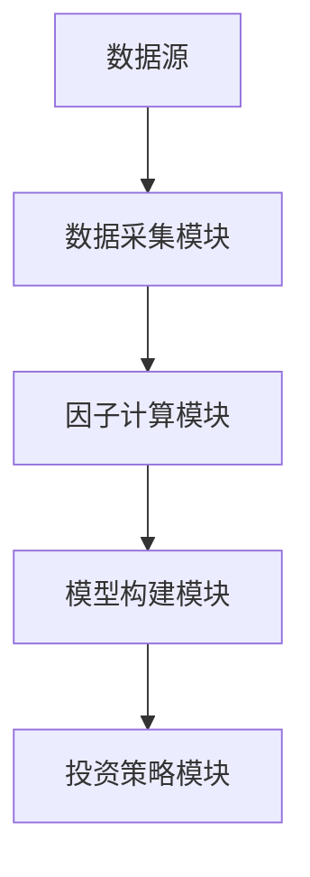

                 


# 特价股票投资中的多因子模型构建与优化

> 关键词：多因子模型、特价股票、投资策略、因子筛选、模型优化

> 摘要：本文详细探讨了多因子模型在特价股票投资中的构建与优化方法，从背景介绍到数学模型，再到系统设计和项目实战，全面解析了多因子模型的应用及其优化策略。通过实例分析和代码实现，帮助读者掌握如何利用多因子模型进行有效的股票投资。

---

## 第一部分: 多因子模型的背景与核心概念

### 第1章: 多因子模型的背景与核心概念

#### 1.1 多因子模型的定义与起源
多因子模型是一种基于多个因子（如市值、价值、动量等）来解释股票收益的模型。它起源于20世纪70年代，Fama和French提出的三因子模型是其中的代表。

#### 1.2 多因子模型的核心要素
- **因子的定义与分类**：因子可以分为基本面因子（如市盈率、市净率）和动量因子（如过去的价格趋势）。
- **因子之间的关系**：因子之间可能存在相关性，需要通过优化来选择最优因子组合。

#### 1.3 多因子模型在特价股票投资中的重要性
- 特价股票通常具有较高的市盈率或市净率，通过多因子模型可以筛选出具有潜力的股票。

### 第2章: 多因子模型的核心概念与联系

#### 2.1 多因子模型的数学基础
- **单因子模型**：收益 = α + β × 因子值 + ε
- **多因子模型**：收益 = α + β₁×因子1 + β₂×因子2 + ... + βₙ×因子n + ε

#### 2.2 多因子模型的因子间关系
- **相关性分析**：通过协方差矩阵分析因子之间的相关性。
- **相互作用**：因子之间的相互作用会影响模型的性能。

#### 2.3 因子筛选与优化
- **因子筛选标准**：信息比率、夏普比率等。
- **优化方法**：使用最小二乘法或遗传算法优化因子组合。

---

## 第二部分: 多因子模型的数学模型与公式

### 第3章: 多因子模型的数学模型与公式

#### 3.1 基本公式
- 单因子模型：
  $$ R_i = \alpha + \beta R_m + \epsilon $$
- 多因子模型：
  $$ R_i = \alpha + \beta_1 F_1 + \beta_2 F_2 + ... + \beta_n F_n + \epsilon $$

#### 3.2 因子权重的确定
- **等权重法**：每个因子的权重相同。
- **优化权重法**：通过最小化误差方差优化权重。

---

## 第三部分: 多因子模型的算法实现

### 第4章: 多因子模型的算法实现

#### 4.1 因子选择与数据预处理
- 数据清洗：处理缺失值和异常值。
- 因子标准化：对因子进行标准化处理。

#### 4.2 模型构建与优化
- 使用Python实现因子回归：
  ```python
  import pandas as pd
  from sklearn.linear_model import LinearRegression

  # 数据准备
  df = pd.read_csv('stock_data.csv')
  X = df[['因子1', '因子2']]
  y = df['收益']

  # 模型训练
  model = LinearRegression()
  model.fit(X, y)
  ```

#### 4.3 模型优化与风险控制
- 使用正则化方法（如Lasso回归）优化因子组合。
- 风险控制：通过夏普比率评估模型风险。

---

## 第四部分: 系统设计与架构

### 第5章: 系统设计与架构

#### 5.1 系统功能设计
- 数据采集模块：收集股票数据。
- 因子计算模块：计算各个因子。
- 模型构建模块：构建并优化多因子模型。
- 投资策略模块：制定投资策略并执行。

#### 5.2 系统架构设计


---

## 第五部分: 项目实战

### 第6章: 项目实战

#### 6.1 数据收集与预处理
- 使用Yahoo Finance API获取股票数据。

#### 6.2 因子筛选与模型优化
- 通过回测优化因子权重。

#### 6.3 投资策略制定
- 根据模型结果制定投资组合。

---

## 第六部分: 优化技巧与未来展望

### 第7章: 优化技巧与未来展望

#### 7.1 优化技巧
- 定期更新因子库。
- 结合机器学习方法优化模型。

#### 7.2 未来展望
- 多因子模型与其他投资策略的结合。
- 利用大数据技术提升模型性能。

---

## 第七部分: 最佳实践与小结

### 7.1 最佳实践
- 定期回测模型。
- 结合市场变化调整因子。

### 7.2 小结
多因子模型是一种有效的投资工具，通过合理构建和优化模型，可以提高投资收益并降低风险。

---

通过以上结构，我们可以系统地构建和优化多因子模型，为特价股票投资提供科学依据。

