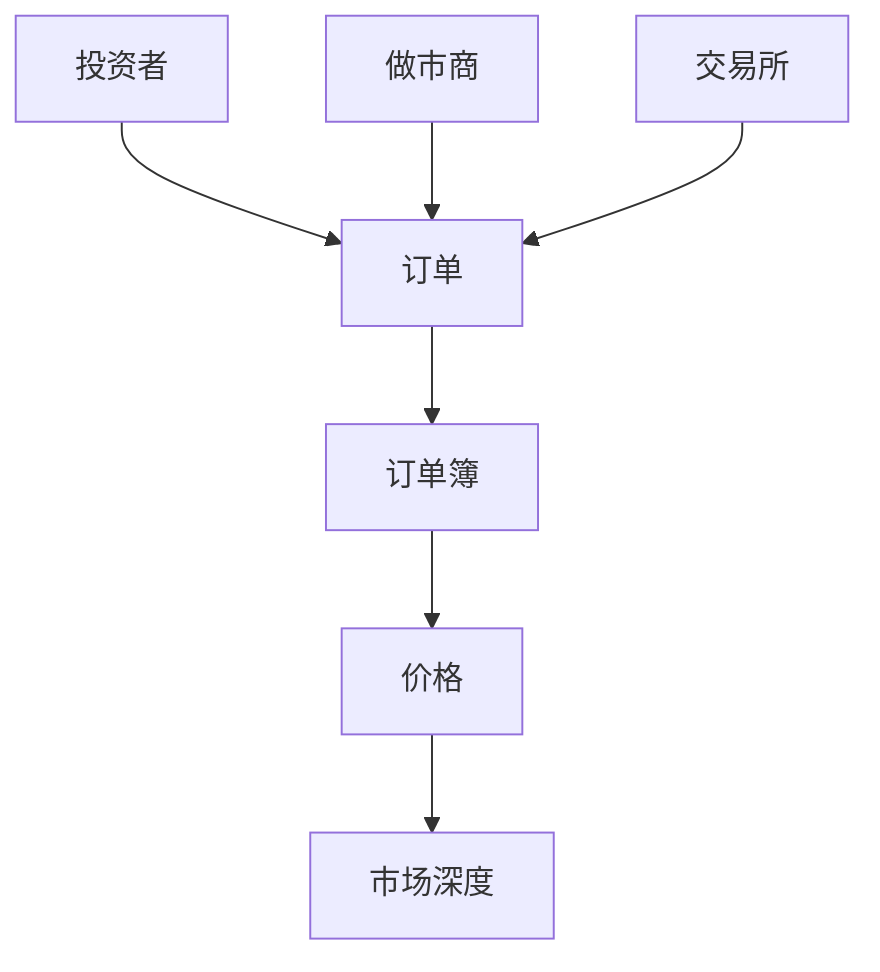
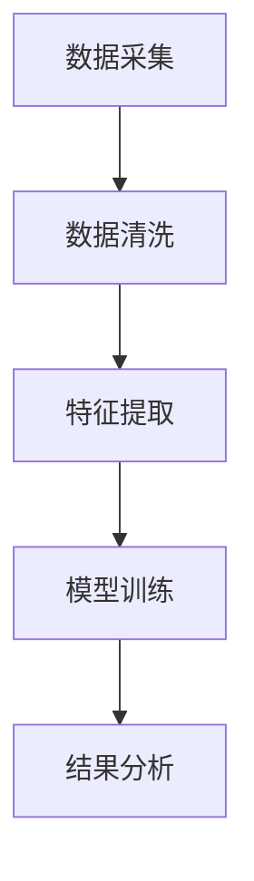
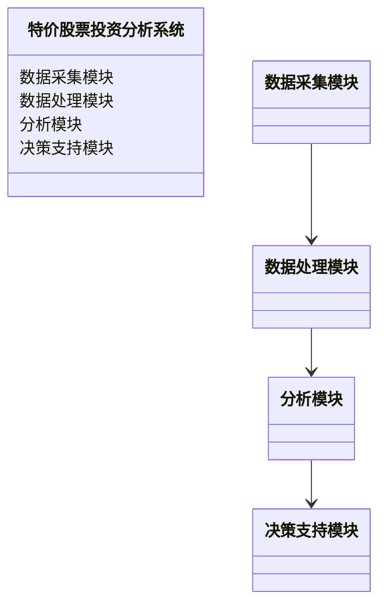
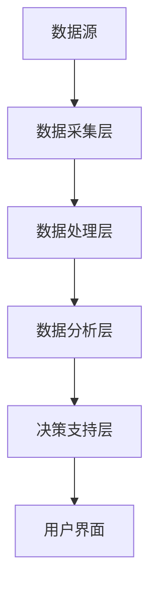
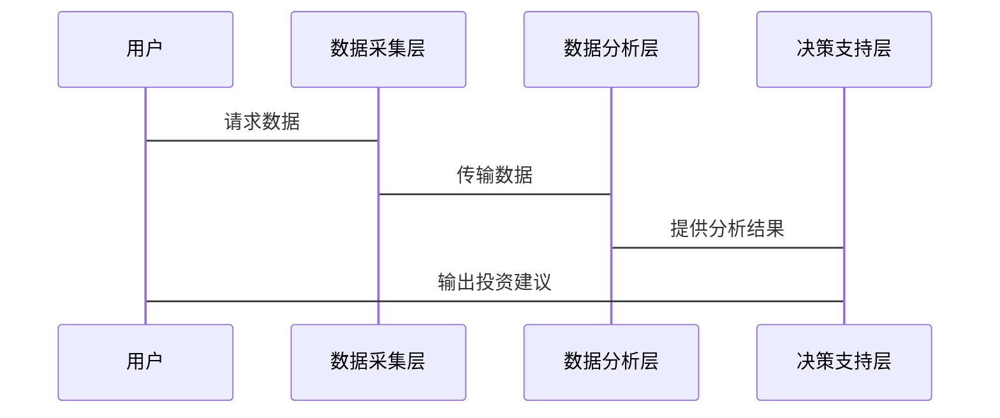

                 


# 特价股票投资中的市场微观结构分析

> 关键词：特价股票，市场微观结构，订单簿分析，交易行为分析，数学模型，系统架构

> 摘要：本文深入探讨了特价股票投资中的市场微观结构分析，从核心概念、算法原理、数学模型到系统架构，结合实际案例，为投资者提供了一套科学的投资分析方法。通过本文，读者可以掌握如何利用市场微观结构分析来优化投资决策，提升投资收益。

---

## 第一部分: 特价股票投资中的市场微观结构分析基础

### 第1章: 特价股票投资与市场微观结构概述

#### 1.1 特价股票的定义与特征

##### 1.1.1 特价股票的定义
特价股票是指价格相对较低的股票，通常属于小盘股或中盘股，具有较高的增长潜力。这类股票通常流动性较低，但潜在回报较高。

##### 1.1.2 特价股票的市场特征
- 价格波动较大
- 交易量较小
- 市值较低
- 风险较高，但回报潜力大

##### 1.1.3 特价股票与普通股票的区别
| 特性 | 特价股票 | 普通股票 |
|------|----------|----------|
| 价格 | 较低     | 较高     |
| 流动性 | 较低     | 较高     |
| 市值 | 小       | 大       |
| 风险 | 较高     | 较低     |

#### 1.2 市场微观结构的基本概念

##### 1.2.1 市场微观结构的定义
市场微观结构是指市场中交易的参与者、订单、价格形成机制等微观要素的构成和相互关系。

##### 1.2.2 市场微观结构的核心要素
- 参与者：投资者、做市商、机构投资者
- 订单：买单、卖单、限价单、市价单
- 价格形成机制：订单簿、拍卖机制、做市商报价

##### 1.2.3 市场微观结构与投资的关系
市场微观结构分析可以帮助投资者理解市场的运作机制，发现交易机会，优化投资策略。

#### 1.3 本章小结
- 特价股票的定义和特征
- 市场微观结构的核心概念
- 本书的研究目标

---

### 第2章: 市场微观结构的核心概念与联系

#### 2.1 市场微观结构的核心要素

##### 2.1.1 订单簿分析
订单簿是市场微观结构分析的重要工具，记录了当前市场的所有买单和卖单。

##### 2.1.2 价格发现机制
价格发现是指通过买卖双方的交易，确定资产的市场价格。

##### 2.1.3 市场参与者行为
市场参与者的交易行为直接影响市场的流动性、价格波动和市场深度。

#### 2.2 核心概念的原理与联系

##### 2.2.1 订单类型与价格关系
- 限价单：以指定价格成交
- 市价单：以当前市场价格成交
- 做市商报价：提供买卖价格

##### 2.2.2 市场深度与流动性分析
市场深度是指在特定价格水平上可以成交的订单数量，流动性反映市场的交易活跃程度。

##### 2.2.3 市场微观结构的动态变化
市场微观结构在交易过程中不断变化，受市场参与者的交易行为和市场环境的影响。

#### 2.3 实体关系图（ER图）展示


#### 2.4 本章小结
- 市场微观结构的核心要素
- 核心概念的系统性分析
- 市场微观结构的动态特征

---

## 第二部分: 市场微观结构分析的算法原理

### 第3章: 市场微观结构分析的算法原理

#### 3.1 订单簿分析算法

##### 3.1.1 订单簿分析的基本原理
订单簿分析通过统计订单的数量、价格和时间，揭示市场的买卖力量和价格走势。

##### 3.1.2 基于订单簿的市场情绪分析
- 买单比例：买方力量强弱
- 卖单比例：卖方力量强弱
- 订单撤销率：市场参与者对价格变化的敏感度

##### 3.1.3 订单流的统计分析方法
- 计算订单的平均间隔时间
- 计算订单的成交概率
- 计算订单的生命周期

#### 3.2 交易行为分析算法

##### 3.2.1 交易行为的分类与识别
- 投机交易：短期价格波动
- 投资交易：长期价值投资
- 做市商交易：维持市场深度

##### 3.2.2 基于机器学习的交易行为预测
- 使用聚类分析识别交易模式
- 使用分类算法预测交易行为
- 使用时间序列模型预测市场反应

##### 3.2.3 交易行为对市场价格的影响
- 大额交易：可能导致价格瞬间波动
- 零散交易：可能导致价格逐步变化
- 做市商干预：稳定市场价格

#### 3.3 市场微观结构分析的流程图


#### 3.4 本章小结
- 订单簿分析的原理和方法
- 交易行为分析的核心算法
- 市场微观结构分析的流程

---

### 第4章: 市场微观结构的数学模型与公式

#### 4.1 市场深度与流动性模型

##### 4.1.1 市场深度的定义与计算
市场深度是指在某一价格水平上可以成交的订单数量。

##### 4.1.2 流动性冲击模型
流动性冲击是指大额交易对市场价格的影响。

##### 4.1.3 市场深度与流动性关系
$$ \text{市场深度} = \sum_{i=1}^{n} \text{订单量}_i $$

#### 4.2 价格发现机制的数学模型

##### 4.2.1 市场价格的形成
市场价格由买卖双方的订单匹配决定。

##### 4.2.2 订单匹配算法
$$ P_{\text{new}} = \max(P_{\text{bid}}, P_{\text{ask}}) $$

##### 4.2.3 价格波动模型
$$ \sigma = \sqrt{\sum_{i=1}^{n} (\text{价格变化}_i - \mu)^2 / (n-1)} $$

#### 4.3 本章小结
- 市场深度与流动性模型
- 价格发现机制的数学模型
- 市场微观结构分析的公式总结

---

## 第三部分: 系统分析与架构设计方案

### 第5章: 系统分析与架构设计

#### 5.1 问题场景介绍
特价股票投资中的市场微观结构分析需要构建一个实时数据采集、分析和决策支持的系统。

#### 5.2 系统功能设计

##### 5.2.1 领域模型


#### 5.3 系统架构设计

##### 5.3.1 系统架构图


#### 5.4 系统接口设计
- 数据接口：与交易所API对接
- 分析接口：提供实时数据分析服务
- 决策支持接口：输出投资建议

#### 5.5 系统交互流程图


#### 5.6 本章小结
- 系统功能设计
- 系统架构图
- 系统接口设计

---

## 第四部分: 项目实战

### 第6章: 项目实战

#### 6.1 环境安装
- 安装Python
- 安装Pandas、NumPy、Scikit-learn

#### 6.2 核心实现源代码

##### 6.2.1 数据采集模块
```python
import pandas as pd

def collect_data(ticker):
    # 模拟数据采集
    data = pd.DataFrame({
        'timestamp': [1, 2, 3],
        'price': [10, 11, 9],
        'volume': [100, 200, 300]
    })
    return data
```

##### 6.2.2 数据分析模块
```python
from sklearn.cluster import KMeans

def analyze_behavior(data):
    # 提取特征
    features = data[['price', 'volume']]
    # 聚类分析
    model = KMeans(n_clusters=2)
    model.fit(features)
    return model.labels_
```

#### 6.3 代码应用解读与分析
- 数据采集模块：从交易所API获取实时数据
- 数据分析模块：使用聚类算法识别交易行为

#### 6.4 实际案例分析
分析某只特价股票的订单流，识别市场参与者的交易行为。

#### 6.5 本章小结
- 项目实战的环境配置
- 核心代码实现
- 实际案例分析

---

## 第五部分: 总结与展望

### 第7章: 总结与展望

#### 7.1 本章内容回顾
- 特价股票投资的核心概念
- 市场微观结构分析的方法
- 系统架构设计与实现

#### 7.2 未来研究方向
- 更复杂的数学模型
- 更智能的算法优化
- 更高效的系统架构

#### 7.3 投资策略建议
- 结合市场微观结构分析优化投资决策
- 重视市场参与者的交易行为
- 关注市场深度和流动性变化

#### 7.4 最佳实践 tips
- 定期更新模型
- 保持对市场的敏感性
- 结合技术分析和基本面分析

#### 7.5 本章小结
- 总结全文
- 展望未来研究
- 提出投资建议

---

通过以上章节的分析和实践，读者可以全面掌握特价股票投资中的市场微观结构分析方法，并能够在实际投资中灵活运用这些分析工具和策略，提升投资收益。

