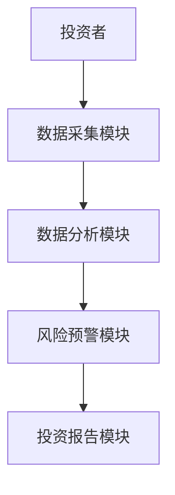
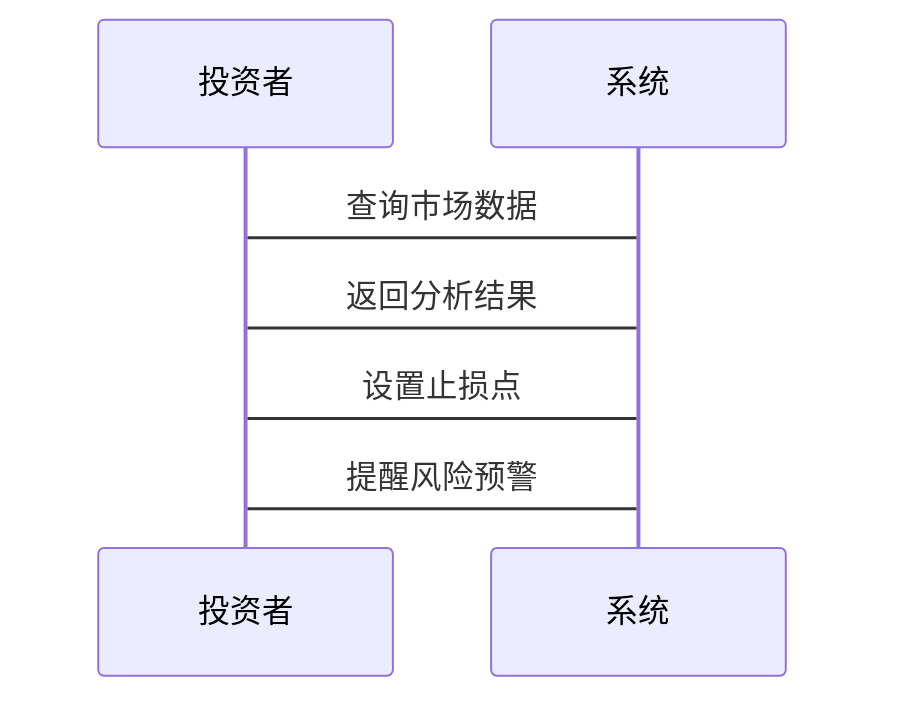

                 


# 特价股票投资中的心理偏差和如何克服

---

## 关键词：
特价股票、心理偏差、行为矫正、投资策略、情绪管理、认知重构、风险管理

---

## 摘要：
特价股票投资作为一种高风险高回报的投资方式，常常伴随着投资者的心理偏差，如过度自信、从众心理和损失厌恶等。这些偏差会影响投资者的决策，导致非理性的投资行为。本文从心理偏差的定义、常见类型及其对投资的影响入手，深入分析投资者在特价股票投资中容易出现的心理偏差，并提出相应的克服策略。通过心理调节、认知重构、行为矫正和策略优化等方法，帮助投资者克服心理偏差，制定科学合理的投资计划，提升投资决策的理性性和有效性。

---

## 目录结构：

### 第1章：特价股票投资的背景与心理偏差概述
1.1 特价股票投资的定义与特点
1.2 心理偏差的概述
1.3 心理偏差对投资决策的影响

### 第2章：常见心理偏差对特价股票投资的影响
2.1 过度自信偏差
2.2 从众心理偏差
2.3 损失厌恶偏差
2.4 其他常见心理偏差（确认偏差、锚定效应、过拟合偏差）

### 第3章：克服心理偏差的心理调节与认知重构
3.1 心理调节的基本原理（自我反思、情绪管理、理性思维）
3.2 认知重构的策略与方法（识别偏差、建立认知框架、案例分析）
3.3 心理调节与认知重构的实践技巧（日志记录、行为矫正、寻求专业帮助）

### 第4章：特价股票投资中的行为矫正与策略优化
4.1 投资策略的制定与优化（明确目标、制定计划、策略调整）
4.2 行为矫正的具体方法（避免从众、控制情绪、分散投资）

### 第5章：系统分析与架构设计方案
5.1 系统功能设计（领域模型、系统架构、接口设计）
5.2 系统架构设计图（使用Mermaid绘制）
5.3 系统交互设计（使用Mermaid绘制）

### 第6章：项目实战与案例分析
6.1 环境安装与系统核心实现（Python代码示例）
6.2 代码应用解读与实际案例分析
6.3 项目总结与经验分享

### 第7章：最佳实践与投资建议
7.1 投资者心态调整的技巧
7.2 风险管理的核心原则
7.3 持续学习与自我提升的重要性
7.4 总结与展望

---

## 正文内容：

### 第1章：特价股票投资的背景与心理偏差概述

#### 1.1 特价股票投资的定义与特点
特价股票通常指的是价格低于市场平均水平的股票，这类股票往往被认为具有较高的投资价值。然而，特价股票的投资风险较高，市场波动性大，投资者需要具备较高的市场敏感性和风险承受能力。特价股票的特点包括低估值、高波动性和潜在的高回报。

#### 1.2 心理偏差的概述
心理偏差是指人们在决策过程中由于认知局限、情感因素或环境影响而产生的非理性行为。在股票投资中，心理偏差会导致投资者做出错误的决策，如过度交易、盲目跟风等。

#### 1.3 心理偏差对投资决策的影响
心理偏差会影响投资者的判断和决策，导致投资损失。例如，过度自信偏差使投资者高估自己的能力，忽视市场风险；从众心理偏差使投资者盲目跟随市场潮流，忽视个体分析。

---

### 第2章：常见心理偏差对特价股票投资的影响

#### 2.1 过度自信偏差
过度自信偏差是指投资者过于相信自己的判断和能力，导致决策失误。例如，投资者可能会过度相信自己的市场分析能力，忽视市场的不确定性。

#### 2.2 从众心理偏差
从众心理偏差是指投资者盲目跟随市场潮流，缺乏独立思考。例如，在市场热炒某只股票时，投资者可能会盲目跟风，导致投资亏损。

#### 2.3 损失厌恶偏差
损失厌恶偏差是指投资者对损失的厌恶程度高于对收益的追求。例如，投资者可能会因为害怕亏损而错过投资机会，或者在亏损后采取错误的补救措施。

#### 2.4 其他常见心理偏差
- **确认偏差**：投资者倾向于寻找支持自己观点的信息，忽略相反的证据。
- **锚定效应**：投资者在决策时过于依赖某个固定的参考点，如历史价格。
- **过拟合偏差**：投资者在分析数据时过于拟合短期趋势，忽视长期趋势。

---

### 第3章：克服心理偏差的心理调节与认知重构

#### 3.1 心理调节的基本原理
心理调节包括自我反思、情绪管理和理性思维训练。例如，投资者可以通过记录投资日志来反思自己的决策，通过冥想和放松练习来管理情绪，通过逻辑分析来避免冲动决策。

#### 3.2 认知重构的策略与方法
认知重构包括识别和分析偏差、建立正确的认知框架、通过案例分析进行认知重构。例如，投资者可以通过分析失败案例来识别自己的心理偏差，并调整认知框架。

#### 3.3 心理调节与认知重构的实践技巧
- **日志记录**：记录每次投资决策的动机和结果，分析心理偏差的影响。
- **行为矫正**：通过设定投资计划和纪律，避免冲动交易。
- **寻求专业帮助**：心理咨询师或投资顾问可以帮助投资者克服心理偏差。

---

### 第4章：特价股票投资中的行为矫正与策略优化

#### 4.1 投资策略的制定与优化
投资者需要明确投资目标、制定详细的投资计划，并根据市场变化及时调整策略。例如，设定止损和止盈点，避免过度交易。

#### 4.2 行为矫正的具体方法
- **避免从众心理**：独立分析市场，避免盲目跟风。
- **控制情绪**：在市场波动中保持冷静，避免冲动决策。
- **分散投资**：通过分散投资降低风险，避免过度集中在某一只股票。

---

### 第5章：系统分析与架构设计方案

#### 5.1 系统功能设计
系统功能包括数据采集、分析、预警和报告。例如，系统可以实时采集市场数据，分析股票走势，预警风险，并生成投资报告。

#### 5.2 系统架构设计图
以下是系统架构设计图：



#### 5.3 系统交互设计
以下是系统交互设计图：



---

### 第6章：项目实战与案例分析

#### 6.1 环境安装与系统核心实现
以下是Python代码示例：

```python
import pandas as pd
import numpy as np

def analyze_stock_data(data):
    # 计算技术指标
    data['MA_50'] = data['收盘价'].rolling(50).mean()
    data['MA_200'] = data['收盘价'].rolling(200).mean()
    # 判断趋势
    data['趋势'] = np.where(data['MA_50'] > data['MA_200'], '上升', '下降')
    return data

# 示例数据
data = pd.DataFrame({
    '收盘价': [100, 105, 98, 110, 108],
    '交易日期': ['2023-01-01', '2023-01-02', '2023-01-03', '2023-01-04', '2023-01-05']
})

result = analyze_stock_data(data)
print(result)
```

#### 6.2 代码应用解读与实际案例分析
通过上述代码，我们可以分析股票的趋势，并制定相应的投资策略。例如，在上升趋势中增加仓位，下降趋势中减少仓位。

#### 6.3 项目总结与经验分享
通过系统的分析和实际案例的分析，投资者可以更好地理解心理偏差对投资的影响，并通过行为矫正和策略优化来克服这些偏差。

---

### 第7章：最佳实践与投资建议

#### 7.1 投资者心态调整的技巧
投资者需要保持冷静，避免情绪化决策，定期反思和调整投资策略。

#### 7.2 风险管理的核心原则
设定止损点，分散投资，避免过度集中在某一只股票。

#### 7.3 持续学习与自我提升的重要性
通过不断学习和实践，提升自己的市场分析能力和风险管理能力。

#### 7.4 总结与展望
克服心理偏差是投资者成功的关键。通过心理调节、认知重构、行为矫正和策略优化，投资者可以做出更理性的决策，提升投资表现。

---

## 附录：
- **心理偏差测试**：帮助投资者识别自己的心理偏差。
- **投资工具与资源**：推荐一些有用的投资工具和资源。

---

通过以上内容，我详细思考了如何撰写一篇符合用户要求的关于特价股票投资中的心理偏差及如何克服的技术博客文章。

