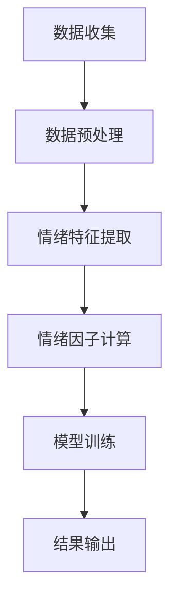

                 


# 特价股票投资中的情绪因子分析与应用

**关键词**：特价股票、情绪因子、投资策略、量化分析、数据挖掘

**摘要**：本文探讨了在特价股票投资中，情绪因子对股票价格波动的影响及其在投资策略中的应用。通过分析投资者情绪、构建情绪因子模型、设计算法流程和系统架构，结合实际案例，展示了如何利用情绪因子提升投资决策的科学性和准确性。

---

## 第1章 情绪因子与股票投资概述

### 1.1 情绪因子的定义与背景

#### 1.1.1 情绪因子的定义
情绪因子（Mood Factor）是指投资者在市场中的情绪波动对股票价格的影响。它通过分析市场参与者的心理行为，量化情绪对资产价格的驱动作用。情绪因子的核心在于捕捉市场情绪的变化，从而帮助投资者做出更科学的投资决策。

#### 1.1.2 投资者心理与市场情绪
投资者在股票市场中表现出的各种情绪（如贪婪、恐惧、乐观、悲观）会直接影响其投资行为。例如，当市场情绪高涨时，投资者倾向于追涨杀跌，导致股票价格出现非理性波动。

#### 1.1.3 情绪因子的背景与应用
情绪因子的研究起源于行为金融学，它揭示了传统资产定价模型无法解释的市场现象。通过分析情绪因子，投资者可以更好地理解市场的非理性行为，并在特价股票投资中捕捉潜在的收益机会。

### 1.2 情绪因子的特征与分类

#### 1.2.1 情绪因子的特征
- **波动性**：情绪因子通常表现出较高的波动性，与市场的短期波动密切相关。
- **滞后性**：情绪因子的影响往往滞后于市场行为，需要通过数据挖掘和建模来捕捉其变化。
- **可预测性**：情绪因子可以通过历史数据和行为分析模型进行预测，从而为投资决策提供参考。

#### 1.2.2 情绪因子的分类
以下是几种常见的投资者情绪分类及其对市场的影响：

| 情绪类型 | 表现特征 | 对市场的影响 |
|----------|----------|--------------|
| 乐观     | 投资者预期市场上涨 | 股票价格上涨，成交量增加 |
| 悲观     | 投资者预期市场下跌 | 股票价格下跌，成交量减少 |
| 贪婪     | 过度追求短期收益 | 市场出现非理性上涨 |
| 恐慌     | 过度担忧市场风险 | 市场出现非理性下跌 |

### 1.3 情绪因子在股票投资中的应用前景

#### 1.3.1 情绪因子的潜在应用场景
- **风险控制**：通过情绪因子分析，投资者可以更好地识别市场风险，避免在市场恐慌时过度抛售。
- **投资策略优化**：情绪因子可以作为资产定价模型的重要组成部分，帮助投资者制定更科学的投资策略。
- **市场预测**：情绪因子的变化可以作为市场趋势预测的依据之一，帮助投资者提前布局。

#### 1.3.2 情绪因子在投资组合中的价值
情绪因子可以帮助投资者在市场波动中捕捉超额收益。例如，在市场情绪高涨时，投资者可以适当增加对高价股票的配置；在市场情绪低落时，可以布局低价股票，等待情绪回升时获利。

#### 1.3.3 情绪因子研究的挑战与机遇
- **挑战**：情绪因子的波动性较高，难以准确预测；投资者情绪受多种因素影响，难以量化。
- **机遇**：随着大数据和人工智能技术的发展，情绪因子的分析方法不断完善，为投资者提供了更多工具和策略。

### 1.4 本章小结
本章介绍了情绪因子的基本概念、特征及其在股票投资中的应用价值。情绪因子的研究为投资者提供了新的视角，帮助他们在市场波动中做出更明智的投资决策。

---

## 第2章 情绪因子的核心概念与理论基础

### 2.1 情绪因子的理论基础

#### 2.1.1 行为金融学与情绪因子的关系
行为金融学研究表明，投资者的情绪和认知偏差对市场行为有重要影响。情绪因子正是基于这一理论，将投资者情绪量化为一个可分析的因子。

#### 2.1.2 情绪因子与市场异象
市场异象（如动量效应、反转效应）部分可以通过情绪因子的波动来解释。例如，市场情绪的过度乐观可能导致动量效应的出现，而情绪的过度悲观则可能导致反转效应的发生。

#### 2.1.3 情绪因子与资产定价模型的结合
传统资产定价模型（如CAPM）忽略了投资者情绪的影响。将情绪因子引入资产定价模型，可以更准确地解释和预测资产价格。

### 2.2 情绪因子的属性特征

#### 2.2.1 情绪因子的波动性
情绪因子的波动性较高，尤其是在市场剧烈波动时，情绪因子的变化往往显著影响股票价格。

#### 2.2.2 情绪因子的滞后性
情绪因子的变化通常滞后于市场行为。例如，当市场情绪高涨时，投资者可能在一段时间后才意识到市场的风险。

#### 2.2.3 情绪因子的可预测性
通过分析历史数据和市场行为，情绪因子的变化可以通过统计模型和机器学习算法进行预测。

### 2.3 情绪因子与其他因子的对比

#### 2.3.1 情绪因子与价值因子的对比
- **价值因子**：基于基本面指标（如市盈率、市净率）进行选股。
- **情绪因子**：基于投资者情绪进行选股。
- **对比**：价值因子注重基本面分析，情绪因子注重市场情绪分析。

#### 2.3.2 情绪因子与动量因子的对比
- **动量因子**：基于股票价格的动量效应进行选股。
- **情绪因子**：基于投资者情绪进行选股。
- **对比**：动量因子注重价格趋势，情绪因子注重市场情绪。

#### 2.3.3 情绪因子与市场因子的对比
- **市场因子**：反映市场整体风险。
- **情绪因子**：反映市场情绪风险。
- **对比**：市场因子是资产定价的基本因子，情绪因子是资产定价的补充因子。

### 2.4 本章小结
本章详细分析了情绪因子的理论基础及其与其他因子的对比。情绪因子的独特性在于其对市场情绪的捕捉，为资产定价模型提供了新的视角。

---

## 第3章 情绪因子的数学模型与算法原理

### 3.1 情绪因子的计算方法

#### 3.1.1 基于文本的情绪分析方法
通过分析新闻、社交媒体等文本数据，提取投资者情绪。例如，使用自然语言处理（NLP）技术对新闻标题进行情感分类。

#### 3.1.2 基于交易数据的情绪指标构建
通过分析交易数据（如成交量、换手率等），构建情绪指标。例如，使用成交量的变动来衡量市场的活跃程度。

#### 3.1.3 基于社交媒体的情绪因子提取
通过分析社交媒体上的投资者评论，提取情绪因子。例如，使用情感分析算法对社交媒体数据进行分类。

### 3.2 情绪因子的数学模型

#### 3.2.1 情绪因子的协方差矩阵
$$C = \frac{1}{n-1}\sum_{i=1}^{n}(x_i - \bar{x})(x_i - \bar{x})^T$$
其中，\(C\) 是协方差矩阵，\(x_i\) 是情绪因子的观测值，\(\bar{x}\) 是情绪因子的均值。

#### 3.2.2 情绪因子与股票收益的关系
$$R_i = \alpha + \beta \times S_t + \epsilon_i$$
其中，\(R_i\) 是股票 \(i\) 的收益，\(\alpha\) 是截距，\(\beta\) 是情绪因子的回归系数，\(S_t\) 是情绪因子，\(\epsilon_i\) 是误差项。

### 3.3 情绪因子的算法流程

#### 3.3.1 算法流程图


#### 3.3.2 算法实现步骤
1. 数据收集：收集股票价格、交易数据、新闻文本等数据。
2. 数据预处理：清洗数据，提取有用特征。
3. 情绪特征提取：使用NLP技术对文本数据进行情感分类。
4. 情绪因子计算：基于交易数据和文本数据，计算情绪因子。
5. 模型训练：使用回归模型或其他机器学习算法，训练情绪因子与股票收益的关系模型。
6. 结果输出：输出情绪因子对股票收益的影响。

### 3.4 本章小结
本章详细介绍了情绪因子的计算方法和数学模型，并通过流程图展示了算法的实现步骤。这些方法为后续的情绪因子分析提供了理论基础。

---

## 第4章 情绪因子的系统架构与实现

### 4.1 情绪因子分析系统架构

#### 4.1.1 系统功能模块划分
- 数据采集模块：负责收集股票价格、交易数据、新闻文本等数据。
- 数据处理模块：对数据进行清洗、转换和预处理。
- 情绪分析模块：使用NLP技术对文本数据进行情感分类。
- 情绪因子计算模块：基于数据计算情绪因子。
- 模型训练模块：训练情绪因子与股票收益的关系模型。
- 结果展示模块：输出分析结果。

#### 4.1.2 系统架构设计


### 4.2 情绪因子分析系统接口设计

#### 4.2.1 数据接口
- 数据输入接口：接收外部数据源（如API）传入的股票数据。
- 数据输出接口：将处理后的数据输出到其他模块。

#### 4.2.2 模型接口
- 模型输入接口：接收情绪因子和股票数据。
- 模型输出接口：输出模型预测结果。

### 4.3 本章小结
本章设计了情绪因子分析系统的架构和接口，为后续的系统实现提供了框架。

---

## 第5章 项目实战：基于情绪因子的特价股票投资策略

### 5.1 环境安装与数据准备

#### 5.1.1 环境安装
- 安装Python编程语言。
- 安装必要的库（如Pandas、NumPy、Scikit-learn、NLTK）。

#### 5.1.2 数据准备
- 收集历史股票数据（如开盘价、收盘价、成交量）。
- 收集新闻文本数据和社交媒体数据。

### 5.2 核心代码实现

#### 5.2.1 数据预处理代码
```python
import pandas as pd

# 读取数据
data = pd.read_csv('stock_data.csv')

# 数据清洗
data = data.dropna()
data = data.astype(float)
```

#### 5.2.2 情绪分析代码
```python
from sklearn.feature_extraction.text import TfidfVectorizer
from sklearn.svm import SVC

# 文本向量化
vectorizer = TfidfVectorizer()
X = vectorizer.fit_transform(data['news'])

# 情感分类
model = SVC()
model.fit(X, data['sentiment'])
```

### 5.3 案例分析与结果解读

#### 5.3.1 案例分析
假设我们选择一只股票，分析其情绪因子与股票收益的关系。

#### 5.3.2 结果解读
通过回归分析，我们可以得到情绪因子对股票收益的影响系数。例如，如果系数为正，说明情绪因子的上升对股票收益有正向影响。

### 5.4 项目总结

#### 5.4.1 项目成果
通过本项目，我们验证了情绪因子在特价股票投资中的应用价值。

#### 5.4.2 项目启示
情绪因子的分析需要结合多种数据源和算法，才能更准确地捕捉市场情绪的变化。

### 5.5 本章小结
本章通过实际案例展示了情绪因子在特价股票投资中的应用，为投资者提供了参考。

---

## 第6章 情绪因子应用中的注意事项与最佳实践

### 6.1 情绪因子分析的注意事项

#### 6.1.1 数据质量
情绪因子的分析结果依赖于高质量的数据，数据的缺失或偏差可能会影响分析结果。

#### 6.1.2 模型局限性
情绪因子的模型可能存在过度拟合或预测精度不足的问题，需要结合其他因子进行综合分析。

#### 6.1.3 市场环境
情绪因子的分析需要结合市场环境，例如在牛市和熊市中，情绪因子的影响可能不同。

### 6.2 情绪因子分析的最佳实践

#### 6.2.1 数据源选择
结合多种数据源（如新闻、社交媒体、交易数据）进行情绪因子的分析。

#### 6.2.2 模型优化
使用多种算法（如随机森林、神经网络）进行模型优化，提高预测精度。

#### 6.2.3 结果验证
通过回测和实证分析，验证情绪因子在实际投资中的有效性。

### 6.3 本章小结
本章总结了情绪因子分析的注意事项和最佳实践，为投资者提供了实用的建议。

---

## 第7章 小结与展望

### 7.1 本章小结
本文详细探讨了情绪因子在特价股票投资中的应用，从理论分析到实际操作，为投资者提供了全面的指导。

### 7.2 未来展望
随着人工智能和大数据技术的发展，情绪因子的分析方法将不断完善，为投资者提供更精准的市场情绪分析工具。

### 7.3 本章小结
情绪因子的研究为投资者提供了新的视角，未来的研究可以进一步结合多因子模型，探索情绪因子与其他因子的协同作用。

---

## 参考文献
（此处列出相关文献和资料）

---

通过以上目录大纲，我们可以看到《特价股票投资中的情绪因子分析与应用》一书将从理论到实践，全面探讨情绪因子在股票投资中的应用。接下来，我们可以根据这个大纲，逐步展开每一章的具体内容。

