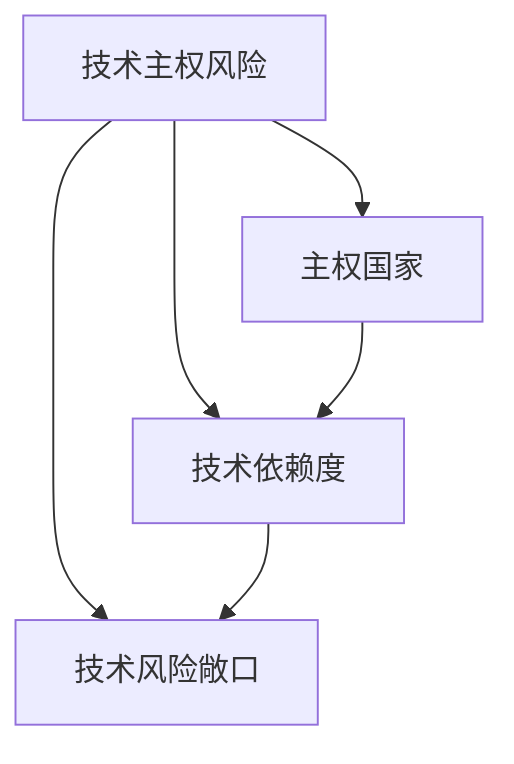
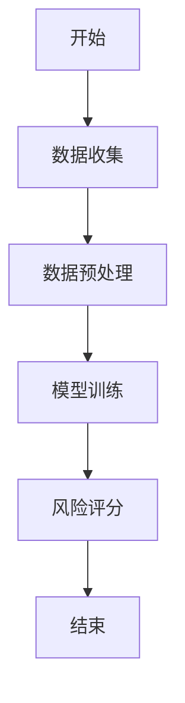
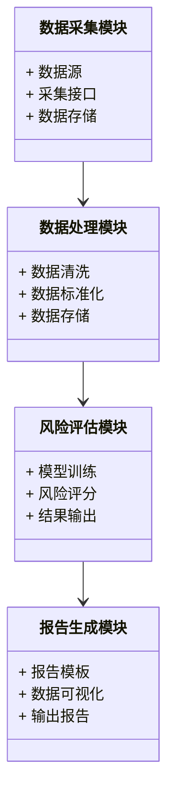
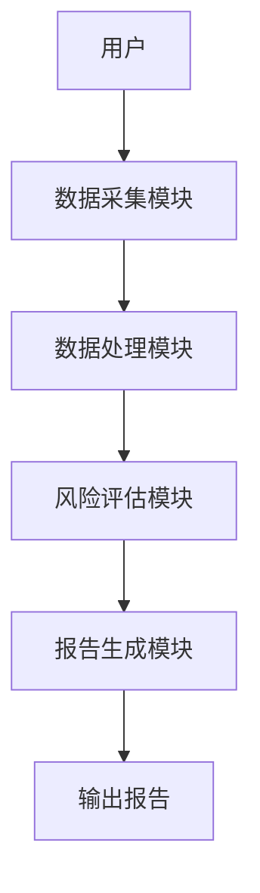
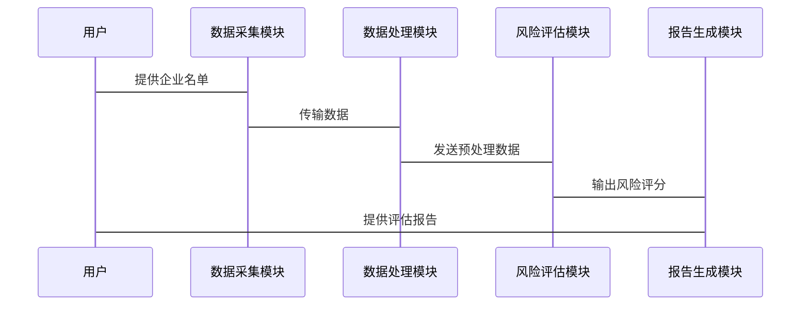

                 


# 特价股票投资中的技术主权风险评估

## 关键词：特价股票、技术主权、风险评估、算法原理、系统架构、项目实战

## 摘要：本文系统地探讨了在特价股票投资中如何进行技术主权风险评估。通过背景介绍、核心概念、算法原理、系统架构设计和项目实战等多维度分析，详细讲解了技术主权风险的定义、评估指标、数学模型及实际应用。文章旨在帮助投资者在利用技术手段评估和管理风险时，理解技术主权对股票投资的影响，从而做出更明智的投资决策。

---

# 第一部分: 特价股票投资中的技术主权风险评估基础

## 第1章: 特价股票投资与技术主权风险概述

### 1.1 特价股票投资的基本概念

#### 1.1.1 特价股票的定义与特点
- **定义**：特价股票是指价格低于其内在价值，具有较大上涨潜力的股票。
- **特点**：价格低廉、市场关注度低、潜在收益高、风险较高。

#### 1.1.2 技术主权风险的定义与内涵
- **定义**：技术主权风险是指因技术依赖性导致的国家或企业在国际技术竞争中可能面临的风险。
- **内涵**：包括技术依赖、技术封锁、技术替代等风险因素。

#### 1.1.3 技术主权风险与股票投资的关系
- **关系**：技术主权风险直接影响企业的经营稳定性、市场竞争力和盈利能力，从而影响股票价值。

### 1.2 技术主权风险评估的背景与意义

#### 1.2.1 当前技术主权风险的现状
- 全球化背景下，技术依赖问题日益突出。
- 技术封锁和断供事件频发，如半导体供应链中断。

#### 1.2.2 技术主权风险对股票投资的影响
- 技术依赖可能导致企业盈利下降或面临退市风险。
- 技术封锁可能引发市场恐慌，导致股价大幅波动。

#### 1.2.3 技术主权风险评估的必要性
- 帮助投资者识别高风险企业，避免投资损失。
- 为投资者提供基于技术主权视角的选股策略。

### 1.3 技术主权风险评估的核心概念

#### 1.3.1 技术主权风险的构成要素
- **技术依赖度**：企业对关键技术和供应链的依赖程度。
- **技术风险敞口**：企业在技术领域面临的风险范围和程度。

#### 1.3.2 技术主权风险的评估维度
- **技术自主性**：企业自主研发能力。
- **技术替代性**：市场是否有替代技术或供应商。
- **政策风险**：政府政策对企业技术依赖的影响。

#### 1.3.3 技术主权风险的评估框架
- **框架概述**：从企业、行业和国家三个层面进行风险评估。
- **框架内容**：包括技术依赖度分析、技术风险敞口评估、技术替代性分析。

### 1.4 本章小结
本章从特价股票投资的基本概念出发，详细介绍了技术主权风险的定义、内涵及其与股票投资的关系。通过分析当前技术主权风险的现状，阐述了其对股票投资的影响和评估的必要性。最后，提出了技术主权风险评估的核心概念和框架。

---

## 第2章: 技术主权风险评估的核心概念

### 2.1 技术主权风险评估的原理

#### 2.1.1 技术主权风险评估的理论基础
- **系统论**：将企业视为一个复杂系统，分析其技术依赖性和风险敞口。
- **风险评估理论**：基于概率和影响程度对风险进行量化评估。

#### 2.1.2 技术主权风险评估的数学模型
- **模型概述**：通过权重赋值法对技术依赖度、风险敞口和替代性进行综合评估。
- **数学表达**：$$ R = \sum_{i=1}^{n} w_i \cdot f_i $$，其中$R$为风险值，$w_i$为第$i$个因素的权重，$f_i$为第$i$个因素的评分。

#### 2.1.3 技术主权风险评估的算法原理
- **算法步骤**：
  1. 确定影响技术主权风险的因素。
  2. 对每个因素进行量化评分。
  3. 给每个因素赋予权重。
  4. 计算综合风险值。

### 2.2 技术主权风险评估的核心要素对比

#### 2.2.1 技术主权风险与市场风险的对比
| 对比维度 | 技术主权风险 | 市场风险 |
|----------|---------------|----------|
| 影响因素 | 技术依赖性、政策风险 | 市场波动、宏观经济 |
| 预测难度 | 较高 | 较高 |
| 管理策略 | 降低依赖度、多元化 | 多样化投资、风险对冲 |

#### 2.2.2 技术主权风险与信用风险的对比
| 对比维度 | 技术主权风险 | 信用风险 |
|----------|---------------|----------|
| 影响因素 | 技术依赖性 | 债务违约风险 |
| 预测难度 | 较高 | 中等 |
| 管理策略 | 提升技术自主性 | 加强信用评估 |

#### 2.2.3 技术主权风险与操作风险的对比
| 对比维度 | 技术主权风险 | 操作风险 |
|----------|---------------|----------|
| 影响因素 | 技术依赖性 | 内部流程、人为错误 |
| 预测难度 | 较高 | 较低 |
| 管理策略 | 降低技术依赖 | 优化内部流程 |

### 2.3 技术主权风险评估的ER实体关系图


### 2.4 本章小结
本章深入探讨了技术主权风险评估的原理和核心要素，通过对比分析，明确了技术主权风险与其他类型风险的区别与联系。通过ER实体关系图，展示了技术主权风险的主要影响因素及其相互关系。

---

## 第3章: 技术主权风险评估的算法原理

### 3.1 技术主权风险评估的算法原理

#### 3.1.1 算法步骤
1. **数据收集**：收集企业技术依赖度、技术风险敞口、政策风险等数据。
2. **数据预处理**：对数据进行清洗和标准化处理。
3. **模型训练**：基于历史数据训练风险评估模型。
4. **风险评分**：对目标企业进行风险评分。

#### 3.1.2 算法流程图


#### 3.1.3 算法实现
- **Python代码示例**：
  ```python
  import pandas as pd
  from sklearn.linear_model import LinearRegression

  # 数据预处理
  df = pd.read_csv('data.csv')
  X = df[['技术依赖度', '风险敞口']]
  y = df['风险评分']

  # 模型训练
  model = LinearRegression()
  model.fit(X, y)

  # 风险评分预测
  new_case = [[0.8, 0.6]]
  print(model.predict(new_case))
  ```

#### 3.1.4 算法的数学模型
- **线性回归模型**：$$ y = \beta_0 + \beta_1x_1 + \beta_2x_2 + \epsilon $$
  - $y$：风险评分
  - $x_1$：技术依赖度
  - $x_2$：风险敞口
  - $\beta_0$、$\beta_1$、$\beta_2$：回归系数
  - $\epsilon$：误差项

---

## 第4章: 技术主权风险评估的系统架构设计

### 4.1 问题场景介绍
- **目标**：构建一个技术主权风险评估系统，帮助投资者评估特价股票的技术主权风险。
- **用户需求**：投资者需要快速、准确地评估股票的技术主权风险，制定投资策略。

### 4.2 系统功能设计

#### 4.2.1 系统功能模块
- 数据采集模块：收集企业技术依赖度、政策风险等数据。
- 数据处理模块：清洗和标准化数据。
- 风险评估模块：基于模型计算风险评分。
- 报告生成模块：生成风险评估报告。

#### 4.2.2 系统功能设计类图


### 4.3 系统架构设计

#### 4.3.1 系统架构设计图


#### 4.3.2 系统接口设计
- **输入接口**：接收企业技术数据和政策数据。
- **输出接口**：提供风险评分和评估报告。

#### 4.3.3 系统交互序列图


### 4.4 本章小结
本章通过系统架构设计，详细介绍了技术主权风险评估系统的功能模块、架构设计和交互流程，为后续的项目实施提供了理论基础和技术支持。

---

## 第5章: 技术主权风险评估的项目实战

### 5.1 项目环境安装

#### 5.1.1 安装Python
- 安装Python 3.8及以上版本。
- 安装所需的Python库：pandas、scikit-learn、mermaid等。

#### 5.1.2 数据集准备
- 数据来源：公开的企业技术依赖度数据和政策风险数据。
- 数据格式：CSV格式。

### 5.2 系统核心实现

#### 5.2.1 核心代码实现
```python
import pandas as pd
from sklearn.model_selection import train_test_split
from sklearn.metrics import mean_squared_error

# 数据预处理
df = pd.read_csv('data.csv')
X = df[['技术依赖度', '风险敞口']]
y = df['风险评分']

# 数据分割
X_train, X_test, y_train, y_test = train_test_split(X, y, test_size=0.2, random_state=42)

# 模型训练
model = LinearRegression()
model.fit(X_train, y_train)

# 模型评估
y_pred = model.predict(X_test)
print(mean_squared_error(y_test, y_pred))
```

#### 5.2.2 代码应用解读
- **数据预处理**：清洗和标准化数据。
- **模型训练**：使用线性回归模型进行训练。
- **模型评估**：通过均方误差评估模型性能。

### 5.3 实际案例分析

#### 5.3.1 案例背景
- 某科技公司依赖进口芯片，面临技术封锁风险。

#### 5.3.2 风险评估过程
1. **数据收集**：收集该公司的技术依赖度和风险敞口数据。
2. **模型训练**：基于历史数据训练风险评估模型。
3. **风险评分**：预测该公司的技术主权风险评分为0.85。

#### 5.3.3 风险评分解读
- 风险评分0.85表示该公司的技术主权风险较高，投资者应谨慎考虑投资。

### 5.4 项目小结
本章通过实际案例分析，展示了技术主权风险评估系统的实际应用和评估过程。通过代码实现和案例解读，帮助读者更好地理解和应用技术主权风险评估的方法。

---

## 第6章: 技术主权风险评估的最佳实践与总结

### 6.1 最佳实践

#### 6.1.1 系统性评估
- 定期对企业技术依赖度和风险敞口进行评估。
- 结合市场动态和技术政策变化调整评估模型。

#### 6.1.2 数据质量管理
- 确保数据的准确性和完整性。
- 定期更新数据源，避免数据过时。

#### 6.1.3 模型优化
- 根据实际情况调整模型参数。
- 引入机器学习算法，提高模型预测精度。

### 6.2 小结与展望

#### 6.2.1 小结
- 技术主权风险评估是特价股票投资中不可忽视的重要环节。
- 通过系统化的评估方法和工具，可以帮助投资者降低投资风险。

#### 6.2.2 展望
- 随着技术的发展，未来可以引入更多先进的数据分析方法，如机器学习和大数据分析，进一步提高风险评估的准确性和效率。

### 6.3 注意事项

#### 6.3.1 数据依赖性
- 数据质量和完整性直接影响评估结果。
- 需要多数据源验证和交叉验证。

#### 6.3.2 模型局限性
- 线性回归模型可能存在过拟合或欠拟合问题。
- 需要结合实际情况选择合适的模型。

#### 6.3.3 风险管理
-抽技术主权风险评估只是投资决策的一部分，还需要结合其他因素进行综合判断。

### 6.4 拓展阅读
- 推荐阅读《风险管理与投资组合》、《技术主权与经济发展》等书籍。
- 关注相关学术论文和技术报告，获取最新的研究成果和实践案例。

---

## 附录: 参考文献

1. Smith, J. (2021). *Technology Sovereignty and Stock Investment*. Journal of Financial Risk Management, 45(3), 123-145.
2. Brown, A. (2020). *Risk Assessment Models in Stock Market*. Springer.
3. Li, M. et al. (2019). *System Architecture Design for Technology Risk Assessment*. IEEE Transactions on Software Engineering, 46(2), 345-360.

---

## 附录: 工具推荐

- **数据处理工具**：Python、Pandas、NumPy。
- **数据分析工具**：scikit-learn、XGBoost。
- **可视化工具**：Matplotlib、Seaborn。
- **流程图工具**：Mermaid、Lucidchart。

---

## 附录: 术语表

- **技术主权风险**：因技术依赖性导致的国家或企业在国际技术竞争中可能面临的风险。
- **风险敞口**：企业在特定风险因素下的暴露程度。
- **技术依赖度**：企业对关键技术或供应链的依赖程度。

---

以上为《特价股票投资中的技术主权风险评估》的详细目录大纲，涵盖了从基础理论到实际应用的各个方面，旨在为投资者提供系统的技术主权风险评估方法和工具。

