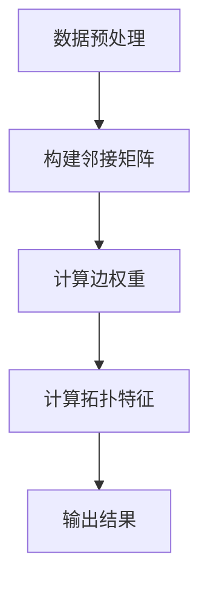
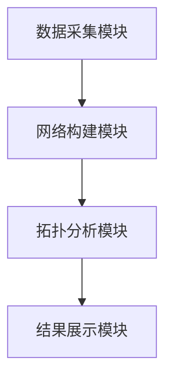
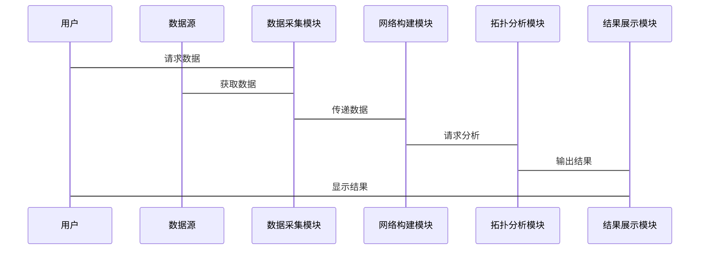

                 


# 特价股票投资中的数字产业价值网络拓扑分析方法

## 关键词：特价股票投资，数字产业，价值网络，拓扑分析，股票投资，数字技术

## 摘要：本文深入探讨了在特价股票投资中，如何利用数字产业价值网络的拓扑分析方法，构建和优化股票投资模型。通过分析数字产业网络的结构特征和节点属性，结合拓扑分析算法，帮助投资者识别潜在投资机会，优化投资组合，提升投资收益。文章内容包括数字产业价值网络的构建、拓扑分析方法、系统架构设计、项目实战等，为投资者提供了一套科学的股票投资分析体系。

---

## 第1章: 特价股票投资与数字产业价值网络概述

### 1.1 特价股票投资的背景与意义
#### 1.1.1 特价股票投资的定义与特点
特价股票投资是指以低于市场价购买股票，并在合适的时机卖出以获得收益的投资策略。其特点包括低门槛、高风险、高收益潜力和灵活性。通过数字技术的应用，投资者可以更高效地识别低价股票，捕捉市场机会。

#### 1.1.2 数字化技术在股票投资中的应用
数字化技术（如大数据分析、人工智能、区块链等）为股票投资提供了新的工具和方法。通过这些技术，投资者可以实时获取市场数据、分析市场趋势、评估股票价值，从而做出更明智的投资决策。

#### 1.1.3 数字产业价值网络的定义与内涵
数字产业价值网络是指由数字技术构建的产业生态系统，涵盖企业、产品、服务、数据等要素。其核心在于通过数字技术连接各个产业节点，形成价值传递的网络。价值网络的拓扑结构反映了各节点之间的关系和影响力。

### 1.2 数字产业价值网络的拓扑分析方法
#### 1.2.1 拓扑分析的基本概念
拓扑分析是通过研究网络的结构特征（如节点度数、中心性、聚类系数等）来理解网络的运行规律和潜在价值。在股票投资中，拓扑分析可以帮助识别关键节点（如龙头企业）和高风险节点（如弱势股）。

#### 1.2.2 数字产业价值网络的构建逻辑
数字产业价值网络的构建基于以下逻辑：
1. 数据采集：收集企业的市场数据、财务数据、新闻数据等。
2. 关系建立：通过数据关联性（如供应链、上下游关系）构建节点之间的关系。
3. 权重计算：根据节点的重要性（如市值、影响力）赋予边的权重。
4. 拓扑分析：通过算法提取网络的结构特征。

#### 1.2.3 拓扑分析在股票投资中的应用价值
- 识别行业龙头：通过节点中心性分析，找出行业中的核心企业。
- 发现投资机会：通过分析低估值、高潜力的节点，寻找潜在的特价股票。
- 评估风险：通过拓扑结构的稳定性分析，识别高风险区域。

---

## 第2章: 数字产业价值网络的核心概念与联系

### 2.1 数字产业价值网络的拓扑结构
#### 2.1.1 节点与边的定义
- **节点**：代表产业中的个体（企业、产品、服务等）。
- **边**：代表节点之间的关系（供应链、合作关系、竞争关系等）。

#### 2.1.2 拓扑特征的分类与对比
拓扑特征包括：
- **节点度数**：节点连接的边数，反映节点的重要性。
- **中心性**：节点在网络中的影响力。
- **聚类系数**：节点之间连接的紧密程度。
- **路径长度**：节点之间的最短路径长度。

#### 2.1.3 拓扑属性的数学表达
- 节点度数公式：$$degree(v) = \sum_{u \in V} A(u, v)$$
  其中，$A(u, v)$ 表示节点 $u$ 和 $v$ 之间是否存在边。
- 中心性公式：$$C(v) = \frac{1}{\sum_{u \neq v} d(v, u)}$$
  其中，$d(v, u)$ 表示节点 $v$ 到节点 $u$ 的最短路径长度。

#### 2.1.4 ER实体关系图
```mermaid
er
  %% 数字产业价值网络 ER 图
  title 数字产业价值网络 ER 图

  rectangle 节点类型 {
    <节点类型>
  }
  rectangle 边权重 {
    <边权重>
  }
  rectangle 拓扑结构 {
    <拓扑结构>
  }
  rectangle 节点属性 {
    <节点属性>
  }
  rectangle 边属性 {
    <边属性>
  }

  节点类型 -->> 边权重
  节点类型 -->> 拓扑结构
  节点类型 -->> 节点属性
  边权重 -->> 拓扑结构
  边属性 -->> 拓扑结构
```

### 2.2 数字产业价值网络的拓扑分析方法
#### 2.2.1 节点权重计算公式
节点权重计算公式：$$w(v) = \frac{degree(v)}{\sum_{u \in V} degree(u)}$$
其中，$degree(v)$ 是节点 $v$ 的度数，$\sum_{u \in V} degree(u)$ 是所有节点的度数之和。

#### 2.2.2 拓扑结构的稳定性分析
拓扑结构的稳定性分析可以通过节点移除实验来验证：
1. 移除关键节点，观察网络的连通性变化。
2. 使用聚类系数和路径长度来评估网络的鲁棒性。

#### 2.2.3 拓扑分析在股票投资中的应用
- **识别行业趋势**：通过分析网络的聚类系数，判断行业的集中度和分散度。
- **评估企业影响力**：通过中心性分析，判断企业的市场地位。
- **发现投资机会**：通过低度数节点分析，寻找被市场忽视的潜在机会。

---

## 第3章: 数字产业价值网络的拓扑分析算法原理

### 3.1 拓扑分析算法的基本原理
#### 3.1.1 基于图论的拓扑分析方法
图论是拓扑分析的基础。通过构建图的邻接矩阵，可以计算节点度数、中心性等特征。

#### 3.1.2 拓扑排序算法
拓扑排序算法用于确定节点的顺序，确保没有循环依赖。常见的算法包括Kahn算法和DFS算法。

#### 3.1.3 拓扑结构的动态更新机制
市场环境不断变化，拓扑结构需要动态更新。通过实时数据流处理，可以保持网络的准确性。

### 3.2 拓扑分析算法的实现流程
#### 3.2.1 数据预处理
- 清洗数据：去除无效数据和异常值。
- 标准化处理：将数据归一化，便于计算。

#### 3.2.2 拓扑结构构建
- 构建邻接矩阵：表示节点之间的关系。
- 计算边权重：根据数据赋予边的权重。

#### 3.2.3 拓扑特征提取
- 提取节点度数、中心性等特征。

#### 3.2.4 拓扑分析算法的实现


### 3.3 拓扑分析算法的数学模型
#### 3.3.1 节点度数计算公式
$$degree(v) = \sum_{u \in V} A(u, v)$$

#### 3.3.2 节点中心性计算公式
$$C(v) = \frac{1}{\sum_{u \neq v} d(v, u)}$$

#### 3.3.3 拓扑密度计算公式
$$density = \frac{m}{n(n-1)/2}$$
其中，$m$ 是边数，$n$ 是节点数。

---

## 第4章: 数字产业价值网络的系统分析与架构设计

### 4.1 系统分析
#### 4.1.1 问题场景介绍
系统需要解决的问题包括数据采集、网络构建、拓扑分析等。

#### 4.1.2 需求分析
- 功能需求：数据采集、网络构建、拓扑分析、结果输出。
- 性能需求：实时性、准确性、可扩展性。

#### 4.1.3 系统目标与约束条件
- 目标：构建高效、准确的数字产业价值网络分析系统。
- 约束条件：数据隐私、计算资源限制。

### 4.2 系统架构设计
#### 4.2.1 系统功能模块划分
- 数据采集模块：负责采集市场数据。
- 网络构建模块：负责构建数字产业价值网络。
- 拓扑分析模块：负责计算拓扑特征。
- 结果展示模块：负责输出分析结果。

#### 4.2.2 系统架构图


#### 4.2.3 系统接口设计
- 数据接口：与数据源对接，获取市场数据。
- 分析接口：提供拓扑分析服务。

#### 4.2.4 系统交互流程图


---

## 第5章: 项目实战

### 5.1 环境安装
- 安装Python和相关库（如NetworkX、Matplotlib）。
- 安装数据分析工具（如Pandas、NumPy）。

### 5.2 核心代码实现
#### 5.2.1 数据采集模块
```python
import requests
import pandas as pd

def get_market_data(ticker):
    url = f"https://api.example.com/{ticker}"
    response = requests.get(url)
    data = response.json()
    return pd.DataFrame(data)
```

#### 5.2.2 网络构建模块
```python
import networkx as nx

def build_network(data):
    G = nx.Graph()
    for row in data:
        G.add_edge(row['source'], row['target'], weight=row['weight'])
    return G
```

#### 5.2.3 拓扑分析模块
```python
def analyze_topology(G):
    degrees = {node: nx.degree(G, node) for node in G.nodes()}
    centralities = {node: nx.betweenness_centrality(G)[node] for node in G.nodes()}
    return degrees, centralities
```

### 5.3 实际案例分析
- 数据采集：获取某行业的市场数据。
- 网络构建：构建该行业的数字产业价值网络。
- 拓扑分析：计算节点度数和中心性。
- 投资决策：根据分析结果选择投资标的。

---

## 第6章: 最佳实践与总结

### 6.1 最佳实践
- 数据质量：确保数据的准确性和完整性。
- 模型优化：根据市场变化调整分析模型。
- 风险控制：合理分散投资，降低风险。

### 6.2 小结
本文通过数字产业价值网络的拓扑分析方法，为特价股票投资提供了一种新的思路。通过构建和优化分析模型，投资者可以更科学地进行投资决策，提高投资收益。

### 6.3 注意事项
- 数据隐私：注意保护数据来源和用户隐私。
- 计算资源：确保计算资源充足，避免性能瓶颈。

### 6.4 拓展阅读
建议读者进一步学习图论、网络科学、股票投资等相关知识，深入了解数字技术在金融领域的应用。

---

通过以上步骤，我们可以系统地构建数字产业价值网络的拓扑分析方法，为特价股票投资提供科学的决策支持。

