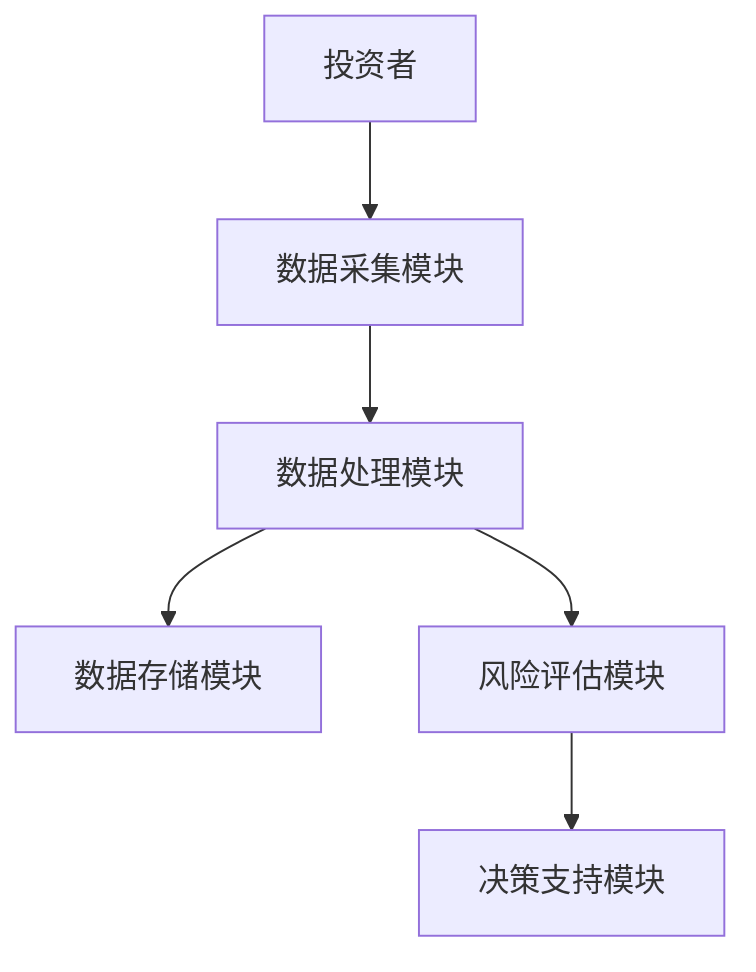
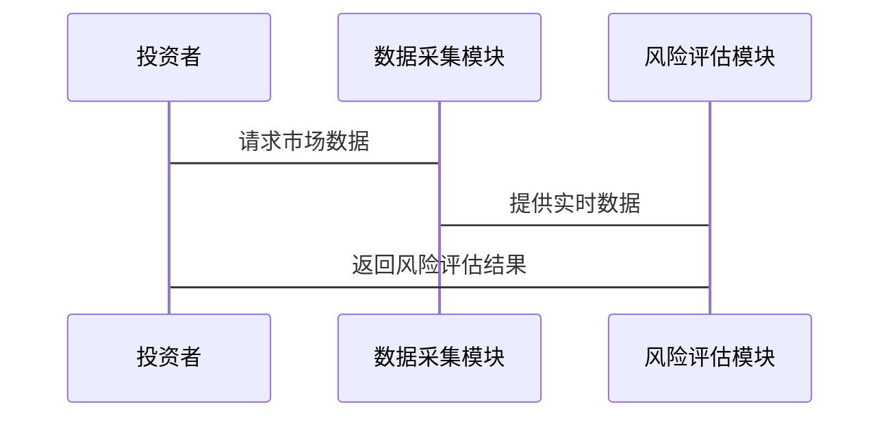

                 


# 特价股票投资中的数据主权与网络安全风险动态评估方法

## 关键词：特价股票投资、数据主权、网络安全风险、动态评估、机器学习模型

## 摘要：本文探讨在特价股票投资中如何确保数据主权，并动态评估网络安全风险。通过分析数据主权的核心要素、网络安全风险的动态变化，提出基于机器学习的评估方法，构建综合评估模型，并设计相应的系统架构，为投资者提供安全可靠的投资决策支持。

---

## 第一部分：背景介绍

### 第1章：特价股票投资的背景与现状

#### 1.1 特价股票投资的定义与特点

- **特价股票的定义**：指在特定价格点买入或卖出的股票，通常基于市场波动、公司财报或外部事件。
- **特点**：高风险、高回报；需要快速决策；依赖实时数据和分析。

#### 1.2 数据主权与网络安全的重要性

- **数据主权**：投资者对数据的控制权和使用权，涉及隐私和法律合规。
- **网络安全风险**：指因网络攻击导致的数据泄露、系统瘫痪等问题，影响投资决策和资产安全。

#### 1.3 特价股票投资中数据主权与网络安全的关系

- 数据主权确保投资者的数据安全，网络安全风险动态评估保障投资决策的准确性。

---

## 第二部分：核心概念与联系

### 第2章：数据主权的核心要素

#### 2.1 数据主权的法律框架

- 数据所有权、存储权、访问权的法律定义。

#### 2.2 数据主权的技术实现

- 数据加密、访问控制、数据备份的技术手段。

#### 2.3 数据主权的边界与外延

- 数据主权的范围包括数据生成、传输、存储和处理的全过程。

### 第3章：网络安全风险动态评估的原理

#### 3.1 网络安全风险的动态变化

- 市场波动、网络攻击、用户行为等因素影响风险变化。

#### 3.2 风险评估的核心要素

- 数据完整性、机密性、可用性。

#### 3.3 动态评估的方法与工具

- 实时监控、机器学习模型的应用。

### 第4章：数据主权与网络安全风险的关联性分析

#### 4.1 数据主权对网络安全风险的影响

- 数据主权确保数据合法使用，减少因数据滥用引发的风险。

#### 4.2 网络安全风险对数据主权的威胁

- 黑客攻击可能导致数据主权的丧失。

#### 4.3 两者的相互作用与协同关系

- 数据主权为网络安全提供基础，网络安全保障数据主权的实现。

---

## 第三部分：数学模型与算法原理

### 第5章：数据主权评估模型

#### 5.1 数据主权评估的指标体系

- 数据所有权、数据控制权、数据隐私保护。

#### 5.2 数据主权评估的数学公式

$$
\text{数据主权指数} = \frac{\text{数据所有权} + \text{数据控制权} + \text{数据隐私保护}}{3}
$$

#### 5.3 模型的验证与优化

- 使用历史数据验证模型准确性，通过反馈优化模型参数。

### 第6章：网络安全风险动态评估模型

#### 6.1 风险评估的动态特征

- 风险的实时变化、多因素影响。

#### 6.2 动态评估的数学模型

$$
R(t) = \alpha \cdot D(t) + \beta \cdot A(t) + \gamma \cdot U(t)
$$

其中，$R(t)$ 表示时间 $t$ 的风险值，$D(t)$ 表示数据完整性，$A(t)$ 表示访问控制，$U(t)$ 表示用户行为异常。

#### 6.3 模型的实现与应用

- 使用机器学习算法（如随机森林、神经网络）进行风险预测。

---

## 第四部分：系统架构设计

### 第7章：系统架构设计

#### 7.1 问题场景介绍

- 投资者需要实时监控特价股票，确保数据安全和投资决策的准确性。

#### 7.2 系统功能设计

- 数据采集模块：实时收集市场数据和用户行为数据。
- 数据处理模块：分析数据，评估数据主权和网络安全风险。
- 评估模块：动态评估风险，提供决策支持。

#### 7.3 系统架构图



#### 7.4 系统接口设计

- API接口：数据采集、风险评估结果输出。

#### 7.5 系统交互序列图



---

## 第五部分：项目实战

### 第8章：项目实战

#### 8.1 环境安装

- 安装Python、机器学习库（如scikit-learn、TensorFlow）、数据处理工具（如Pandas）。

#### 8.2 核心实现代码

```python
import pandas as pd
from sklearn.ensemble import RandomForestClassifier

# 数据预处理
data = pd.read_csv('stock_data.csv')
features = data.drop('target', axis=1)
labels = data['target']

# 训练模型
model = RandomForestClassifier()
model.fit(features, labels)

# 风险评估
def assess_risk(data_point):
    prediction = model.predict(data_point)
    return 'high' if prediction[0] else 'low'
```

#### 8.3 代码解读与分析

- 使用随机森林模型进行风险分类，数据点经过特征工程后输入模型，输出高或低风险。

#### 8.4 实际案例分析

- 以某次特价股票交易为例，展示数据采集、处理、评估的全过程。

---

## 第六部分：总结与展望

### 第9章：最佳实践与注意事项

#### 9.1 小结

- 数据主权和网络安全是保障特价股票投资的关键因素。
- 动态评估模型能够有效应对风险变化，提升投资决策的准确性。

#### 9.2 注意事项

- 定期更新模型参数，应对市场变化。
- 加强数据备份和系统防护，确保数据安全。

#### 9.3 拓展阅读

- 推荐阅读《数据主权与网络安全》、《机器学习在金融中的应用》等书籍。

---

## 第七部分：附录

### 附录A：术语解释

- 数据主权：数据的所有权和控制权。
- 动态评估：实时监控和调整的风险评估方法。

### 附录B：工具与库

- Python、Pandas、scikit-learn、TensorFlow等。

---

## 结语

通过本文的探讨，读者可以深入了解在特价股票投资中如何确保数据主权，动态评估网络安全风险，并通过实际案例和系统设计掌握具体实现方法。希望本文能够为投资者和相关技术人士提供有价值的参考和指导。

