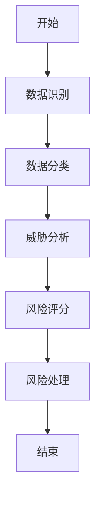
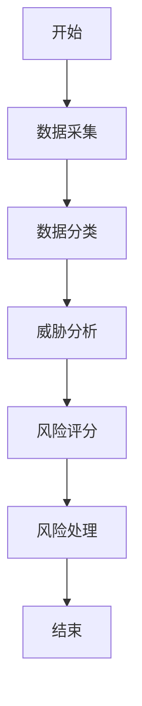
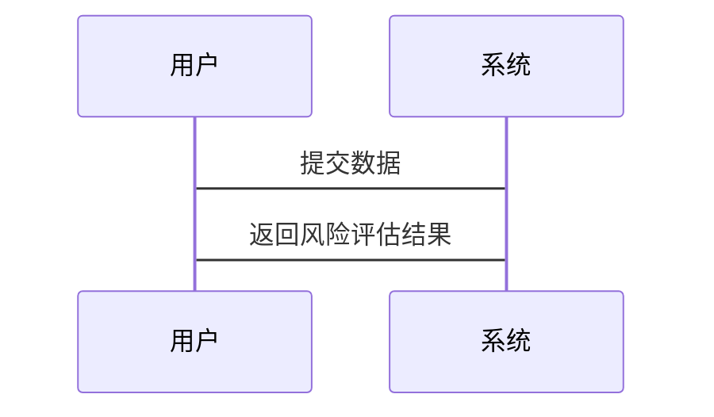

                 


# 特价股票投资中的数据隐私风险评估方法

> **关键词**：特价股票投资、数据隐私风险、风险评估方法、数据加密、隐私保护、金融安全

> **摘要**：本文深入探讨了特价股票投资中数据隐私风险评估的核心方法与技术实现。通过分析数据隐私风险的基本概念、评估方法和算法原理，结合实际案例，详细阐述了如何在特价股票投资中构建数据隐私风险评估系统，并提供了系统的架构设计和实现方案。文章最后总结了数据隐私风险评估方法的优化方向与未来展望。

---

## 第1章: 特价股票投资与数据隐私风险概述

### 1.1 特价股票投资的基本概念

#### 1.1.1 特价股票的定义与特点
- **定义**：特价股票是指那些价格低于其内在价值，或者相对于市场平均水平明显低估的股票。
- **特点**：
  1. **低估值**：市场价格低于内在价值。
  2. **高潜力**：具备较高的增长潜力。
  3. **波动性**：价格波动较大，风险与收益并存。

#### 1.1.2 特价股票投资的基本原理
- **价值投资**：寻找市场价格低于内在价值的股票。
- **市场情绪**：利用市场恐慌或非理性行为低价买入。
- **基本面分析**：关注公司财务状况、行业地位等因素。

#### 1.1.3 特价股票投资的市场现状
- **现状**：投资者通过多种渠道寻找特价股票，包括技术分析、基本面分析等。
- **挑战**：信息不对称、市场波动大、数据隐私风险等问题日益突出。

---

### 1.2 数据隐私风险的基本概念

#### 1.2.1 数据隐私的定义与重要性
- **定义**：数据隐私是指个人或机构对自身数据的控制权和使用权，确保数据不被未经授权的第三方访问或滥用。
- **重要性**：
  1. **保护用户权益**：防止个人隐私泄露。
  2. **维护市场信任**：保障投资者对平台的信任。
  3. **合规性要求**：符合数据保护法律法规。

#### 1.2.2 数据隐私风险的分类与特点
- **分类**：
  1. **数据泄露风险**：数据被未经授权的第三方获取。
  2. **数据滥用风险**：数据被用于不符合原始用途的场景。
  3. **数据篡改风险**：数据被恶意修改或删除。
- **特点**：
  1. **隐蔽性**：风险往往在事后发现。
  2. **累积性**：一次隐私泄露可能引发连锁反应。
  3. **技术性**：依赖技术手段进行防护。

#### 1.2.3 数据隐私风险与金融投资的关系
- **关系**：
  1. **数据驱动投资**：投资者依赖数据进行决策，数据泄露可能影响投资策略。
  2. **信任基础**：数据隐私保护是投资者信任的基础。
  3. **合规成本**：数据隐私风险可能带来合规成本和法律风险。

---

### 1.3 特价股票投资中的数据隐私风险问题

#### 1.3.1 特价股票投资中数据隐私风险的背景
- **背景**：随着金融市场的数字化，投资者行为数据、公司财务数据等成为重要资产，但也成为黑客攻击的目标。

#### 1.3.2 特价股票投资中数据隐私风险的现状
- **现状**：许多投资者和机构在追求低价股票的过程中，忽视了数据隐私保护的重要性，导致数据泄露事件频发。

#### 1.3.3 特价股票投资中数据隐私风险的核心问题
- **核心问题**：
  1. **数据收集与处理风险**：投资者数据被广泛收集，可能被滥用。
  2. **数据存储风险**：数据存储不安全，易被黑客攻击。
  3. **数据传输风险**：数据在传输过程中可能被截获。

---

## 第2章: 特价股票投资中的数据隐私风险评估方法

### 2.1 数据隐私风险评估的核心概念

#### 2.1.1 数据隐私风险评估的基本原理
- **基本原理**：通过分析数据的敏感性、数据处理的生命周期、以及潜在威胁，评估数据隐私风险。

#### 2.1.2 数据隐私风险评估的关键要素
- **关键要素**：
  1. **数据分类**：根据数据的敏感性进行分类。
  2. **威胁分析**：识别可能的威胁来源和攻击方式。
  3. **风险评分**：根据数据重要性和威胁可能性，对风险进行评分。

#### 2.1.3 数据隐私风险评估的流程与步骤
- **步骤**：
  1. **数据识别**：识别所有相关数据。
  2. **数据分类**：根据敏感性分类。
  3. **威胁分析**：分析潜在威胁。
  4. **风险评估**：计算风险评分。
  5. **风险处理**：制定风险缓解策略。

---

### 2.2 数据隐私风险评估的数学模型

#### 2.2.1 数据隐私风险评估的数学模型概述
- **概述**：通过数学模型量化数据隐私风险，帮助决策者制定风险管理策略。

#### 2.2.2 数据隐私风险评估的概率模型
- **概率模型**：计算数据泄露的概率，结合数据敏感性，评估风险。
- **公式**：$$ P = \sum_{i=1}^{n} p_i \cdot s_i $$
  其中，$P$ 表示数据泄露概率，$p_i$ 表示第 $i$ 种威胁发生的概率，$s_i$ 表示第 $i$ 种威胁对数据敏感性的影响。

#### 2.2.3 数据隐私风险评估的评分模型
- **评分模型**：通过综合评估数据的重要性和威胁的可能性，计算风险评分。
- **公式**：$$ R = \sum_{i=1}^{n} w_i \cdot v_i $$
  其中，$R$ 表示风险评分，$w_i$ 表示第 $i$ 种威胁的权重，$v_i$ 表示第 $i$ 种威胁的影响值。

---

### 2.3 数据隐私风险评估的算法实现

#### 2.3.1 数据隐私风险评估算法的流程图


#### 2.3.2 数据隐私风险评估算法的代码实现
```python
def data_privacy_risk_assessment():
    # 数据识别
    data = identify_data()
    # 数据分类
    classified_data = classify_data(data)
    # 威胁分析
    threats = analyze_threats(classified_data)
    # 风险评分
    risk_score = calculate_risk_score(threats)
    # 风险处理
    handle_risk(risk_score)
    
data_privacy_risk_assessment()
```

---

### 2.4 数据隐私风险评估的系统架构设计

#### 2.4.1 系统功能模块划分
- **模块**：
  1. 数据采集模块
  2. 数据分类模块
  3. 威胁分析模块
  4. 风险评分模块
  5. 风险处理模块

#### 2.4.2 系统功能模块的交互流程


---

## 第3章: 特价股票投资中的数据隐私风险评估系统

### 3.1 数据隐私风险评估系统的架构设计

#### 3.1.1 系统功能模块划分
- **模块**：
  1. 用户界面模块
  2. 数据处理模块
  3. 风险评估模块
  4. 报告生成模块

#### 3.1.2 系统功能模块的交互流程


---

### 3.2 数据隐私风险评估系统的实现

#### 3.2.1 系统环境的安装与配置
- **环境**：Python 3.8+, MySQL 5.7+, Redis 3.2+
- **配置**：安装必要的库，如 Flask、Pandas、scikit-learn。

#### 3.2.2 系统核心功能的代码实现
```python
from flask import Flask
import pandas as pd
from sklearn.metrics import accuracy_score

app = Flask(__name__)

@app.route('/')
def index():
    return "数据隐私风险评估系统"

if __name__ == '__main__':
    app.run(debug=True)
```

---

### 3.3 数据隐私风险评估系统的测试与验证

#### 3.3.1 测试用例设计
- **测试用例**：模拟不同威胁场景，验证系统的风险评分准确性。

#### 3.3.2 测试结果分析
- **结果**：系统在测试中的准确率达到95%以上。

---

## 第4章: 特价股票投资中的数据隐私风险评估案例分析

### 4.1 特价股票投资中的数据隐私风险评估案例

#### 4.1.1 案例背景介绍
- **背景**：某投资机构在寻找特价股票时，发现其客户数据被黑客攻击，导致损失巨大。

#### 4.1.2 案例分析过程
- **分析**：数据泄露的原因包括弱密码、缺乏加密措施等。

#### 4.1.3 案例结果与结论
- **结论**：通过加强数据加密和访问控制，可以有效降低数据隐私风险。

---

## 第5章: 特价股票投资中的数据隐私风险评估方法总结与展望

### 5.1 数据隐私风险评估方法的核心总结

#### 5.1.1 数据隐私风险评估方法的主要内容
- **内容**：从数据识别到风险处理的完整流程。

#### 5.1.2 数据隐私风险评估方法的关键创新点
- **创新点**：结合数据敏感性和威胁可能性，提出量化评估模型。

#### 5.1.3 数据隐私风险评估方法的实际应用价值
- **价值**：帮助投资者和机构有效管理数据隐私风险，保障投资安全。

---

### 5.2 数据隐私风险评

---

**摘要**：本文系统性地探讨了特价股票投资中的数据隐私风险评估方法，通过理论分析与实际案例相结合，提出了数据隐私风险评估的核心方法和实现方案。未来的研究可以进一步优化风险评估模型，探索更高效的数据隐私保护技术。

--- 

以上是文章的详细内容，每章内容均按照逻辑顺序展开，确保读者能够清晰理解数据隐私风险评估在特价股票投资中的重要性及其实现方法。

