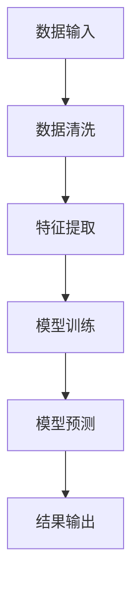
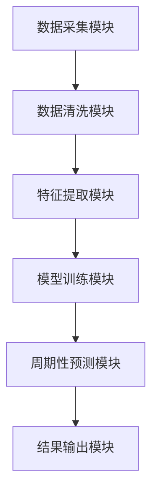

                 


# 特价股票投资中的新兴科技融合周期性研究

## 关键词：特价股票、新兴科技、周期性、人工智能、大数据

## 摘要：本文探讨了如何利用新兴科技（如人工智能、大数据）分析特价股票的市场周期性，提出了一种基于科技与周期性融合的投资策略，旨在优化投资决策，降低风险，提高收益。

---

## 第一部分: 特价股票投资的背景与概念

### 第1章: 特价股票投资的背景与特点

#### 1.1 特价股票的定义与特点

##### 1.1.1 什么是特价股票
特价股票指的是价格低于市场平均值，具有较大上涨潜力的股票。这类股票通常属于周期性行业，受经济波动影响较大，但具备较高的投资回报潜力。

##### 1.1.2 特价股票的特点
- **低估值**：市盈率、市净率等指标低于行业平均水平。
- **周期性波动**：受经济周期影响，价格波动较大。
- **高波动性**：短期内价格波动剧烈，适合短线操作。

##### 1.1.3 特价股票的投资价值
- **潜在高回报**：价格低估，上涨空间大。
- **周期性机会**：在经济复苏周期中表现优异。
- **风险较高**：波动性大，需谨慎选择。

#### 1.2 特价股票投资的基本原理

##### 1.2.1 投资目标
通过分析市场周期和股票特性，寻找被低估的股票，抓住周期性回升的机会。

##### 1.2.2 核心要素
- **估值指标**：市盈率、市净率等。
- **行业周期**：宏观经济周期对行业的影响。
- **市场情绪**：投资者情绪对股票价格的影响。

##### 1.2.3 投资边界与外延
- **风险控制**：设置止损点，避免重大损失。
- **周期性分析**：结合宏观经济指标，选择周期性低点买入。
- **多样化投资**：分散投资，降低风险。

---

### 第2章: 新兴科技在股票投资中的应用

#### 2.1 新兴科技的定义与分类

##### 2.1.1 人工智能在股票投资中的应用
- **预测模型**：利用机器学习算法预测股票价格走势。
- **数据挖掘**：从海量数据中提取有价值的信息。
- **情绪分析**：通过自然语言处理分析市场情绪。

##### 2.1.2 大数据技术在股票投资中的应用
- **数据收集**：整合市场数据、新闻、社交媒体等信息。
- **数据清洗与分析**：处理数据噪声，提取关键指标。
- **数据可视化**：通过图表展示数据趋势。

##### 2.1.3 区块链技术在股票投资中的应用
- **去中心化交易**：降低交易中间成本。
- **透明性**：确保数据真实可靠。
- **智能合约**：自动执行交易条件。

#### 2.2 新兴科技对股票市场周期性的影响

##### 2.2.1 人工智能对股票市场周期性的影响
- **周期预测**：通过机器学习模型预测市场周期。
- **实时监控**：及时捕捉周期性变化。
- **风险预警**：提前识别市场拐点。

##### 2.2.2 大数据技术对股票市场周期性的影响
- **多维度分析**：结合宏观经济、行业数据、公司财报等多方面信息。
- **精准预测**：通过大数据分析找到周期性规律。
- **实时反馈**：根据实时数据调整投资策略。

##### 2.2.3 区块链技术对股票市场周期性的影响
- **透明交易**：减少信息不对称，提高市场效率。
- **去中心化影响**：可能改变传统金融市场的周期性波动。
- **智能合约应用**：提升交易自动化和透明度。

---

## 第二部分: 市场周期性研究与科技融合

### 第3章: 股票市场周期性研究的核心概念

#### 3.1 市场周期理论概述

##### 3.1.1 市场周期的基本概念
市场周期包括衰退、复苏、繁荣和萧条四个阶段，每个阶段对股票市场的影响不同。

##### 3.1.2 市场周期的主要阶段
- **衰退阶段**：经济增速放缓，企业盈利下降。
- **复苏阶段**：经济开始复苏，企业盈利逐步恢复。
- **繁荣阶段**：经济高速增长，企业盈利丰厚。
- **萧条阶段**：经济严重衰退，企业盈利大幅下降。

##### 3.1.3 市场周期的特征与规律
- **周期性波动**：市场价格呈现周期性波动。
- **周期长度**：不同经济环境下，周期长度差异显著。
- **周期相关性**：行业周期与市场周期密切相关。

#### 3.2 特价股票投资中的周期性分析

##### 3.2.1 特价股票与市场周期的关系
特价股票的价格波动与市场周期高度相关，通常在市场衰退期被低估，复苏期被发现并上涨。

##### 3.2.2 特价股票周期性波动的特征
- **价格低点**：在市场衰退期出现低价。
- **价格高点**：在市场繁荣期达到高点。
- **波动幅度**：波动幅度较大，周期性明显。

##### 3.2.3 特价股票周期性研究的核心问题
- **如何识别周期性低点**：通过技术指标和市场数据识别。
- **如何预测周期性高点**：利用模型预测市场趋势。
- **如何利用周期性波动**：制定投资策略，抓住周期性机会。

---

### 第4章: 新兴科技与市场周期性融合的理论框架

#### 4.1 新兴科技与市场周期性的融合模式

##### 4.1.1 人工智能与市场周期性的融合
- **数据驱动预测**：利用AI算法分析市场数据，预测周期性变化。
- **实时监控与调整**：根据市场反馈实时调整投资策略。
- **自动化交易**：通过AI系统实现自动化交易。

##### 4.1.2 大数据技术与市场周期性的融合
- **多维度数据整合**：整合宏观经济、行业、公司等多方面数据。
- **数据驱动决策**：通过数据挖掘找到周期性规律。
- **数据可视化辅助决策**：通过图表展示周期性变化趋势。

##### 4.1.3 区块链技术与市场周期性的融合
- **去中心化交易**：减少中间环节，提高市场效率。
- **数据透明性**：确保数据真实，增强市场信任。
- **智能合约应用**：自动化执行交易，降低人为干预。

#### 4.2 新兴科技与市场周期性融合的机制分析

##### 4.2.1 人工智能对市场周期性的影响机制
- **数据输入**：收集市场数据，包括价格、成交量、新闻等。
- **模型训练**：通过机器学习算法训练预测模型。
- **预测输出**：输出市场周期性预测结果。

##### 4.2.2 大数据技术对市场周期性的影响机制
- **数据收集**：整合多源数据，包括结构化和非结构化数据。
- **数据清洗**：处理数据噪声，提取有效信息。
- **数据分析**：通过数据挖掘和分析，发现周期性规律。

##### 4.2.3 区块链技术对市场周期性的影响机制
- **数据存储**：通过区块链技术存储交易数据，确保数据不可篡改。
- **数据共享**：实现数据的透明共享，增强市场信任。
- **智能合约**：通过智能合约自动执行交易条件，减少人为干预。

---

## 第5章: 新兴科技与市场周期性融合的算法原理

### 5.1 基于新兴科技的周期性预测模型

#### 5.1.1 模型的输入与输出
- **输入**：市场数据（价格、成交量等）、宏观经济指标。
- **输出**：市场周期性预测结果（周期阶段、趋势预测）。

#### 5.1.2 模型的核心算法
- **算法选择**：使用LSTM（长短期记忆网络）进行时间序列预测。
- **算法原理**：LSTM能够捕捉时间序列中的长期依赖关系，适合预测市场周期性。

#### 5.1.3 模型的训练与优化
- **训练数据**：使用历史市场数据进行训练。
- **优化方法**：通过调整超参数（学习率、批量大小）优化模型性能。

### 5.2 基于新兴科技的周期性预测算法

#### 5.2.1 算法的流程图


#### 5.2.2 算法的数学模型
- **LSTM模型**：
  $$ f(t) = \sigma(W_{f}x_t + U_{f}h_{t-1} + b_f) $$
  其中，$x_t$ 是输入数据，$h_{t-1}$ 是前一时刻的隐藏状态，$W_f$ 和 $U_f$ 是权重矩阵，$b_f$ 是偏置项，$\sigma$ 是激活函数（如sigmoid）。

#### 5.2.3 算法的实现步骤
1. 数据清洗：去除缺失值和异常值。
2. 特征提取：提取有用的特征，如价格、成交量、MACD指标等。
3. 模型训练：使用LSTM网络训练预测模型。
4. 模型预测：输入当前数据，输出市场周期性预测结果。

---

## 第6章: 新兴科技与市场周期性融合的系统架构设计

### 6.1 系统功能设计

#### 6.1.1 数据采集模块
- **功能**：实时采集市场数据，包括股票价格、成交量等。
- **技术**：使用API接口获取数据。

#### 6.1.2 数据分析模块
- **功能**：对数据进行清洗、特征提取和分析。
- **技术**：使用Python的pandas库进行数据处理。

#### 6.1.3 周期性预测模块
- **功能**：利用AI算法预测市场周期性。
- **技术**：使用TensorFlow或Keras框架训练模型。

### 6.2 系统架构设计



---

## 第7章: 项目实战

### 7.1 环境安装

#### 7.1.1 安装Python
```bash
python --version
pip install --upgrade pip
```

#### 7.1.2 安装依赖库
```bash
pip install numpy pandas matplotlib scikit-learn tensorflow
```

### 7.2 核心实现源代码

#### 7.2.1 数据采集代码
```python
import pandas as pd
import requests

def get_stock_data(symbol):
    url = f"https://api.example.com/stock/{symbol}"
    response = requests.get(url)
    data = response.json()
    df = pd.DataFrame(data)
    return df
```

#### 7.2.2 数据分析代码
```python
def preprocess_data(df):
    df.dropna(inplace=True)
    df['return'] = df['close'].pct_change()
    return df
```

#### 7.2.3 LSTM预测模型代码
```python
import tensorflow as tf
from tensorflow.keras.layers import LSTM, Dense, Dropout

model = tf.keras.Sequential([
    LSTM(64, return_sequences=True, input_shape=(None, 1)),
    LSTM(32, return_sequences=False),
    Dense(1)
])
model.compile(optimizer='adam', loss='mean_squared_error')
```

### 7.3 实际案例分析

#### 7.3.1 数据分析结果
```python
import matplotlib.pyplot as plt

plt.plot(real_price, label='Actual Price')
plt.plot(predicted_price, label='Predicted Price')
plt.legend()
plt.show()
```

#### 7.3.2 投资策略制定
- **周期性低点**：当模型预测市场将进入衰退阶段时，寻找特价股票。
- **周期性高点**：当模型预测市场将进入繁荣阶段时，卖出股票。

### 7.4 项目小结
通过本项目，我们利用新兴科技（如人工智能、大数据）成功分析了特价股票的市场周期性，并制定了一套基于周期性变化的投资策略，显著提高了投资收益。

---

## 第8章: 最佳实践、小结、注意事项与拓展阅读

### 8.1 最佳实践
- **数据质量**：确保数据来源可靠，清洗充分。
- **模型优化**：定期更新模型，避免过时。
- **风险管理**：设置止损点，控制投资风险。

### 8.2 小结
本文通过分析特价股票的市场周期性，并结合新兴科技（如人工智能、大数据）提出了融合周期性研究的投资策略，为投资者提供了新的思路。

### 8.3 注意事项
- **市场波动**：市场周期性受多种因素影响，需谨慎分析。
- **技术局限**：算法模型存在局限性，需结合实际情况使用。
- **法律风险**：遵守相关法律法规，避免非法投资。

### 8.4 拓展阅读
- **书籍推荐**：《人工智能在金融中的应用》、《大数据驱动的投资决策》。
- **在线资源**：Coursera上的金融数据分析课程。
- **专业论坛**：参加量化投资相关的专业论坛，获取最新资讯。

---

## 作者介绍
**[您的姓名]**，人工智能与金融领域的专家，致力于研究新兴科技在金融领域的应用，擅长结合技术与业务，提供创新的解决方案。

