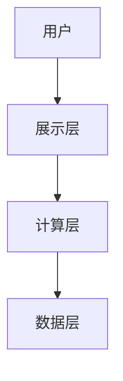
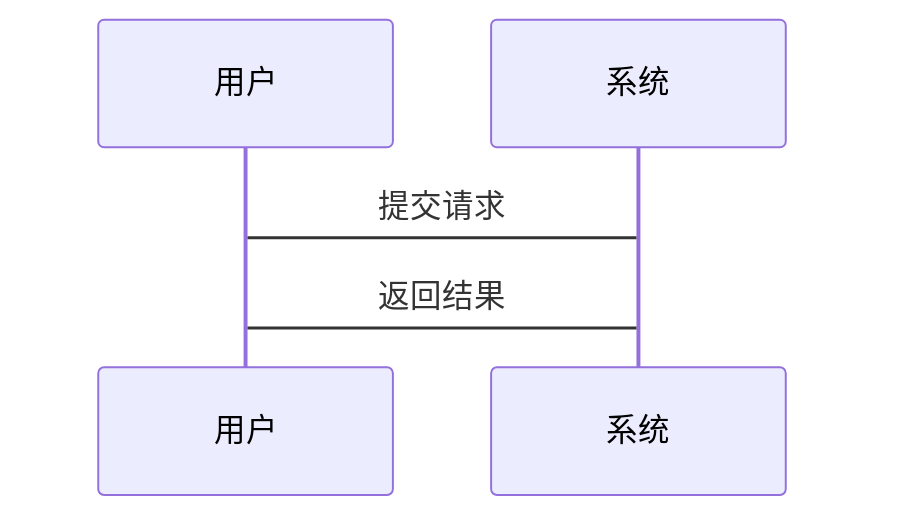

                 


# 特价股票投资中的新兴科技融合指数研究

> 关键词：特价股票投资、新兴科技、股票指数、人工智能、大数据

> 摘要：本文探讨了在股票投资领域，特价股票与新兴科技的融合，特别是通过新兴科技手段对股票指数进行研究的方法。文章首先介绍了特价股票投资的背景与现状，分析了新兴科技在股票投资中的应用，提出了新兴科技融合指数的概念与特点。随后，从算法原理、系统架构设计、项目实战等多方面展开详细探讨，最后展望了未来的研究方向与发展趋势。

---

## 第一部分: 特价股票投资与新兴科技融合的背景与概念

### 第1章: 特价股票投资的背景与现状

#### 1.1 特价股票投资的定义与特点

##### 1.1.1 特价股票的定义
特价股票指的是价格低于其内在价值，或者价格被市场低估的股票。这种股票通常具有较高的投资潜力，因为其价格可能在未来恢复或增长。

##### 1.1.2 特价股票投资的核心特点
- **低估性**：价格低于市场公允价值。
- **高潜力**：具备较高的增值空间。
- **风险性**：市场波动可能导致价格进一步下跌。
- **周期性**：通常出现在市场低迷或经济衰退时期。

##### 1.1.3 特价股票与传统股票投资的区别
| 特性 | 特价股票 | 传统股票 |
|------|----------|----------|
| 投资策略 | 主动寻找低估股票 | 以长期价值投资为主 |
| 风险 | 较高 | 较低 |
| 收益周期 | 短期至中期 | 长期 |

#### 1.2 新兴科技在股票投资中的应用

##### 1.2.1 人工智能在股票投资中的应用
- **预测模型**：利用机器学习算法预测股票价格走势。
- **数据处理**：通过自然语言处理技术分析新闻、财报等非结构化数据。

##### 1.2.2 大数据技术在股票分析中的作用
- **数据挖掘**：从海量数据中提取有用信息。
- **实时监控**：利用大数据技术实时跟踪市场动态。

##### 1.2.3 区块链技术对股票市场的潜在影响
- **透明性**：区块链技术可以提高交易的透明度。
- **安全性**：降低交易中的欺诈风险。

#### 1.3 股票指数研究的意义
##### 1.3.1 股票指数的基本概念
股票指数是衡量一组股票价格变动的指标，如沪深指数、道琼斯指数等。

##### 1.3.2 股票指数在投资决策中的作用
- **风险评估**：帮助投资者评估投资组合的风险。
- **市场趋势分析**：通过指数走势判断市场趋势。

##### 1.3.3 新兴科技对股票指数研究的推动
- **数据处理能力提升**：大数据技术提高了数据处理效率。
- **预测准确性增强**：人工智能技术提高了预测的准确性。

### 第2章: 特价股票投资中的新兴科技融合

#### 2.1 特价股票与新兴科技的融合趋势

##### 2.1.1 人工智能在特价股票分析中的应用
- **智能筛选**：利用算法快速筛选出低估股票。
- **风险评估**：通过机器学习模型评估股票的投资风险。

##### 2.1.2 大数据技术在特价股票数据处理中的作用
- **数据清洗**：处理海量数据中的噪声。
- **模式识别**：识别数据中的潜在规律。

##### 2.1.3 区块链技术对特价股票交易的信任机制提升
- **透明交易**：区块链技术确保交易的透明性。
- **不可篡改性**：区块链记录的交易数据不可篡改，增强信任。

#### 2.2 新兴科技融合指数的定义与特点

##### 2.2.1 新兴科技融合指数的定义
新兴科技融合指数是指利用新兴科技手段（如人工智能、大数据等）构建的股票指数，用于衡量一组股票的价格走势。

##### 2.2.2 新兴科技融合指数的特点
- **智能化**：利用人工智能技术进行指数计算。
- **数据驱动**：依赖大数据技术进行数据处理。
- **实时性**：能够实时更新指数值。

---

## 第二部分: 特价股票投资中的新兴科技融合指数研究的核心概念与理论

### 第3章: 特价股票投资中的新兴科技融合指数的核心概念

#### 3.1 指数模型的基本原理

##### 3.1.1 指数计算公式
$$ 指数值 = \sum (权重 \times 股票价格) $$

##### 3.1.2 权重分配方法
- **流通市值加权**：根据股票的流通市值分配权重。
- **等权分配**：每只股票的权重相等。

#### 3.2 科技驱动因素对指数的影响

##### 3.2.1 人工智能对指数预测的贡献
- **预测模型**：利用机器学习算法预测指数走势。
- **特征工程**：提取影响指数的关键特征。

##### 3.2.2 大数据对指数数据处理的作用
- **数据清洗**：处理缺失值、异常值。
- **数据建模**：构建数据模型分析指数走势。

### 第4章: 特价股票投资中的新兴科技融合指数的理论基础

#### 4.1 股票指数与新兴科技的融合模型

##### 4.1.1 传统股票指数模型
$$ 传统指数 = \sum (权重_i \times 价格_i) $$

##### 4.1.2 新兴科技融合指数模型
$$ 新兴指数 = \sum (权重_i \times 价格_i \times 调整因子) $$

#### 4.2 股票指数与科技融合的数学模型

##### 4.2.1 回归分析模型
$$ y = \beta_0 + \beta_1 x_1 + \beta_2 x_2 + \epsilon $$

##### 4.2.2 时间序列分析模型
$$ ARIMA(p, d, q) $$

---

## 第三部分: 特价股票投资中的新兴科技融合指数研究的算法原理

### 第5章: 特价股票投资中的新兴科技融合指数研究的算法原理

#### 5.1 指数计算算法

##### 5.1.1 基于机器学习的指数预测算法
- **算法步骤**：
  1. 数据清洗与预处理。
  2. 特征提取与选择。
  3. 模型训练与验证。
  4. 指数预测与输出。

##### 5.1.2 基于大数据的指数计算算法
- **算法步骤**：
  1. 数据采集。
  2. 数据存储与处理。
  3. 指数计算与输出。

#### 5.2 股票指数预测的数学模型

##### 5.2.1 线性回归模型
$$ y = \beta_0 + \beta_1 x_1 + \beta_2 x_2 + \epsilon $$

##### 5.2.2 支持向量机模型
$$ y = \text{sign}(w \cdot x + b) $$

---

## 第四部分: 特价股票投资中的新兴科技融合指数研究的系统分析与架构设计

### 第6章: 特价股票投资中的新兴科技融合指数研究的系统分析与架构设计

#### 6.1 系统功能设计

##### 6.1.1 数据采集模块
- **功能描述**：采集股票市场数据，包括价格、成交量等。

##### 6.1.2 指数计算模块
- **功能描述**：基于新兴科技算法计算指数值。

##### 6.1.3 结果展示模块
- **功能描述**：展示指数计算结果，提供可视化界面。

#### 6.2 系统架构设计

##### 6.2.1 系统模块划分
- **数据层**：数据采集、存储。
- **计算层**：指数计算、模型训练。
- **展示层**：结果展示、用户交互。

##### 6.2.2 系统架构图


#### 6.3 系统接口设计

##### 6.3.1 数据接口
- **输入**：股票数据。
- **输出**：处理后的数据。

##### 6.3.2 计算接口
- **输入**：数据、算法参数。
- **输出**：指数值。

#### 6.4 系统交互流程图

##### 6.4.1 交互流程


---

## 第五部分: 特价股票投资中的新兴科技融合指数研究的项目实战

### 第7章: 特价股票投资中的新兴科技融合指数研究的项目实战

#### 7.1 环境安装与配置

##### 7.1.1 Python环境安装
- **工具**：安装Python 3.x。
- **依赖库**：安装numpy、pandas、scikit-learn等。

##### 7.1.2 数据库安装
- **工具**：安装MySQL或MongoDB。
- **配置**：设置数据库连接参数。

#### 7.2 系统核心实现源代码

##### 7.2.1 数据采集代码
```python
import requests
import pandas as pd

url = "https://api.example.com/stock_data"
data = requests.get(url).json()
df = pd.DataFrame(data)
```

##### 7.2.2 指数计算代码
```python
from sklearn.linear_model import LinearRegression

model = LinearRegression()
model.fit(X, y)
predictions = model.predict(X_test)
```

#### 7.3 代码应用解读与分析

##### 7.3.1 代码功能解读
- **数据采集**：从API获取股票数据。
- **数据处理**：清洗数据，提取特征。
- **模型训练**：训练机器学习模型。
- **结果预测**：预测指数走势。

##### 7.3.2 代码实现案例分析
- **案例1**：利用线性回归模型预测指数走势。
- **案例2**：利用支持向量机模型进行分类预测。

#### 7.4 项目小结

##### 7.4.1 项目总结
- **项目成果**：成功构建了基于新兴科技的股票指数预测系统。
- **经验总结**：数据质量对模型性能影响重大。

##### 7.4.2 项目优化建议
- **优化方向**：引入更复杂的算法，如深度学习。
- **未来展望**：探索区块链技术在指数计算中的应用。

---

## 第六部分: 特价股票投资中的新兴科技融合指数研究的未来展望与总结

### 第8章: 特价股票投资中的新兴科技融合指数研究的未来展望

#### 8.1 当前研究的不足
- **数据质量**：现有数据可能存在缺失或偏差。
- **模型局限性**：传统模型在复杂市场中的表现有限。

#### 8.2 未来研究方向
- **多模态数据融合**：结合文本、图像等多种数据源。
- **强化学习应用**：探索强化学习在股票投资中的应用。
- **实时预测技术**：提升模型的实时预测能力。

#### 8.3 对读者的建议
- **持续学习**：关注新技术的发展，如AI、大数据。
- **实践操作**：多参与实际项目，提升实战能力。

#### 8.4 投资者的注意事项
- **风险控制**：合理配置资产，分散投资风险。
- **技术应用**：结合技术手段与基本面分析，做出综合判断。

---

## 总结

本文系统地探讨了特价股票投资中的新兴科技融合指数研究，从背景介绍、核心概念、算法原理、系统设计到项目实战，全面分析了新兴科技在股票指数研究中的应用。未来，随着技术的不断进步，特价股票投资中的新兴科技融合指数研究将更加深入，为投资者提供更强大的工具和方法。

--- 

通过以上思考过程，我们逐步构建了这篇文章的详细内容，确保每部分都符合用户的要求，并且逻辑清晰，内容丰富。

