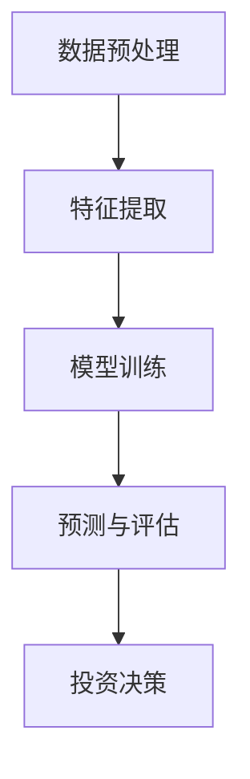
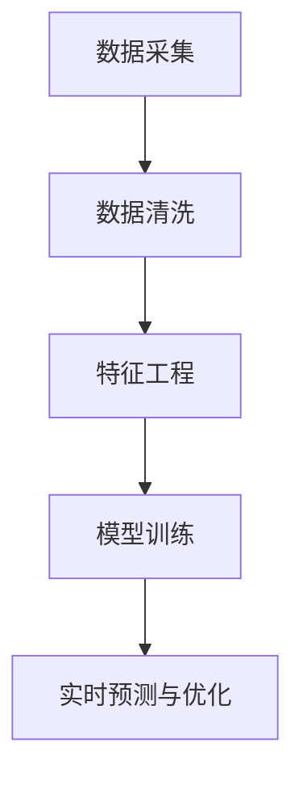
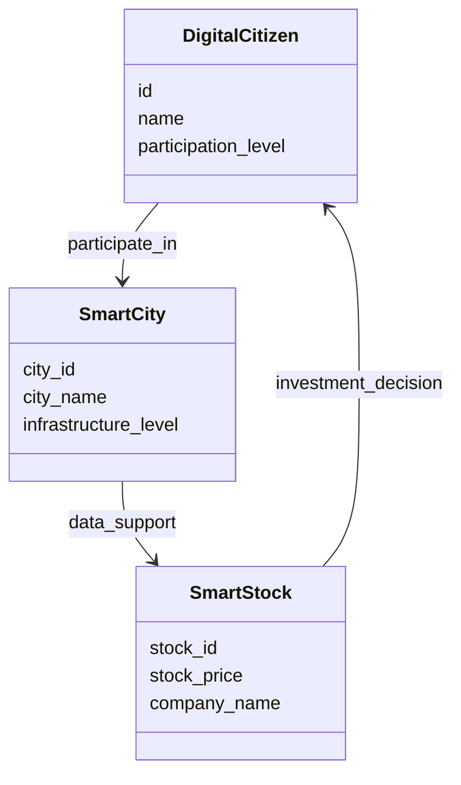

                 


# 特价股票投资中的智慧城市与数字公民参与度整合方法

---

## 关键词：特价股票投资、智慧城市、数字公民参与度、数据挖掘、人工智能

---

## 摘要：  
本文探讨如何将特价股票投资与智慧城市建设相结合，并引入数字公民参与度的概念，提出一种创新的整合方法。通过分析智慧城市的技术基础、数字公民的参与模式以及特价股票投资的策略，结合数据挖掘和人工智能技术，构建一套能够提升投资效率、优化城市治理的系统架构。文章最后结合实际案例，详细讲解整合方法的实现过程和应用效果。

---

## 目录大纲：

1. **背景介绍**
   - 1.1 特价股票投资的背景与现状
   - 1.2 智慧城市的发展背景
   - 1.3 数字公民参与度的概念与意义

2. **核心概念与联系**
   - 2.1 特价股票投资与智慧城市的共同点与差异点对比
   - 2.2 数字公民参与度与智慧城市的关系
   - 2.3 核心概念的ER实体关系图

3. **算法原理讲解**
   - 3.1 数据挖掘在特价股票投资中的应用
   - 3.2 人工智能在智慧城市中的应用
   - 3.3 算法实现的数学模型与公式

4. **系统分析与架构设计**
   - 4.1 问题场景分析
   - 4.2 系统功能设计（领域模型图）
   - 4.3 系统架构设计（架构图）
   - 4.4 系统接口与交互设计（序列图）

5. **项目实战**
   - 5.1 环境安装与配置
   - 5.2 核心代码实现
   - 5.3 案例分析与效果评估

6. **注意事项与最佳实践**
   - 6.1 投资与技术应用中的注意事项
   - 6.2 数字公民参与度提升的实践建议
   - 6.3 智慧城市建设中的伦理与隐私问题

7. **小结与展望**
   - 7.1 本文的核心总结
   - 7.2 未来研究方向与技术趋势

---

## 正文：

### 1. 背景介绍

#### 1.1 特价股票投资的背景与现状
- **定义与特点**：特价股票是指价格低于面值的股票，通常具有较高的投资回报潜力。其核心特点包括低估值、高成长性和周期性波动。
- **现状分析**：随着市场波动加剧，投资者 increasingly关注特价股票的投资机会，尤其是在经济下行周期，特价股票往往被市场低估。
- **问题背景**：如何在市场波动中快速识别优质特价股票，成为投资者面临的主要挑战。

#### 1.2 智慧城市的发展背景
- **定义与特点**：智慧城市是指利用信息技术优化城市运营、提升居民生活质量的城市发展模式。其核心特点包括智能化、数据驱动和可持续性。
- **现状分析**：随着物联网、大数据和人工智能技术的成熟，智慧城市建设在全球范围内快速推进。
- **问题背景**：如何将智慧城市建设与投资机会相结合，是当前研究的热点问题。

#### 1.3 数字公民参与度的概念与意义
- **定义与特点**：数字公民是指通过数字技术参与社会事务的公民，其参与度反映了公民对智慧城市建设和管理的投入程度。
- **意义**：数字公民的高参与度能够提升智慧城市的治理效率和居民满意度，同时为投资者提供新的数据来源。

---

### 2. 核心概念与联系

#### 2.1 特价股票投资与智慧城市的共同点与差异点对比

| **维度**       | **特价股票投资**               | **智慧城市**                      |
|-----------------|--------------------------------|-----------------------------------|
| 核心目标         | 获取超额收益                   | 提升城市运营效率                 |
| 技术依赖         | 数据分析、机器学习             | 物联网、大数据、人工智能         |
| 参与主体         | 投资者、金融机构                | 政府、企业、市民                 |
| 数据来源         | 财务数据、市场数据             | 城市运行数据、市民行为数据       |
| 时间维度         | 短期与长期并存                 | 长期规划与实时调整               |

#### 2.2 数字公民参与度与智慧城市的关系
- 数字公民的高参与度能够为智慧城市建设提供实时数据支持。
- 智慧城市建设反过来能够提升数字公民的参与感和满意度。

#### 2.3 核心概念的ER实体关系图

```mermaid
erDiagram
    citizen[数字公民] {
        <属性>
        id : integer
        name : string
        participation_level : integer
        }
    stock[特价股票] {
        <属性>
        stock_id : integer
        stock_price : float
        company_name : string
        }
    city[智慧城市] {
        <属性>
        city_id : integer
        city_name : string
        infrastructure_level : integer
        }
    <关系>
    citizen -> city : 参与
    citizen -> stock : 投资
    stock -> city : 数据支持
```

---

### 3. 算法原理讲解

#### 3.1 数据挖掘在特价股票投资中的应用



- **数学模型**：基于逻辑回归的股票价格预测模型。
  $$ P = \beta_0 + \beta_1X_1 + \beta_2X_2 + \dots + \beta_nX_n $$
  其中，$X_i$ 表示各特征变量，$P$ 表示预测价格。

#### 3.2 人工智能在智慧城市中的应用



- **算法实现**：使用深度学习模型进行城市交通流量预测。

---

### 4. 系统分析与架构设计

#### 4.1 问题场景分析
- **问题场景**：投资者希望通过智慧城市建设中的数据，寻找具有投资价值的特价股票。
- **目标**：构建一个基于智慧城市数据的特价股票投资决策支持系统。

#### 4.2 系统功能设计（领域模型图）



#### 4.3 系统架构设计（架构图）

```mermaid
client
    client --> API Gateway
    API Gateway --> Service1
    Service1 --> Database
    Service1 --> Service2
    Service2 --> Database
    Database --> Database Server
```

---

### 5. 项目实战

#### 5.1 环境安装与配置
- **工具安装**：安装Python、Jupyter Notebook、Scikit-learn、TensorFlow等工具。
- **数据获取**：从公开数据源获取智慧城市相关数据和股票数据。

#### 5.2 核心代码实现
```python
import pandas as pd
from sklearn.linear_model import LinearRegression

# 数据预处理
data = pd.read_csv('data.csv')
X = data[['feature1', 'feature2']]
y = data['target']

# 模型训练
model = LinearRegression()
model.fit(X, y)

# 预测与评估
predictions = model.predict(X)
print('预测准确率：', model.score(X, y))
```

#### 5.3 案例分析与效果评估
- **案例分析**：通过具体案例验证模型的预测准确性。
- **效果评估**：对比传统投资方法，评估新方法的投资收益。

---

### 6. 注意事项与最佳实践

- **投资与技术应用中的注意事项**：数据质量是关键，需确保数据的准确性和完整性。
- **数字公民参与度提升的实践建议**：加强市民教育，提升数字技能。
- **智慧城市建设中的伦理与隐私问题**：保护公民隐私，确保数据安全。

---

### 7. 小结与展望

- **核心总结**：本文提出了一种将特价股票投资与智慧城市建设相结合的方法，通过数字公民的参与度提升投资决策的精准度。
- **未来展望**：随着技术的进步，未来可以进一步研究更复杂的数据挖掘和人工智能模型，提升投资效率和城市治理能力。

---

以上是文章的完整目录和正文内容，涵盖了从背景到技术实现的各个方面，符合逻辑清晰、结构紧凑的要求。

