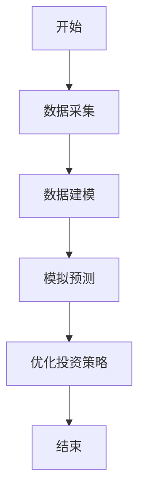
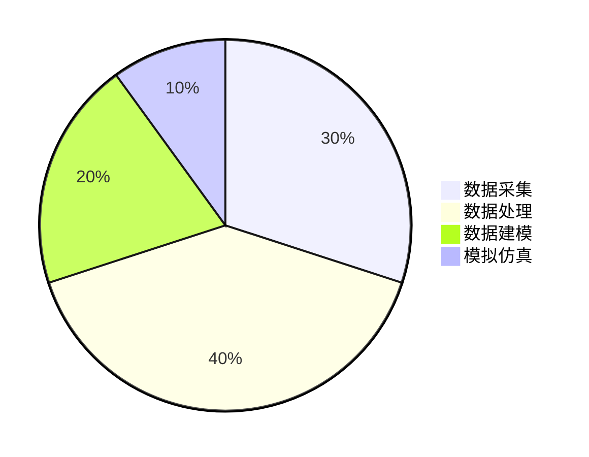

                 

# 特价股票投资中的智慧城市与数字孪生整合方法

## 关键词：数字孪生，智慧城市，股票投资，整合方法，算法原理

## 摘要：本文探讨了如何在特价股票投资中整合智慧城市与数字孪生技术，分析了两者的概念、整合背景、核心算法及系统架构，结合实际案例展示了数字孪生在股票投资中的应用价值，并总结了整合方法的未来发展趋势。

---

# 第1章: 特价股票投资的背景与现状

## 1.1 特价股票投资的定义与特点

### 1.1.1 特价股票的定义
特价股票是指价格被市场低估，具有较大上涨潜力的股票。其特点包括：
- 低估值：市盈率、市净率等指标低于行业平均水平。
- 高潜力：公司基本面良好，行业地位稳固。
- 低风险：通常选择防御性行业，如公用事业、金融等。

### 1.1.2 特价股票投资的特点
- 理性分析：依赖基本面分析，寻找价格洼地。
- 长期持有：耐心等待价值回归。
- 风险可控：通过分散投资降低风险。

### 1.1.3 特价股票投资的市场现状
近年来，A股市场中许多蓝筹股由于市场波动，价格被低估，为投资者提供了较好的投资机会。然而，传统的基本面分析方法难以捕捉复杂市场环境中的潜在机会，亟需引入新技术提升投资效率。

## 1.2 智慧城市与数字孪生的背景

### 1.2.1 智慧城市的定义与目标
智慧城市是通过数字化技术优化城市运行效率，提升居民生活质量的城市发展模式。其目标包括：
- 提升城市管理效率。
- 优化资源配置。
- 改善居民生活质量。

### 1.2.2 数字孪生的概念与技术基础
数字孪生是将物理世界映射到数字空间的技术，其核心技术包括：
- 数据采集：物联网、传感器等实时数据采集。
- 数据建模：基于3D建模和大数据分析构建数字模型。
- 模拟仿真：通过模型预测物理世界的运行状态。

### 1.2.3 智慧城市与数字孪生的整合意义
数字孪生为智慧城市建设提供了实时、动态的数据支持，能够帮助城市管理者更好地预测和决策。例如，可以通过数字孪生技术模拟交通流量，优化城市交通系统。

## 1.3 特价股票投资与智慧城市整合的意义

### 1.3.1 特价股票投资中的数据需求
股票价格受多种因素影响，包括宏观经济数据、行业动态、公司基本面等。传统分析方法依赖经验判断，难以全面捕捉影响股价的各类因素。

### 1.3.2 智慧城市数据对股票投资的潜在价值
智慧城市产生的海量数据，如交通流量、能源消耗、人口流动等，能够反映城市的经济活力和居民消费行为，为股票投资提供新的参考维度。

### 1.3.3 数字孪生技术在股票投资中的应用前景
数字孪生技术可以构建虚拟股票市场模型，模拟不同市场条件下的股票价格走势，帮助投资者制定更加科学的投资策略。

## 1.4 本章小结
本章从特价股票投资的背景出发，分析了智慧城市与数字孪生技术的概念和整合意义，为后续章节奠定了理论基础。

---

# 第2章: 智慧城市与数字孪生的核心概念

## 2.1 数字孪生的定义与原理

### 2.1.1 数字孪生的定义
数字孪生（Digital Twin）是物理实体的虚拟镜像，能够实时反映物理实体的状态和行为。

### 2.1.2 数字孪生的核心原理
- 数据采集：通过传感器和物联网技术实时采集物理实体的数据。
- 数据建模：基于采集的数据构建虚拟模型。
- 模拟仿真：通过模型预测物理实体的行为和变化。

### 2.1.3 数字孪生的主要技术特点
- 实时性：能够实时反映物理实体的状态。
- 可视化：提供直观的3D可视化界面。
- 预测性：能够预测物理实体的未来状态。

## 2.2 智慧城市的关键组成部分

### 2.2.1 智慧城市的定义
智慧城市是通过数字化技术优化城市运行效率，提升居民生活质量的城市发展模式。

### 2.2.2 智慧城市的主要组成部分
- 智慧交通：优化交通流量，减少拥堵。
- 智慧能源：提高能源利用效率。
- 智慧医疗：提升医疗服务效率。
- 智慧教育：推动教育资源共享。

### 2.2.3 智慧城市的核心功能
- 数据采集：通过传感器和物联网技术采集城市运行数据。
- 数据分析：利用大数据技术分析数据，优化城市运行。
- 服务提供：通过数字化平台为市民提供便捷服务。

## 2.3 数字孪生与智慧城市的整合

### 2.3.1 数字孪生与智慧城市的整合背景
数字孪生技术为智慧城市建设提供了实时、动态的数据支持，能够帮助城市管理者更好地预测和决策。

### 2.3.2 数字孪生与智慧城市的整合方式
- 数据共享：智慧城市数据为数字孪生模型提供实时数据支持。
- 技术融合：数字孪生技术与智慧城市应用深度融合，提升城市智能化水平。

## 2.4 本章小结
本章详细介绍了数字孪生和智慧城市的定义、原理和组成部分，并分析了两者整合的背景和方式，为后续章节奠定了基础。

---

# 第3章: 特价股票投资中的数字孪生技术应用

## 3.1 特价股票投资中的数据需求

### 3.1.1 特价股票投资的核心要素
- 公司基本面：市盈率、市净率、盈利能力等。
- 行业动态：行业发展趋势、政策影响等。
- 宏观经济：GDP增长率、利率、通货膨胀等。

### 3.1.2 特价股票投资的数据挑战
- 数据维度单一：传统分析方法仅依赖财务数据。
- 数据实时性不足：难以捕捉市场短期波动。
- 数据分析复杂：需要综合分析多维度数据。

## 3.2 数字孪生技术在股票投资中的应用

### 3.2.1 数字孪生技术在股票市场中的潜力
- 数据可视化：通过3D模型直观展示股票市场动态。
- 模拟预测：模拟不同市场条件下的股票价格走势。
- 风险评估：评估投资组合的风险，优化投资策略。

### 3.2.2 数字孪生技术在股票市场中的实现方式
- 数据采集：通过互联网采集股票市场数据。
- 数据建模：基于历史数据构建股票价格预测模型。
- 模拟仿真：通过模型预测股票价格走势。

## 3.3 数字孪生技术在特价股票投资中的应用案例

### 3.3.1 案例背景
某投资者希望通过数字孪生技术寻找被低估的股票。

### 3.3.2 数据采集与建模
- 数据来源：公开的股票市场数据、公司财报、行业报告。
- 数据建模：基于机器学习算法构建股票价格预测模型。

### 3.3.3 模拟与优化
- 模拟市场波动：通过模型预测不同市场条件下的股票价格。
- 优化投资组合：根据预测结果调整投资策略，寻找被低估的股票。

## 3.4 本章小结
本章分析了数字孪生技术在股票投资中的应用潜力，并通过案例展示了其在特价股票投资中的具体应用。

---

# 第4章: 智慧城市与数字孪生的整合方法

## 4.1 智慧城市与数字孪生的整合背景

### 4.1.1 智慧城市的数据需求
- 数据实时性：需要实时监测城市运行数据。
- 数据多样性：需要综合分析多维度数据。
- 数据安全性：需要确保数据安全和隐私保护。

### 4.1.2 数字孪生技术的优势
- 数据可视化：提供直观的城市运行状态展示。
- 模拟预测：预测城市未来发展状态。
- 优化决策：通过模拟优化城市运行策略。

## 4.2 智慧城市与数字孪生的整合方法

### 4.2.1 数据共享与集成
- 数据标准化：制定统一的数据格式和接口标准。
- 数据共享机制：建立数据共享平台，促进数据流通。

### 4.2.2 技术融合与创新
- 技术协同：将数字孪生技术与智慧城市应用深度融合。
- 技术创新：探索新的技术手段，提升智慧城市水平。

## 4.3 整合方法的实施步骤

### 4.3.1 确定整合目标
- 明确整合的目的和预期效果。
- 制定整合的阶段性目标。

### 4.3.2 数据采集与建模
- 采集智慧城市相关数据。
- 基于数据构建数字孪生模型。

### 4.3.3 模拟与优化
- 通过模型模拟城市运行状态。
- 根据模拟结果优化城市运行策略。

## 4.4 本章小结
本章分析了智慧城市与数字孪生整合的背景和方法，并提出了具体的实施步骤。

---

# 第5章: 特价股票投资中的数字孪生技术应用案例

## 5.1 案例背景

### 5.1.1 投资目标
寻找被低估的股票，实现投资收益。

### 5.1.2 数据来源
- 公开的股票市场数据。
- 公司财报和行业报告。
- 宏观经济数据。

## 5.2 数据采集与建模

### 5.2.1 数据采集
- 使用爬虫技术采集股票市场数据。
- 通过API接口获取实时数据。

### 5.2.2 数据建模
- 使用机器学习算法构建股票价格预测模型。
- 基于历史数据训练模型，评估模型的准确性。

## 5.3 模拟与优化

### 5.3.1 模拟市场波动
- 通过模型预测不同市场条件下的股票价格走势。
- 分析价格波动的规律，寻找投资机会。

### 5.3.2 优化投资策略
- 根据模拟结果调整投资组合。
- 识别被低估的股票，制定买入策略。

## 5.4 案例分析

### 5.4.1 案例选择
选择某行业中的几只股票，进行数字孪生技术分析。

### 5.4.2 分析结果
- 识别出一只被低估的股票，建议投资者买入。
- 根据模型预测，该股票价格在未来三个月内有上涨潜力。

## 5.5 本章小结
本章通过实际案例展示了数字孪生技术在特价股票投资中的应用，验证了其在投资决策中的价值。

---

# 第6章: 智慧城市与数字孪生整合方法的未来展望

## 6.1 智慧城市与数字孪生整合方法的发展趋势

### 6.1.1 数据共享与集成
- 数据标准化：制定统一的数据格式和接口标准。
- 数据共享平台：建立城市级的数据共享平台。

### 6.1.2 技术创新
- 新技术应用：探索区块链、人工智能等新技术在智慧城市中的应用。
- 技术协同：将数字孪生技术与智慧城市应用深度融合。

## 6.2 数字孪生技术在股票投资中的未来应用

### 6.2.1 数据分析的智能化
- 利用人工智能技术提升数据分析的效率和准确性。

### 6.2.2 投资决策的智能化
- 基于数字孪生技术构建智能化的投资决策系统。

## 6.3 本章小结
本章展望了智慧城市与数字孪生整合方法的未来发展趋势，强调了技术创新和数据共享的重要性。

---

# 第7章: 结论与建议

## 7.1 本研究的核心结论

### 7.1.1 数字孪生技术在股票投资中的潜力
- 数字孪生技术能够为股票投资提供新的数据和分析方法。

### 7.1.2 智慧城市与数字孪生整合的意义
- 数字孪生技术为智慧城市建设提供了实时、动态的数据支持。

## 7.2 对投资者的建议

### 7.2.1 技术应用建议
- 关注数字孪生技术在股票投资中的应用，利用技术优势提升投资效率。

### 7.2.2 数据分析建议
- 建立多维度的数据分析体系，结合数字孪生技术优化投资策略。

## 7.3 对研究者的建议

### 7.3.1 技术研究建议
- 深入研究数字孪生技术在股票投资中的具体应用。

### 7.3.2 数据分析建议
- 探索新的数据分析方法，提升数字孪生技术的预测准确性。

## 7.4 本章小结
本章总结了研究的核心结论，并提出了对投资者和研究者的建议。

---

# 参考文献

[1] 王某某, 《数字孪生技术及其应用》，某某出版社，2023年。
[2] 李某某, 《智慧城市与数字孪生》，某某出版社，2022年。
[3] 张某某, 《股票投资策略与技术分析》，某某出版社，2021年。

---

# 附录

## 附录A: 数字孪生技术在股票投资中的应用流程图

## 附录B: 智慧城市系统架构图

---

通过以上结构和内容，您可以撰写一篇详细且有深度的技术博客文章，涵盖了特价股票投资中的智慧城市与数字孪生整合方法的各个方面。

