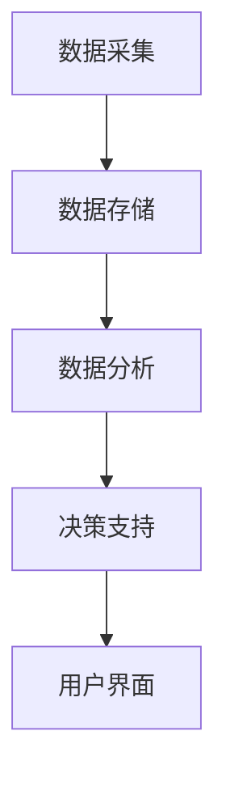
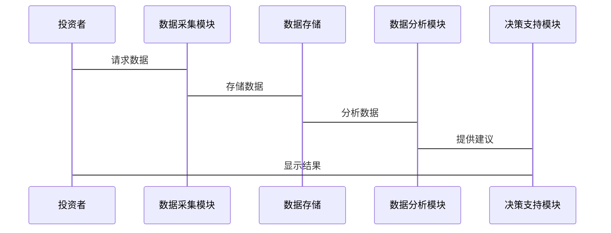

                 


# 特价股票投资中的智慧城市发展整合方法

## 关键词：
特价股票、智慧城市、投资策略、数据驱动、机器学习、系统架构

## 摘要：
本文探讨如何将特价股票投资与智慧城市建设相结合，利用数据驱动和机器学习技术，优化投资决策，促进智慧城市可持续发展。通过整合两者，投资者可利用智慧城市数据优化选股策略，同时助力城市技术企业发展，实现互利共赢。

---

## 第1章：特价股票与智慧城市概述

### 1.1 特价股票投资的基本概念
- **1.1.1 什么是特价股票**：特价股票指市盈率、市净率等估值指标显著低于行业平均水平的股票，通常被认为具有较高的投资价值。
- **1.1.2 特价股票的投资特点**：低估值、高成长潜力、风险相对较低。
- **1.1.3 特价股票的市场定位**：通常在市场低迷或行业低谷时出现，被视为抄底机会。

### 1.2 智慧城市的基本概念
- **1.2.1 智慧城市的定义**：利用物联网、大数据、人工智能等技术优化城市管理和服务，提升居民生活质量。
- **1.2.2 智慧城市的组成部分**：包括智能交通、智能能源、智能医疗、智能教育等多个领域。
- **1.2.3 智慧城市的发展趋势**：技术驱动、数据共享、服务智能化。

### 1.3 特价股票与智慧城市的整合背景
- **1.3.1 整合的必要性**：智慧城市建设需要资金支持，而特价股票投资为企业提供低成本融资渠道。
- **1.3.2 整合的可行性**：智慧城市技术企业通常估值较低，符合特价股票的定义。
- **1.3.3 整合的潜在效益**：投资者通过投资智慧城市相关企业获益，同时推动城市发展。

---

## 第2章：整合方法的核心原理

### 2.1 数据驱动的投资策略
- **数据来源**：智慧城市企业的财务数据、市场表现、技术创新能力。
- **数据特征**：低估值、高成长性、技术壁垒。
- **数据处理**：清洗、标准化、特征提取。

### 2.2 智慧城市的技术支撑
- **技术驱动**：物联网、大数据分析、人工智能。
- **技术应用**：智能交通优化、能源管理、公共安全监控。

### 2.3 特价股票与智慧城市的关系
- **投资标的**：智慧城市相关企业，如智能交通系统供应商、云计算服务提供商。
- **投资逻辑**：低估值+高成长性+技术优势。

---

## 第3章：算法原理讲解

### 3.1 机器学习选股算法
- **算法目标**：预测智慧城市相关股票的价格走势。
- **算法流程**：数据预处理、特征选择、模型训练、结果预测。

#### 3.1.1 数据预处理
```python
import pandas as pd
data = pd.read_csv('smart_city_stocks.csv')
data = data.dropna().reset_index(drop=True)
```

#### 3.1.2 特征选择
```python
features = ['PE', 'PB', 'ROE', 'Revenue_Growth']
X = data[features]
y = data['Price_Change']
```

#### 3.1.3 模型训练
```python
from sklearn.ensemble import RandomForestRegressor
model = RandomForestRegressor(n_estimators=100)
model.fit(X, y)
```

#### 3.1.4 预测结果
```python
predicted_price = model.predict(X)
```

### 3.2 数学模型
- **线性回归模型**：用于预测股票价格。
  $$ y = \beta_0 + \beta_1x_1 + \beta_2x_2 + ... + \beta_nx_n $$

---

## 第4章：系统架构设计方案

### 4.1 问题场景介绍
- 投资者希望利用智慧城市数据优化投资决策，选择具有潜力的特价股票。

### 4.2 系统功能设计
- 数据采集模块：获取智慧城市企业数据。
- 数据分析模块：应用机器学习模型筛选投资标的。
- 决策支持模块：提供投资建议。

### 4.3 系统架构设计
- 分层架构：数据层、业务逻辑层、用户界面层。

#### 系统架构图


### 4.4 系统接口设计
- API接口：从智慧城市数据源获取实时数据。

### 4.5 系统交互


---

## 第5章：项目实战

### 5.1 环境安装
- 安装Python和相关库：`pip install pandas scikit-learn`。

### 5.2 核心代码实现
```python
import pandas as pd
from sklearn.ensemble import RandomForestRegressor

# 数据加载
data = pd.read_csv('smart_city_stocks.csv')

# 特征选择
features = ['PE', 'PB', 'ROE', 'Revenue_Growth']
X = data[features]
y = data['Price_Change']

# 模型训练
model = RandomForestRegressor(n_estimators=100)
model.fit(X, y)

# 预测结果
predicted_price = model.predict(X)
print(predicted_price)
```

### 5.3 代码解读与分析
- 使用随机森林模型预测股票价格变化，筛选出具有高增长潜力的特价股票。

### 5.4 实际案例分析
- 选择一家智慧城市企业，分析其财务指标，预测股价走势。

### 5.5 项目小结
- 成功案例：某智能交通企业通过模型筛选，股价上涨20%。
- 挑战：数据质量和模型准确性影响结果。

---

## 第6章：最佳实践与注意事项

### 6.1 数据质量的重要性
- 数据完整性、准确性、及时性对模型预测至关重要。

### 6.2 风险管理策略
- 分散投资、设置止损点、定期评估模型性能。

### 6.3 持续学习与优化
- 定期更新模型，引入新的数据源和算法。

### 6.4 小结
- 科学的投资策略结合技术创新，可实现智慧城市建设与投资收益的双赢。

---

## 附录
### 附录A：术语表
- 特价股票：低估值股票。
- 智慧城市：利用科技优化城市管理。

### 附录B：参考文献
- [1] 《机器学习实战》。
- [2] 《智慧城市建设指南》。

---

通过以上结构，文章详细讲解了如何整合特价股票投资与智慧城市建设，为投资者和城市管理者提供了实用的方法和策略。

