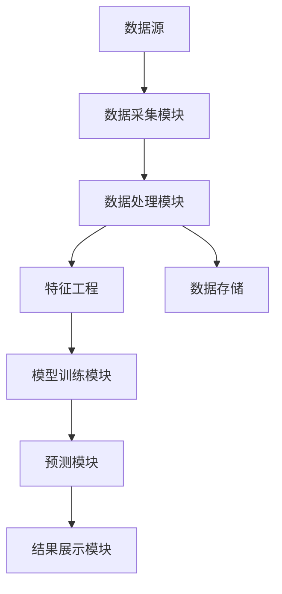
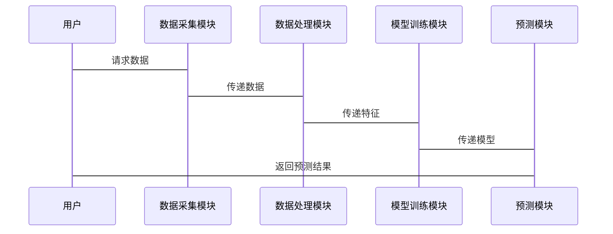

                 

# 特价股票投资中的替代数据分析与人工智能应用

> **关键词**：特价股票投资、替代数据、人工智能、机器学习、股票预测、数据分析  
>
> **摘要**：随着人工智能技术的快速发展，替代数据在股票投资中的应用日益广泛。本文将深入探讨特价股票投资的背景、替代数据的收集与处理方法，以及人工智能算法在股票预测中的应用。通过详细分析和实战案例，结合系统架构设计，为读者提供一个全面了解和应用人工智能技术进行股票投资的框架。

---

## 目录

1. **背景与概念**
   - 1.1 特价股票投资的定义与特点
   - 1.2 替代数据的定义与分类
   - 1.3 人工智能在股票投资中的应用

2. **替代数据的收集与处理**
   - 2.1 替代数据的来源
   - 2.2 数据清洗与预处理
   - 2.3 特征工程与构建

3. **人工智能算法在股票投资中的应用**
   - 3.1 常用机器学习算法
   - 3.2 深度学习算法
   - 3.3 算法实现与优化

4. **系统架构设计**
   - 4.1 系统功能设计
   - 4.2 系统架构图
   - 4.3 系统交互流程

5. **项目实战：基于替代数据的股票预测系统**
   - 5.1 环境搭建与工具安装
   - 5.2 数据收集与特征工程
   - 5.3 模型训练与优化
   - 5.4 结果展示与分析

6. **总结与最佳实践**
   - 6.1 总结与反思
   - 6.2 最佳实践与注意事项
   - 6.3 拓展阅读与未来展望

---

### 第1章: 背景与概念

#### 1.1 特价股票投资的定义与特点
特价股票投资是指通过寻找市场中被低估的股票，以低于其内在价值的价格买入，期望在价值回归时获得收益的投资策略。其核心特点包括：
- **低估性**：股票价格低于其真实价值。
- **周期性**：投资者需要耐心等待价值回归。
- **风险性**：市场波动可能导致短期亏损。

#### 1.2 替代数据的定义与分类
替代数据是指传统财务数据之外的其他数据来源，包括：
- **社交媒体数据**：投资者情绪分析。
- **新闻数据**：市场舆情监控。
- **公司财报**：非财务信息，如供应链数据。

#### 1.3 人工智能在股票投资中的应用
人工智能通过处理替代数据，帮助投资者发现潜在的投资机会。其优势包括：
- **自动化分析**：快速处理大量非结构化数据。
- **预测能力**：利用历史数据预测未来趋势。
- **实时监控**：及时捕捉市场变化。

---

### 第2章: 替代数据的收集与处理

#### 2.1 替代数据的来源
- **社交媒体**：如Twitter、Reddit，用于分析投资者情绪。
- **新闻与博客**：实时监控市场新闻和分析。
- **公司数据**：如供应链数据、专利数量。

#### 2.2 数据清洗与预处理
- **数据清洗**：去除噪声数据，处理缺失值。
- **数据标准化**：将数据转换为统一格式。
- **分词与实体识别**：对文本数据进行处理，提取关键词。

#### 2.3 特征工程与构建
- **特征提取**：从文本中提取情感分数。
- **特征选择**：筛选对预测有用的特征。
- **特征构建**：构建复合特征，如情绪强度。

---

### 第3章: 人工智能算法在股票投资中的应用

#### 3.1 常用机器学习算法
- **线性回归**：用于预测股票价格。
- **随机森林**：用于分类和回归任务。
- **支持向量机**：用于分类任务。

#### 3.2 深度学习算法
- **LSTM**：用于时间序列预测。
- **Transformer**：用于处理长序列数据。

#### 3.3 算法实现与优化
- **模型训练**：使用历史数据训练模型。
- **超参数优化**：通过网格搜索或随机搜索优化模型。
- **模型评估**：使用准确率、召回率等指标评估模型性能。

---

### 第4章: 系统架构设计

#### 4.1 系统功能设计
- **数据采集模块**：负责收集替代数据。
- **数据处理模块**：负责清洗和特征工程。
- **模型训练模块**：负责训练和优化模型。
- **预测模块**：负责实时预测和生成报告。

#### 4.2 系统架构图

#### 4.3 系统交互流程

---

### 第5章: 项目实战：基于替代数据的股票预测系统

#### 5.1 环境搭建与工具安装
- **Python**：安装Anaconda。
- **库安装**：如pandas、numpy、scikit-learn、transformers。

#### 5.2 数据收集与特征工程
- **数据收集**：使用API获取社交媒体数据。
- **特征工程**：提取关键词和情感分数。

#### 5.3 模型训练与优化
- **模型选择**：尝试不同算法，选择最优模型。
- **超参数优化**：使用网格搜索。

#### 5.4 结果展示与分析
- **结果展示**：可视化预测结果。
- **性能分析**：对比不同模型的准确率。

---

### 第6章: 总结与最佳实践

#### 6.1 总结与反思
- 人工智能为股票投资提供了新的可能性。
- 替代数据的应用需要结合传统数据。

#### 6.2 最佳实践与注意事项
- 数据质量至关重要。
- 模型需要持续优化。
- 需要结合市场实际情况。

#### 6.3 拓展阅读与未来展望
- 深入研究替代数据的其他来源。
- 探索更先进的机器学习算法。

---

以上是本文的完整目录结构和核心内容框架。通过系统的分析和实战案例，本文为读者提供了一个从理论到实践的完整指南，帮助读者利用替代数据和人工智能技术进行特价股票投资。

