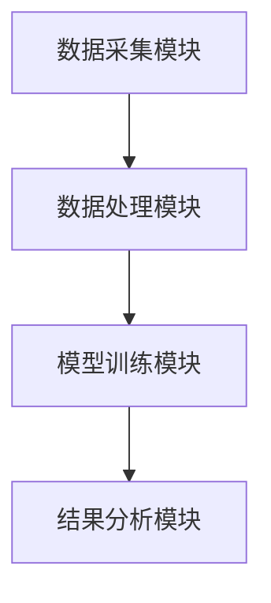
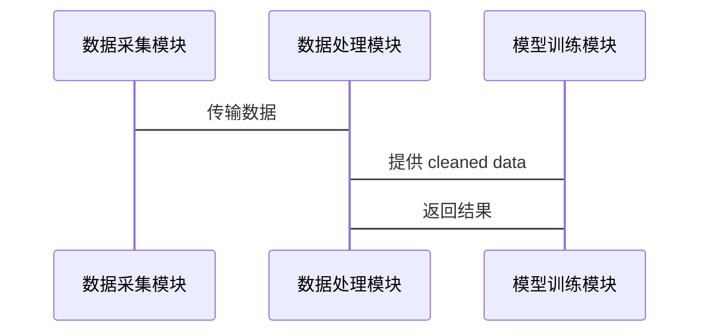

                 


# 特价股票投资中的替代数据分析与分布式人工智能应用

> **关键词**：特价股票投资、替代数据分析、分布式人工智能、文本挖掘、时间序列分析、分布式计算  
>
> **摘要**：本文探讨了在特价股票投资中，如何利用替代数据和分布式人工智能技术进行数据分析与建模。通过结合文本挖掘、时间序列分析和图像识别等技术，本文提出了基于分布式计算的解决方案，以提高投资决策的效率和准确性。文章详细介绍了相关算法、系统架构设计以及实际案例分析，为投资者提供了新的视角和工具。

---

# 第1章: 特价股票投资与替代数据分析概述

## 1.1 特价股票投资的定义与特点

### 1.1.1 特价股票的定义
特价股票通常指市场价格远低于其内在价值的股票，这种股票往往被市场低估，具有较大的增值潜力。投资者通过挖掘这些股票，可以实现超额收益。

### 1.1.2 特价股票投资的核心特点
- **低估值**：市场价格低于内在价值。
- **高潜力**：具备增长潜力的公司。
- **分散风险**：通过分散投资降低风险。

### 1.1.3 特价股票投资的潜在机会与风险
- **机会**：市场波动可能导致低估股票的价格回升。
- **风险**：市场情绪和公司基本面变化可能导致股价波动。

## 1.2 替代数据的定义与分类

### 1.2.1 替代数据的定义
替代数据是指传统财务数据之外的其他数据，如社交媒体、新闻、卫星图像等。这些数据可以帮助投资者更全面地分析市场。

### 1.2.2 替代数据的主要分类
- **文本数据**：社交媒体、新闻报道。
- **图像数据**：卫星图像、公司财报。
- **声音数据**：电话会议录音。

### 1.2.3 替代数据在股票投资中的应用价值
- **市场情绪分析**：通过社交媒体数据预测市场走势。
- **公司基本面分析**：通过卫星图像分析公司运营状况。

## 1.3 分布式人工智能的背景与意义

### 1.3.1 分布式人工智能的定义
分布式人工智能是指将人工智能任务分布在多个计算节点上，通过协同计算完成目标。

### 1.3.2 分布式人工智能的核心优势
- **高效性**：分布式计算可以提高处理速度。
- **鲁棒性**：节点故障不会导致整个系统崩溃。

### 1.3.3 分布式人工智能在金融领域的应用前景
- **实时数据分析**：快速处理大量数据。
- **模型优化**：通过分布式训练提高模型性能。

---

# 第2章: 替代数据与分布式人工智能的结合

## 2.1 替代数据在股票投资中的应用

### 2.1.1 文本数据（新闻、社交媒体）

#### 2.1.1.1 文本挖掘技术
- **关键词提取**：识别文本中的重要关键词。
- **情感分析**：分析文本中的市场情绪。

#### 2.1.1.2 示例代码
```python
from textblob import TextBlob
text = "The company's earnings beat expectations."
print(TextBlob(text).sentiment)
```

### 2.1.2 图像数据（卫星图像、公司财报）

#### 2.1.2.1 图像识别技术
- **目标检测**：识别图像中的特定目标。
- **图像分割**：将图像分割成不同区域进行分析。

#### 2.1.2.2 示例代码
```python
import tensorflow as tf
model = tf.keras.models.load_model('model.h5')
image = tf.keras.preprocessing.image.load_img('image.jpg', target_size=(224, 224))
image = tf.keras.preprocessing.image.img_to_array(image)
image = tf.keras.applications.mobilenet.preprocess_input(image)
prediction = model.predict(tf.expand_dims(image, axis=0))
print(prediction)
```

### 2.1.3 声音数据（电话会议、市场情绪）

#### 2.1.3.1 声音识别技术
- **语音识别**：将语音转换为文本。
- **情感分析**：分析语音中的情感信息。

---

## 2.2 分布式人工智能在股票投资中的优势

### 2.2.1 分布式计算的高效性
- **并行处理**：多个节点同时处理数据，提高效率。

### 2.2.2 分布式模型的鲁棒性
- **容错性**：部分节点故障不影响整体系统。

### 2.2.3 分布式数据处理的灵活性
- **数据分区**：根据数据特点进行分区处理。

---

## 2.3 替代数据与分布式人工智能的结合场景

### 2.3.1 数据采集与预处理
- **数据清洗**：去除噪声数据。
- **数据转换**：将数据转换为模型可处理的形式。

### 2.3.2 数据分析与建模
- **特征提取**：从替代数据中提取有用特征。
- **模型训练**：使用分布式计算训练模型。

### 2.3.3 模型部署与优化
- **模型部署**：将模型部署到生产环境中。
- **模型优化**：根据反馈优化模型性能。

---

# 第3章: 替代数据分析的核心算法与实现

## 3.1 替代数据分析的主要算法

### 3.1.1 文本挖掘算法

#### 3.1.1.1 TF-IDF
- **定义**：Term Frequency-Inverse Document Frequency，用于衡量词的重要性。
- **公式**：
  $$ TF-IDF(t) = \text{TF}(t) \times \log\left(\frac{N}{\text{DF}(t)}\right) $$
- **代码示例**
  ```python
  from sklearn.feature_extraction.text import TfidfVectorizer
  vectorizer = TfidfVectorizer()
  tfidf = vectorizer.fit_transform(documents)
  ```

#### 3.1.1.2 LSTM
- **定义**：长短期记忆网络，适用于时间序列数据。
- **公式**：
  $$ f_t = \sigma(W_f \cdot [h_{t-1}, x_t] + b_f) $$
- **代码示例**
  ```python
  import tensorflow as tf
  model = tf.keras.Sequential([
      tf.keras.layers.LSTM(64, return_sequences=True),
      tf.keras.layers.Dense(1)
  ])
  model.compile(optimizer='adam', loss='mse')
  ```

### 3.1.2 时间序列分析算法

#### 3.1.2.1 ARIMA
- **定义**：自回归积分滑动平均模型，适用于时间序列预测。
- **公式**：
  $$ \phi(\theta(B)) \cdot (1 - B)^\delta y_t = \theta(\phi(B)) \cdot \epsilon_t $$
- **代码示例**
  ```python
  from statsmodels.tsa.arima_model import ARIMA
  model = ARIMA(data, order=(5, 1, 0))
  model_fit = model.fit()
  ```

---

## 3.2 分布式人工智能的核心算法

### 3.2.1 分布式随机梯度下降

#### 3.2.1.1 定义
分布式随机梯度下降是一种在分布式系统中进行梯度下降的方法。

#### 3.2.1.2 步骤
1. **数据分区**：将数据分块到各个节点。
2. **局部优化**：每个节点计算局部梯度。
3. **参数同步**：将局部梯度汇总到中心节点。
4. **更新参数**：更新全局模型参数。

#### 3.2.1.3 代码示例
```python
import tensorflow as tf
strategy = tf.distribute.MirroredStrategy()
with strategy.scope():
    model = tf.keras.Sequential([
        tf.keras.layers.Dense(64, activation='relu'),
        tf.keras.layers.Dense(1)
    ])
    model.compile(optimizer='sgd', loss='mse')
```

---

## 3.3 算法实现与优化

### 3.3.1 算法实现的代码示例
```python
import numpy as np
from sklearn.cluster import KMeans

# 假设data是训练数据
model = KMeans(n_clusters=3)
model.fit(data)
```

### 3.3.2 算法优化的策略与技巧
- **超参数调优**：通过网格搜索找到最佳参数。
- **模型集成**：结合多个模型的结果提高准确性。

---

## 3.4 算法性能的评估与对比

### 3.4.1 模型评估指标
- **准确率**：分类任务中的正确预测比例。
- **F1分数**：综合考虑精确率和召回率。

### 3.4.2 模型对比分析
- **对比不同算法的性能**：如LSTM vs ARIMA。

---

# 第4章: 分布式人工智能系统的架构设计

## 4.1 系统架构设计概述

### 4.1.1 系统设计的目标与原则
- **目标**：高效处理替代数据，支持实时分析。
- **原则**：模块化设计、可扩展性。

---

## 4.2 系统功能设计

### 4.2.1 数据采集模块
- **功能**：实时采集新闻、社交媒体数据。

### 4.2.2 数据处理模块
- **功能**：清洗、转换数据。

### 4.2.3 模型训练模块
- **功能**：分布式训练替代数据分析模型。

---

## 4.3 系统架构的可扩展性与可维护性

### 4.3.1 模块化设计
- **优点**：便于维护和扩展。

### 4.3.2 可扩展性设计
- **弹性计算**：根据需求动态调整计算资源。

---

## 4.4 系统架构的详细设计

### 4.4.1 系统架构图


### 4.4.2 系统交互流程
1. 数据采集模块采集数据。
2. 数据处理模块清洗数据。
3. 模型训练模块训练模型。
4. 结果分析模块输出结果。

---

## 4.5 系统接口设计

### 4.5.1 API接口设计
- **RESTful API**：提供HTTP接口，供其他系统调用。

### 4.5.2 消息队列设计
- **Kafka**：用于数据分发。

---

## 4.6 系统交互流程图


---

# 第5章: 项目实战

## 5.1 环境安装与配置

### 5.1.1 安装依赖
- **Python**：3.8+
- **TensorFlow**：2.0+
- **Kafka**：2.8+

### 5.1.2 配置环境变量
- **PATH**：添加Python和TensorFlow的安装路径。

---

## 5.2 系统核心实现

### 5.2.1 数据采集模块实现
```python
from kafka import KafkaProducer
import json

def send_data(producer, data):
    for d in data:
        producer.send('stock_topic', json.dumps(d))
    producer.flush()

producer = KafkaProducer(bootstrap_servers='localhost:9092')
data = [...]  # 示例数据
send_data(producer, data)
```

### 5.2.2 数据处理模块实现
```python
from pyspark import SparkContext

sc = SparkContext.getOrCreate()
data = sc.textFile('data.txt')
data = data.map(lambda x: x.split())
data.count()
```

### 5.2.3 模型训练模块实现
```python
import tensorflow as tf
from tensorflow.keras import layers

model = tf.keras.Sequential([
    layers.Dense(64, activation='relu'),
    layers.Dense(1)
])
model.compile(optimizer='adam', loss='mse')
model.fit(x_train, y_train, epochs=10, batch_size=32)
```

---

## 5.3 代码应用解读与分析

### 5.3.1 数据采集模块
- **功能**：从Kafka主题读取数据。
- **代码示例**
  ```python
  from kafka import KafkaConsumer

  consumer = KafkaConsumer('stock_topic', bootstrap_servers='localhost:9092')
  for message in consumer:
      print(message.value)
  ```

### 5.3.2 数据处理模块
- **功能**：使用PySpark处理数据。
- **代码示例**
  ```python
  from pyspark.sql import SparkSession

  spark = SparkSession.builder.getOrCreate()
  df = spark.read.csv('data.csv', header=True)
  df.createOrReplaceTempView('temp_view')
  ```

### 5.3.3 模型训练模块
- **功能**：训练分布式模型。
- **代码示例**
  ```python
  import tensorflow as tf
  strategy = tf.distribute.MirroredStrategy()
  with strategy.scope():
      model = tf.keras.Sequential([
          tf.keras.layers.Dense(64, activation='relu'),
          tf.keras.layers.Dense(1)
      ])
      model.compile(optimizer='adam', loss='mse')
  model.fit(x_train, y_train, epochs=10, batch_size=32)
  ```

---

## 5.4 实际案例分析

### 5.4.1 数据来源
- **新闻数据**：从API获取实时新闻。
- **社交媒体数据**：从Twitter API获取推文。

### 5.4.2 数据分析
- **市场情绪分析**：使用文本挖掘技术分析新闻和推文，预测股价走势。

### 5.4.3 模型优化
- **超参数调优**：通过网格搜索找到最佳参数。
- **模型集成**：结合多个模型的结果，提高准确性。

---

## 5.5 项目小结

### 5.5.1 核心实现总结
- **数据采集**：使用Kafka和API获取数据。
- **数据处理**：使用PySpark进行分布式处理。
- **模型训练**：使用TensorFlow进行分布式训练。

### 5.5.2 项目成果
- **提高了投资决策的效率和准确性**。
- **实现了高效的分布式计算**。

---

# 第6章: 总结与展望

## 6.1 最佳实践

### 6.1.1 替代数据的处理技巧
- **数据清洗**：去除噪声数据。
- **特征提取**：提取有意义的特征。

### 6.1.2 分布式计算的优化技巧
- **任务并行**：将任务分解为并行处理。
- **资源分配**：合理分配计算资源。

### 6.1.3 模型部署与监控
- **模型部署**：将模型部署到生产环境。
- **模型监控**：实时监控模型性能。

---

## 6.2 未来展望

### 6.2.1 替代数据的扩展应用
- **更多数据源**：如物联网数据、视频数据。
- **更复杂的模型**：如Transformer模型。

### 6.2.2 分布式人工智能的优化方向
- **更高效的分布式算法**：如分布式注意力机制。
- **更智能的资源管理**：动态分配计算资源。

### 6.2.3 技术与金融的结合
- **智能化投资**：通过AI实现自动化投资决策。
- **个性化服务**：根据客户需求提供定制化服务。

---

## 6.3 注意事项

### 6.3.1 数据质量
- **数据清洗**：确保数据准确可靠。
- **数据来源**：选择可靠的替代数据源。

### 6.3.2 模型风险
- **过拟合**：避免模型过拟合训练数据。
- **数据泄漏**：防止敏感数据泄漏。

---

## 6.4 拓展阅读

### 6.4.1 推荐书籍
- 《Python机器学习实战》
- 《分布式系统：概念与设计》

### 6.4.2 推荐博客
- [机器学习博客](https://towardsdatascience.com/)
- [分布式计算博客](https://www.allthingsdistributed.com/)

---

## 附录

### 附录A: 替代数据源列表
- 新闻API：如Alpha Vantage。
- 社交媒体API：如Twitter API。
- 卫星图像数据：如Sentinel Hub。

### 附录B: 分布式计算框架
- Apache Spark。
- Apache Hadoop。
- TensorFlow分布式训练。

---

# 小结

本文通过详细分析特价股票投资中的替代数据分析与分布式人工智能应用，展示了如何利用现代技术提高投资决策的效率和准确性。通过结合文本挖掘、时间序列分析和分布式计算技术，投资者可以更好地捕捉市场机会，降低投资风险。未来，随着技术的不断发展，替代数据和分布式人工智能在金融领域的应用将更加广泛和深入。

