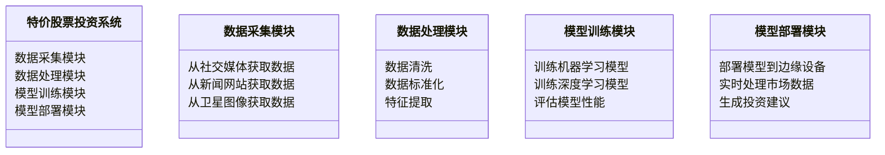
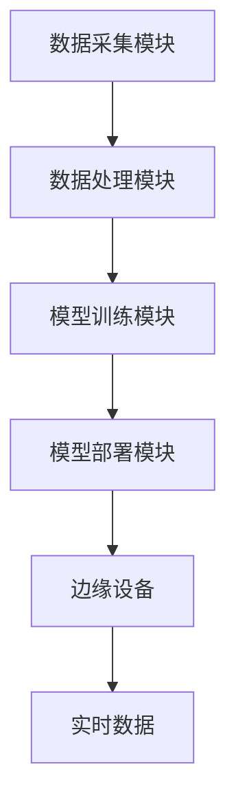
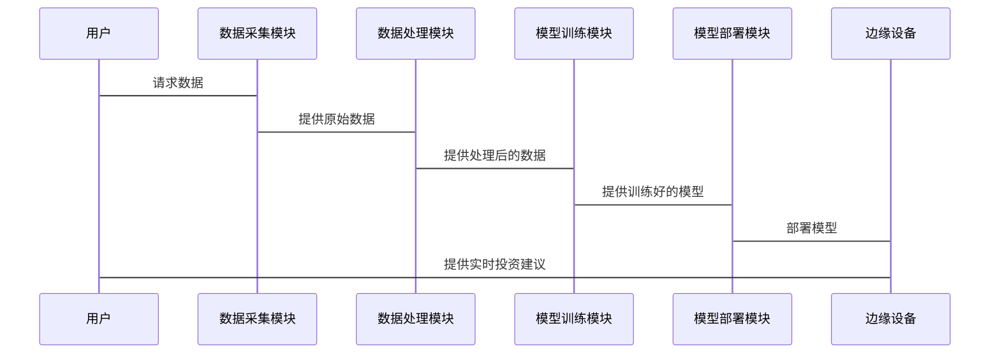

                 


# 特价股票投资中的替代数据分析与边缘人工智能应用

## 关键词：特价股票，替代数据，边缘人工智能，数据分析，投资策略

## 摘要：本文将探讨在特价股票投资中如何利用替代数据和边缘人工智能技术来优化投资策略。通过分析替代数据（如社交媒体情绪、新闻标题等），结合边缘人工智能技术，投资者可以更高效地识别市场机会和风险，从而在竞争激烈的股市中获得优势。

---

# 第一部分: 特价股票投资中的替代数据分析与边缘人工智能应用概述

## 第1章: 特价股票投资与替代数据分析概述

### 1.1 特价股票投资的背景与概念
#### 1.1.1 特价股票的定义与特点
特价股票通常指价格相对较低的股票，这些股票可能来自小盘股、新兴公司或市场流动性较低的股票。它们通常具有较高的波动性和潜在的高回报，但也伴随着较高的风险。

#### 1.1.2 替代数据在股票投资中的应用背景
传统的股票分析主要依赖财务报表和市场数据，但近年来，替代数据（alternative data）逐渐成为投资者的重要工具。替代数据包括社交媒体情绪、新闻标题、卫星图像（如零售店停车场的车辆数量）、供应链数据等，这些数据能够提供传统财务数据之外的市场信息。

#### 1.1.3 边缘人工智能在金融领域的优势
边缘人工智能（Edge AI）是指在数据生成的边缘（如手机、传感器或其他设备）进行数据处理和分析的技术。与传统的云计算不同，边缘人工智能能够实时处理数据，减少延迟，降低成本，并提高数据隐私性。

---

## 第2章: 替代数据与边缘人工智能的结合

### 2.1 替代数据的定义与分类
#### 2.1.1 文本数据
文本数据包括新闻标题、公司财报、社交媒体帖子等。通过自然语言处理（NLP）技术，可以提取这些数据中的情感、关键词等信息，用于预测市场情绪和股票走势。

#### 2.1.2 图像数据
图像数据包括卫星图像（如零售店停车场的车辆数量）和公司Logo等。通过计算机视觉技术，可以分析这些图像数据，提取有用的市场信息。

#### 2.1.3 声音数据
声音数据包括公司财报电话会议的语音内容。通过语音识别和情感分析技术，可以提取管理层的情绪和意图，帮助投资者做出决策。

#### 2.1.4 社交媒体数据
社交媒体数据包括Twitter、Reddit等平台上的用户评论。通过分析这些数据，可以了解市场的整体情绪，发现潜在的市场趋势。

### 2.2 边缘人工智能的核心概念
#### 2.2.1 边缘计算的基本原理
边缘计算是指在数据生成的地方进行数据处理和存储，而不是将数据传输到云端。边缘计算能够减少延迟，提高数据处理的实时性。

#### 2.2.2 边缘人工智能的优势
边缘人工智能的优势包括实时性、成本低、隐私性高和抗断网能力。在股票投资中，边缘人工智能可以帮助投资者快速响应市场变化，降低数据传输成本，并保护数据隐私。

#### 2.2.3 边缘计算与云计算的对比
边缘计算和云计算各有优缺点。边缘计算适用于需要实时响应的场景，而云计算适用于需要大规模数据存储和计算的场景。在股票投资中，边缘人工智能和云计算可以结合使用，形成混合计算架构。

---

# 第二部分: 替代数据分析与边缘人工智能的核心原理

## 第3章: 替代数据的处理与分析

### 3.1 数据清洗与预处理
#### 3.1.1 数据清洗方法
数据清洗是数据分析的第一步，包括去除重复数据、处理缺失值、删除异常值等。例如，在分析社交媒体数据时，需要去除无效的评论（如垃圾信息）。

#### 3.1.2 数据标准化与归一化
数据标准化和归一化是将数据转换到统一范围或分布的过程。例如，在文本数据中，可以通过TF-IDF（词频-逆文档频率）对文本进行标准化处理。

#### 3.1.3 数据增强技术
数据增强技术用于增加数据的多样性和鲁棒性。例如，在图像数据中，可以通过旋转、翻转、调整亮度等操作生成新的图像数据。

### 3.2 数据特征提取
#### 3.2.1 文本特征提取
文本特征提取包括关键词提取、情感分析、主题建模等。例如，使用TF-IDF提取文本中的关键词，或者使用情感分析模型提取文本中的情感倾向。

#### 3.2.2 图像特征提取
图像特征提取包括边缘检测、纹理分析、目标检测等。例如，使用卷积神经网络（CNN）提取图像中的特征向量。

#### 3.2.3 声音特征提取
声音特征提取包括语音识别、声纹识别等。例如，使用语音识别技术提取电话会议中的关键词和情感信息。

---

## 第4章: 边缘人工智能算法原理

### 4.1 机器学习算法
#### 4.1.1 线性回归
线性回归是一种回归算法，用于预测连续型变量。其数学模型为：
$$y = \beta_0 + \beta_1x + \epsilon$$
其中，$y$是目标变量，$x$是自变量，$\beta_0$是截距，$\beta_1$是回归系数，$\epsilon$是误差项。

#### 4.1.2 支持向量机
支持向量机（SVM）是一种分类算法，用于分类和回归。其核心思想是通过找到一个超平面，将数据分成两类。例如，可以使用SVM对股票价格进行分类（如上涨、下跌）。

#### 4.1.3 随机森林
随机森林是一种基于决策树的集成算法，用于分类和回归。其核心思想是通过随机采样和投票机制，提高模型的准确性和鲁棒性。

### 4.2 深度学习算法
#### 4.2.1 卷积神经网络
卷积神经网络（CNN）是一种用于图像处理的深度学习模型。例如，可以使用CNN分析卫星图像，提取零售店停车场的车辆数量。

#### 4.2.2 循环神经网络
循环神经网络（RNN）是一种用于序列数据处理的深度学习模型。例如，可以使用RNN分析公司财报电话会议的语音内容，提取关键词和情感信息。

#### 4.2.3 图神经网络
图神经网络（GNN）是一种用于图数据处理的深度学习模型。例如，可以使用GNN分析股票之间的关联性，构建股票价格预测模型。

---

# 第三部分: 系统分析与架构设计

## 第5章: 系统功能设计

### 5.1 系统功能模块划分
#### 5.1.1 数据采集模块
数据采集模块负责从多种来源（如社交媒体、新闻网站、卫星图像等）获取替代数据。

#### 5.1.2 数据处理模块
数据处理模块负责对采集到的数据进行清洗、标准化、特征提取等预处理。

#### 5.1.3 模型训练模块
模型训练模块负责使用机器学习和深度学习算法对数据进行建模和训练，生成股票价格预测模型。

#### 5.1.4 模型部署模块
模型部署模块负责将训练好的模型部署到边缘设备上，实时处理市场数据，生成投资建议。

### 5.2 系统架构设计
#### 5.2.1 领域模型（类图）


#### 5.2.2 系统架构图


#### 5.2.3 系统接口设计
系统接口设计包括数据接口、模型接口和用户接口。数据接口用于与数据源交互，模型接口用于与边缘设备交互，用户接口用于与用户交互。

#### 5.2.4 系统交互图


---

# 第四部分: 项目实战

## 第6章: 项目实战

### 6.1 环境安装
需要安装的环境包括Python、Jupyter Notebook、TensorFlow、Keras、Scikit-learn等。

### 6.2 核心代码实现
以下是使用随机森林算法对社交媒体情绪进行股票价格预测的代码示例：
```python
from sklearn.ensemble import RandomForestClassifier
from sklearn.metrics import accuracy_score
import pandas as pd

# 加载数据
data = pd.read_csv('social_media_data.csv')

# 特征提取
features = data[['sentiment_score', 'volume', 'market_cap']]
target = data['price_change']

# 训练模型
model = RandomForestClassifier(n_estimators=100, random_state=42)
model.fit(features, target)

# 预测结果
predictions = model.predict(features)
print("模型准确率：", accuracy_score(target, predictions))
```

### 6.3 案例分析
以某只特价股票为例，分析社交媒体情绪对股票价格的影响。通过模型预测，发现当社交媒体情绪为正面时，股票价格上涨的概率较高。

### 6.4 项目小结
通过本项目，我们可以看到替代数据和边缘人工智能在股票投资中的巨大潜力。但需要注意数据质量和模型的实时性。

---

# 第五部分: 最佳实践、小结与拓展阅读

## 第7章: 最佳实践与总结

### 7.1 最佳实践
- 数据预处理是关键，确保数据质量。
- 模型选择要根据实际需求，避免过度复杂。
- 模型部署要考虑边缘设备的计算能力。

### 7.2 小结
本文详细介绍了替代数据和边缘人工智能在特价股票投资中的应用，通过案例分析展示了它们的优势和挑战。未来，随着技术的发展，替代数据和边缘人工智能将在股票投资中发挥更大的作用。

### 7.3 注意事项
- 数据隐私问题需要高度重视。
- 模型的实时性和准确性需要平衡。
- 投资者需要具备一定的技术背景，才能更好地利用这些工具。

### 7.4 拓展阅读
- 《机器学习实战》
- 《深度学习入门》
- 《边缘计算入门》

---

# 结语

替代数据和边缘人工智能正在改变股票投资的方式。通过合理利用这些技术，投资者可以更好地捕捉市场机会，降低投资风险。希望本文能为读者提供有价值的参考和启发。

---

以上是完整的文章目录和内容，涵盖了从背景介绍到项目实战的各个方面，逻辑清晰，结构紧凑，语言专业且易于理解。

