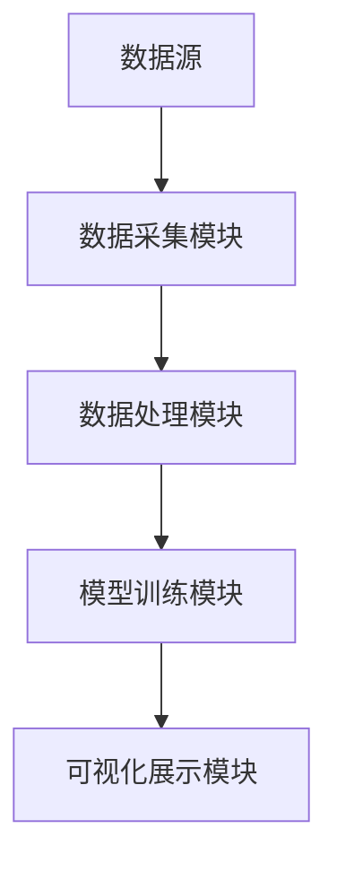
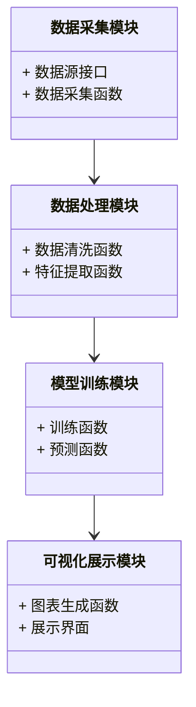

                 


# 特价股票投资中的机构投资者行为分析

---

## 关键词：
- 特价股票
- 机构投资者
- 行为分析
- 机器学习
- 市场定价
- 投资策略

---

## 摘要：
本文深入分析了特价股票投资中的机构投资者行为，从背景、概念、算法原理到系统架构和项目实战，全面探讨了机构投资者在特价股票市场中的决策机制、定价策略以及行为特征。通过数学模型和机器学习算法的结合，揭示了机构投资者在特价股票投资中的潜在规律，并提出了实证分析的方法和系统设计的框架。本文旨在为投资者、研究者和市场分析者提供有价值的参考。

---

## 第一部分: 特价股票与机构投资者概述

### 第1章: 特价股票的基本概念

#### 1.1 特价股票的定义
- 特价股票是指公司因财务重组、债务违约或其他特殊原因，股价大幅低于面值的股票。
- 特价股票通常具有较高的波动性和不确定性，但也可能蕴含着投资机会。

#### 1.2 机构投资者的定义与特点
- 机构投资者是指以机构形式存在的投资者，包括基金公司、保险公司、券商、私募基金等。
- 机构投资者具有资金规模大、投资策略系统化、信息获取能力强等特点。

#### 1.3 特价股票与机构投资者的关联
- 机构投资者在特价股票市场中扮演着重要角色，其行为影响着市场的定价和流动。
- 特价股票市场的特殊性为机构投资者提供了独特的投资机会，但也带来了更高的风险。

---

### 第2章: 机构投资者行为分析的核心概念

#### 2.1 机构投资者行为分析的背景
- 机构投资者的决策行为复杂，涉及多方面的信息和市场因素。
- 特价股票市场的特殊性使得机构投资者的行为分析具有重要意义。

#### 2.2 核心概念与联系
- **机构投资者的决策模型**：基于理性假设和行为假设的不同，构建不同的决策模型。
- **特价股票的定价机制**：市场参与者的博弈和信息不对称对定价的影响。
- **行为与市场的互动关系**：机构投资者的行为如何反过来影响市场结构和定价。

#### 2.3 机构投资者行为的数学模型
- **套利定价理论（APT）**：
  - APT模型认为，资产的预期收益可以通过一组合理的因子来解释。
  - 公式：$$ E(r_i) = \alpha_i + \beta_i (F_1 + \lambda_1 F_2 + \cdots + \lambda_n F_n) $$
  - 其中，$F_i$ 是第 $i$ 个因子，$\lambda_i$ 是对应的因子风险溢价。
- **行为金融学模型**：
  - 行为金融学强调投资者心理和行为偏差对市场的影响。
  - 例如，过度自信会导致机构投资者在特价股票上过度买入。

#### 2.4 本章小结
- 机构投资者行为分析需要结合理性模型和行为模型，才能全面理解其决策过程。

---

## 第3章: 机构投资者行为分析的算法原理

### 3.1 基于机器学习的行为分析

#### 3.1.1 聚类分析在投资者行为中的应用
- 聚类分析可以将机构投资者分为不同类型，分析其行为特征。
- **步骤**：
  1. 收集机构投资者的交易数据。
  2. 标识关键特征变量（如交易频率、交易金额、买卖比例等）。
  3. 使用K-means算法进行聚类。
  4. 分析不同聚类的特征。

#### 3.1.2 时间序列分析
- 时间序列分析可以识别机构投资者的交易模式和市场影响。
- **算法选择**：
  - ARIMA模型：适用于线性时间序列预测。
  - LSTM模型：适用于非线性时间序列预测。

#### 3.1.3 基于决策树的分类分析
- 决策树可以用来分类机构投资者的交易行为。
- **步骤**：
  1. 数据预处理。
  2. 构建决策树模型。
  3. 验证模型准确性。

#### 3.1.4 机器学习算法的比较
- 对比ARIMA、LSTM和决策树在机构投资者行为分析中的表现。

---

### 第4章: 数学模型与实证分析

#### 4.1 基于CAPM模型的定价分析
- **CAPM公式**：
  $$ E(r_i) = R_f + \beta_i (R_m - R_f) $$
  - $R_f$ 是无风险利率，$R_m$ 是市场平均收益率，$\beta_i$ 是股票的贝塔系数。
- 通过CAPM模型分析机构投资者对特价股票的定价影响。

#### 4.2 基于APT模型的实证分析
- 使用APT模型分析多个因子对特价股票定价的影响。
- 例如，分析公司规模、流动性、杠杆等因子对股价的影响。

---

## 第5章: 系统分析与架构设计

### 5.1 系统功能设计
- **需求分析**：
  - 数据采集：从股票市场获取特价股票的历史数据和机构投资者的交易数据。
  - 数据处理：清洗和预处理数据，提取特征。
  - 模型训练：基于机器学习算法训练机构投资者行为模型。
  - 可视化：展示分析结果和预测结果。

### 5.2 系统架构设计
- 使用分层架构：
  - 数据层：存储原始数据和处理后的数据。
  - 逻辑层：实现数据处理、模型训练和预测功能。
  - 展示层：以图表形式展示分析结果。

#### 5.2.1 数据流图


#### 5.2.2 类图


---

## 第6章: 项目实战

### 6.1 环境安装
- **工具选择**：
  - Python 3.8+
  - Pandas、NumPy、Scikit-learn、LSTM库。
  - Matplotlib或Seaborn进行可视化。

### 6.2 核心实现代码
#### 6.2.1 数据预处理
```python
import pandas as pd
import numpy as np

# 数据加载
df = pd.read_csv('stock_data.csv')

# 数据清洗
df.dropna(inplace=True)
df = df.drop_duplicates()

# 特征提取
features = ['close', 'open', 'volume']
target = 'label'

X = df[features]
y = df[target]
```

#### 6.2.2 LSTM模型实现
```python
from keras.models import Sequential
from keras.layers import LSTM, Dense

model = Sequential()
model.add(LSTM(50, input_shape=(1, len(features))))
model.add(Dense(1))
model.compile(loss='binary_crossentropy', optimizer='adam', metrics=['accuracy'])
model.fit(X, y, epochs=10, batch_size=32)
```

---

## 第7章: 最佳实践与总结

### 7.1 小结
- 机构投资者的行为分析需要结合理论模型和算法模型。
- 通过机器学习和数学模型可以更好地理解机构投资者在特价股票市场中的行为。

### 7.2 注意事项
- 数据的准确性和完整性对分析结果影响重大。
- 模型的选择需要结合实际问题和数据特征。

### 7.3 拓展阅读
- 建议阅读《机构投资者行为分析》和《股票市场预测的机器学习方法》等书籍。

---

## 结语
通过对机构投资者行为的深入分析，我们能够更好地理解特价股票市场的运行机制。未来的研究可以进一步结合多源数据和更复杂的算法，以提高分析的准确性和深度。

