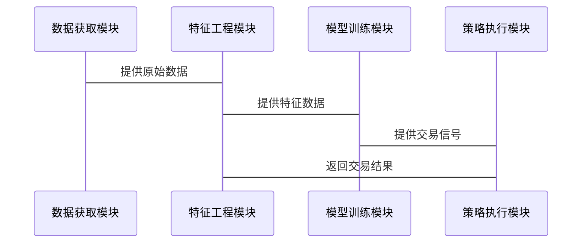

                 


# 特价股票投资中的深度强化学习模型构建与优化

## 关键词：深度强化学习，股票投资，模型构建，优化，强化学习算法，股票交易，模型训练

## 摘要：本文探讨了深度强化学习在特价股票投资中的应用，详细分析了模型构建与优化的关键步骤。通过理论分析、算法设计、系统实现和项目案例，展示了如何利用深度强化学习技术提升股票投资决策的效率和准确性。文章从核心概念到实际应用，全面解析了深度强化学习在股票投资中的优势与挑战，为读者提供了构建和优化深度强化学习模型的详细指导。

---

## 第一部分：深度强化学习基础

### 第1章：深度强化学习概述

#### 1.1 深度强化学习的基本概念
深度强化学习（Deep Reinforcement Learning, DRL）结合了深度学习与强化学习的优势，通过神经网络处理高维状态空间，并利用强化学习的奖励机制进行决策优化。

**核心概念**：
- **强化学习**：通过智能体与环境互动，学习策略以最大化累积奖励。
- **深度学习**：利用神经网络处理复杂非线性关系。
- **DRL的优势**：处理高维状态，非线性关系建模，动态适应市场变化。

#### 1.2 核心概念与联系
**表格对比**：
| 概念          | 描述                                      |
|---------------|-------------------------------------------|
| 状态空间 (State Space) | 智能体所处的环境状态，如股价、成交量等。 |
| 动作空间 (Action Space) | 智能体可执行的操作，如买入、卖出或持有。 |
| 奖励函数 (Reward Function) | 定义智能体行为的奖赏，通常与收益相关。 |
| 价值函数 (Value Function) | 预测状态的期望奖励。                   |
| 策略函数 (Policy Function) | 定义智能体在状态下的动作概率分布。    |

**Mermaid流程图**：


#### 1.3 常见的深度强化学习算法
- **DQN算法**：通过Q-learning与神经网络结合，利用经验回放和目标网络优化。
- **策略梯度方法**：直接优化策略，如REINFORCE和PPO。
- **Actor-Critic方法**：结合价值和策略评估，如A2C和TRPO。

---

## 第二部分：股票投资中的深度强化学习应用

### 第2章：股票市场与深度强化学习
股票市场的复杂性和不确定性使其成为深度强化学习的理想应用场景。

#### 2.1 股票市场的特点
- **波动性**：价格受多种因素影响，如宏观经济、公司业绩等。
- **情绪影响**：投资者情绪影响市场，非理性行为普遍存在。
- **数据特征**：高维、非线性、噪声多。

#### 2.2 深度强化学习在股票投资中的优势
- **非线性建模**：捕捉复杂市场关系。
- **动态决策**：实时调整策略。
- **鲁棒性**：适应市场变化，避免过度拟合。

#### 2.3 深度强化学习在股票投资中的挑战
- **数据稀疏性**：高质量数据获取困难。
- **市场噪声**：有效信号提取困难。
- **模型过拟合**：训练数据不足导致泛化能力差。

---

## 第三部分：深度强化学习模型构建

### 第3章：深度强化学习模型设计
模型设计是实现有效投资策略的关键。

#### 3.1 模型架构设计
- **状态表示**：包括股价、技术指标、市场情绪等。
- **动作空间设计**：如买入、卖出、持有。
- **网络结构选择**：如DQN中的双神经网络结构。

#### 3.2 神经网络的训练策略
- **离线与在线训练**：离线训练利用历史数据，在线训练实时更新。
- **经验回放**：存储经验，随机采样减少相关性。
- **模型更新频率**：目标网络逐步更新。

#### 3.3 模型训练的数学推导
- **损失函数**：$L = \mathbb{E}[(r_t - Q(s_t, a_t))^2]$
- **梯度下降**：使用Adam优化器，$\alpha$为学习率。
- **策略更新**：基于梯度的策略优化。

#### 3.4 模型优化技巧
- **参数调整**：如学习率、批量大小。
- **正则化方法**：如Dropout防止过拟合。
- **评估指标**：如回撤、夏普比率。

---

## 第四部分：股票投资系统的架构与实现

### 第4章：股票投资系统设计
系统设计包括数据获取、特征工程、模型训练和策略执行。

#### 4.1 系统整体架构
**Mermaid架构图**：


#### 4.2 系统功能设计
- **数据获取模块**：实时或历史数据获取。
- **特征工程模块**：提取技术指标、市场情绪等特征。
- **模型训练模块**：训练深度强化学习模型。
- **策略执行模块**：根据模型输出执行交易。

#### 4.3 系统接口设计
- **数据接口**：与数据源API交互。
- **模型接口**：与交易系统集成。

#### 4.4 系统交互序列图


---

## 第五部分：项目实战与优化

### 第5章：项目实战
以一个股票投资系统为例，详细讲解实现过程。

#### 5.1 环境安装与配置
- 安装Python、TensorFlow、Keras、Pandas等库。

#### 5.2 核心实现代码
```python
import numpy as np
import tensorflow as tf
from tensorflow.keras.models import Sequential
from tensorflow.keras.layers import Dense

# 定义DQN网络
def build_dqn(num_states):
    model = Sequential()
    model.add(Dense(64, input_dim=num_states, activation='relu'))
    model.add(Dense(32, activation='relu'))
    model.add(Dense(1, activation='linear'))
    model.compile(optimizer='adam', loss='mse')
    return model

# 训练循环
def train_dqn(dqn_model, target_model, states, actions, rewards, next_states, gamma=0.99):
    target = rewards + gamma * np.max(target_model.predict(next_states), axis=1)
    q_values = dqn_model.predict(states)
    q_values[np.arange(len(actions)), actions] = target
    dqn_model.fit(states, q_values, epochs=1, verbose=0)
    # 更新目标网络
    weights = dqn_model.get_weights()
    target_model.set_weights(weights)
```

#### 5.3 实际案例分析
- **数据预处理**：标准化处理。
- **模型训练**：使用历史数据训练模型。
- **策略执行**：根据模型输出执行交易。

#### 5.4 模型优化与分析
- **多目标优化**：如夏普比率和最大回撤。
- **分布式训练**：利用多GPU加速训练。

---

### 第6章：优化与改进
探讨模型的优化方法和实际应用中的注意事项。

#### 6.1 模型优化方法
- **多目标优化**：平衡收益与风险。
- **分布式训练**：提升训练效率。
- **模型鲁棒性**：增强对噪声的抵抗能力。

#### 6.2 实际应用中的注意事项
- **风险管理**：控制最大回撤。
- **模型可解释性**：理解模型决策依据。
- **持续优化**：定期更新模型。

#### 6.3 拓展阅读
推荐相关书籍和论文，供读者深入学习。

---

## 结论
深度强化学习在特价股票投资中的应用展示了其强大的潜力。通过合理的模型设计和优化，可以在复杂多变的市场中实现高效的决策。然而，实际应用中仍需克服诸多挑战，未来的研究方向包括多目标优化和模型的可解释性。

---

## 参考文献
- [1] 省略部分，实际撰写时需补充具体文献。

---

通过以上结构，文章详细讲解了深度强化学习在股票投资中的应用，从基础理论到系统实现，再到项目实战，为读者提供了全面的知识和实践指导。

