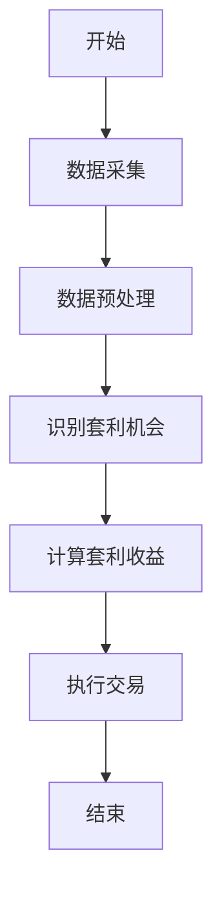
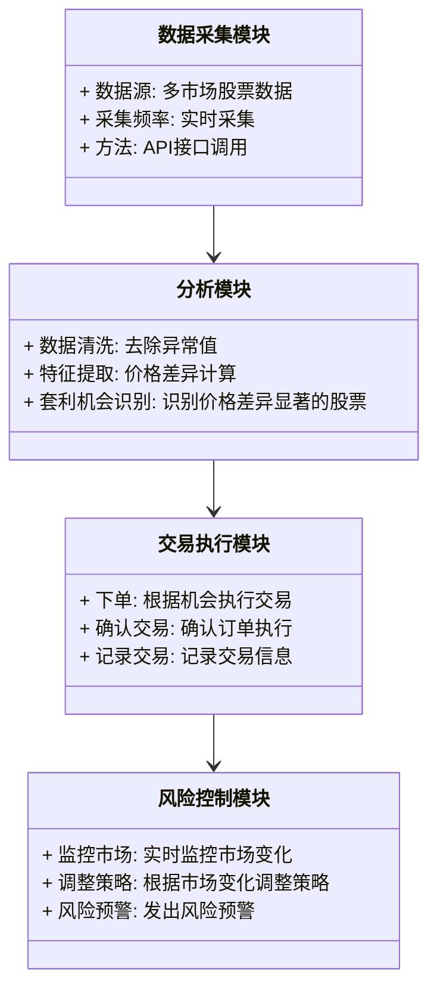
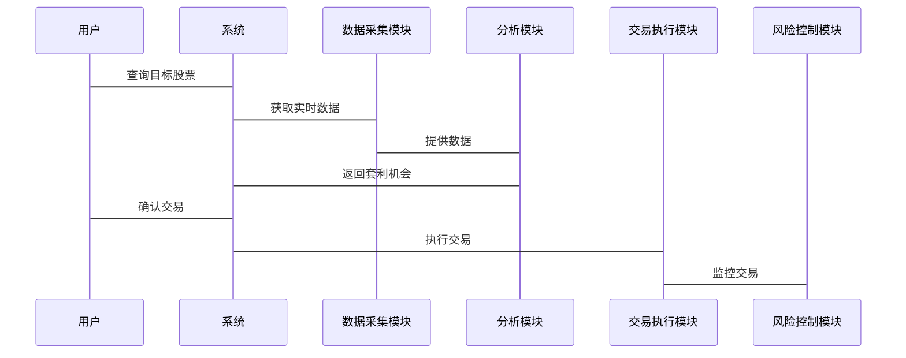

                 


# 特价股票投资中的监管套利策略

## 关键词：特价股票、监管套利、算法、数学模型、系统架构

## 摘要：  
本文深入探讨了特价股票投资中的监管套利策略，从背景、原理到实现进行了全面分析。通过数学模型和算法实现，结合系统架构设计，展示了如何利用监管差异进行套利。文章还提供了实战案例和最佳实践，帮助读者理解如何在实际投资中应用这些策略。

---

## 第一部分: 特价股票投资中的监管套利策略概述

### 第1章: 特价股票投资的背景与概念

#### 1.1 特价股票投资的背景  
特价股票是指在特定市场条件下，由于监管差异、市场结构或投资者行为等因素，某些股票的价格出现显著波动或差异。这种现象为监管套利提供了机会。

#### 1.2 监管套利策略的概念  
监管套利是指利用不同市场或监管规则的差异，通过买入低价股票并卖出高价股票，从中获利的策略。其核心在于识别和利用监管漏洞或市场不一致。

### 第2章: 监管套利策略的原理

#### 2.1 监管套利的核心概念  
- **监管差异**：不同市场对股票的交易规则、信息披露要求等存在差异，导致价格差异。  
- **套利机会**：利用这些差异，投资者可以在不同市场间进行 arbitrage，赚取无风险收益。

#### 2.2 监管套利的数学模型  
套利机会的识别可以通过以下公式进行量化：  
$$ \text{套利收益} = \text{高价市场价格} - \text{低价市场价格} - \text{交易成本} $$  
其中，交易成本包括佣金、税费等。

### 第3章: 监管套利策略的算法实现

#### 3.1 数据采集与预处理  
- 数据来源：多个市场的股票价格数据。  
- 数据清洗：去除异常值，填补缺失值。

#### 3.2 数据分析与特征提取  
- 通过统计分析识别价格差异显著的股票。  
- 使用机器学习模型预测套利机会。

### 第4章: 监管套利策略的系统架构设计

#### 4.1 系统功能模块划分  
- 数据采集模块：收集实时股票数据。  
- 分析模块：识别套利机会。  
- 交易执行模块：自动执行交易。  
- 风险控制模块：监控交易风险。

#### 4.2 系统交互流程  
- 用户输入查询：指定关注的股票。  
- 系统分析：生成套利信号。  
- 执行交易：自动下单。

---

## 第二部分: 监管套利策略的算法实现

### 第5章: 监管套利算法的实现

#### 5.1 算法流程图  


#### 5.2 算法代码实现  
以下是一个简化的Python代码示例：  
```python
import pandas as pd
import numpy as np

def calculate_arbitrage机会(data):
    # data为包含不同市场股票价格的DataFrame
    # 找出价格差异最大的股票
    max_diff = data.max() - data.min()
    return max_diff.idxmax()

# 示例数据
data = pd.DataFrame({
    '市场A': [100, 105, 98],
    '市场B': [110, 115, 100]
})

# 计算套利机会
opportunity = calculate_arbitrage机会(data)
print(f"套利机会在股票：{opportunity}")
```

### 第6章: 监管套利策略的系统架构设计

#### 6.1 系统架构图  


#### 6.2 系统交互流程  


---

## 第三部分: 监管套利策略的项目实战

### 第7章: 项目背景与目标

#### 7.1 项目背景  
本文通过一个实际案例，分析香港和新加坡市场中某只股票的监管套利机会。

#### 7.2 项目目标  
识别套利机会，设计并实现套利交易系统。

### 第8章: 项目核心实现

#### 8.1 数据采集与处理  
- 使用Yahoo Finance API获取实时数据。  
- 数据清洗：去除异常值，填充缺失值。

#### 8.2 套利策略实现  
- 使用Python编写套利策略代码。  
- 结合市场数据计算套利机会。

### 第9章: 实际案例分析

#### 9.1 案例分析  
某只股票在两个市场中价格差异较大，利用套利策略进行交易，最终获利。

#### 9.2 代码实现  
以下是一个套利策略的Python代码示例：  
```python
import pandas as pd
import requests

def get_stock_price(symbol, market):
    # 获取股票价格
    url = f"https://query1.finance.yahoo.com/...{symbol}=D%2Lt%3D1d%3F"
    response = requests.get(url)
    data = response.json()
    return data['data']['prices'][0]['price']

# 示例股票和市场
stock_symbol = "AAPL"
market1 = "US"
market2 = "HK"

price1 = get_stock_price(f"{stock_symbol}.{market1}", market1)
price2 = get_stock_price(f"{stock_symbol}.{market2}", market2)

# 计算套利收益
arbitrage = price1 - price2 - 10  # 假设交易成本为10
print(f"套利收益：{arbitrage}")
```

### 第10章: 项目小结

#### 10.1 项目成果  
成功识别并实现套利交易，验证了策略的有效性。

#### 10.2 经验总结  
- 数据质量至关重要。  
- 风险控制必不可少。

---

## 第四部分: 监管套利策略的最佳实践与注意事项

### 第11章: 最佳实践

#### 11.1 投资策略  
- 分散投资，降低风险。  
- 定期监控市场变化。

#### 11.2 风险控制  
- 设置止损点。  
- 监控市场波动。

### 第12章: 注意事项

#### 12.1 监管政策变化  
套利机会可能因监管政策变化而消失。

#### 12.2 市场波动  
剧烈的市场波动可能导致套利失败。

### 第13章: 总结

本文详细分析了特价股票投资中的监管套利策略，从理论到实践，结合算法和系统架构设计，为投资者提供了实用的指导。

---

## 第五部分: 拓展阅读

- 《算法交易：机密 revealed》  
- 《金融工程：模型与实践》  
- 《监管套利：全球视角》  

---

通过以上详细分析，本文为读者提供了全面的监管套利策略指南，帮助投资者在特价股票投资中把握机会，降低风险。

