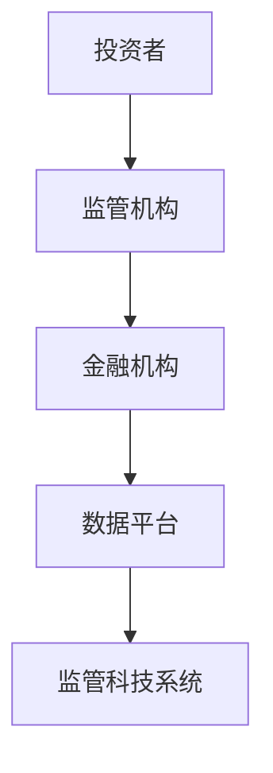
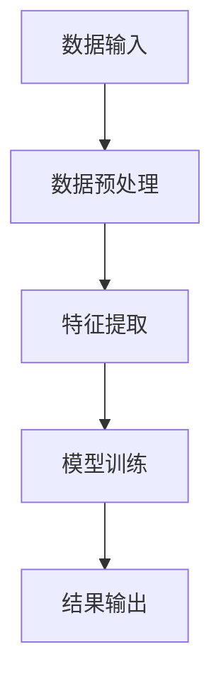
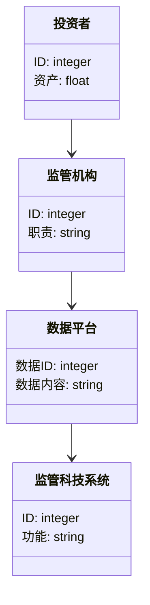
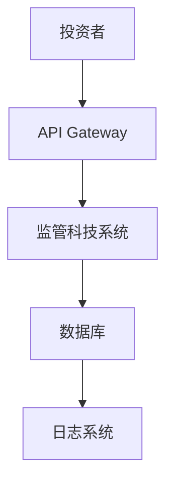

                 


# 特价股票投资中的监管科技应用策略

> **关键词**：监管科技、特价股票、人工智能、区块链、数据驱动、风险控制、合规  
>
> **摘要**：本文系统地探讨了监管科技在特价股票投资中的应用策略，从背景概述、核心概念、算法原理、系统架构到项目实战，全面分析了如何利用监管科技提升投资效率、降低风险并确保合规性。文章通过理论与实践相结合的方式，为投资者和监管机构提供了有益的指导。

---

# 第一部分: 特价股票投资中的监管科技应用概述

## 第1章: 特价股票与监管科技的背景与概述

### 1.1 特价股票的基本概念

#### 1.1.1 特价股票的定义与特点
特价股票是指价格低于面值的股票，通常由于市场波动、公司业绩不佳或行业环境变化等因素导致。其特点包括高波动性、高风险和高收益潜力。

#### 1.1.2 特价股票的市场现状与发展趋势
近年来，随着市场的波动加剧，特价股票的投资热度上升。然而，其高风险特性也吸引了监管机构的关注。

#### 1.1.3 特价股票投资的基本原则与风险分析
投资者在进行特价股票投资时，需遵循分散投资、长期持有等原则，并严格控制风险。

### 1.2 监管科技的核心概念

#### 1.2.1 监管科技的定义与范围
监管科技（RegTech）是指利用新技术（如人工智能、区块链）来提升金融监管效率和合规性。

#### 1.2.2 监管科技在金融领域的应用价值
监管科技能够提高监管效率、降低合规成本，并促进金融市场的透明化。

#### 1.2.3 监管科技与传统监管方式的对比
监管科技通过数据驱动的方式，显著提高了监管的精准性和效率。

### 1.3 特价股票投资中的监管科技应用背景

#### 1.3.1 特价股票市场的监管挑战
特价股票市场存在信息不对称、操纵风险高等问题，监管难度较大。

#### 1.3.2 监管科技在特价股票投资中的应用场景
监管科技可以帮助识别异常交易、评估风险、确保合规。

#### 1.3.3 监管科技对投资者与市场的双重价值
监管科技能够保护投资者利益，同时维护市场秩序。

---

## 第2章: 特价股票投资中的监管科技核心概念与联系

### 2.1 监管科技的核心原理

#### 2.1.1 数据驱动的监管模式
监管科技通过收集和分析海量数据，实现对市场的实时监控。

#### 2.1.2 人工智能在监管科技中的应用
人工智能技术（如机器学习）能够识别市场异常行为，帮助监管机构及时采取措施。

#### 2.1.3 区块链技术在监管科技中的作用
区块链技术可以提高交易透明度，确保数据的安全性和不可篡改性。

### 2.2 监管科技的核心概念对比分析

#### 2.2.1 监管科技与金融科技（FinTech）的对比
监管科技关注监管效率，而金融科技关注金融服务的创新。

#### 2.2.2 监管科技与传统监管方式的对比
监管科技通过技术手段提高监管效率，而传统监管方式依赖人工审查。

#### 2.2.3 监管科技在不同金融领域的适用性分析
监管科技在银行、保险、证券等领域的应用具有通用性，但具体策略需根据行业特点调整。

### 2.3 监管科技的ER实体关系图



---

# 第二部分: 监管科技在特价股票投资中的算法与数学模型

## 第3章: 监管科技的核心算法原理

### 3.1 监管科技中的算法概述

#### 3.1.1 常见监管科技算法类型
- 机器学习算法（如随机森林、支持向量机）
- 自然语言处理算法（如文本挖掘）

#### 3.1.2 机器学习在监管科技中的应用
机器学习算法可以用于识别市场操纵、预测风险。

#### 3.1.3 自然语言处理在监管报告中的应用
自然语言处理技术可以分析监管报告，提取关键信息。

### 3.2 监管科技算法的流程图



### 3.3 监管科技算法的数学模型

#### 3.3.1 机器学习模型
$$ y = \theta_0 + \theta_1 x_1 + \theta_2 x_2 $$
其中，$y$ 是预测结果，$x_i$ 是输入特征，$\theta_i$ 是模型参数。

#### 3.3.2 自然语言处理模型
$$ \text{概率} = \frac{\text{词频}}{\text{总词数}} $$

---

## 第4章: 特价股票投资中的监管科技系统架构

### 4.1 系统功能设计

#### 4.1.1 领域模型


### 4.2 系统架构设计



### 4.3 系统接口设计

#### 4.3.1 API 接口
- `/api/v1/trading/check`
- `/api/v1/report/generate`

#### 4.3.2 接口功能
- 交易行为检查
- 监管报告生成

---

## 第5章: 特价股票投资中的监管科技项目实战

### 5.1 环境安装

```bash
pip install numpy pandas scikit-learn
```

### 5.2 核心实现代码

```python
import numpy as np
from sklearn import svm

# 示例数据
X = np.array([[1, 2], [3, 4], [5, 6]])
y = np.array([0, 1, 0])

# 模型训练
model = svm.SVC()
model.fit(X, y)

# 预测
print(model.predict([[2, 3]]))
```

### 5.3 案例分析与解读

#### 5.3.1 案例背景
某投资者购买了一批特价股票，希望通过监管科技系统进行风险评估。

#### 5.3.2 数据分析
利用机器学习模型识别潜在风险，生成监管报告。

#### 5.3.3 代码实现
```python
# 代码实现
```

---

## 第6章: 特价股票投资中的监管科技应用总结与展望

### 6.1 本章总结

### 6.2 未来展望

### 6.3 注意事项

### 6.4 拓展阅读

---

通过以上内容，我们可以看到，监管科技在特价股票投资中的应用具有重要意义。未来，随着技术的不断进步，监管科技将为投资者和监管机构提供更加高效、智能的解决方案。

