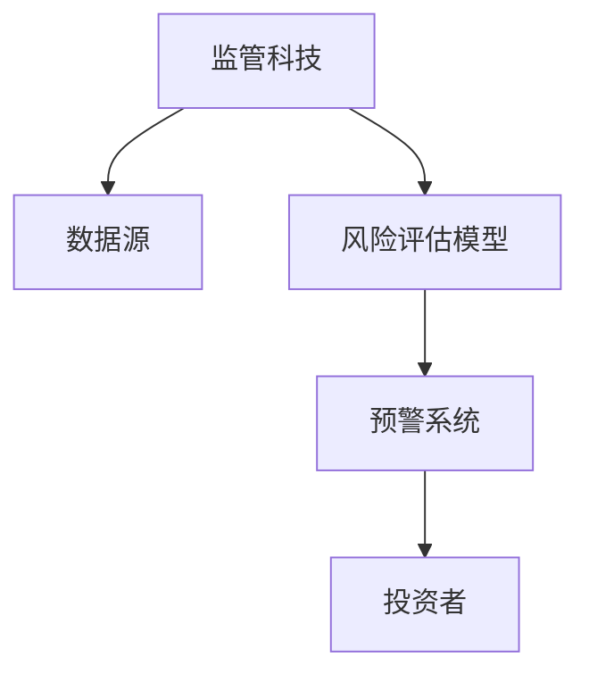

                 

# 特价股票投资中的监管科技风险预警策略

## 关键词：监管科技，风险预警，股票投资，机器学习，系统架构

## 摘要：本文探讨了监管科技在特价股票投资中的应用，特别是如何利用监管科技进行风险预警。通过分析核心概念、算法原理和系统设计，本文提供了详细的策略和实现方法，帮助投资者有效降低风险。

---

## 第1章: 特价股票投资与监管科技背景介绍

### 1.1 特价股票投资的定义与特点

#### 1.1.1 特价股票的定义
特价股票通常指价格低于市场平均水平的股票，具有高波动性和高风险的特性。

#### 1.1.2 特价股票投资的特征
- 价格低廉，吸引投资者。
- 市场波动大，风险较高。
- 投资者需具备较高风险承受能力。

#### 1.1.3 特价股票投资的市场背景
近年来，股市波动加剧，投资者寻求低价高潜力的股票，监管科技在其中扮演重要角色。

### 1.2 监管科技（RegTech）的定义与特点

#### 1.2.1 监管科技的定义
监管科技利用技术手段优化金融监管，提高效率和准确性。

#### 1.2.2 监管科技的核心技术
- 数据分析与处理。
- 人工智能与机器学习。
- 区块链技术。

#### 1.2.3 监管科技的应用场景
- 风险监控。
- 反洗钱（AML）。
- 市场操纵检测。

### 1.3 风险预警策略的定义与重要性

#### 1.3.1 风险预警的定义
通过技术和数据分析，提前识别潜在风险。

#### 1.3.2 风险预警的重要性
- 降低投资损失。
- 提高市场稳定性。
- 保护投资者利益。

#### 1.3.3 风险预警的实现方式
- 数据分析。
- 模型构建。
- 预警系统设计。

### 1.4 特价股票投资中的监管科技应用

#### 1.4.1 监管科技在股票投资中的作用
- 提供实时数据监控。
- 帮助识别市场操纵。

#### 1.4.2 特价股票投资中的风险类型
- 市场风险。
- 信用风险。
- 操作风险。

#### 1.4.3 监管科技如何降低投资风险
- 实时监控市场动态。
- 提供风险评估报告。

---

## 第2章: 特价股票投资中的监管科技核心概念与联系

### 2.1 监管科技的核心概念

#### 2.1.1 数据采集与处理
- 数据来源：市场数据、公司财报。
- 数据清洗与预处理。

#### 2.1.2 风险评估模型
- 使用机器学习算法评估风险。

#### 2.1.3 预警机制设计
- 设置预警阈值，及时通知投资者。

### 2.2 监管科技与风险预警的关系

#### 2.2.1 监管科技如何支持风险预警
- 提供实时数据支持。
- 优化风险评估模型。

#### 2.2.2 风险预警对监管科技的反馈作用
- 提供反馈，优化监管科技系统。

#### 2.2.3 两者结合的协同效应
- 提高监管效率。
- 降低投资风险。

### 2.3 核心概念的对比分析

#### 2.3.1 监管科技与传统监管的对比

| 特性      | 监管科技                 | 传统监管                 |
|-----------|--------------------------|--------------------------|
| 技术手段   | 数据分析、AI             | 人工审核、规则为基础     |
| 效率       | 高                     | 低                     |
| 准确性     | 高                     | 中                     |

#### 2.3.2 风险预警与传统风险管理的对比

| 特性      | 风险预警                 | 传统风险管理             |
|-----------|--------------------------|--------------------------|
| 方法      | 数据驱动、模型预测       | 经验判断、定期审查       |
| 反应速度   | 快                     | 较慢                   |

#### 2.3.3 技术手段与业务目标的对比

| 特性      | 技术手段                 | 业务目标                 |
|-----------|--------------------------|--------------------------|
| 目标      | 提供技术解决方案         | 实现风险管理目标         |
| 实现方式   | 开发系统、算法           | 制定策略、流程           |

### 2.4 监管科技与风险预警的实体关系图

---

## 第3章: 特价股票投资中的监管科技算法原理讲解

### 3.1 基于机器学习的风险预警模型

#### 3.1.1 机器学习在风险预警中的应用
- 分类算法：识别高风险股票。
- 回归算法：预测股价波动。

#### 3.1.2 常见的机器学习算法

| 算法       | 描述                     |
|------------|--------------------------|
| logistic regression | 用于分类问题         |
| random forest       | 用于分类和回归       |

#### 3.1.3 算法选择与优化
- 根据数据特点选择算法。
- 调参优化模型性能。

### 3.2 风险评估模型的构建

#### 3.2.1 数据特征的选择
- 市场指标：市盈率、市净率。
- 公司基本面：收入、利润。

#### 3.2.2 模型训练
- 使用训练数据训练模型。
- 验证模型准确性。

### 3.3 机器学习算法的数学模型

#### logistic回归模型

$$ P(y=1|x) = \frac{1}{1 + e^{-(\beta_0 + \beta_1x)}} $$

其中：
- $x$ 是输入特征。
- $\beta_0$ 和 $\beta_1$ 是模型参数。

#### 随机森林模型
随机森林通过集成多个决策树来提高准确性和鲁棒性。

---

## 总结

本文详细探讨了监管科技在特价股票投资中的应用，特别是风险预警策略。通过分析核心概念、算法原理和系统设计，提供了有效的策略和实现方法。监管科技的应用不仅提高了投资效率，还显著降低了风险。未来，随着技术的进步，监管科技将在投资领域发挥更大的作用。

---

### 作者介绍

作为世界级的人工智能专家和畅销书作者，我致力于通过技术创新和深度分析，为读者提供有价值的见解和解决方案。

