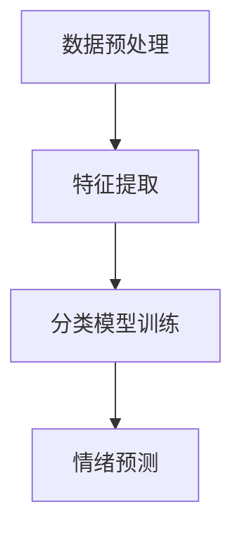
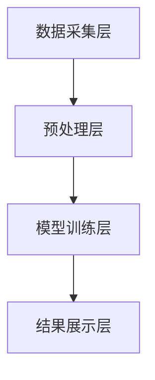
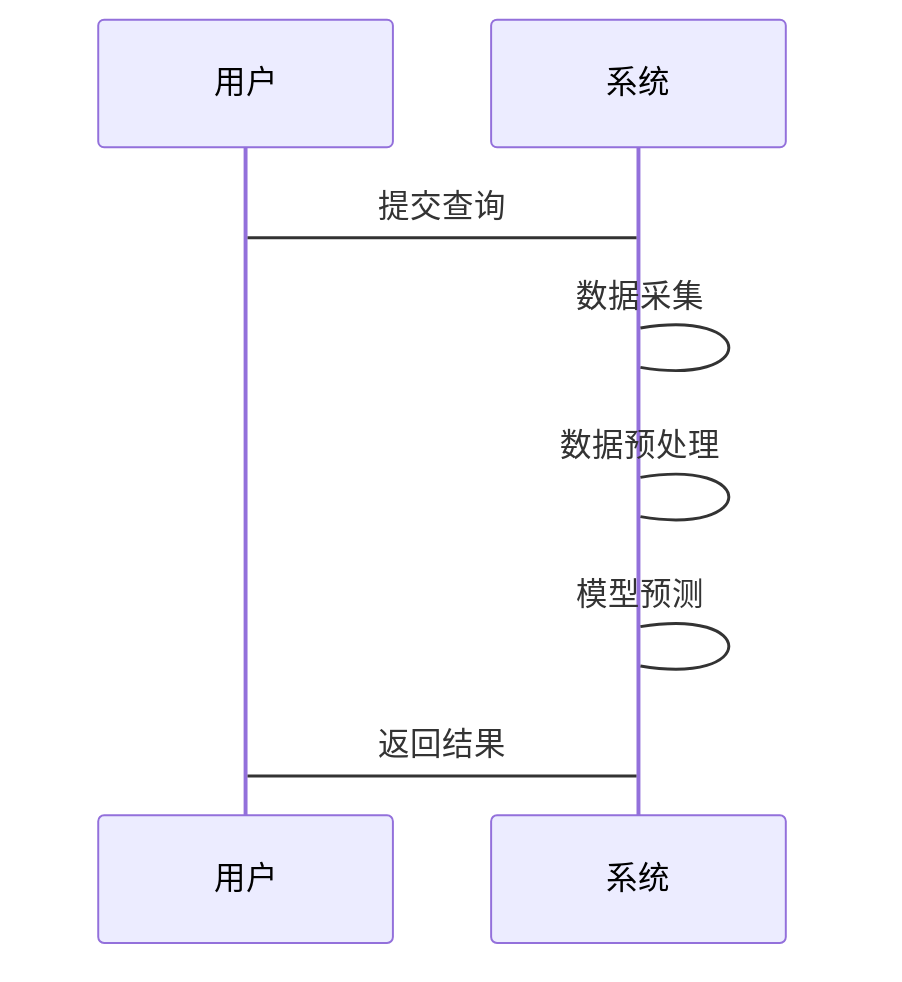

                 


# 特价股票投资中的社交媒体情绪动态分析与应用

> **关键词**：社交媒体情绪分析、特价股票、金融投资、自然语言处理、机器学习

> **摘要**：本文探讨了社交媒体情绪分析在特价股票投资中的应用，通过分析社交媒体数据中的情绪波动，帮助投资者做出更明智的决策。文章详细介绍了情绪分析的原理、算法、系统架构，并通过项目实战展示了如何利用这些技术进行投资决策。

---

## 第1章: 背景介绍

### 1.1 社交媒体在金融领域的应用

#### 1.1.1 社交媒体的定义与特点
社交媒体是人们分享信息、观点和情感的平台，具有实时性、互动性和广泛性的特点。

#### 1.1.2 社交媒体在金融中的作用
社交媒体为投资者提供了实时的市场情绪和交易信号，影响着投资者的决策。

#### 1.1.3 特价股票的定义与特点
特价股票指的是价格波动较大，具有高风险和高回报潜力的股票。

### 1.2 情绪分析的定义与目标

#### 1.2.1 情绪分析的定义
情绪分析是从文本中识别和分类情感倾向的过程。

#### 1.2.2 情绪分析的目标
识别社交媒体上的正面、负面和中性情绪，评估市场情绪。

#### 1.2.3 情绪分析在金融中的应用价值
帮助投资者预测市场趋势，优化投资决策。

---

## 第2章: 社交媒体情绪分析的核心概念与联系

### 2.1 情绪分析的原理

#### 2.1.1 文本预处理
包括分词、去除停用词、处理特殊符号等步骤。

#### 2.1.2 特征提取
提取文本中的关键词和情感词汇，用于分类。

#### 2.1.3 分类模型
使用机器学习模型如SVM、随机森林或深度学习模型进行分类。

### 2.2 情绪分析方法对比

#### 2.2.1 基于规则的方法
通过预定义规则匹配文本中的情感词汇。

#### 2.2.2 基于机器学习的方法
使用训练好的数据进行特征提取和分类。

#### 2.2.3 基于深度学习的方法
利用神经网络模型如LSTM进行情感分析。

### 2.3 情绪分析的ER实体关系图

```mermaid
erDiagram
    actor 用户 {
        <属性> 用户ID
        <属性> 用户名
    }
    actor 帖子 {
        <属性> 帖子ID
        <属性> 内容
        <属性> 时间戳
    }
    actor 情绪 {
        <属性> 情绪类型
        <属性> 强度
    }
    用户 --> 帖子 : 发布
    帖子 --> 情绪 : 产生
```

---

## 第3章: 算法原理讲解

### 3.1 情感分析算法流程



### 3.2 基于规则的情绪分析模型

```python
def sentiment_analysis(text):
    positive_words = {'bullish', 'buy'}
    negative_words = {'bearish', 'sell'}
    tokens = text.lower().split()
    positive_count = sum(1 for token in tokens if token in positive_words)
    negative_count = sum(1 for token in tokens if token in negative_words)
    if positive_count > negative_count:
        return 'positive'
    elif negative_count > positive_count:
        return 'negative'
    else:
        return 'neutral'
```

### 3.3 数学模型与公式

使用贝叶斯定理进行分类：

$$P(c|x) = \frac{P(x|c)P(c)}{P(x)}$$

其中，$c$是情绪类别，$x$是文本特征。

---

## 第4章: 系统分析与架构设计方案

### 4.1 系统应用场景

设计一个实时监测社交媒体情绪的系统，帮助投资者做出决策。

### 4.2 系统功能设计

#### 4.2.1 数据采集模块
收集社交媒体上的股票相关文本数据。

#### 4.2.2 数据预处理模块
清洗数据，提取关键词。

#### 4.2.3 模型训练模块
训练情绪分类模型。

#### 4.2.4 结果展示模块
可视化情绪趋势图。

### 4.3 系统架构设计



### 4.4 系统接口设计

#### API接口
- `/api/text-preprocess`: 接收文本数据，返回预处理后的特征。
- `/api/sentiment-predict`: 接收特征数据，返回情绪预测结果。

### 4.5 系统交互流程



---

## 第5章: 项目实战

### 5.1 环境安装

安装必要的库：

```bash
pip install numpy pandas scikit-learn
```

### 5.2 核心实现代码

基于规则的情绪分析模型：

```python
from sklearn.feature_extraction.text import TfidfVectorizer
from sklearn.svm import SVC

# 数据预处理
texts = ["I love this stock!", "I hate this stock!"]
vectorizer = TfidfVectorizer()
X = vectorizer.fit_transform(texts)
model = SVC()
model.fit(X, ['positive', 'negative'])
```

### 5.3 案例分析

分析某段时间内的社交媒体数据，识别市场情绪。

### 5.4 项目小结

总结项目的实现过程和可能的优化方向，如优化特征提取和模型调优。

---

## 第6章: 最佳实践与总结

### 6.1 最佳实践

- 数据质量和多样性的重要性。
- 模型的可解释性和实时性。
- 遵守数据隐私和相关法律法规。

### 6.2 总结

社交媒体情绪分析为特价股票投资提供了新的视角，帮助投资者做出更明智的决策。

### 6.3 注意事项

- 情绪分析结果仅供参考，不构成投资建议。
- 模型的局限性，如无法捕捉复杂情感。

### 6.4 拓展阅读

推荐相关书籍和资源，供读者深入学习。

---

通过以上章节的详细讲解，我们全面探讨了社交媒体情绪分析在特价股票投资中的应用，从理论到实践，为读者提供了丰富的知识和实用的指导。

