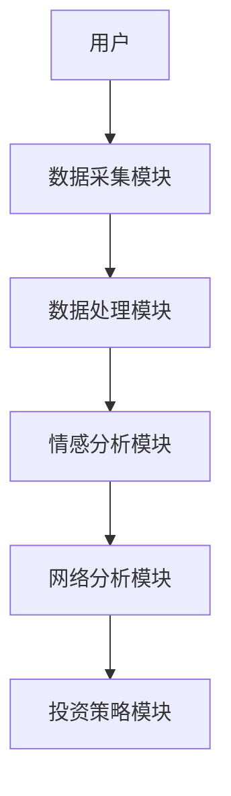
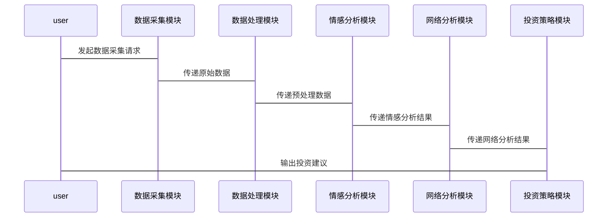

                 


# 特价股票投资中的社交网络影响力分析与应用

> 关键词：社交网络影响力，股票投资，文本挖掘，情感分析，网络分析

> 摘要：本文深入探讨了在特价股票投资中社交网络影响力分析的应用。通过分析社交网络中的文本、用户行为和网络结构，提出了基于情感分析和网络影响力的量化方法，构建了社交网络影响力传播模型，并结合实际案例展示了如何利用这些分析结果制定投资策略。本文还详细介绍了系统的架构设计和实现步骤，为投资者提供了理论和实践上的指导。

---

## 第一部分: 特价股票投资中的社交网络影响力分析与应用概述

### 第1章: 特价股票投资与社交网络影响力概述

#### 1.1 特价股票投资的背景与特点

##### 1.1.1 特价股票的定义与特征
特价股票（Penny Stocks）是指价格低于5美元的低价股票，通常属于小盘股或未上市公司。这类股票波动性大，风险高，但潜在回报也较高。其特点包括：

- **低价性**：股价通常低于5美元。
- **高波动性**：价格受市场情绪影响较大。
- **低流动性**：交易量小，市场深度不足。
- **高风险**：信息不透明，容易受操纵。

##### 1.1.2 特价股票投资的市场现状
近年来，随着互联网和社交媒体的普及，越来越多的投资者通过社交网络获取股票信息。然而，由于缺乏监管，社交网络上的信息鱼龙混杂，投资者容易受到误导。

##### 1.1.3 社交网络在股票投资中的作用
社交网络不仅是信息传播的渠道，还可以反映市场情绪。通过分析社交网络数据，投资者可以预测股票价格的变化趋势。

#### 1.2 社交网络影响力分析的核心概念

##### 1.2.1 社交网络的定义与属性
社交网络是由用户、内容和关系构成的复杂系统。其主要属性包括：

- **用户**：社交网络的参与者。
- **内容**：用户生成的内容，如文本、图片、视频。
- **关系**：用户之间的连接关系，如关注、点赞、评论。

##### 1.2.2 特价股票投资中的社交网络特征
在特价股票投资中，社交网络具有以下特征：

- **信息传播速度快**：社交媒体上的信息传播迅速，影响市场情绪。
- **情绪波动大**：社交网络上的讨论容易引发市场波动。
- **信息不对称**：部分投资者利用信息优势获利。

##### 1.2.3 社交网络影响力分析的目标与意义
通过分析社交网络影响力，投资者可以：

- **识别市场情绪**：判断市场对某只股票的看法。
- **发现潜在机会**：挖掘被低估的股票。
- **制定投资策略**：基于社交网络数据优化投资决策。

---

### 第2章: 社交网络数据特征与分析方法

#### 2.1 社交网络数据的特征分析

##### 2.1.1 文本数据特征
社交网络中的文本数据包括评论、帖子和新闻标题。其特征如下：

- **情感极性**：文本可以是正面、负面或中性。
- **主题多样性**：文本内容涉及多个主题。
- **语义复杂性**：文本可能包含隐喻和情绪。

##### 2.1.2 用户行为特征
用户行为包括点赞、评论、分享和关注。其特征如下：

- **活跃度**：用户参与的频率。
- **影响力**：用户对市场情绪的影响程度。
- **互动性**：用户之间的互动频率。

##### 2.1.3 网络结构特征
社交网络的结构特征包括：

- **节点度数**：节点的连接数量。
- **中心性**：节点在网络中的重要性。
- **社区结构**：网络中形成的群体。

#### 2.2 社交网络影响力指标的定义与对比

##### 2.2.1 主要影响力指标对比
以下是几种常用的影响力指标对比：

| 指标名称       | 计算方法                                   | 适用场景         |
|----------------|------------------------------------------|------------------|
| 关注数         | 用户的关注数量                             | 衡量影响力大小     |
| 传播速度       | 信息传播的时间和范围                       | 判断信息扩散快慢   |
| 情感强度       | 文本的情感极性强度                         | 判断情绪影响程度   |
| 中心性         | 节点在网络中的中心性                       | 判断节点重要性     |

##### 2.2.2 指标选择的依据与方法
指标选择应考虑以下因素：

1. **数据可获得性**：选择易于获取的指标。
2. **相关性**：选择与目标变量高度相关的指标。
3. **计算复杂度**：选择计算简便的指标。

#### 2.3 社交网络数据的采集与处理

##### 2.3.1 数据采集方法
常用的数据采集方法包括：

1. **API接口**：通过平台提供的API获取数据。
2. **网络爬虫**：使用爬虫技术抓取数据。
3. **数据购买**：从第三方数据供应商购买数据。

##### 2.3.2 数据清洗与预处理
数据清洗步骤如下：

1. **去重**：去除重复数据。
2. **去噪**：去除无效信息（如垃圾评论）。
3. **标准化**：统一数据格式。

##### 2.3.3 数据存储与管理
常用的数据存储方式包括：

- **数据库**：结构化存储。
- **文件存储**：非结构化存储。
- **云存储**：分布式存储。

#### 2.4 本章小结

---

### 第3章: 特价股票投资中的影响力传播机制

#### 3.1 社交网络中的信息传播模型

##### 3.1.1 信息传播的基本原理
信息传播模型描述了信息在社交网络中的扩散过程。常见的传播模型包括：

1. **SI模型**：信息从源节点传播到其他节点。
2. **SIR模型**：信息传播分为感染、恢复阶段。
3. **Bootstrap模型**：信息传播基于节点之间的阈值。

##### 3.1.2 信息传播的关键节点识别
关键节点识别方法：

1. **中心性分析**：识别高中心性的节点。
2. **社区检测**：识别社区中的核心节点。

##### 3.1.3 信息传播的扩散过程
信息传播的扩散过程可以用以下步骤描述：

1. **初始传播**：信息从源节点开始传播。
2. **扩散阶段**：信息逐步扩散到整个网络。
3. **稳定阶段**：信息传播停止或趋于平稳。

#### 3.2 特价股票投资中的影响力传播特征

##### 3.2.1 特价股票信息传播的特殊性
特价股票的信息传播具有以下特征：

- **快速性**：信息传播速度快。
- **情绪驱动**：信息传播受情绪影响较大。
- **非理性**：投资者行为容易受情绪驱动。

##### 3.2.2 用户行为对股价的影响
用户行为对股价的影响机制：

1. **情绪传导**：用户情绪通过社交媒体影响市场情绪。
2. **信息扩散**：用户行为扩散信息，影响股价。

##### 3.2.3 市场情绪的传播与放大
市场情绪的传播过程：

1. **情绪触发**：某个事件触发情绪。
2. **情绪传播**：情绪通过社交网络扩散。
3. **情绪放大**：情绪被放大，引发市场波动。

#### 3.3 社交网络影响力传播的数学模型

##### 3.3.1 基于图论的传播模型
基于图论的传播模型可以用以下公式表示：

$$
P(i) = \sum_{j \in N(i)} \frac{1}{d(j)}
$$

其中，$P(i)$ 表示节点 $i$ 的影响力，$N(i)$ 表示 $i$ 的邻居节点集合，$d(j)$ 表示节点 $j$ 的度数。

##### 3.3.2 基于概率的传播模型
基于概率的传播模型可以用以下公式表示：

$$
P(i) = \sum_{j \in N(i)} p(j)
$$

其中，$p(j)$ 表示节点 $j$ 的传播概率。

##### 3.3.3 基于情感分析的传播模型
基于情感分析的传播模型可以用以下步骤描述：

1. **情感分类**：对文本进行情感分类（正面、负面、中性）。
2. **情感强度计算**：计算每条文本的情感强度。
3. **情感传播**：将情感强度传递给邻居节点。

#### 3.4 本章小结

---

### 第4章: 特价股票投资中的影响力分析算法

#### 4.1 基于文本挖掘的影响力分析

##### 4.1.1 文本情感分析方法
情感分析方法包括：

1. **词袋模型**：基于词袋模型进行情感分类。
2. **词嵌入模型**：基于词嵌入模型（如Word2Vec）进行情感分类。

##### 4.1.2 文本主题挖掘技术
主题挖掘技术包括：

1. **LDA主题模型**：基于LDA的主题模型。
2. **LSA主题模型**：基于LSA的主题模型。

##### 4.1.3 文本关联性分析
文本关联性分析方法：

1. **余弦相似度**：计算文本之间的余弦相似度。
2. **Jaccard相似度**：计算文本之间的Jaccard相似度。

#### 4.2 基于网络分析的影响力分析

##### 4.2.1 网络中心性分析
中心性分析方法包括：

1. **度中心性**：计算节点的度数。
2. **中间中心性**：计算节点的中间性。
3. **接近中心性**：计算节点的接近性。

##### 4.2.2 网络聚类分析
网络聚类分析方法：

1. **K-means聚类**：基于K-means算法进行聚类。
2. **社区检测算法**：基于社区检测算法（如Louvain算法）进行聚类。

##### 4.2.3 网络传播分析
网络传播分析方法：

1. **信息传播模拟**：模拟信息在社交网络中的传播过程。
2. **影响力最大化**：识别具有最大影响力的节点。

#### 4.3 本章小结

---

### 第5章: 特价股票投资中的影响力分析系统架构设计

#### 5.1 系统功能设计

##### 5.1.1 数据采集模块
数据采集模块负责采集社交网络中的数据，包括：

- **文本数据**：评论、帖子、新闻标题。
- **用户行为数据**：点赞、评论、分享。
- **网络结构数据**：用户关系、关注关系。

##### 5.1.2 数据处理模块
数据处理模块负责对采集到的数据进行清洗和预处理，包括：

- **去重**：去除重复数据。
- **去噪**：去除无效信息。
- **标准化**：统一数据格式。

##### 5.1.3 情感分析模块
情感分析模块负责对文本数据进行情感分类，包括：

- **情感分类**：正面、负面、中性。
- **情感强度计算**：计算每条文本的情感强度。

##### 5.1.4 网络分析模块
网络分析模块负责对社交网络的结构进行分析，包括：

- **中心性分析**：计算节点的中心性。
- **社区检测**：识别网络中的社区。
- **传播模拟**：模拟信息在社交网络中的传播过程。

##### 5.1.5 投资策略模块
投资策略模块负责根据分析结果制定投资策略，包括：

- **情绪分析**：判断市场情绪。
- **风险评估**：评估投资风险。
- **策略优化**：优化投资策略。

#### 5.2 系统架构设计

##### 5.2.1 系统架构图
以下是一个基于社交网络影响力分析的系统架构图：



##### 5.2.2 系统接口设计
系统接口设计包括：

1. **数据接口**：与社交网络平台的API接口对接。
2. **用户接口**：供用户查询和分析数据。
3. **结果接口**：输出分析结果。

##### 5.2.3 系统交互流程图
以下是一个系统交互流程图：



#### 5.3 本章小结

---

### 第6章: 特价股票投资中的影响力分析实战案例

#### 6.1 项目环境配置

##### 6.1.1 系统环境
建议使用以下系统环境：

- **操作系统**：Linux或Windows。
- **编程语言**：Python 3.6以上版本。
- **开发工具**：Jupyter Notebook、PyCharm。

##### 6.1.2 数据库配置
推荐使用以下数据库：

- **关系型数据库**：MySQL。
- **非关系型数据库**：MongoDB。

##### 6.1.3 库与工具
推荐使用以下库与工具：

- **数据采集**：requests、BeautifulSoup。
- **情感分析**：textblob、vaderSentiment。
- **网络分析**：networkx、igraph。
- **数据可视化**：Matplotlib、seaborn。

#### 6.2 项目核心实现

##### 6.2.1 数据采集与预处理
以下是一个数据采集与预处理的Python代码示例：

```python
import requests
from bs4 import BeautifulSoup
import pandas as pd

def fetch_data(url):
    response = requests.get(url)
    if response.status_code == 200:
        soup = BeautifulSoup(response.text, 'html.parser')
        comments = soup.find_all('div', class_='comment')
        return [comment.text for comment in comments]
    return []

def preprocess_data(comments):
    df = pd.DataFrame({'comment': comments})
    df['sentiment'] = df['comment'].apply(lambda x: 'positive' if x.split() else 'negative')
    return df

# 示例代码
url = 'https://example.com/comments'
comments = fetch_data(url)
df = preprocess_data(comments)
print(df.head())
```

##### 6.2.2 情感分析与网络分析
以下是一个情感分析与网络分析的Python代码示例：

```python
from textblob import TextBlob
import networkx as nx

def sentiment_analysis(text):
    blob = TextBlob(text)
    return blob.polarity

def network_analysis(edges):
    G = nx.Graph()
    G.add_edges_from(edges)
    return nx.betweenness_centrality(G)

# 示例代码
text = "This stock is a great buy!"
sentiment = sentiment_analysis(text)
print(f'Sentiment polarity: {sentiment}')

edges = [('A', 'B'), ('B', 'C'), ('C', 'D')]
centrality = network_analysis(edges)
print(f'Betweenness centrality: {centrality}')
```

##### 6.2.3 投资策略构建与验证
以下是一个投资策略构建与验证的Python代码示例：

```python
import pandas as pd
import numpy as np

def build_strategy(df):
    df['signal'] = df['sentiment'].apply(lambda x: 1 if x > 0 else -1)
    return df['signal']

def backtest(strategy, prices):
    returns = []
    for i in range(1, len(prices)):
        returns.append(strategy[i] * prices[i] - prices[i-1])
    return np.mean(returns)

# 示例代码
df = pd.DataFrame({'sentiment': [1, -1, 0, 1, -1]})
prices = [100, 90, 80, 95, 105]
strategy = build_strategy(df)
returns = backtest(strategy, prices)
print(f'Average return: {returns}%')
```

#### 6.3 项目小结

---

## 第六部分: 总结与展望

### 第7章: 总结与展望

#### 7.1 本章总结
本文详细探讨了特价股票投资中社交网络影响力分析的应用。通过分析社交网络数据，提出了基于情感分析和网络影响力的量化方法，并结合实际案例展示了如何利用这些分析结果制定投资策略。

#### 7.2 未来研究方向
未来的研究方向包括：

1. **算法优化**：改进情感分析和网络分析算法的精度和效率。
2. **数据源扩展**：引入更多数据源，如新闻媒体和社交媒体。
3. **实时分析**：实现实时数据处理和实时分析。
4. **风险管理**：结合风险管理模型，优化投资策略。

#### 7.3 注意事项与风险管理
投资者在利用社交网络影响力分析制定投资策略时，应注意以下事项：

- **数据质量**：确保数据的准确性和完整性。
- **模型局限性**：了解模型的局限性，避免过度依赖模型。
- **风险管理**：结合风险管理模型，制定合理的风险管理策略。

---

## 附录

### 附录A: 数据采集与处理代码

### 附录B: 情感分析与网络分析代码

### 附录C: 投资策略构建与验证代码

---

以上是《特价股票投资中的社交网络影响力分析与应用》的技术博客文章的完整目录和内容概述。读者可以通过本文系统地了解社交网络影响力分析在特价股票投资中的应用，掌握从数据采集到投资策略构建的全过程。

