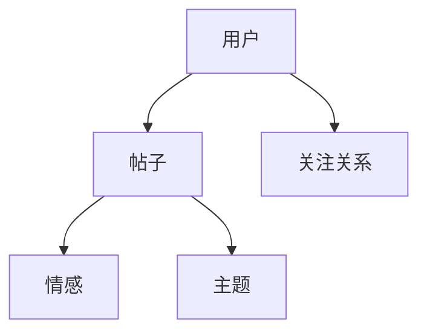
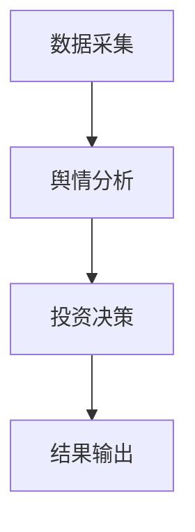

                 


# 特价股票投资中的社交网络舆情动态分析与应用

## 关键词：社交网络舆情，股票投资，情感分析，话题传播，投资策略

## 摘要：本文探讨社交网络舆情在特价股票投资中的作用，分析情绪传播机制，提出基于自然语言处理和图论的算法，构建动态分析模型，并通过实际案例验证其应用效果。

---

# 第一部分: 特价股票投资中的社交网络舆情动态分析与应用

## 第1章: 背景介绍

### 1.1 社交网络舆情的基本概念

#### 1.1.1 什么是社交网络舆情
社交网络舆情是指在社交平台上，用户对特定事件、产品或股票的情绪化表达。这些表达包括评论、点赞和分享，反映了用户的看法和态度。

#### 1.1.2 社交网络舆情在股票投资中的作用
社交网络舆情能够影响市场情绪，进而影响股票价格。投资者通过分析这些舆情，可以做出更明智的投资决策。

#### 1.1.3 特价股票的定义与特点
特价股票是指价格低于市场价或历史价的股票，通常具有较高的波动性和投资机会。

### 1.2 社交网络舆情对股票市场的影响机制

#### 1.2.1 情绪分析与市场反应
情绪分析通过识别文本中的情感倾向，判断市场情绪的变化，从而预测股价波动。

#### 1.2.2 舆情传播路径与投资者行为
舆情在社交网络中的传播速度和路径直接影响投资者的行为，进而影响股价。

#### 1.2.3 舆情强度与股价波动的关系
舆情强度与股价波动呈正相关，高强度的正面舆情会推高股价，负面舆情则会拉低股价。

---

## 第2章: 核心概念与联系

### 2.1 社交网络舆情分析的原理

#### 2.1.1 数据采集与处理
数据采集包括从社交平台获取文本数据，处理包括清洗和预处理。

#### 2.1.2 情感分析与主题挖掘
情感分析判断文本情感倾向，主题挖掘提取主要话题。

#### 2.1.3 舆情传播网络的构建
通过图论方法构建舆情传播网络，分析节点影响力。

### 2.2 核心概念对比分析

#### 2.2.1 不同社交平台的舆情特征对比
比较微博、Twitter和Reddit的舆情特征，包括用户活跃度和信息传播速度。

#### 2.2.2 舆情强度与股价波动的对比
分析不同舆情强度下股价的波动情况。

#### 2.2.3 舆情传播速度与市场反应的对比
舆情传播速度越快，市场反应越迅速。

### 2.3 ER实体关系图



---

## 第3章: 算法原理讲解

### 3.1 情感分析算法

#### 3.1.1 基于词袋模型的特征提取

使用词袋模型提取文本特征，计算词频向量。

```python
from sklearn.feature_extraction.text import CountVectorizer

vectorizer = CountVectorizer()
X = vectorizer.fit_transform(texts)
```

#### 3.1.2 基于TF-IDF的权重计算

使用TF-IDF计算词的权重，突出重要词汇。

```python
from sklearn.feature_extraction.text import TfidfVectorizer

vectorizer = TfidfVectorizer()
X = vectorizer.fit_transform(texts)
```

#### 3.1.3 基于朴素贝叶斯的情感分类

使用朴素贝叶斯算法进行情感分类。

```python
from sklearn.naive_bayes import MultinomialNB

model = MultinomialNB()
model.fit(X_train, y_train)
```

### 3.2 舆情传播分析算法

#### 3.2.1 基于图论的传播网络构建

构建话题传播网络，计算节点影响力。

```python
import networkx as nx

G = nx.Graph()
G.add_edges_from(edges)
```

#### 3.2.2 基于PageRank的节点影响力排序

使用PageRank算法排序节点影响力。

```python
pr = nx.pagerank(G)
```

#### 3.2.3 基于LDA的主题模型应用

使用LDA主题模型提取主题。

```python
from gensim.models import LdaModel

lda_model = LdaModel(corpus, num_topics=5, random_state=42)
```

---

## 第4章: 数学模型与公式

### 4.1 情感分析的数学模型

#### 4.1.1 词嵌入表示
$$ \text{Word Embedding} = W \cdot \text{Input} $$

#### 4.1.2 注意力机制
$$ \text{Attention}(Q, K, V) = \text{softmax}\left(\frac{QK^T}{\sqrt{d_k}}\right)V $$

### 4.2 舆情传播的数学模型

#### 4.2.1 舆情传播的扩散模型
$$ S_{t+1} = S_t + \beta S_t (1 - S_t) $$

---

## 第5章: 系统分析与架构设计

### 5.1 问题场景介绍

#### 5.1.1 项目背景
分析社交网络舆情对特价股票投资的影响。

#### 5.1.2 系统功能设计

- 数据采集模块
- 舆情分析模块
- 投资决策模块

### 5.2 系统架构设计



---

## 第6章: 项目实战

### 6.1 环境搭建

安装Python和相关库，如networkx、scikit-learn和gensim。

### 6.2 核心实现

#### 数据采集与预处理

使用爬虫获取数据，清洗和预处理。

#### 情感分析与主题挖掘

使用情感分析算法判断情感倾向，提取主题。

#### 舆情传播网络分析

构建传播网络，分析节点影响力。

### 6.3 实际案例分析

分析某事件的舆情传播，预测股价波动。

### 6.4 项目小结

总结项目成果，提出改进建议。

---

## 第7章: 总结与展望

### 7.1 总结

回顾文章内容，强调社交网络舆情在投资中的重要性。

### 7.2 投资策略建议

根据分析结果，制定投资策略。

### 7.3 注意事项

提醒读者注意数据质量和模型局限性。

### 7.4 拓展阅读

推荐进一步阅读的资料，鼓励深入学习。

---

通过以上步骤，我们系统地分析了社交网络舆情对特价股票投资的影响，提出了基于算法的解决方案，并通过实际案例验证了其可行性。希望本文能为投资者提供新的视角和方法。

