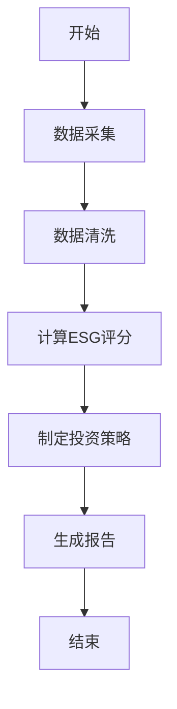
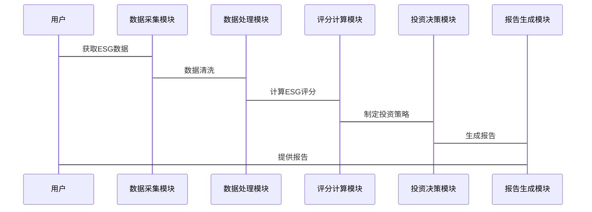

                 


# 第三部分: 特价股票投资中的社会责任因素考量

# 第3章: 特价股票投资中的社会责任因素

## 3.1 特价股票投资中的社会责任因素

### 3.1.1 环境因素在特价股票投资中的重要性

### 3.1.2 社会因素对特价股票投资的影响

### 3.1.3 治理因素在特价股票投资中的作用

## 3.2 特价股票社会责任投资的影响因素分析

### 3.2.1 环境因素的具体指标

| 指标 | 描述 |
|------|------|
| 碳排放 | 公司的碳足迹 |
| 可再生能源使用 | 使用可再生能源的比例 |
| 环境事件 | 发生的环境事故次数 |

### 3.2.2 社会因素的具体指标

| 指标 | 描述 |
|------|------|
| 员工福利 | 员工待遇和福利 |
| 供应链管理 | 供应商的社会责任表现 |
| 社区关系 | 公司与社区的关系 |

### 3.2.3 治理因素的具体指标

| 指标 | 描述 |
|------|------|
| 董事会构成 | 董事会成员的多样性 |
| 透明度 | 公司信息披露的透明度 |
| 治理结构 | 公司治理结构的合理性 |

## 3.3 特价股票社会责任投资的评价模型

### 3.3.1 综合评价模型的设计思路

### 3.3.2 综合评价模型的数学公式

$$ESG = w_e \cdot E + w_s \cdot S + w_g \cdot G$$

其中：
- E 表示环境因素的评分
- S 表示社会因素的评分
- G 表示治理因素的评分
- \(w_e\), \(w_s\), \(w_g\) 分别是环境、社会、治理因素的权重

### 3.3.3 模型权重的确定方法

| 方法 | 描述 |
|------|------|
| 主观赋权法 | 根据专家意见确定权重 |
| 客观赋权法 | 根据历史数据计算权重 |
| 综合法 | 结合主观和客观因素确定权重 |

## 3.4 特价股票社会责任投资的决策框架

### 3.4.1 决策框架的设计思路

### 3.4.2 决策框架的实现步骤

1. 收集公司ESG数据
2. 计算各公司的ESG评分
3. 根据评分筛选出符合条件的特价股票
4. 进行风险评估和收益预测
5. 制定投资策略

## 3.5 本章小结

---

# 第四部分: 特价股票社会责任投资的系统架构设计

# 第4章: 特价股票社会责任投资的系统架构设计

## 4.1 系统功能设计

### 4.1.1 系统功能模块划分

| 模块 | 描述 |
|------|------|
| 数据采集模块 | 采集公司ESG数据 |
| 数据处理模块 | 处理和清洗数据 |
| 评分计算模块 | 计算ESG评分 |
| 投资决策模块 | 基于评分制定投资策略 |
| 报告生成模块 | 生成投资报告 |

### 4.1.2 系统功能流程



## 4.2 系统架构设计

### 4.2.1 系统架构图

```mermaid
div
  classDiagram
    class 数据采集模块 {
        采集数据
    }
    class 数据处理模块 {
        清洗数据
    }
    class 评分计算模块 {
        计算ESG评分
    }
    class 投资决策模块 {
        制定投资策略
    }
    class 报告生成模块 {
        生成报告
    }
    数据采集模块 --> 数据处理模块
    数据处理模块 --> 评分计算模块
    评分计算模块 --> 投资决策模块
    投资决策模块 --> 报告生成模块
```

## 4.3 系统接口设计

### 4.3.1 数据接口设计

| 接口名称 | 描述 |
|---------|------|
| get_esg_data | 获取公司ESG数据 |
| compute_esg_score | 计算ESG评分 |
| generate_report | 生成投资报告 |

### 4.3.2 接口实现代码示例

```python
def get_esg_data(company_id):
    # 获取公司ESG数据
    pass

def compute_esg_score(esg_data):
    # 计算ESG评分
    pass

def generate_report(scores):
    # 生成投资报告
    pass
```

## 4.4 系统交互流程

### 4.4.1 交互流程图



## 4.5 本章小结

---

# 第五部分: 特价股票社会责任投资的项目实战

# 第5章: 特价股票社会责任投资的项目实战

## 5.1 项目介绍

### 5.1.1 项目背景

### 5.1.2 项目目标

## 5.2 项目实施

### 5.2.1 环境安装

#### 5.2.1.1 系统环境要求

| 系统 | 版本 |
|------|------|
| Python | 3.8+ |
| 数据库 | MySQL 5.7+ |
| 其他依赖 | Pandas, Scikit-learn |

### 5.2.1.2 安装步骤

```bash
pip install pandas scikit-learn
```

### 5.2.1.3 数据获取

```python
import pandas as pd
data = pd.read_csv('esg_data.csv')
```

## 5.3 核心代码实现

### 5.3.1 数据预处理代码

```python
import pandas as pd
from sklearn.impute import SimpleImputer

data = pd.read_csv('esg_data.csv')
# 处理缺失值
imp = SimpleImputer(missing_values=np.nan, strategy='mean')
imp.fit(data)
data_processed = imp.transform(data)
```

### 5.3.2 ESG评分计算代码

```python
def compute_esg_score(data):
    # 假设data已经预处理
    # 这里使用简单的平均值计算
    esg_score = data.mean(axis=0)
    return esg_score

esg_scores = compute_esg_score(data_processed)
```

### 5.3.3 投资策略制定代码

```python
def generate_recommendation(scores):
    recommendations = []
    for score in scores:
        if score > 0.7:
            recommendations.append('买入')
        elif score > 0.5:
            recommendations.append('持有')
        else:
            recommendations.append('卖出')
    return recommendations

recommendations = generate_recommendation(esg_scores)
```

## 5.4 项目实战案例分析

### 5.4.1 案例背景

### 5.4.2 数据分析与处理

### 5.4.3 投资策略制定与结果分析

## 5.5 项目小结

---

# 第六部分: 特价股票社会责任投资的最佳实践

# 第6章: 特价股票社会责任投资的最佳实践

## 6.1 投资策略与风险管理

### 6.1.1 投资策略制定

### 6.1.2 风险管理方法

## 6.2 投资组合优化

### 6.2.1 投资组合优化的必要性

### 6.2.2 投资组合优化的方法

## 6.3 投资者教育与意识提升

### 6.3.1 投资者教育的重要性

### 6.3.2 提高社会责任意识的方法

## 6.4 注意事项与常见误区

### 6.4.1 注意事项

### 6.4.2 常见误区

## 6.5 拓展阅读与资源推荐

### 6.5.1 推荐书籍

### 6.5.2 推荐文章

### 6.5.3 其他资源

## 6.6 本章小结

---

# 结语

通过本文的详细阐述，我们可以看到，将社会责任投资因素纳入特价股票的投资决策中，不仅有助于实现经济回报，还能促进社会的可持续发展。希望本文的分析和建议能够为投资者提供有价值的参考，帮助他们在投资过程中更好地平衡经济效益与社会责任。

---

# 参考文献

（此处可以列出相关的书籍、文章、研究报告等参考资料）

---

# 附录

（此处可以放置相关的代码、数据表格、图表等补充材料）

---

**摘要：** 本文系统探讨了在特价股票投资中如何考量社会责任投资因素，结合了理论分析、算法设计和实际案例，旨在为投资者提供科学的投资决策依据，促进投资与社会责任的有机结合。

**关键词：** 特价股票、社会责任投资、价值评估、投资策略、长期收益

