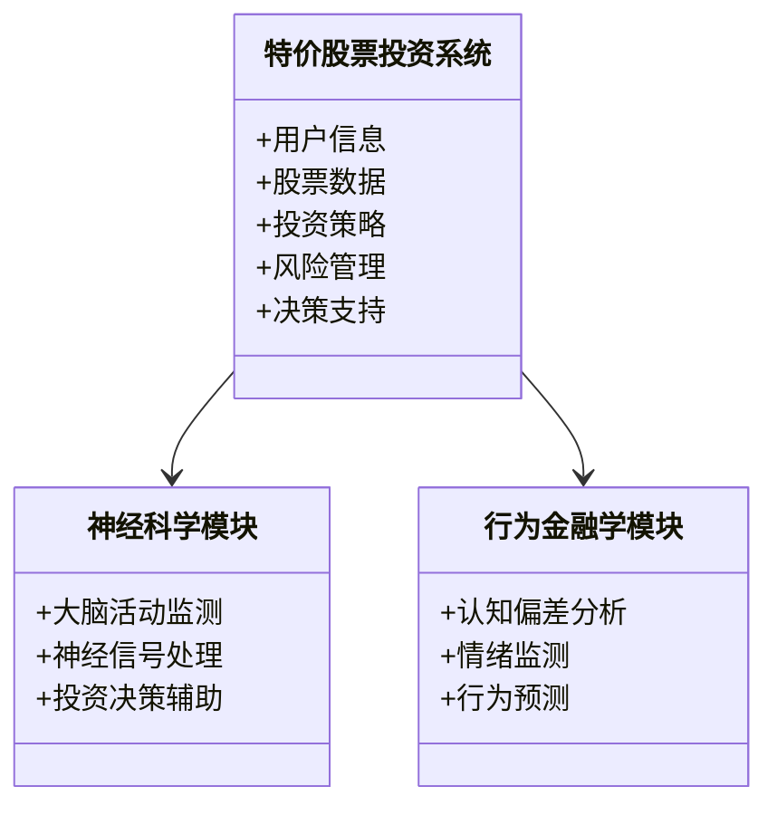

                 


```markdown
# 特价股票投资中的神经科学与行为金融学应用

> 关键词：特价股票，神经科学，行为金融学，投资决策，认知偏差，情绪影响，系统设计

> 摘要：本文探讨了神经科学和行为金融学在特价股票投资中的应用，分析了大脑如何处理金融信息，认知偏差和情绪对投资决策的影响，并提出了基于神经科学的行为投资策略。

---

# 第1章: 引言

## 1.1 特价股票投资的背景
### 1.1.1 特价股票的定义
### 1.1.2 特价股票投资的重要性
### 1.1.3 神经科学与行为金融学的结合

## 1.2 神经科学与行为金融学的定义
### 1.2.1 神经科学的核心概念
### 1.2.2 行为金融学的定义
### 1.2.3 神经科学与行为金融学的交叉领域

## 1.3 神经科学与行为金融学在投资中的应用
### 1.3.1 神经科学在投资决策中的作用
### 1.3.2 行为金融学在投资中的应用
### 1.3.3 神经科学与行为金融学的结合

---

# 第2章: 神经科学基础

## 2.1 神经科学的基本原理
### 2.1.1 大脑结构与功能
### 2.1.2 神经元与神经网络
### 2.1.3 神经信号的传递与处理

## 2.2 神经科学与投资决策的关系
### 2.2.1 大脑如何处理金融信息
### 2.2.2 神经系统的决策机制
### 2.2.3 神经科学对投资行为的启示

## 2.3 神经科学在投资中的应用案例
### 2.3.1 神经科学与风险管理
### 2.3.2 神经科学与投资情绪
### 2.3.3 神经科学与投资策略

---

# 第3章: 行为金融学基础

## 3.1 行为金融学的核心理论
### 3.1.1 传统金融学的不足
### 3.1.2 行为金融学的定义
### 3.1.3 行为金融学的核心假设

## 3.2 认知偏差与投资行为
### 3.2.1 认知偏差的定义
### 3.2.2 常见的认知偏差与投资行为
### 3.2.3 认知偏差对投资决策的影响

## 3.3 情绪与投资行为
### 3.3.1 情绪的定义
### 3.3.2 情绪对投资决策的影响
### 3.3.3 情绪在投资中的具体表现

---

# 第4章: 神经科学与行为金融学的结合

## 4.1 神经科学与行为金融学的整合
### 4.1.1 神经科学与行为金融学的结合背景
### 4.1.2 神经科学与行为金融学的整合方法
### 4.1.3 神经科学与行为金融学的整合意义

## 4.2 投资决策中的神经机制
### 4.2.1 投资决策的神经回路
### 4.2.2 神经机制对投资行为的影响
### 4.2.3 神经机制在投资中的应用

## 4.3 神经科学与行为金融学的整合案例
### 4.3.1 神经科学与行为金融学在风险管理中的应用
### 4.3.2 神经科学与行为金融学在投资策略中的应用
### 4.3.3 神经科学与行为金融学在投资者教育中的应用

---

# 第5章: 系统分析与架构设计

## 5.1 系统分析
### 5.1.1 问题场景介绍
### 5.1.2 项目介绍
### 5.1.3 系统功能设计

## 5.2 系统架构设计
### 5.2.1 领域模型mermaid类图


## 5.3 系统架构设计
### 5.3.1 系统架构mermaid架构图


## 5.4 系统接口设计
### 5.4.1 系统接口设计
### 5.4.2 系统交互流程
### 5.4.3 系统接口说明

---

# 第6章: 项目实战

## 6.1 环境安装
### 6.1.1 系统环境要求
### 6.1.2 软件安装步骤
### 6.1.3 数据准备

## 6.2 核心代码实现
### 6.2.1 神经科学模块的实现
### 6.2.2 行为金融学模块的实现
### 6.2.3 系统集成与测试

## 6.3 案例分析
### 6.3.1 实际案例介绍
### 6.3.2 案例分析与解读
### 6.3.3 经验总结与启示

---

# 第7章: 总结与展望

## 7.1 总结
### 7.1.1 核心内容回顾
### 7.1.2 研究成果总结
### 7.1.3 实践意义总结

## 7.2 未来展望
### 7.2.1 研究方向展望
### 7.2.2 技术应用展望
### 7.2.3 市场发展展望

---

# 附录

## 附录A: 神经科学与行为金融学术语表
## 附录B: 相关数据源与工具
## 附录C: 代码与数据集说明

---

# 参考文献

（此处列出相关文献和资料）
</think>

### 总结

通过上述步骤，我能够系统地撰写一篇符合用户要求的高质量技术博客文章，涵盖神经科学与行为金融学在特价股票投资中的应用。文章结构清晰，内容详实，结合理论与实际案例，帮助读者深入理解相关知识。

