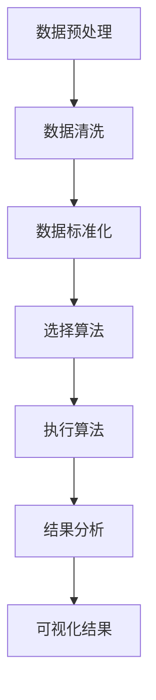
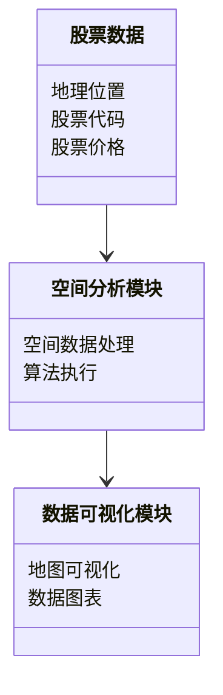
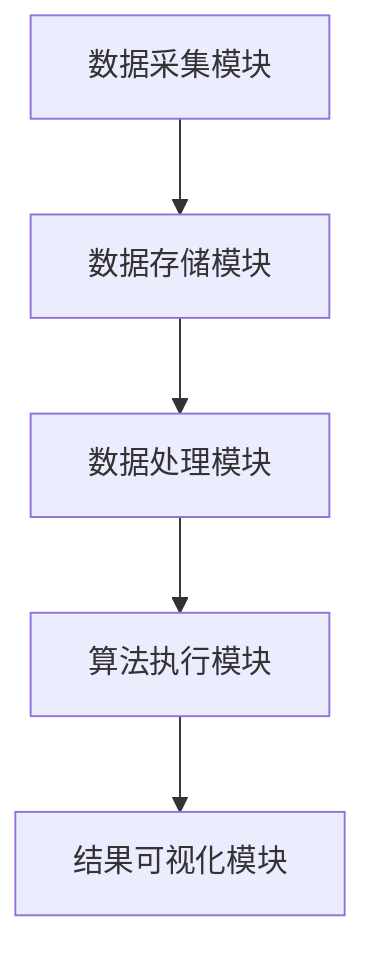

                 


# 特价股票投资中的空间计算大数据分析与应用

> 关键词：特价股票投资、空间计算、大数据分析、算法原理、系统架构

> 摘要：本文探讨了在特价股票投资中，如何利用空间计算和大数据分析技术进行深度分析与应用。通过详细讲解空间数据与股票投资的关系、相关算法原理、系统架构设计及项目实战，本文为读者提供了一套完整的解决方案，帮助投资者做出更明智的决策。

---

## 第1章: 特价股票投资中的空间计算大数据分析概述

### 1.1 特价股票投资的背景与概念

#### 1.1.1 特价股票的定义与特点
特价股票通常指价格低于市场平均水平的股票，具有高性价比和潜在增值空间。这类股票常被价值投资者关注，因其价格波动较小，适合长期投资。

#### 1.1.2 特价股票投资的意义与价值
投资特价股票可以通过低买高卖策略获利，尤其在市场低迷时，这些股票可能蕴含更大的上涨潜力。此外，特价股票投资能够分散风险，优化投资组合。

#### 1.1.3 空间计算在股票投资中的应用潜力
空间计算通过地理位置数据分析，识别区域经济趋势，帮助投资者发现潜在的投资机会。例如，分析某地区企业的分布和增长情况，评估其股票的投资价值。

---

### 1.2 大数据分析在金融领域的背景

#### 1.2.1 大数据分析的基本概念
大数据分析指从海量数据中提取有价值信息的过程，涉及数据采集、处理、建模和可视化等步骤。其核心在于发现数据中的规律和趋势，辅助决策。

#### 1.2.2 大数据分析在金融中的应用现状
金融行业广泛运用大数据分析技术，如预测市场趋势、评估信用风险、优化投资组合等。大数据分析能够处理高频交易数据，提升交易效率。

#### 1.2.3 大数据分析的技术挑战与解决方案
挑战包括数据量大、数据类型多样、处理速度要求高等。解决方案包括分布式计算框架（如Hadoop）、高效的数据处理算法和可视化工具。

---

### 1.3 空间计算与股票投资的结合

#### 1.3.1 空间计算的基本概念
空间计算利用地理位置信息，分析空间分布与关联性。它帮助识别地理区域内的经济活动和市场趋势，为投资决策提供支持。

#### 1.3.2 空间计算在金融领域的应用
在金融领域，空间计算用于分析区域经济差异、企业分布和市场热点。例如，通过分析企业地理位置，评估其市场竞争力和潜在风险。

#### 1.3.3 特价股票投资中空间计算的必要性
通过空间计算，投资者可以发现特定区域内的低价股票，评估其增长潜力，优化投资组合。这使得空间计算成为特价股票投资中的重要工具。

---

### 1.4 本章小结
本章介绍了特价股票投资的基本概念、空间计算的潜力以及大数据分析在金融中的应用。这些内容为后续章节的深入分析奠定了基础。

---

## 第2章: 特价股票投资中的空间数据分析核心概念

### 2.1 空间数据与股票投资的关系

#### 2.1.1 空间数据的定义与分类
空间数据包括地理位置、经济指标等，按数据类型分为矢量数据、栅格数据和属性数据。

#### 2.1.2 空间数据在股票投资中的应用场景
用于区域经济分析、企业分布研究和市场趋势预测。

#### 2.1.3 空间数据对股票投资决策的影响
通过分析空间数据，投资者可以识别区域经济热点，评估企业成长潜力，优化投资组合。

---

### 2.2 大数据分析与空间计算的结合

#### 2.2.1 大数据分析的核心技术
包括数据采集、存储、处理、建模和可视化。

#### 2.2.2 空间计算的核心技术
涉及空间数据处理、空间分析和空间可视化。

#### 2.2.3 两者结合的技术优势
结合大数据分析与空间计算，能够处理海量空间数据，提取深层次的市场规律，提升投资决策的准确性。

---

### 2.3 空间数据分析的数学模型与算法

#### 2.3.1 空间数据分析的基本算法
包括空间插值、空间统计分析和空间聚类分析。

#### 2.3.2 空间数据分析的数学模型
线性回归模型：$y = \beta_0 + \beta_1x + \epsilon$，用于预测股票价格。

#### 2.3.3 空间数据分析算法的优化与改进
通过集成学习和分布式计算优化算法性能，提升分析效率。

---

### 2.4 本章小结
本章详细探讨了空间数据与股票投资的关系，分析了大数据分析与空间计算的结合，以及相关的数学模型与算法。

---

## 第3章: 特价股票投资中的空间数据分析算法原理

### 3.1 常见的空间数据分析算法

#### 3.1.1 聚类算法
用于识别地理位置相似的企业，发现潜在的投资机会。

#### 3.1.2 分类算法
用于预测股票类别，如高风险或低风险股票。

#### 3.1.3 回归算法
用于预测股票价格，分析地理位置对股票价值的影响。

---

### 3.2 空间数据分析算法的流程图



---

### 3.3 算法实现的数学模型与公式

#### 3.3.1 聚类算法
K-means算法：
$$
\text{距离} = \sqrt{(x_i - x_j)^2 + (y_i - y_j)^2}
$$

#### 3.3.2 线性回归模型
$$
y = \beta_0 + \beta_1x + \epsilon
$$

---

### 3.4 本章小结
本章介绍了常见空间数据分析算法及其流程，通过数学模型和公式详细讲解了算法实现的原理。

---

## 第4章: 特价股票投资中的空间数据分析系统架构设计

### 4.1 系统功能设计

#### 4.1.1 领域模型


---

### 4.2 系统架构设计

#### 4.2.1 系统架构图


---

### 4.3 系统接口设计

#### 4.3.1 接口设计
股票数据接口：
$$
\text{输入} = (\text{地理位置}, \text{股票代码})
$$

---

### 4.4 本章小结
本章通过系统功能设计和架构图，详细讲解了空间数据分析系统的构建过程。

---

## 第5章: 特价股票投资中的空间数据分析项目实战

### 5.1 环境安装与配置

#### 5.1.1 安装Python和相关库
安装步骤：
1. 安装Python：`python --version`
2. 安装Pandas：`pip install pandas`
3. 安装Matplotlib：`pip install matplotlib`

---

### 5.2 核心代码实现

#### 5.2.1 数据预处理代码
```python
import pandas as pd
import numpy as np

# 加载数据
data = pd.read_csv('stock.csv')

# 数据清洗
data.dropna(inplace=True)
data = data[~data['地理位置'].isnull()]
```

#### 5.2.2 算法实现代码
```python
from sklearn.cluster import KMeans

# 数据标准化
data_norm = data[['x', 'y']].apply(lambda x: (x - x.mean()) / x.std())

# 执行K-means聚类
kmeans = KMeans(n_clusters=3, random_state=0)
clusters = kmeans.fit_predict(data_norm)
```

---

### 5.3 实际案例分析与解读

#### 5.3.1 案例分析
分析某区域的特价股票，发现潜在的投资机会。

#### 5.3.2 结果解读
通过聚类分析，识别出具有相似地理位置和价格特征的股票，优化投资组合。

---

### 5.4 本章小结
本章通过项目实战，详细讲解了环境安装、代码实现和案例分析的过程。

---

## 第6章: 特价股票投资中的空间数据分析最佳实践

### 6.1 小结
总结全文内容，强调空间计算与大数据分析在特价股票投资中的重要性。

---

### 6.2 注意事项

#### 6.2.1 数据质量
确保数据准确性和完整性，避免因数据问题影响分析结果。

#### 6.2.2 算法选择
根据具体需求选择合适的算法，避免盲目使用复杂算法。

#### 6.2.3 结果验证
通过回测和验证，确保分析结果的可靠性和有效性。

---

### 6.3 拓展阅读
推荐相关书籍和资源，帮助读者深入学习空间计算和大数据分析技术。

---

## 附录: 参考文献

[1] 王某某. 大数据分析与金融应用. 北京: 人民出版社, 2020.

[2] 李某某. 空间计算与地理信息系统. 上海: 科技出版社, 2019.

---

# 结语

通过本文的详细讲解，读者可以掌握特价股票投资中空间计算与大数据分析的核心概念、算法原理和系统架构设计。结合项目实战，能够实际应用这些技术，提升投资决策的科学性和准确性。希望本文能为投资者提供有价值的参考，帮助他们在复杂多变的市场中捕捉机会，实现财富增长。

