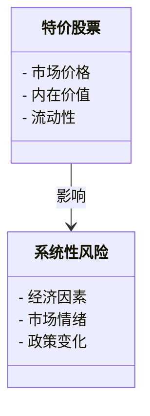
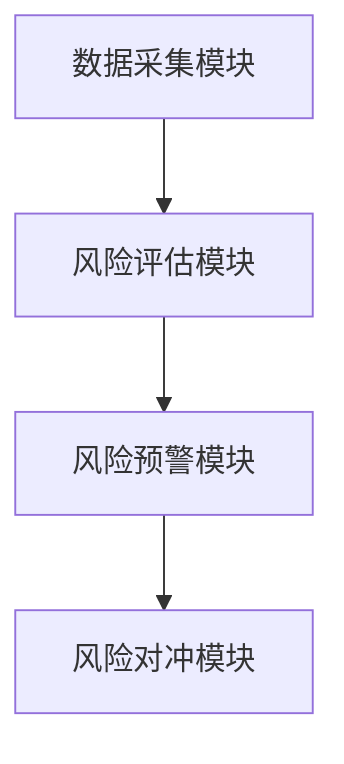
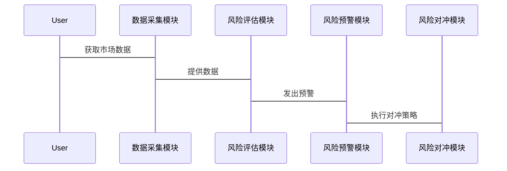

                 


# 特价股票投资中的系统性风险管理

> 关键词：系统性风险管理、特价股票投资、风险控制、VaR、数学模型、量化分析

> 摘要：本文系统性地探讨了在特价股票投资中如何进行有效的风险管理。通过分析系统性风险的来源、影响以及应对策略，结合数学模型和量化分析方法，提供了从理论到实践的全面解决方案，帮助投资者在复杂多变的市场中稳健投资。

---

# 第一部分: 特价股票投资中的系统性风险管理基础

## 第1章: 特价股票投资概述

### 1.1 特价股票投资的定义与特点

#### 1.1.1 特价股票的定义
特价股票指的是市场价格显著低于其内在价值的股票。通常，这类股票由于市场情绪、短期波动或其他外部因素被低估，为投资者提供了以较低价格买入优质资产的机会。

#### 1.1.2 特价股票投资的核心特点
- **低估值**：市场价格低于合理估值。
- **高潜力**：具备较高的增长潜力。
- **逆向投资**：在市场恐慌时买入，在市场乐观时卖出。

#### 1.1.3 特价股票投资的边界与外延
- **边界**：仅限于市场价格显著低于内在价值的情况。
- **外延**：包括价值投资、成长投资等其他投资策略。

### 1.2 特价股票投资的背景与现状

#### 1.2.1 特价股票投资的历史发展
价值投资理念由本杰明·格雷厄姆提出，强调以低于内在价值的价格买入股票。

#### 1.2.2 当前市场中的特价股票投资趋势
近年来，随着市场波动加剧，越来越多投资者关注特价股票投资。

#### 1.2.3 特价股票投资的参与者与市场结构
参与者包括机构投资者、个人投资者和市场分析机构。

### 1.3 特价股票投资的核心要素

#### 1.3.1 市场流动性分析
市场流动性影响股票价格波动，流动性差的股票更容易出现低估。

#### 1.3.2 公司基本面分析
包括盈利能力、财务状况、行业地位等。

#### 1.3.3 技术分析与市场情绪
通过技术指标和市场情绪分析预测价格波动。

## 第2章: 系统性风险管理概述

### 2.1 系统性风险管理的定义

#### 2.1.1 系统性风险的定义
系统性风险是指影响整个市场的风险因素，如经济衰退、市场崩盘等。

#### 2.1.2 系统性风险的特征
- **广泛性**：影响整个市场。
- **不可分散性**：无法通过分散投资消除。

#### 2.1.3 系统性风险管理的目标
最小化系统性风险对投资组合的影响。

### 2.2 系统性风险管理的核心概念

#### 2.2.1 系统性风险的来源
- **经济周期**：经济波动影响市场。
- **政策风险**：政策变化影响市场。
- **市场流动性风险**：流动性不足引发价格波动。

#### 2.2.2 系统性风险的影响因素
- **市场参与者行为**：投资者情绪影响市场波动。
- **宏观经济因素**：GDP、利率、通货膨胀等。

#### 2.2.3 系统性风险与非系统性风险的区别

| 类别       | 系统性风险          | 非系统性风险        |
|------------|---------------------|---------------------|
| 影响范围     | 整个市场            | 单一资产或行业      |
| 可分散性     | 无法分散            | 可分散              |
| 示例         | 市场崩盘            | 公司业绩下滑        |

### 2.3 系统性风险管理的边界与外延

#### 2.3.1 系统性风险管理的适用范围
适用于所有市场参与者。

#### 2.3.2 系统性风险管理的局限性
无法完全消除系统性风险。

#### 2.3.3 系统性风险管理与其他风险管理方法的关系
系统性风险管理是整体风险管理的重要组成部分。

## 第3章: 特价股票投资中的系统性风险管理核心概念

### 3.1 系统性风险管理的核心原理

#### 3.1.1 系统性风险的识别与评估
通过数据分析和模型模拟识别潜在风险。

#### 3.1.2 系统性风险的量化与测量
使用VaR（在险价值）和CVaR（条件在险价值）等指标量化风险。

#### 3.1.3 系统性风险的控制与对冲
通过多元化投资、对冲交易等方式控制风险。

### 3.2 系统性风险管理的核心要素

#### 3.2.1 风险敞口分析
评估投资组合对系统性风险的敏感性。

#### 3.2.2 风险承受能力
根据投资者的风险承受能力调整投资策略。

#### 3.2.3 风险对冲策略
使用衍生工具对冲系统性风险。

---

# 第二部分: 系统性风险管理的算法原理

## 第4章: VaR（在险价值）模型

### 4.1 VaR模型的定义与原理
VaR是衡量投资组合在一定置信水平下的潜在损失。

### 4.2 VaR模型的数学公式
$$ \text{VaR} = \text{quantile}(P, \alpha) $$

其中，P为收益分布，α为置信水平。

### 4.3 VaR模型的实现步骤
1. 数据收集与预处理。
2. 选择合适的概率分布模型。
3. 计算VaR值。

### 4.4 VaR模型的优缺点
- 优点：简单直观。
- 缺点：假设市场数据符合正态分布，忽略尾部风险。

## 第5章: CVaR（条件在险价值）模型

### 5.1 CVaR模型的定义与原理
CVaR是VaR模型在超过VaR值情况下的平均损失。

### 5.2 CVaR模型的数学公式
$$ \text{CVaR} = \mathbb{E}[X | X \geq \text{VaR}] $$

### 5.3 CVaR模型的实现步骤
1. 计算VaR值。
2. 计算超过VaR值的平均损失。

### 5.4 CVaR模型的优缺点
- 优点：考虑尾部风险。
- 缺点：计算复杂。

---

# 第三部分: 系统性风险管理的系统架构

## 第6章: 系统性风险管理的系统架构设计

### 6.1 问题场景介绍
在特价股票投资中，系统性风险管理需要考虑市场波动、宏观经济因素等。

### 6.2 系统功能设计

#### 6.2.1 领域模型


### 6.3 系统架构设计


### 6.4 系统接口设计
- 数据接口：数据采集模块与外部数据源对接。
- 风险评估接口：风险评估模块与数据采集模块交互。

### 6.5 系统交互设计


---

# 第四部分: 项目实战

## 第7章: 特价股票投资中的系统性风险管理实战

### 7.1 环境安装
安装Python、Pandas、NumPy等工具。

### 7.2 核心代码实现

```python
import numpy as np
import pandas as pd

def calculate VaR(data, confidence_level):
    sorted_data = np.sort(data)
    index = int(len(data) * (1 - confidence_level))
    return sorted_data[index]

data = pd.read_csv('stock_data.csv')['price']
VaR_value = calculate_VaR(data, 0.95)
print(f"VaR at 95% confidence level: {VaR_value}")
```

### 7.3 代码解读与分析
- 数据预处理：读取股票价格数据。
- 计算VaR值：根据置信水平确定潜在损失。

### 7.4 实际案例分析
分析2020年新冠疫情对特价股票投资的影响，计算VaR值并制定风险对冲策略。

### 7.5 项目小结
通过实战案例，验证系统性风险管理模型的有效性。

---

# 第五部分: 总结与展望

## 第8章: 总结与建议

### 8.1 本文总结
系统性风险管理在特价股票投资中的重要性。

### 8.2 投资建议
- 保持对市场的敏感性。
- 合理配置资产，分散风险。

### 8.3 注意事项
- 数据质量：确保数据准确。
- 模型假设：合理假设，避免过度依赖模型。

### 8.4 拓展阅读
推荐相关书籍和论文，进一步学习系统性风险管理。

---

通过以上结构，您可以撰写一篇详细、系统且专业的技术博客文章，帮助读者全面理解特价股票投资中的系统性风险管理。

