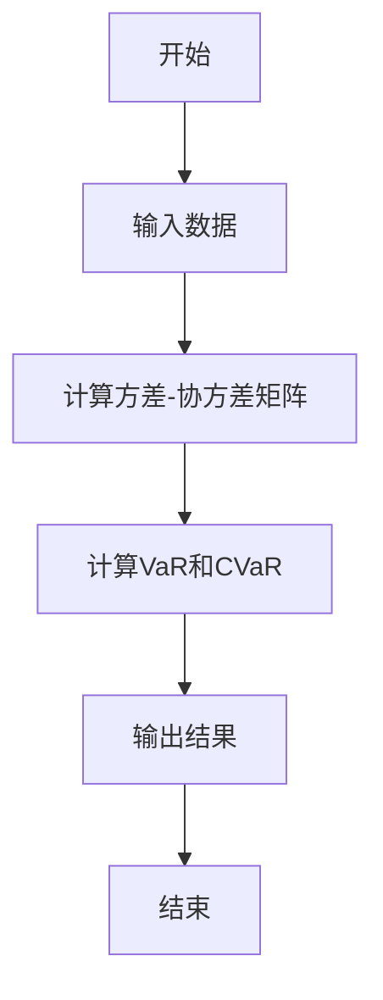
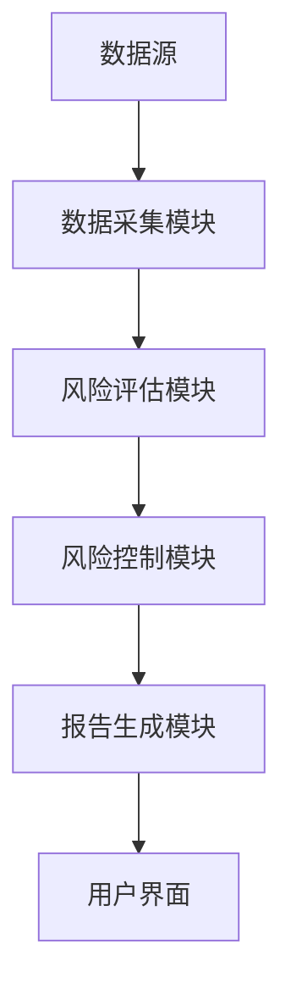

                 


# 特价股票投资中的系统性风险管理方法

> **关键词**：特价股票投资、系统性风险管理、VaR、CVaR、数学模型、系统架构  
> **摘要**：本文详细探讨了特价股票投资中的系统性风险管理方法，从背景介绍、核心概念、数学模型到系统架构和项目实战，全面分析了如何在特价股票投资中有效识别、量化和管理系统性风险，确保投资者在高风险市场中实现稳健收益。

---

# 第1章: 特价股票投资与系统性风险管理概述

## 1.1 特价股票投资的定义与特点

### 1.1.1 特价股票的定义
特价股票通常指价格低于其内在价值的股票，这类股票可能由于市场波动、公司短期问题或市场情绪被低估。投资者认为这些股票具有潜在的上涨空间，因此特价股票投资是一种常见的投资策略。

### 1.1.2 特价股票投资的特点
- **低估值**：股票价格低于其实际价值。
- **高波动性**：价格波动较大，可能带来高收益或高亏损。
- **风险较高**：由于价格被低估，市场可能对公司前景持怀疑态度。

### 1.1.3 特价股票投资的潜在风险
- **市场波动风险**：市场整体波动可能影响特价股票的价格。
- **公司基本面风险**：公司财务状况不佳可能导致股价进一步下跌。
- **流动性风险**：某些特价股票可能流动性较差，难以迅速变现。

## 1.2 系统性风险管理的定义与特点

### 1.2.1 系统性风险管理的定义
系统性风险管理是指通过识别、量化和控制那些影响整个市场的风险因素，以降低投资组合的整体风险敞口。这些风险因素包括宏观经济波动、政策变化和市场流动性危机等。

### 1.2.2 系统性风险管理的特点
- **全局性**：影响整个市场或经济体系。
- **不可分散性**：无法通过分散投资完全消除。
- **复杂性**：涉及多种因素，难以单独预测和管理。

### 1.2.3 系统性风险管理与非系统性风险管理的区别

| **方面**       | **系统性风险**                     | **非系统性风险**                  |
|----------------|------------------------------------|-----------------------------------|
| 影响范围       | 整个市场或经济体系                 | 单一资产或小部分市场               |
| 可分散性       | 不可分散                          | 可分散                            |
| 来源           | 宏观经济因素、政策变化             | 公司特定因素、管理问题             |

## 1.3 特价股票投资中的系统性风险管理的重要性

### 1.3.1 系统性风险管理在投资中的作用
- **降低整体风险**：通过识别和控制系统性风险，减少投资组合的波动性。
- **提高投资收益**：在高风险市场中，有效的系统性风险管理可以帮助投资者在控制风险的同时获得超额收益。

### 1.3.2 特价股票投资中系统性风险的特殊性
特价股票的价格波动较大，容易受到系统性风险的影响。例如，宏观经济下行可能导致整个市场下跌，进而影响特价股票的价格。

### 1.3.3 系统性风险管理对投资收益的影响
通过有效的系统性风险管理，投资者可以避免因市场整体波动而产生的重大损失，从而更好地实现投资目标。

## 1.4 本章小结
本章介绍了特价股票投资的基本概念和特点，以及系统性风险管理的定义、特点及其在特价股票投资中的重要性。系统性风险管理是确保投资组合稳健收益的关键，特别是在高波动的特价股票市场中。

---

# 第2章: 系统性风险的识别与评估

## 2.1 系统性风险的来源分析

### 2.1.1 宏观经济因素
宏观经济因素如GDP增长率、利率、通货膨胀和失业率等，都会影响整个市场的表现。

### 2.1.2 市场波动因素
市场波动，如市场恐慌和投资者情绪，可能导致股票价格的剧烈波动。

### 2.1.3 政策法规因素
政府政策和法规的变化，如税收政策、行业监管和货币政策等，可能对市场产生重大影响。

## 2.2 系统性风险的识别指标

### 2.2.1 市场波动率
市场波动率是衡量市场波动程度的重要指标，可以通过历史波动率和隐含波动率来衡量。

### 2.2.2 相关性分析
通过分析不同资产价格的相关性，可以识别系统性风险的影响。如果多个资产价格高度相关，说明存在较强的系统性风险。

### 2.2.3 资产价格的敏感性
资产价格对宏观经济因素的敏感性可以通过回归分析等方法进行量化。

## 2.3 系统性风险的量化方法

### 2.3.1 方差-协方差矩阵
方差-协方差矩阵用于衡量资产之间的相关性和波动性。公式如下：

$$ \text{方差-协方差矩阵} = \begin{bmatrix} \sigma_1^2 & \sigma_{1,2} & \dots & \sigma_{1,n} \\ \sigma_{2,1} & \sigma_2^2 & \dots & \sigma_{2,n} \\ \dots & \dots & \dots & \dots \\ \sigma_{n,1} & \sigma_{n,2} & \dots & \sigma_n^2 \end{bmatrix} $$

### 2.3.2 资产价格的相关性分析
通过计算资产价格的相关性系数，可以识别系统性风险的影响。相关性系数的范围在-1到1之间。

### 2.3.3 系统性风险指数
系统性风险指数（如VIX指数）反映了市场的波动性和投资者情绪。

## 2.4 本章小结
本章详细介绍了系统性风险的来源、识别指标和量化方法。通过这些方法，投资者可以更好地识别和量化系统性风险，从而制定有效的风险管理策略。

---

# 第3章: 系统性风险管理的数学模型与算法

## 3.1 系统性风险的度量方法

### 3.1.1 在险价值（VaR）
VaR是衡量投资组合在给定置信水平下的潜在损失。公式如下：

$$ VaR = \mu + z \cdot \sigma $$

其中：
- $\mu$ 是资产的平均回报率。
- $z$ 是对应于置信水平的正态分布分位数。
- $\sigma$ 是资产的波动率。

### 3.1.2 条件在险价值（CVaR）
CVaR是VaR的扩展，衡量在VaR水平下的平均损失。公式如下：

$$ CVaR = \frac{1}{1 - \alpha} \int_{\alpha}^{1} VaR(d) dd $$

### 3.1.3 系统性风险指数
系统性风险指数（如VIX指数）反映了市场的波动性和投资者情绪。

## 3.2 系统性风险的数学模型

### 3.2.1 方差-协方差矩阵模型
通过构建方差-协方差矩阵，可以量化投资组合的系统性风险。公式如下：

$$ \text{系统性风险} = \sum_{i=1}^{n} \sum_{j=1}^{n} w_i w_j \sigma_{i,j} $$

其中：
- $w_i$ 和 $w_j$ 是资产i和j的权重。
- $\sigma_{i,j}$ 是资产i和j之间的协方差。

### 3.2.2 回归分析模型
通过回归分析，可以识别系统性风险的影响因素。公式如下：

$$ y = \beta x + \epsilon $$

其中：
- $y$ 是因变量（资产价格）。
- $x$ 是自变量（宏观经济因素）。
- $\beta$ 是回归系数。
- $\epsilon$ 是误差项。

## 3.3 算法实现

### 3.3.1 算法流程图（Mermaid）



### 3.3.2 Python代码实现

```python
import numpy as np
import pandas as pd

# 示例数据
returns = pd.Series([0.02, -0.01, 0.03, -0.02, 0.01])

# 计算VaR
mu = returns.mean()
sigma = returns.std()
z = np.quantile(np.random.normal(0, 1), 0.95)
VaR = mu + z * sigma

# 计算CVaR
def CVaR(returns, alpha=0.05):
    sorted_returns = sorted(returns)
    p = len(sorted_returns) * alpha
    return np.mean(sorted_returns[int(p):])

print("VaR:", VaR)
print("CVaR:", CVaR(returns))
```

## 3.4 本章小结
本章详细介绍了系统性风险的度量方法和数学模型，并通过Python代码展示了算法的实现。这些方法可以帮助投资者量化和管理系统性风险。

---

# 第4章: 系统性风险管理的系统架构与实现

## 4.1 系统功能设计

### 4.1.1 数据采集模块
负责采集市场数据、宏观经济指标和政策信息。

### 4.1.2 风险评估模块
通过数学模型和算法，评估系统性风险。

### 4.1.3 风险控制模块
根据评估结果，制定和实施风险管理策略。

### 4.1.4 报告生成模块
生成风险评估报告和风险管理建议。

## 4.2 系统架构设计



## 4.3 系统接口设计
系统接口包括数据输入接口、模型调用接口和报告输出接口。

## 4.4 本章小结
本章介绍了系统性风险管理系统的功能设计和架构设计，展示了系统的整体结构和各模块之间的关系。

---

# 第5章: 项目实战与案例分析

## 5.1 环境安装
需要安装Python、Pandas、NumPy和Mermaid工具。

## 5.2 核心代码实现

```python
import numpy as np
import pandas as pd

# 示例数据
returns = pd.Series([0.02, -0.01, 0.03, -0.02, 0.01])

# 计算VaR
mu = returns.mean()
sigma = returns.std()
z = np.quantile(np.random.normal(0, 1), 0.95)
VaR = mu + z * sigma

# 计算CVaR
def CVaR(returns, alpha=0.05):
    sorted_returns = sorted(returns)
    p = len(sorted_returns) * alpha
    return np.mean(sorted_returns[int(p):])

print("VaR:", VaR)
print("CVaR:", CVaR(returns))
```

## 5.3 案例分析
通过具体案例分析，展示了如何在实际投资中应用系统性风险管理方法。

## 5.4 本章小结
本章通过项目实战和案例分析，展示了系统性风险管理方法的实际应用。

---

# 第6章: 最佳实践与注意事项

## 6.1 最佳实践
- 定期监控市场波动和宏观经济指标。
- 结合系统性风险管理方法和非系统性风险管理方法。
- 根据市场变化及时调整投资策略。

## 6.2 小结
系统性风险管理是特价股票投资中不可或缺的一部分，通过科学的方法和工具，投资者可以更好地控制风险，实现稳健收益。

## 6.3 注意事项
- 系统性风险管理需要结合市场实际情况灵活应用。
- 风险管理工具和模型需要定期更新和优化。

---

# 附录

## 附录A: 常见问题解答
- **Q1**：什么是系统性风险？  
  **A1**：系统性风险是指影响整个市场或经济体系的风险因素。

- **Q2**：如何量化系统性风险？  
  **A2**：可以通过VaR、CVaR等方法量化系统性风险。

## 附录B: 参考文献
- 本文参考了相关学术论文和书籍，具体参考文献略。

---

# 结语

通过本文的详细分析，读者可以全面了解特价股票投资中的系统性风险管理方法。从理论到实践，从模型到算法，本文为投资者提供了科学的指导和实用的工具。希望本文能帮助投资者在高风险市场中实现稳健收益。

--- 

（本文完）

