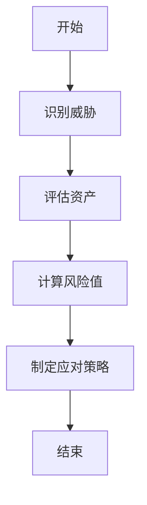
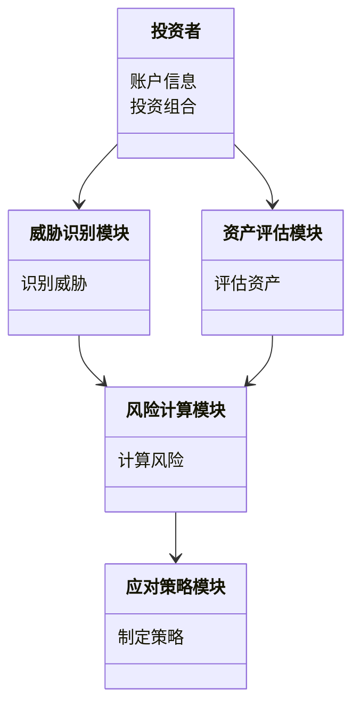
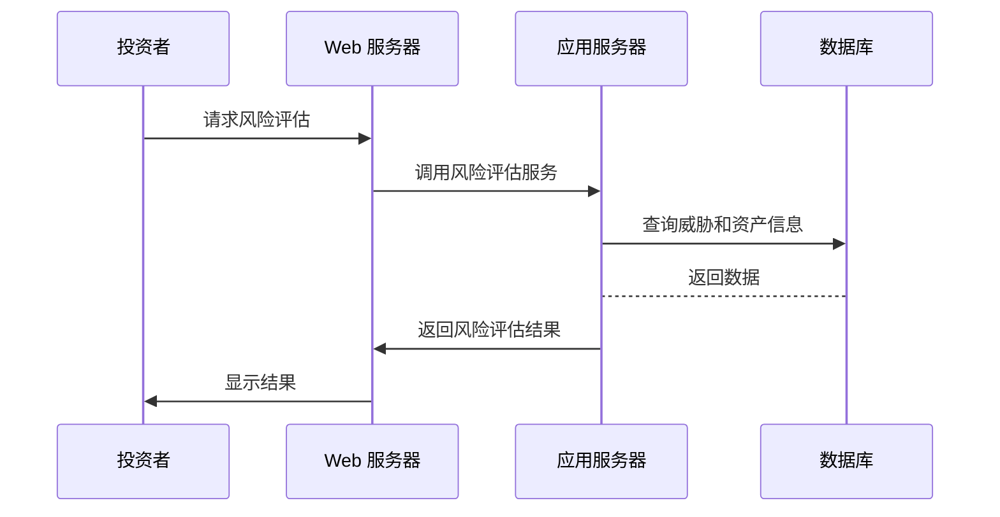

                 


# 特价股票投资中的网络安全风险评估方法

## 关键词：特价股票，网络安全，风险评估，投资策略，数据安全

## 摘要：本文详细探讨了在特价股票投资中面临的网络安全风险，并提出了系统化的评估方法。通过分析网络安全威胁，构建风险评估模型，并结合实际案例，提供有效的防范策略，帮助投资者确保信息安全和资金安全。

---

# 第一部分：特价股票投资中的网络安全风险概述

## 第1章：特价股票投资概述

### 1.1 特价股票的基本概念

#### 1.1.1 特价股票的定义
特价股票是指价格低于市场平均价格的股票，通常被认为具有较高的投资潜力。这类股票可能因市场低估或暂时性因素导致价格偏低，吸引投资者关注。

#### 1.1.2 特价股票的投资策略
投资者通常采用价值投资策略，寻找被市场低估的股票。这种策略要求投资者具备深入的市场分析能力和对个股基本面的了解。

#### 1.1.3 特价股票市场的特点
- 价格波动较大，市场流动性较低。
- 信息不对称，投资者可能难以获取准确的信息。
- 市场参与者多样，包括机构投资者和散户。

### 1.2 网络安全在股票投资中的重要性

#### 1.2.1 网络安全的基本概念
网络安全是指保护网络系统免受未经授权的访问、破坏、泄露等威胁。在金融领域，网络安全直接关系到投资者的资产安全和交易信息的保密性。

#### 1.2.2 特价股票投资中的网络安全威胁
- **数据泄露**：投资者的账户信息、交易记录可能被黑客窃取。
- **钓鱼攻击**：通过虚假网站或邮件诱导投资者泄露敏感信息。
- **恶意软件**：病毒或木马程序可能破坏计算机系统，导致数据丢失。

#### 1.2.3 网络安全对投资决策的影响
- 影响投资者对市场的判断，可能导致错误的投资决策。
- 数据泄露可能引发股价操纵，影响市场的公平性。

## 1.3 本章小结
本章介绍了特价股票的基本概念及其市场的特点，并强调了网络安全在投资中的重要性。网络安全威胁可能对投资者造成重大损失，因此需要系统化的风险评估方法。

---

## 第2章：网络安全风险概述

### 2.1 网络安全风险的定义

#### 2.1.1 风险的定义
风险是指在特定条件下，某一事件发生的可能性及其可能带来的损失。在网络安全中，风险通常与潜在的威胁和漏洞相关。

#### 2.1.2 网络安全风险的分类
- **技术风险**：如系统漏洞、数据泄露。
- **操作风险**：如人为错误、内部人员泄密。
- **合规风险**：如未能遵守数据保护法规。

#### 2.1.3 风险的量化方法
风险量化可以通过概率和损失程度的乘积来评估。例如，风险值 = 概率 × 影响。

### 2.2 网络安全风险评估的必要性

#### 2.2.1 风险评估的基本原则
- **全面性**：覆盖所有可能的威胁和漏洞。
- **准确性**：基于可靠的数据和方法进行评估。
- **及时性**：定期更新评估结果以应对新的威胁。

#### 2.2.2 风险评估的流程
1. 识别潜在威胁。
2. 评估资产的脆弱性。
3. 计算风险值。
4. 制定应对策略。

#### 2.2.3 风险评估的工具与方法
- **工具**：如 Nessus、OpenVAS 等漏洞扫描工具。
- **方法**：如威胁建模、风险矩阵等。

### 2.3 本章小结
本章详细介绍了网络安全风险的基本概念和分类，并提出了风险评估的必要性和流程。通过系统化的评估，可以有效降低投资风险。

---

## 第3章：特价股票投资中的网络安全风险评估方法论

### 3.1 风险评估的基本模型

#### 3.1.1 风险评估模型的构建
模型通常包括威胁识别、资产评估和风险计算三个步骤。

#### 3.1.2 风险评估模型的验证
通过实际案例验证模型的有效性，确保评估结果准确可靠。

#### 3.1.3 模型

### 3.2 网络安全风险评估的框架

#### 3.2.1 风险评估框架的构建
基于 ISO 27001 标准，构建包括风险识别、分析和应对的框架。

#### 3.2.2 风险评估框架的实施
- **步骤一**：识别关键资产。
- **步骤二**：评估威胁和漏洞。
- **步骤三**：计算风险值。
- **步骤四**：制定应对措施。

### 3.3 本章小结
本章提出了基于 ISO 27001 标准的网络安全风险评估框架，并详细介绍了模型的构建和实施步骤。

---

# 第4章：网络安全风险评估的算法原理

## 4.1 算法原理概述

### 4.1.1 算法概述
常用的风险评估算法包括基于概率的方法和基于规则的方法。

### 4.1.2 算法流程图



### 4.1.3 算法实现

```python
def calculateRisk(threats, assets):
    risk = {}
    for threat in threats:
        for asset in assets:
            risk_value = probability(threat) * impact(asset)
            risk[(threat, asset)] = risk_value
    return risk

def probability(threat):
    # 示例：基于历史数据计算威胁发生的概率
    return 0.1 * threat.count()

def impact(asset):
    # 示例：基于资产价值计算影响程度
    return 0.1 * asset.value()
```

## 4.2 算法的数学模型

### 4.2.1 概率模型

$$ \text{风险值} = \sum_{i=1}^{n} P_i \times I_i $$

其中，\( P_i \) 是第 \( i \) 个威胁发生的概率，\( I_i \) 是其影响程度。

### 4.2.2 实例分析

假设某资产面临两个威胁，威胁1的概率为0.3，影响为0.5；威胁2的概率为0.2，影响为0.8。风险值为：

$$ 0.3 \times 0.5 + 0.2 \times 0.8 = 0.15 + 0.16 = 0.31 $$

## 4.3 本章小结
本章详细介绍了网络安全风险评估的算法原理，并通过示例展示了算法的实现过程。

---

# 第5章：网络安全风险评估的系统分析与架构设计

## 5.1 系统分析

### 5.1.1 项目背景
本项目旨在为特价股票投资者提供网络安全风险评估服务，确保投资决策的安全性。

### 5.1.2 项目介绍
构建一个基于网络的安全风险评估系统，帮助投资者识别和应对潜在的网络安全威胁。

## 5.2 系统功能设计

### 5.2.1 系统功能模块
- **威胁识别模块**：识别潜在的网络安全威胁。
- **资产评估模块**：评估投资者的资产及其脆弱性。
- **风险计算模块**：计算每个威胁的风险值。
- **应对策略模块**：制定应对措施。

### 5.2.2 系统功能设计的领域模型



## 5.3 系统架构设计

### 5.3.1 系统架构设计


### 5.3.2 系统接口设计
- **API 接口**：提供 RESTful API，供投资者调用风险评估服务。
- **用户界面**：提供直观的 Web 界面，方便投资者使用。

### 5.3.3 系统交互流程



## 5.4 本章小结
本章详细描述了网络安全风险评估系统的架构设计和功能模块，为后续的项目实施奠定了基础。

---

# 第6章：网络安全风险评估的项目实战

## 6.1 项目环境安装

### 6.1.1 环境需求
- 操作系统：Linux 或 Windows。
- 开发工具：Python、Jupyter Notebook。
- 数据库：MySQL 或 PostgreSQL。

### 6.1.2 安装步骤
```bash
pip install flask
pip install pandas
pip install numpy
```

## 6.2 核心实现源代码

### 6.2.1 数据预处理代码

```python
import pandas as pd

def preprocess_data(data):
    # 删除缺失值
    data = data.dropna()
    # 标准化数据
    data = (data - data.mean()) / data.std()
    return data
```

### 6.2.2 模型训练代码

```python
from sklearn.model_selection import train_test_split
from sklearn.linear_model import LogisticRegression

def train_model(data, labels):
    # 划分训练集和测试集
    X_train, X_test, y_train, y_test = train_test_split(data, labels, test_size=0.2)
    # 训练模型
    model = LogisticRegression().fit(X_train, y_train)
    return model
```

## 6.3 项目小结
本章通过具体的代码实现，展示了网络安全风险评估系统的实际应用，帮助读者理解如何将理论应用于实践。

---

# 第7章：网络安全风险评估的最佳实践与小结

## 7.1 最佳实践

### 7.1.1 数据隐私保护
确保投资者数据的安全存储和传输，采用加密技术保护敏感信息。

### 7.1.2 定期更新评估方法
随着网络安全威胁的演变，需要定期更新风险评估模型和方法。

### 7.1.3 培训与教育
对投资者进行网络安全意识培训，提高他们的防范意识和能力。

## 7.2 本章小结
本章总结了网络安全风险评估的最佳实践，并强调了持续改进和培训的重要性。

---

# 总结

本文系统地探讨了特价股票投资中的网络安全风险评估方法，从背景介绍到实际案例，详细讲解了相关概念、算法和系统设计。通过本文的指导，投资者可以更好地识别和应对网络安全威胁，确保投资决策的安全性和可靠性。未来的研究可以进一步优化评估模型，探索更先进的安全技术，为投资者提供更全面的保护。

