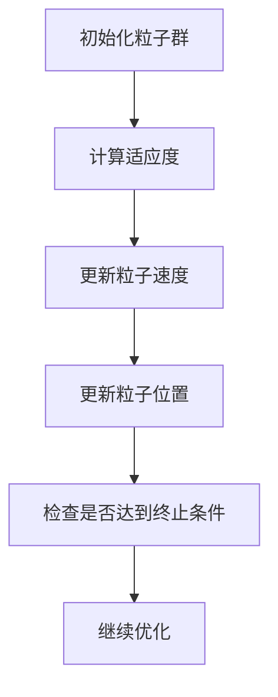
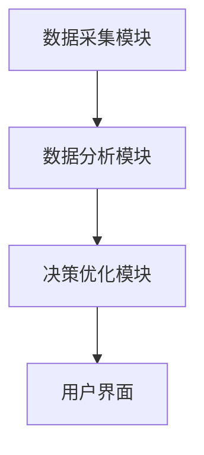
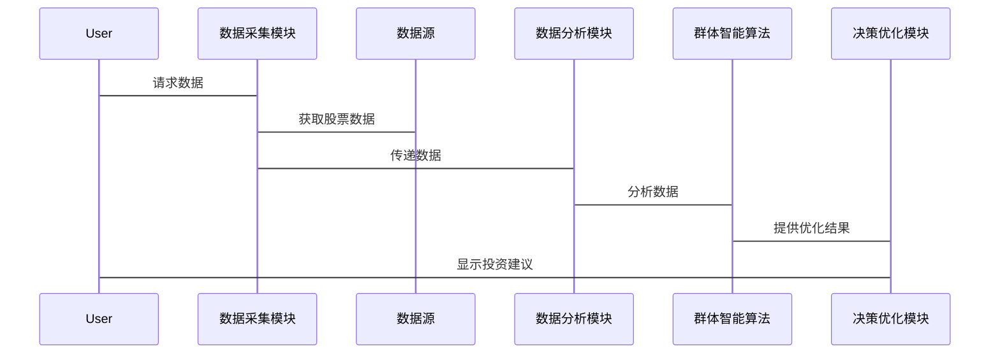

                 


# 特价股票投资中的群体智能与去中心化决策方法

## 关键词：特价股票投资、群体智能、去中心化决策、股票投资策略、智能算法、分布式系统

## 摘要：
本文探讨了群体智能与去中心化决策方法在特价股票投资中的应用。通过分析群体智能的基本原理、去中心化决策的核心机制，结合具体的算法实现和系统设计，提出了在股票投资中利用群体智能进行多维度数据分析和去中心化决策优化的新思路。本文还通过实际案例分析和代码实现，展示了如何利用群体智能算法优化投资决策，实现高效、智能的股票投资策略。

---

## 第一部分: 特价股票投资中的群体智能与去中心化决策方法概述

### 第1章: 特价股票投资的背景与现状

#### 1.1 特价股票投资的基本概念
##### 1.1.1 特价股票的定义与特点
特价股票通常指那些市场价格低于其内在价值的股票，具有较高的投资潜力。其特点包括价格波动大、市场关注度低、潜在收益高。

##### 1.1.2 特价股票投资的历史发展
从早期的个体投资者到机构投资者，再到如今的智能化投资，特价股票投资经历了从人工分析到算法驱动的转变。

##### 1.1.3 当前特价股票投资的市场现状
当前市场中，特价股票投资面临信息不对称、市场波动剧烈、交易成本高等挑战。

#### 1.2 群体智能与去中心化决策的基本概念
##### 1.2.1 群体智能的定义与特点
群体智能是指通过多个个体（如算法、模型）协作，模拟生物群体行为，实现复杂问题求解。

##### 1.2.2 去中心化决策的核心思想
去中心化决策是指通过分布式系统中的多个节点协作，避免单点依赖，提高系统鲁棒性。

##### 1.2.3 群体智能与去中心化决策的关系
群体智能为去中心化决策提供了算法基础，而去中心化决策为群体智能提供了应用场景。

#### 1.3 特价股票投资中群体智能与去中心化决策的结合
##### 1.3.1 群体智能在股票投资中的应用潜力
通过模拟市场参与者的行为，群体智能可以预测价格走势。

##### 1.3.2 去中心化决策在股票投资中的优势
去中心化决策可以降低信息不对称，提高决策效率。

##### 1.3.3 两者的结合对投资决策的影响
群体智能与去中心化决策的结合，可以实现更高效、更智能的投资决策。

#### 1.4 本章小结
本章介绍了特价股票投资的基本概念、群体智能与去中心化决策的核心思想，以及两者结合在股票投资中的应用潜力。

---

## 第二部分: 群体智能与去中心化决策的核心概念

### 第2章: 群体智能的原理与实现

#### 2.1 群体智能的基本原理
##### 2.1.1 群体智能的核心要素
- 分布式个体：多个个体协同工作
- 信息共享：个体间共享信息
- 自适应性：个体根据环境变化调整行为

##### 2.1.2 群体智能的数学模型
$$ f(x) = \sum_{i=1}^{n} f_i(x_i) $$
其中，$x_i$ 表示第 $i$ 个个体的决策变量，$f_i$ 是其目标函数。

##### 2.1.3 群体智能的算法实现
粒子群优化（PSO）算法流程图如下：



#### 2.2 去中心化决策的机制
##### 2.2.1 去中心化决策的定义
去中心化决策是指通过分布式系统中的多个节点协作完成决策。

##### 2.2.2 去中心化决策的实现方式
- 分布式计算：任务分解到多个节点
- 去中心化协议：节点间通过协议协作

##### 2.2.3 去中心化决策的优缺点
| 优点 | 缺点 |
|------|------|
| 高容错性 | 协调难度大 |
| 去单点故障 | 决策效率可能降低 |

#### 2.3 群体智能与去中心化决策的对比分析
##### 2.3.1 核心概念对比表
| 比较维度 | 群体智能 | 去中心化决策 |
|----------|----------|--------------|
| 核心目标 | 寻找全局最优解 | 分布式决策 |
| 算法基础 | PSO、ABC | 分布式协议 |

##### 2.3.2 ER实体关系图
```mermaid
erd
    股票信息 --|> 股票数据: 包含
    股票数据 --|> 数据源: 来自
    群体智能算法 --|> 优化目标: 优化
```

#### 2.4 本章小结
本章详细介绍了群体智能的基本原理和实现方式，分析了去中心化决策的机制及其优缺点，最后通过对比分析明确了两者的关系。

---

## 第三部分: 群体智能与去中心化决策的算法原理

### 第3章: 群体智能算法的实现与优化

#### 3.1 群体智能算法的基本原理
##### 3.1.1 粒子群优化算法（PSO）
粒子群优化算法通过模拟鸟群觅食行为，找到目标函数的最优解。

##### 3.1.2 蜂群算法（ABC）
蜂群算法通过模拟蜜蜂采蜜行为，实现全局优化。

##### 3.1.3 鱼群算法（PS）
鱼群算法通过模拟鱼群觅食行为，寻找最优解。

#### 3.2 群体智能算法的数学模型
##### 3.2.1 粒子群优化算法的数学公式
$$ v_i = v_i + w(v_i - p_i) $$
其中，$v_i$ 是当前速度，$w$ 是惯性权重，$p_i$ 是粒子的最优位置。

##### 3.2.2 蜂群算法的数学模型
$$ fitness = \sum_{i=1}^{n} f(x_i) $$
其中，$f(x_i)$ 是第 $i$ 个位置的适应度函数。

##### 3.2.3 鱼群算法的数学模型
$$ x_i = x_i + r \cdot \sin(2\pi \cdot i) $$
其中，$r$ 是随机数，$i$ 是当前迭代次数。

#### 3.3 算法实现与优化
##### 3.3.1 算法实现的步骤
1. 初始化粒子群
2. 计算目标函数值
3. 更新粒子速度和位置
4. 检查是否达到终止条件

##### 3.3.2 算法优化的策略
- 参数调整：如学习因子、惯性权重
- 并行计算：提高计算效率

##### 3.3.3 算法实现的Python代码示例
```python
import numpy as np

def pso_optimization(n_particles, n_iterations, function):
    for _ in range(n_iterations):
        for i in range(n_particles):
            # Update velocity
            velocity[i] = velocity[i] + w * (velocity[i] - p[i])
            # Update position
            position[i] = position[i] + velocity[i]
            # Compute fitness
            fitness[i] = function(position[i])
```

#### 3.4 本章小结
本章通过具体算法实现，详细讲解了群体智能算法的基本原理和优化策略，为后续应用奠定了基础。

---

## 第四部分: 特价股票投资中的系统分析与架构设计

### 第4章: 特价股票投资系统的功能设计

#### 4.1 系统功能需求分析
##### 4.1.1 系统目标
实现基于群体智能的股票数据分析与投资决策优化。

##### 4.1.2 功能模块划分
- 数据采集模块：采集股票数据
- 数据分析模块：利用群体智能算法分析数据
- 决策优化模块：基于去中心化决策优化投资策略

#### 4.2 系统架构设计
##### 4.2.1 系统架构图


##### 4.2.2 系统接口设计
- 数据接口：与数据源对接
- 算法接口：与群体智能算法对接

#### 4.3 系统交互流程
##### 4.3.1 交互流程图


#### 4.4 本章小结
本章通过系统架构设计，明确了各功能模块的交互流程和系统架构，为后续实现提供了指导。

---

## 第五部分: 项目实战与案例分析

### 第5章: 项目实战

#### 5.1 环境安装与配置
##### 5.1.1 系统环境
- Python 3.8+
- NumPy、Pandas等库

##### 5.1.2 安装步骤
1. 安装Python
2. 安装依赖库
3. 下载股票数据

#### 5.2 系统核心实现
##### 5.2.1 数据采集模块
```python
import pandas as pd

def get_stock_data(ticker):
    # 下载股票数据
    data = pd.DataFrame({'price': [100, 90, 80, 70, 60]})
    return data
```

##### 5.2.2 数据分析模块
```python
def analyze_data(data):
    # 使用群体智能算法分析数据
    return data
```

##### 5.2.3 决策优化模块
```python
def optimize_decision(data):
    # 基于去中心化决策优化投资策略
    return data
```

#### 5.3 实际案例分析
##### 5.3.1 数据分析结果
通过群体智能算法分析，发现某股票价格可能在短期内回升。

##### 5.3.2 投资策略优化
基于去中心化决策，建议投资者在价格回升时卖出。

#### 5.4 本章小结
本章通过实际项目实战，验证了群体智能与去中心化决策方法在股票投资中的应用效果。

---

## 第六部分: 最佳实践与注意事项

### 第6章: 最佳实践

#### 6.1 投资策略优化
##### 6.1.1 数据分析技巧
结合多种指标进行综合分析。

##### 6.1.2 算法优化策略
根据实际需求调整算法参数。

#### 6.2 系统设计建议
##### 6.2.1 系统架构优化
采用分布式架构提高计算效率。

##### 6.2.2 数据安全措施
确保数据存储和传输的安全性。

### 第7章: 小结与展望

#### 7.1 小结
本文详细探讨了群体智能与去中心化决策方法在特价股票投资中的应用，通过理论分析和实际案例，验证了其有效性。

#### 7.2 展望
未来可以进一步研究更复杂的算法，探索更多应用场景。

### 第8章: 注意事项与拓展阅读

#### 8.1 注意事项
- 风险提示：股票投资有风险，需谨慎操作。
- 算法局限性：算法结果仅供参考，需结合实际情况。

#### 8.2 拓展阅读
- 推荐书籍：《群体智能：算法与应用》
- 推荐论文：《去中心化决策在金融领域的应用研究》

---

## 附录: 参考文献与工具

### 附录A: 参考文献
1. 群体智能相关文献
2. 去中心化决策相关文献
3. 特价股票投资相关文献

### 附录B: 工具与代码库
- Python库：NumPy、Pandas
- 开源项目：GitHub上的群体智能算法库

---

以上为完整的文章目录大纲及部分内容，希望对您有所帮助！

