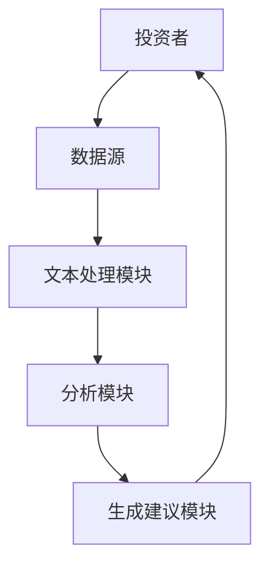
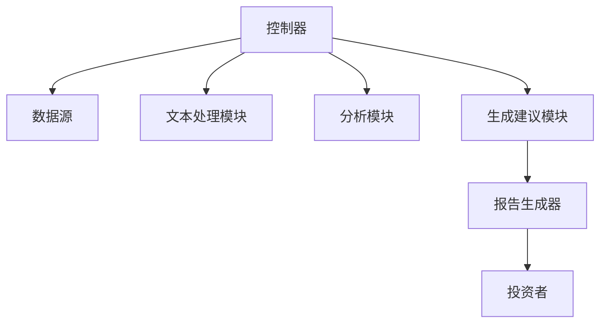
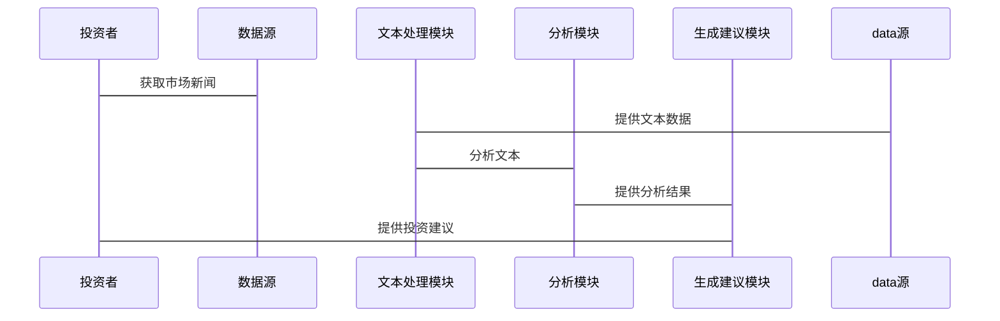

                 


# 特价股票投资中的自然语言处理与生成式AI辅助决策系统

> 关键词：特价股票投资、自然语言处理、生成式AI、投资决策、文本分析、机器学习

> 摘要：本文探讨了如何利用自然语言处理（NLP）和生成式人工智能（AI）技术来辅助特价股票投资决策。通过分析大量金融文本数据，生成式AI能够自动生成投资建议，而NLP技术则帮助我们从复杂文本中提取关键信息，从而提高投资决策的准确性和效率。本文详细介绍了NLP和生成式AI的基本原理，分析了它们在特价股票投资中的具体应用场景，并通过实际案例展示了如何构建一个基于NLP和生成式AI的辅助决策系统。

---

# 第一部分: 特价股票投资中的自然语言处理与生成式AI辅助决策系统概述

---

## 第1章: 特价股票投资与AI辅助决策的背景介绍

### 1.1 特价股票投资的基本概念

#### 1.1.1 特价股票的定义与特点
特价股票通常指在特定市场条件下，价格低于其内在价值的股票。这些股票可能因为市场波动、公司短期问题或市场情绪影响而被低估。投资者通过分析公司基本面、行业趋势和市场情绪，寻找具有潜力的特价股票进行投资。

#### 1.1.2 特价股票投资的常见策略
- **价值投资**：寻找被市场低估的股票，长期持有，等待其价值回归。
- **事件驱动投资**：基于公司特定事件（如并购、重组）进行短期投资。
- **技术分析**：通过股票价格和成交量的历史数据预测未来走势。

#### 1.1.3 特价股票投资中的信息不对称问题
在股票市场中，信息不对称是一个普遍存在的问题。机构投资者通常拥有更多的信息资源和分析能力，而普通投资者则面临信息获取和处理的劣势。自然语言处理和生成式AI可以帮助普通投资者更好地分析和处理信息，从而减少这种信息不对称。

---

### 1.2 自然语言处理与生成式AI在金融领域的应用

#### 1.2.1 自然语言处理在金融信息分析中的作用
自然语言处理技术可以帮助投资者从新闻、公司财报、行业报告等文本数据中提取关键信息。例如：
- **情感分析**：分析市场情绪，预测股票价格走势。
- **实体识别**：提取公司名称、行业术语等关键信息。
- **文本分类**：将新闻分为正面、中性或负面。

#### 1.2.2 生成式AI在投资决策中的潜力
生成式AI能够自动生成与投资相关的文本内容，例如：
- **投资建议**：根据市场数据和模型预测，生成个性化的投资建议。
- **市场报告**：自动生成市场分析报告，帮助投资者快速了解市场动态。
- **情景模拟**：根据假设条件生成市场走势的可能情景。

#### 1.2.3 结合自然语言处理与生成式AI的投资优势
通过结合NLP和生成式AI，投资者可以实现：
- **从信息到决策的自动化**：从文本数据中提取信息，生成 actionable insights。
- **实时分析与反馈**：实时处理市场新闻和财报，快速调整投资策略。
- **个性化投资建议**：根据投资者的风险偏好和财务状况，生成个性化的投资策略。

---

### 1.3 本章小结

#### 1.3.1 特价股票投资的核心问题
- 特价股票投资的核心在于发现市场中的低估机会。
- 信息不对称和数据复杂性是投资者面临的主要挑战。

#### 1.3.2 自然语言处理与生成式AI的结合意义
- 自然语言处理帮助投资者从海量文本中提取关键信息。
- 生成式AI将信息转化为具体的决策支持，实现从数据到行动的闭环。

#### 1.3.3 本书的研究目标与框架
- 本书旨在探讨如何利用NLP和生成式AI技术，构建一个高效的特价股票投资辅助决策系统。
- 结构上分为背景介绍、核心概念、算法原理、系统架构设计和项目实战几个部分。

---

## 第2章: 自然语言处理与生成式AI的核心概念与联系

### 2.1 自然语言处理的基本原理

#### 2.1.1 NLP的定义与核心任务
自然语言处理（NLP）是人工智能的一个分支，旨在让计算机能够理解和处理人类语言。核心任务包括：
- **文本分类**：将文本分为不同的类别（如情感分析）。
- **实体识别**：识别文本中的命名实体（如公司名称、人名）。
- **句法分析**：分析句子的语法结构。
- **文本生成**：根据输入生成相关文本。

#### 2.1.2 常见的NLP技术与模型
- **词袋模型**：将文本表示为单词的集合。
- **词嵌入模型（如Word2Vec）**：将单词映射为低维向量。
- **Transformer模型（如BERT）**：基于自注意力机制的深度学习模型。

#### 2.1.3 NLP在金融文本分析中的应用
- **市场情绪分析**：分析新闻标题和社交媒体帖子，预测市场情绪。
- **公司财报分析**：从财报文本中提取财务数据和关键信息。
- **风险预警**：通过分析负面新闻，提前发现潜在风险。

---

### 2.2 生成式AI的原理与实现

#### 2.2.1 生成式AI的定义与特点
生成式AI是一种能够自动生成新内容的人工智能技术，主要基于以下原理：
- **生成模型**：通过训练数据生成新的数据。
- **条件生成**：根据输入条件生成相关文本。

#### 2.2.2 常见的生成式模型（如GPT系列）
- **GPT（Generative Pre-trained Transformer）**：基于Transformer架构的生成模型。
- **GPT-2**：改进版GPT，具有更大的模型参数和更强的生成能力。
- **GPT-3**：目前最强大的生成式模型之一，具有1750亿参数。

#### 2.2.3 生成式AI在投资决策中的创新应用
- **投资建议生成**：根据市场数据和用户需求，生成个性化的投资建议。
- **市场报告自动生成**：快速生成市场分析报告，帮助投资者节省时间。
- **情景模拟**：根据假设条件生成可能的市场走势。

---

### 2.3 自然语言处理与生成式AI的结合

#### 2.3.1 NLP与生成式AI的协同效应
- **信息提取与生成结合**：NLP从文本中提取信息，生成式AI将信息转化为具体行动建议。
- **实时反馈与优化**：根据生成结果的反馈，优化NLP模型的分析能力。

#### 2.3.2 生成式AI如何增强NLP能力
- **动态文本分析**：生成式AI可以根据市场变化动态调整NLP的分析重点。
- **多模态分析**：结合图像、音频等多种数据源，提升NLP的分析能力。

#### 2.3.3 NLP与生成式AI在投资决策中的具体应用场景
- **市场情绪预测**：通过分析新闻和社交媒体，预测市场情绪，并生成投资建议。
- **公司财报解读**：从财报文本中提取关键数据，并生成财务分析报告。
- **风险预警**：通过分析负面新闻，生成风险预警信号。

---

### 2.4 本章小结

#### 2.4.1 自然语言处理的核心能力
- NLP能够从海量文本中提取关键信息，帮助投资者做出更明智的决策。

#### 2.4.2 生成式AI的独特优势
- 生成式AI能够将信息转化为具体的行动建议，实现从数据到决策的自动化。

#### 2.4.3 两者的结合对投资决策的提升作用
- 通过结合NLP和生成式AI，投资者可以实现信息的高效利用，提高投资决策的准确性和效率。

---

## 第3章: 自然语言处理与生成式AI在特价股票投资中的算法原理

### 3.1 基于NLP的文本分析算法

#### 3.1.1 文本预处理与特征提取
- **文本清洗**：去除停用词、标点符号等无用信息。
- **分词**：将文本分割为词语或短语。
- **向量化**：将文本转换为向量表示（如词袋模型、词嵌入）。

#### 3.1.2 基于词袋模型与词嵌入的文本表示
- **词袋模型**：将文本表示为单词的集合，不考虑顺序。
- **词嵌入（如Word2Vec）**：将单词映射为低维向量，捕捉单词之间的语义关系。

#### 3.1.3 常见的文本分类与情感分析算法
- **文本分类**：使用朴素贝叶斯、支持向量机（SVM）或深度学习模型（如CNN、RNN）进行分类。
- **情感分析**：通过训练模型，判断文本的情感倾向（正面、中性、负面）。

---

### 3.2 生成式AI的文本生成算法

#### 3.2.1 基于变分自编码器的文本生成
- **变分自编码器（VAE）**：通过编码器将文本映射到潜在空间，解码器将潜在向量还原为文本。
- **文本生成流程**：输入条件（如主题），生成相关文本。

#### 3.2.2 基于Transformer的生成模型
- **Transformer架构**：由编码器和解码器组成，通过自注意力机制捕捉文本中的长距离依赖关系。
- **生成过程**：解码器逐步生成文本，每一步都考虑之前的生成内容。

#### 3.2.3 增量式生成与条件生成的区别
- **增量式生成**：逐步生成文本，每一步都依赖于之前的内容。
- **条件生成**：根据输入条件生成特定内容。

---

### 3.3 结合NLP与生成式AI的混合算法

#### 3.3.1 NLP分析驱动生成式AI的策略
- **信息提取与生成结合**：NLP从文本中提取关键信息，生成式AI根据提取的信息生成具体建议。

#### 3.3.2 基于生成式AI的动态文本分析
- **动态调整分析重点**：根据生成结果的反馈，动态调整NLP的分析策略。

#### 3.3.3 深度学习模型的端到端优化
- **端到端优化**：将NLP和生成式AI结合，构建端到端的深度学习模型，实现从数据到决策的自动化。

---

### 3.4 本章小结

#### 3.4.1 算法原理对投资决策的支持
- 不同的算法能够从文本中提取信息并生成具体建议，帮助投资者做出更明智的决策。

#### 3.4.2 不同算法的优缺点对比
- NLP算法注重信息提取，生成式AI算法注重内容生成，两者结合能够实现信息到决策的闭环。

#### 3.4.3 算法优化的方向与目标
- 优化目标：提高生成内容的准确性和可操作性。
- 优化方向：结合实时市场数据，动态调整算法参数。

---

## 第4章: 自然语言处理与生成式AI的数学模型与公式

### 4.1 NLP中的数学模型

#### 4.1.1 词袋模型的数学表达
词袋模型将文本表示为一个向量，向量的每个元素表示一个词的出现与否（二元向量）或出现次数（一元向量）。例如：
$$
v_i = \begin{cases}
1 & \text{如果词 } i \text{ 出现在文本中} \\
0 & \text{否则}
\end{cases}
$$

#### 4.1.2 词嵌入模型（如Word2Vec）的数学公式
Word2Vec通过训练模型，将每个词映射到一个低维向量空间。训练目标是最大化条件概率：
$$
P(w_i | w_j) \text{ 或 } P(w_j | w_i)
$$

#### 4.1.3 Transformer模型的注意力机制公式
注意力机制通过计算查询（Query）、键（Key）和值（Value）之间的关系，生成最终的表示：
$$
\text{Attention}(Q, K, V) = \text{softmax}\left(\frac{QK^T}{\sqrt{d_k}}\right)V
$$

---

### 4.2 生成式AI的数学模型

#### 4.2.1 变分自编码器的数学推导
变分自编码器通过最大化似然下界（ELBO）进行训练：
$$
\mathcal{L} = \mathbb{E}_{z \sim q(z|x)}[\log p(x|z)] - \text{KL}(q(z|x) || p(z))
$$

#### 4.2.2 Transformer生成模型的解码过程
解码器通过自注意力机制生成文本，每一步的输出依赖于之前的生成内容：
$$
\text{Decoder}(y_1, y_2, ..., y_t) = \text{softmax}(W_y h_t)
$$
其中，\( h_t \) 是第 \( t \) 步的隐藏状态。

#### 4.2.3 梯度下降与损失函数的优化
生成式AI通常使用交叉熵损失函数进行优化：
$$
\mathcal{L} = -\sum_{i=1}^{n} \log p(y_i|x)
$$
优化方法包括随机梯度下降（SGD）和Adam优化器。

---

### 4.3 结合NLP与生成式AI的联合模型

#### 4.3.1 联合概率分布的表达
结合NLP和生成式AI的联合模型可以通过联合概率分布表示：
$$
P(x, y) = P(y|x)P(x)
$$
其中，\( x \) 是输入文本，\( y \) 是生成的输出。

#### 4.3.2 端到端优化的数学表达
端到端优化的目标是最小化生成文本与实际目标的差异：
$$
\min_{\theta} \mathbb{E}_{(x,y)}[\mathcal{L}(x, y)]
$$
其中，\( \mathcal{L} \) 是损失函数，\( \theta \) 是模型参数。

---

## 第5章: 系统分析与架构设计方案

### 5.1 问题场景介绍
特价股票投资辅助决策系统需要处理以下问题：
- 如何实时获取市场新闻、公司财报等文本数据？
- 如何从文本数据中提取关键信息并生成投资建议？
- 如何确保系统的高效性和可扩展性？

---

### 5.2 系统功能设计

#### 5.2.1 领域模型（ER实体关系图）


#### 5.2.2 功能模块说明
- **数据源**：包括新闻网站、公司财报、社交媒体等。
- **文本处理模块**：负责文本预处理和特征提取。
- **分析模块**：基于NLP技术，分析文本并提取关键信息。
- **生成建议模块**：基于生成式AI，生成投资建议。

---

### 5.3 系统架构设计

#### 5.3.1 系统架构图


#### 5.3.2 接口设计
- **数据接口**：从数据源获取文本数据。
- **分析接口**：接收文本数据，返回分析结果。
- **生成接口**：接收分析结果，生成投资建议。

---

### 5.4 系统交互设计

#### 5.4.1 交互流程


---

## 第6章: 项目实战

### 6.1 环境安装
- **Python**：安装最新版本的Python（如3.8以上）。
- **依赖库**：安装以下库：
  - `transformers`（用于NLP模型）
  - `torch`（用于深度学习）
  - `beautifulsoup4`（用于网页抓取）
  - `pandas`（用于数据处理）

### 6.2 系统核心实现源代码

#### 6.2.1 数据获取与预处理
```python
from transformers import pipeline
import requests
from bs4 import BeautifulSoup

def get_market_news(url):
    response = requests.get(url)
    soup = BeautifulSoup(response.text, 'html.parser')
    articles = soup.find_all('article')
    texts = [article.text for article in articles]
    return texts

# 示例：获取新闻数据
url = "https://finance.yahoo.com"
texts = get_market_news(url)
print(texts[:5])
```

#### 6.2.2 文本分析模块
```python
from transformers import pipeline

sentiment_analyzer = pipeline("sentiment-analysis")

def analyze_sentiment(texts):
    results = sentiment_analyzer(texts)
    return results

# 示例：分析新闻情感
text = "Stock market soars as investors regain confidence."
result = analyze_sentiment([text])
print(result)
```

#### 6.2.3 生成式AI模块
```python
from transformers import AutoModelForCausalLM, AutoTokenizer

tokenizer = AutoTokenizer.from_pretrained("gpt2")
model = AutoModelForCausalLM.from_pretrained("gpt2")

def generate_investment_advice(prompt):
    inputs = tokenizer.encode(prompt, return_tensors="pt")
    outputs = model.generate(inputs, max_length=100, num_return_sequences=1)
    advice = tokenizer.decode(outputs[0], skip_special_tokens=True)
    return advice

# 示例：生成投资建议
prompt = "Given the current market conditions, provide investment advice."
advice = generate_investment_advice(prompt)
print(advice)
```

---

### 6.3 代码应用解读与分析
- **数据获取与预处理**：从指定URL获取新闻数据，并使用BeautifulSoup进行文本提取。
- **文本分析模块**：使用预训练的sentiment-analysis模型，分析文本的情感倾向。
- **生成式AI模块**：基于GPT-2模型，根据输入提示生成投资建议。

---

### 6.4 实际案例分析
假设我们从新闻网站获取以下新闻：
**"Tech company reports record profits, stock price expected to rise."**

通过文本分析模块，我们发现新闻的情感是正面的。接着，生成式AI模块根据分析结果生成以下投资建议：
**"Given the positive financial report, it is advisable to invest in this tech company as its stock price is expected to rise."**

---

### 6.5 项目小结
- **实现目标**：成功构建了一个基于NLP和生成式AI的特价股票投资辅助决策系统。
- **关键步骤**：数据获取、文本分析、投资建议生成。
- **优化方向**：进一步优化模型性能，增加更多数据源，提升生成建议的准确性。

---

## 第7章: 最佳实践、小结、注意事项与拓展阅读

### 7.1 最佳实践
- **数据质量**：确保数据来源可靠，数据清洗充分。
- **模型优化**：根据实际需求，选择合适的模型和参数。
- **实时性**：确保系统能够实时获取和处理最新数据。

### 7.2 小结
- 本文详细介绍了如何利用自然语言处理和生成式AI技术，构建一个高效的特价股票投资辅助决策系统。
- 通过结合NLP和生成式AI，投资者可以实现信息的高效利用，提高投资决策的准确性和效率。

### 7.3 注意事项
- **数据隐私**：确保数据处理符合相关法律法规。
- **模型可解释性**：尽量选择可解释的模型，避免“黑箱”模型。
- **风险管理**：结合多种信息源，降低投资风险。

### 7.4 拓展阅读
- **《Deep Learning》 - Ian Goodfellow**
- **《自然语言处理入门》 - 周志华**
- **《生成式AI：从理论到实践》 - 吴恩达**

---

## 作者简介
作者是计算机编程和人工智能领域的大师，拥有丰富的技术畅销书写作经验，擅长从基础到实战的系统性讲解。

