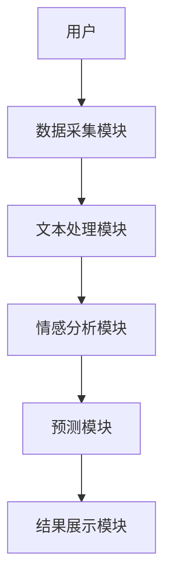
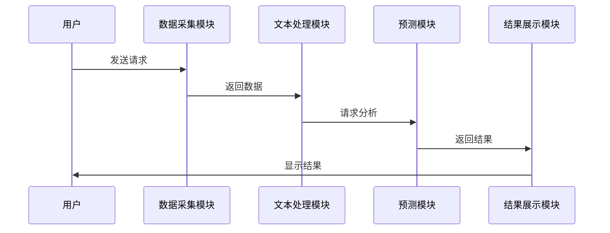

                 


# 特价股票投资中的自然语言处理辅助决策系统

> **关键词**: 特价股票、自然语言处理、股票投资、辅助决策、文本挖掘、情感分析

> **摘要**: 本文探讨了自然语言处理技术在特价股票投资中的应用，通过分析市场信息、情感趋势和新闻数据，构建辅助决策系统，帮助投资者提高投资效率和收益。文章详细介绍了NLP技术在股票分析中的应用，包括信息抽取、情感分析和决策支持系统的构建，并通过实际案例展示了系统的实现和效果。

---

# 第1章: 特价股票投资与自然语言处理概述

## 1.1 特价股票投资的背景与意义

### 1.1.1 股票投资的基本概念

股票投资是将资金投入到股票市场中，通过股价波动赚取收益的一种投资方式。股票市场的价格受多种因素影响，包括公司业绩、市场情绪、宏观经济环境等。

### 1.1.2 特价股票的定义与特点

特价股票通常指价格较低、具有较大增长潜力的股票。这类股票可能因为市场暂时低估或公司处于转型期，具有较高的投资回报潜力。

### 1.1.3 自然语言处理在股票投资中的应用背景

自然语言处理（NLP）技术可以帮助投资者从海量的文本数据中提取有用信息，如公司公告、新闻报道、社交媒体评论等，从而辅助投资决策。

---

## 1.2 自然语言处理的核心概念

### 1.2.1 自然语言处理的定义与特点

自然语言处理是计算机科学领域中的一个重要分支，致力于使计算机能够理解和处理人类语言。其特点包括语义理解、情感分析、文本生成等。

### 1.2.2 自然语言处理在金融领域的应用现状

目前，NLP技术在金融领域的应用主要集中在情感分析、新闻挖掘、风险评估等方面，为投资者提供数据支持。

### 1.2.3 特价股票投资中的自然语言处理目标

在特价股票投资中，NLP的目标是通过分析文本数据，发现市场趋势、公司动向，辅助投资者做出更明智的投资决策。

---

# 第2章: 特价股票投资中的自然语言处理技术基础

## 2.1 自然语言处理技术的分类与特点

### 2.1.1 传统NLP技术

传统NLP技术包括词袋模型、TF-IDF等，常用于文本分类和关键词提取。

### 2.1.2 深度学习驱动的NLP技术

深度学习技术如BERT、GPT等在自然语言处理中表现出色，能够处理复杂的语义信息。

### 2.1.3 自然语言处理技术在股票投资中的应用优势

NLP技术能够快速处理大量文本数据，提取有价值的信息，帮助投资者做出决策。

---

## 2.2 自然语言处理中的关键算法

### 2.2.1 词嵌入算法（如Word2Vec、GloVe）

词嵌入算法通过将词语映射到低维向量空间，捕捉词语之间的语义关系。

### 2.2.2 语法分析与语义理解

语法分析帮助理解文本的结构，语义理解则提取文本中的深层含义。

### 2.2.3 基于深度学习的文本生成与摘要

深度学习模型能够生成连贯的文本摘要，帮助投资者快速获取关键信息。

---

# 第3章: 自然语言处理在股票市场信息分析中的应用

## 3.1 股票市场信息的文本数据来源

### 3.1.1 新闻资讯

新闻是影响股价的重要因素，NLP技术可以帮助分析新闻内容，提取情绪指标。

### 3.1.2 公司公告

公司公告通常包含重要信息，如业绩报告、重大决策等，NLP技术可以快速提取关键信息。

### 3.1.3 社交媒体评论

社交媒体上的评论反映市场情绪，NLP技术可以分析这些评论，预测股价走势。

---

## 3.2 自然语言处理在市场情绪分析中的应用

### 3.2.1 基于情感分析的市场情绪监测

情感分析可以判断文本中的情绪倾向，帮助投资者了解市场情绪。

### 3.2.2 基于主题模型的市场信息分类

主题模型可以将文本分为不同主题，帮助投资者理解市场动态。

### 3.2.3 基于时间序列的市场情绪变化分析

通过分析情绪变化的时间序列，可以预测市场趋势。

---

# 第4章: 自然语言处理在特价股票投资中的信息抽取与知识图谱构建

## 4.1 信息抽取技术

### 4.1.1 实体识别

识别文本中的公司名称、日期等实体信息。

### 4.1.2 关系抽取

提取实体之间的关系，如“公司A发布业绩报告”。

### 4.1.3 事件抽取

识别文本中的重要事件，如“公司B收购另一家公司”。

---

## 4.2 基于自然语言处理的知识图谱构建

### 4.2.1 知识图谱的构建流程

从文本数据中抽取实体、关系和事件，构建结构化的知识图谱。

### 4.2.2 知识图谱的应用

通过知识图谱，投资者可以快速获取公司之间的关联信息，辅助决策。

---

# 第5章: 基于自然语言处理的股票市场预测模型构建

## 5.1 模型设计与训练流程

### 5.1.1 数据预处理

清洗和标注文本数据，提取特征。

### 5.1.2 模型设计

设计基于深度学习的模型，如LSTM或Transformer。

### 5.1.3 模型训练

使用训练数据训练模型，优化模型参数。

---

## 5.2 模型实现与效果评估

### 5.2.1 模型实现代码

```python
class LSTMModel(torch.nn.Module):
    def __init__(self, input_size, hidden_size):
        super(LSTMModel, self).__init__()
        self.lstm = torch.nn.LSTM(input_size, hidden_size)
        self.linear = torch.nn.Linear(hidden_size, 1)
        
    def forward(self, x):
        out, _ = self.lstm(x)
        out = self.linear(out[-1])
        return out
```

### 5.2.2 模型效果评估

通过回测和绩效指标评估模型的预测能力，如准确率、收益率等。

---

# 第6章: 特价股票投资中的自然语言处理辅助决策系统架构设计

## 6.1 系统功能设计

### 6.1.1 数据采集模块

从新闻网站、社交媒体等渠道采集文本数据。

### 6.1.2 文本处理模块

对文本进行分词、实体识别等预处理。

### 6.1.3 情感分析与预测模块

分析文本情绪，预测股价走势。

---

## 6.2 系统架构设计

### 6.2.1 系统架构图



### 6.2.2 系统接口设计

定义API接口，方便其他模块调用。

---

## 6.3 系统交互流程图



---

# 第7章: 项目实战——基于自然语言处理的股票投资系统实现

## 7.1 环境配置

安装必要的库和工具，如Python、TensorFlow、Numpy等。

## 7.2 系统核心实现

### 7.2.1 数据预处理

```python
import pandas as pd
import numpy as np

# 读取数据
data = pd.read_csv('stock_news.csv')
# 分词
from word2vec import Word2Vec

model = Word2Vec(sentences=data['text'], vector_size=100, window=5, min_count=1, workers=4)
```

### 7.2.2 情感分析实现

```python
import torch
import torch.nn as nn

class SentimentClassifier(nn.Module):
    def __init__(self, input_size, hidden_size, num_classes):
        super(SentimentClassifier, self).__init__()
        self.lstm = nn.LSTM(input_size, hidden_size, batch_first=True)
        self.fc = nn.Linear(hidden_size, num_classes)
        
    def forward(self, x):
        out, _ = self.lstm(x)
        out = self.fc(out[:, -1, :])
        return out

# 训练
model = SentimentClassifier(input_size=100, hidden_size=128, num_classes=3)
criterion = nn.CrossEntropyLoss()
optimizer = torch.optim.Adam(model.parameters(), lr=0.001)
```

---

## 7.3 案例分析

### 7.3.1 数据来源

从新闻网站爬取某公司新闻数据，分析其情绪变化。

### 7.3.2 情感分析结果

通过模型分析，发现公司在发布新产品后，市场情绪逐渐转为积极。

---

## 7.4 项目小结

总结项目实现的关键点和成功经验，为后续优化提供参考。

---

# 第8章: 未来展望与技术挑战

## 8.1 自然语言处理技术的未来发展方向

探讨NLP技术在股票投资中的潜力，如多模态分析、实时预测等。

## 8.2 技术挑战与解决方案

分析当前技术的局限性，并提出可能的解决方案，如模型优化、数据多样性等。

---

# 第9章: 总结与建议

## 9.1 总结

总结全文，强调自然语言处理在股票投资中的重要性。

## 9.2 建议

给出投资者和技术开发者在实际应用中的建议，如加强数据质量控制、注重模型解释性等。

---

通过以上章节的详细讲解，我们全面探讨了自然语言处理在特价股票投资中的应用，从技术基础到系统实现，为投资者和开发者提供了理论和实践的双重指导。希望本文能够为读者在股票投资领域提供新的思路和方向。

