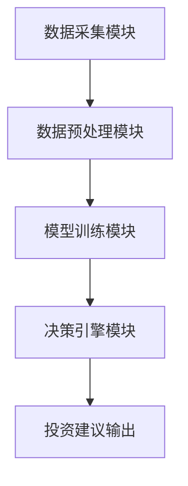

                 


# 特价股票投资中的自然语言理解辅助决策系统

> **关键词**：自然语言处理，股票投资，情感分析，实体识别，文本挖掘，决策支持系统

> **摘要**：本文详细探讨了如何利用自然语言理解技术辅助特价股票投资决策。通过分析股票市场中的文本数据，结合自然语言处理技术，构建一个智能化的决策支持系统，帮助投资者更高效地进行股票分析和投资决策。文章从背景、核心概念、算法原理、系统架构到项目实战，全面阐述了自然语言理解在股票投资中的应用，为投资者提供了新的视角和工具。

---

## 第一部分: 特价股票投资中的自然语言理解辅助决策系统概述

### 第1章: 特价股票投资的背景与挑战

#### 1.1 特价股票投资的背景

##### 1.1.1 特价股票的定义与特点
特价股票是指市场价格低于其内在价值的股票，通常被认为是被市场低估的投资机会。其特点包括：
- 价格低廉，适合中小投资者参与。
- 具有较大的增值潜力，但同时也伴随着较高的风险。

##### 1.1.2 特价股票投资的市场现状
当前股票市场信息量庞大，投资者需要从海量的新闻、公告、社交媒体等文本数据中提取有用信息，以做出决策。然而，传统的人工分析方法效率低下，且容易受到主观因素的影响。

##### 1.1.3 特价股票投资的挑战与机遇
- **挑战**：市场信息复杂且分散，难以快速提取关键信息；投资者情绪波动大，容易受到市场情绪的影响；信息滞后性问题。
- **机遇**：通过自然语言处理技术，可以高效地从非结构化文本中提取有用信息，帮助投资者做出更明智的决策。

#### 1.2 自然语言理解技术的发展

##### 1.2.1 自然语言理解技术的定义
自然语言理解（NLU）是指计算机能够理解人类语言的能力，旨在让计算机能够像人类一样理解和分析文本数据。

##### 1.2.2 自然语言理解技术的核心技术发展
- **词嵌入技术**：如Word2Vec、GloVe，将词语转化为低维向量，便于计算机处理。
- **注意力机制**：如Transformer模型，能够捕捉文本中的长距离依赖关系。
- **序列模型**：如LSTM、GRU，适合处理序列数据，如时间序列分析。

##### 1.2.3 自然语言理解技术在金融领域的应用
- **信息抽取**：从新闻、公告中提取公司财务数据、市场动态等。
- **情感分析**：分析市场情绪，判断投资者对某只股票的态度是正面、负面还是中性。
- **实体识别**：识别文本中的公司名称、人物、日期等实体信息。

#### 1.3 特价股票投资与自然语言理解的结合

##### 1.3.1 特价股票投资中信息的重要性
投资者需要及时获取公司财务数据、市场新闻、行业趋势等信息，以判断股票的价值。

##### 1.3.2 自然语言理解技术在信息处理中的优势
- **高效性**：能够快速处理海量文本数据。
- **准确性**：通过机器学习算法，提高信息提取的准确性。
- **实时性**：可以实时监控市场动态，及时发现投资机会。

##### 1.3.3 两者的结合对投资决策的辅助作用
通过自然语言理解技术，投资者可以更高效地获取和分析市场信息，从而做出更科学的投资决策。

---

### 第2章: 自然语言理解辅助决策系统的概念与框架

#### 2.1 自然语言理解辅助决策系统的核心概念

##### 2.1.1 系统的整体架构
自然语言理解辅助决策系统主要包括以下几个模块：
- **数据采集模块**：从新闻网站、社交媒体等渠道获取文本数据。
- **数据预处理模块**：对文本数据进行清洗、分词、去停用词等处理。
- **模型训练模块**：使用机器学习算法训练情感分析、实体识别等模型。
- **决策引擎模块**：根据模型输出结果，生成投资建议。

##### 2.1.2 系统的核心功能模块
- **信息抽取模块**：从文本中提取公司名称、财务数据等信息。
- **情感分析模块**：分析市场情绪，判断投资者对某只股票的态度。
- **实体识别模块**：识别文本中的公司名称、人物、日期等实体信息。
- **决策支持模块**：根据模型输出结果，生成投资建议。

##### 2.1.3 系统的输入与输出
- **输入**：文本数据（如新闻、公告、社交媒体帖子）。
- **输出**：情感分析结果、实体识别结果、投资建议。

#### 2.2 自然语言理解技术在系统中的应用

##### 2.2.1 文本信息抽取
通过自然语言处理技术，从新闻、公告中提取公司财务数据、市场动态等信息。

##### 2.2.2 情感分析
分析市场情绪，判断投资者对某只股票的态度是正面、负面还是中性。

##### 2.2.3 实体识别
识别文本中的公司名称、人物、日期等实体信息。

#### 2.3 系统的决策逻辑与流程

##### 2.3.1 数据采集与预处理
- **数据采集**：从新闻网站、社交媒体等渠道获取文本数据。
- **数据预处理**：对文本数据进行清洗、分词、去停用词等处理。

##### 2.3.2 模型训练与优化
- **模型训练**：使用机器学习算法训练情感分析、实体识别等模型。
- **模型优化**：通过调整超参数、优化模型结构等方式提高模型性能。

##### 2.3.3 决策输出与反馈
- **决策输出**：根据模型输出结果，生成投资建议。
- **反馈**：根据市场实际表现，调整模型参数，优化系统性能。

---

### 第3章: 系统的核心算法与数学模型

#### 3.1 自然语言理解的核心算法

##### 3.1.1 词嵌入算法
- **Word2Vec**：通过上下文预测单词，生成词向量。
- **GloVe**：通过全局词向量，生成词向量。

##### 3.1.2 注意力机制
- **Transformer模型**：通过自注意力机制，捕捉文本中的长距离依赖关系。

##### 3.1.3 序列模型
- **LSTM**：长短期记忆网络，适合处理序列数据。
- **GRU**：门控循环单元，简化版的LSTM。

#### 3.2 金融时间序列分析的数学模型

##### 3.2.1 金融时间序列的基本特性
- **趋势性**：股票价格的长期走势。
- **周期性**：股票价格的周期性波动。
- **随机性**：股票价格的随机波动。

##### 3.2.2 马尔可夫链模型
- **定义**：一种描述系统状态转移的数学模型。
- **应用**：用于预测股票价格的未来走势。

##### 3.2.3 长短期记忆网络（LSTM）
- **定义**：一种特殊的循环神经网络，适合处理长序列数据。
- **应用**：用于股票价格预测。

#### 3.3 情感分析的数学模型

##### 3.3.1 情感分类的特征提取
- **词袋模型**：将文本表示为词袋，提取特征。
- **词嵌入模型**：使用词嵌入技术，提取文本特征。

##### 3.3.2 基于深度学习的情感分类模型
- **CNN模型**：卷积神经网络，适合处理文本序列数据。
- **RNN模型**：循环神经网络，适合处理序列数据。

##### 3.3.3 情感分析的数学公式与实现
- **损失函数**：交叉熵损失函数。
- **优化算法**：Adam优化算法。
- **模型训练**：使用训练数据训练模型，调整超参数，优化模型性能。

---

### 第4章: 系统的架构设计与实现

#### 4.1 系统的整体架构

##### 4.1.1 系统架构图


##### 4.1.2 系统功能模块
- **数据采集模块**：从新闻网站、社交媒体等渠道获取文本数据。
- **数据预处理模块**：对文本数据进行清洗、分词、去停用词等处理。
- **模型训练模块**：使用机器学习算法训练情感分析、实体识别等模型。
- **决策引擎模块**：根据模型输出结果，生成投资建议。

#### 4.2 系统的交互流程

##### 4.2.1 用户输入
- **输入**：用户输入需要分析的文本数据（如新闻、公告）。

##### 4.2.2 系统处理
- **数据预处理**：对文本数据进行清洗、分词、去停用词等处理。
- **模型训练**：使用机器学习算法训练情感分析、实体识别等模型。
- **决策引擎**：根据模型输出结果，生成投资建议。

##### 4.2.3 系统输出
- **输出**：情感分析结果、实体识别结果、投资建议。

#### 4.3 系统的实现细节

##### 4.3.1 数据采集模块的实现
- **实现**：使用爬虫技术从新闻网站、社交媒体等渠道获取文本数据。
- **代码示例**：
  ```python
  import requests
  from bs4 import BeautifulSoup

  def fetch_data(url):
      response = requests.get(url)
      soup = BeautifulSoup(response.text, 'html.parser')
      return soup.text
  ```

##### 4.3.2 数据预处理模块的实现
- **实现**：使用NLTK库进行文本分词、去停用词等处理。
- **代码示例**：
  ```python
  from nltk import word_tokenize
  from nltk.corpus import stopwords

  def preprocess(text):
      tokens = word_tokenize(text)
      filtered = [token for token in tokens if token.lower() not in stopwords.words('english')]
      return ' '.join(filtered)
  ```

##### 4.3.3 模型训练模块的实现
- **实现**：使用TensorFlow或PyTorch框架训练情感分析模型。
- **代码示例**：
  ```python
  import tensorflow as tf
  from tensorflow.keras import layers

  model = tf.keras.Sequential()
  model.add(layers.Embedding(input_dim=10000, output_dim=16))
  model.add(layers.GlobalAveragePooling1D())
  model.add(layers.Dense(1, activation='sigmoid'))
  model.compile(loss='binary_crossentropy', optimizer='adam', metrics=['accuracy'])
  ```

##### 4.3.4 决策引擎模块的实现
- **实现**：根据模型输出结果，生成投资建议。
- **代码示例**：
  ```python
  def generate_recommendation(score):
      if score > 0.5:
          return "买入"
      elif score < 0.5:
          return "卖出"
      else:
          return "观望"
  ```

---

### 第5章: 项目实战与案例分析

#### 5.1 项目背景
本项目旨在通过自然语言处理技术，构建一个智能化的股票投资决策支持系统，帮助投资者更高效地进行股票分析和投资决策。

#### 5.2 项目核心实现

##### 5.2.1 环境配置
- **安装依赖**：
  ```bash
  pip install numpy pandas scikit-learn tensorflow transformers
  ```

##### 5.2.2 数据集准备
- **数据来源**：从新闻网站、社交媒体等渠道获取股票相关文本数据。
- **数据格式**：文本数据，包含公司名称、财务数据、市场动态等信息。

##### 5.2.3 模型训练
- **训练数据**：使用爬虫获取的文本数据，进行分词、标注等处理。
- **模型训练**：使用深度学习模型训练情感分析、实体识别等任务。

##### 5.2.4 系统测试
- **测试数据**：使用预留的测试数据，验证模型的性能。
- **测试指标**：准确率、召回率、F1值等。

#### 5.3 实际案例分析

##### 5.3.1 情感分析案例
- **案例背景**：某公司发布了季度财报，市场反应热烈。
- **情感分析结果**：通过模型分析，市场对该公司股票的态度是正面的。
- **投资建议**：建议投资者买入该股票。

##### 5.3.2 实体识别案例
- **案例背景**：某公司发布公告，计划进行资产重组。
- **实体识别结果**：识别出公司名称、公告日期、资产重组计划等信息。
- **投资建议**：根据公告内容，建议投资者关注该公司的未来动态。

#### 5.4 项目小结
通过本项目，我们成功地构建了一个基于自然语言理解技术的股票投资决策支持系统，能够帮助投资者更高效地进行股票分析和投资决策。

---

### 第6章: 最佳实践与注意事项

#### 6.1 最佳实践
- **数据质量**：确保数据的准确性和完整性。
- **模型优化**：通过调整超参数、优化模型结构等方式，提高模型性能。
- **实时监控**：实时监控市场动态，及时发现投资机会。

#### 6.2 小结
通过本文的介绍，我们详细探讨了如何利用自然语言理解技术辅助特价股票投资决策。从背景、核心概念、算法原理、系统架构到项目实战，全面阐述了自然语言理解在股票投资中的应用。

#### 6.3 注意事项
- **数据隐私**：注意保护投资者的隐私数据。
- **模型实时性**：确保模型能够实时处理市场动态。
- **风险管理**：合理控制投资风险，避免过度依赖模型的预测结果。

#### 6.4 拓展阅读
- **相关书籍**：《自然语言处理实战：基于Python的深度学习方法》
- **相关论文**：《LSTM-based stock price prediction using news sentiment》

---

通过本文的介绍，我们相信自然语言理解技术在特价股票投资中的应用具有广阔的前景，能够为投资者提供更高效、更准确的投资决策支持。

