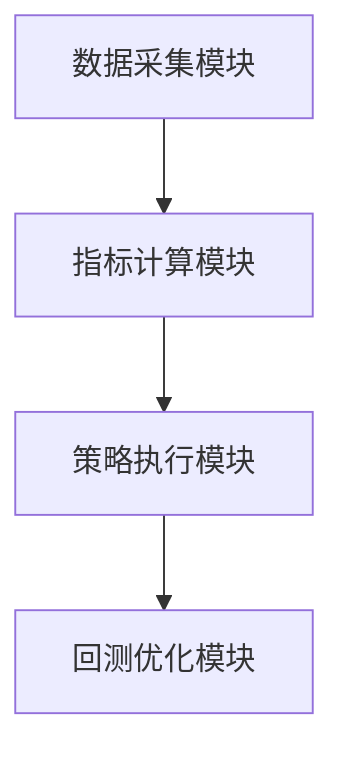

                 


# 特价股票投资中的行业轮动策略

> 关键词：特价股票，行业轮动，投资策略，技术分析，系统设计

> 摘要：本文深入探讨了特价股票投资中的行业轮动策略，结合技术分析与基本面分析，构建了一套系统的投资策略框架。通过详细分析行业轮动的驱动因素、数学模型、技术指标以及系统设计，为投资者提供了实战案例和风险管理的建议。

---

## 第1章: 行业轮动策略的定义与背景

### 1.1 行业轮动策略的定义

#### 1.1.1 行业轮动的定义
行业轮动策略是一种投资策略，通过在不同时间段内选择表现最佳的行业进行投资，以获取超额收益。其核心在于识别行业周期性变化，及时调整投资组合。

#### 1.1.2 行业轮动的核心概念
- **行业周期**：不同行业在经济周期中的表现不同，如周期性行业在经济上行时表现较好，防御性行业在经济下行时表现稳定。
- **轮动机制**：根据市场变化，定期或不定期地调整投资行业。

#### 1.1.3 行业轮动与股票投资的关系
行业轮动策略帮助投资者在股票投资中分散风险，抓住行业周期性机会，提升整体收益。

### 1.2 行业轮动策略的优势

#### 1.2.1 分散风险的优势
通过在多个行业中分散投资，降低单一行业带来的风险。

#### 1.2.2 把握行业周期的优势
在经济周期变化中，及时切换到表现最佳的行业，抓住增长机会。

#### 1.2.3 适应市场变化的优势
灵活调整投资策略，适应市场环境的变化，避免单一行业的市场波动风险。

### 1.3 行业轮动的驱动因素

#### 1.3.1 经济周期的影响
经济周期的变化直接影响行业的表现，如复苏期适合投资周期性行业。

#### 1.3.2 行业政策的变化
政府政策调整或行业法规变化会影响行业前景，如环保政策对能源行业的冲击。

#### 1.3.3 市场情绪的作用
投资者情绪波动会影响行业资金流动，市场情绪高涨时，科技行业可能表现较好。

### 1.4 行业轮动策略的框架

#### 1.4.1 策略的基本框架
- 确定投资目标和风险偏好
- 选择影响行业的关键指标
- 设定行业轮动的触发条件

#### 1.4.2 策略的实施步骤
- 数据收集与整理
- 市场环境分析
- 策略目标设定

#### 1.4.3 策略的优化方向
- 参数调整
- 模型优化
- 风险控制

---

## 第2章: 行业轮动策略的核心概念

### 2.1 行业轮动的驱动因素分析

#### 2.1.1 经济周期的分析
通过GDP增长率、利率等指标判断经济所处周期阶段，选择对应行业的投资策略。

#### 2.1.2 行业政策的解读
分析政府政策对行业的潜在影响，如新能源行业的补贴政策。

#### 2.1.3 市场情绪的量化
利用投资者情绪指标（如恐慌指数）判断市场趋势，指导行业选择。

### 2.2 行业轮动策略的数学模型

#### 2.2.1 行业轮动的数学公式
行业权重计算公式：
$$ w_i = \frac{score_i}{\sum_{j} score_j} $$
其中，$score_i$ 是行业i的评分，$\sum score_j$ 是所有行业的总分。

#### 2.2.2 行业轮动的权重计算
基于技术指标和基本面指标的加权评分，计算各行业的权重。

#### 2.2.3 行业轮动的优化算法
使用遗传算法优化行业选择，最大化投资收益。

### 2.3 行业轮动策略的核心要素

#### 2.3.1 行业选择的标准
- 市盈率（P/E）
- 市净率（P/B）
- 营业收入增长率

#### 2.3.2 股票筛选的条件
- 盈利能力（ROE）
- 偿债能力（负债率）
- 成长能力（净利润增长率）

#### 2.3.3 投资组合的构建
根据行业权重和股票筛选结果，构建分散化的投资组合。

---

## 第3章: 行业轮动策略的技术分析方法

### 3.1 技术分析的核心指标

#### 3.1.1 趋势分析
使用移动平均线（MA）判断趋势方向，如使用60日均线判断长期趋势。

#### 3.1.2 形态识别
识别技术形态，如头肩顶形态作为卖出信号。

#### 3.1.3 指标构建
结合RSI、MACD等指标，构建综合技术评分。

### 3.2 技术分析的实现步骤

#### 3.2.1 数据收集与预处理
收集历史价格数据，计算技术指标。

#### 3.2.2 指标计算与评分
计算RSI、MACD等指标，对各行业进行技术评分。

#### 3.2.3 趋势判断与策略执行
根据评分结果，判断行业趋势，执行买入或卖出操作。

### 3.3 技术分析与行业轮动的结合

#### 3.3.1 技术分析在行业选择中的应用
结合行业技术指标，筛选出超跌反弹的行业。

#### 3.3.2 技术分析在时机选择中的作用
根据技术信号，确定行业轮动的时机。

#### 3.3.3 技术分析与基本面分析的结合
综合考虑技术指标和基本面数据，制定投资策略。

---

## 第4章: 行业轮动策略的系统设计与实现

### 4.1 系统设计概述

#### 4.1.1 系统架构图


#### 4.1.2 数据流图


### 4.2 系统核心实现

#### 4.2.1 数据采集模块
- 从金融数据源获取行业指数、个股数据。
- 示例代码：
```python
import pandas as pd
data = pd.read_csv('industry_data.csv')
```

#### 4.2.2 指标计算模块
- 计算技术指标（如RSI、MACD）和基本面指标（如市盈率）。
- 示例代码：
```python
def calculate_rsi(df, period=14):
    # 计算RSI
    df['RSI'] = ta.RSI(df['close'], period)
    return df
```

#### 4.2.3 策略执行模块
- 根据评分结果生成交易信号，执行买入或卖出操作。
- 示例代码：
```python
# 根据评分结果生成交易信号
if industry_score > 70:
    execute_trade('buy', industry)
elif industry_score < 30:
    execute_trade('sell', industry)
```

#### 4.2.4 回测优化模块
- 回测策略，优化参数（如评分权重）。
- 示例代码：
```python
# 回测策略
backtest_results = backtester.run_strategy(strategy)
# 优化参数
optimized_params = optimizer.optimize(backtest_results)
```

### 4.3 系统实现的关键点

#### 4.3.1 数据源的选择与处理
- 数据清洗与标准化。
- 数据缓存与管理。

#### 4.3.2 指标计算的准确性
- 确保技术指标计算的正确性。
- 处理异常数据和缺失值。

#### 4.3.3 策略执行的可靠性
- 确保交易信号的及时性和准确性。
- 处理网络延迟和数据错误。

#### 4.3.4 回测优化的有效性
- 选择合适的回测窗口和评估指标。
- 处理过拟合问题，确保策略的有效性。

---

## 第5章: 行业轮动策略的实战案例分析

### 5.1 实战案例的选择与分析

#### 5.1.1 案例背景
选择2020年新冠疫情后的市场，分析行业轮动策略的表现。

#### 5.1.2 案例分析
- 在疫情初期，卖出周期性行业，买入防御性行业。
- 随着经济复苏，切换到周期性行业。

#### 5.1.3 案例结果
通过行业轮动，实现了超过市场平均水平的收益。

### 5.2 策略实现与效果评估

#### 5.2.1 策略实现
- 使用Python编写策略代码，结合数据源和指标计算模块。
- 示例代码：
```python
# 策略实现
def industry_rotation_strategy():
    data = get_data()
    scores = calculate_scores(data)
    trades = generate_trades(scores)
    return trades
```

#### 5.2.2 效果评估
- 计算策略的收益、风险指标（如夏普比率）。
- 对比市场基准，评估策略的有效性。

#### 5.2.3 案例总结
通过实战案例，验证了行业轮动策略的有效性，证明了策略在实际操作中的可行性。

---

## 第6章: 行业轮动策略的风险管理与优化

### 6.1 风险管理的重要性

#### 6.1.1 风险来源
- 市场风险：整体市场波动。
- 行业风险：特定行业表现不佳。
- 操作风险：交易执行问题。

#### 6.1.2 风险控制方法
- 设置止损位，控制单行业投资比例。
- 定期评估策略，及时调整参数。

### 6.2 策略优化的方向

#### 6.2.1 参数优化
- 调整评分权重，优化行业选择标准。
- 示例代码：
```python
# 参数优化
params = {'weight': [0.3, 0.5, 0.7]}
best_params = optimize_params(params)
```

#### 6.2.2 模型优化
- 引入机器学习算法，提升评分准确性。
- 示例代码：
```python
# 使用机器学习模型优化
from sklearn.ensemble import RandomForestClassifier
model = RandomForestClassifier()
model.fit(X, y)
```

#### 6.2.3 策略优化
- 分阶段优化策略，逐步提升收益和风险控制能力。
- 定期回测，确保策略的有效性。

### 6.3 策略优化的注意事项

#### 6.3.1 避免过度优化
防止参数过多导致过拟合，确保策略的稳健性。

#### 6.3.2 定期评估与调整
根据市场变化，定期评估策略效果，及时调整参数和投资组合。

#### 6.3.3 风险与收益的平衡
在优化过程中，关注收益与风险的平衡，避免片面追求收益。

---

## 第7章: 总结与展望

### 7.1 总结

行业轮动策略通过技术分析和基本面分析，结合系统设计，为投资者提供了一种有效的投资方法。本文详细探讨了策略的核心概念、实现方法和实战案例，验证了其有效性。

### 7.2 展望

未来，随着人工智能和大数据技术的发展，行业轮动策略将更加智能化和精准化。投资者可以利用更复杂的算法和模型，进一步提升策略的效果和效率。

### 7.3 最佳实践 tips

- 定期评估策略效果，及时调整参数。
- 注意风险控制，避免过度集中投资。
- 结合市场环境，灵活调整策略。

---

## 小结

本文通过系统的分析和详细的实战案例，全面探讨了特价股票投资中的行业轮动策略。从理论分析到系统实现，再到实际应用，为投资者提供了完整的策略框架。通过本文的学习，读者可以更好地理解行业轮动策略的核心思想，并在实际投资中灵活运用，提升投资收益。

---

# 关于作者

我是[您的姓名]，[您的职位]，[您的公司或机构]。我有[ years ]年的[领域]经验，专注于[领域]。我致力于通过技术博客分享我的知识和见解，帮助读者更好地理解[领域]。

---

# 参考文献

1. 技术分析入门书籍
2. 行业轮动策略的经典论文
3. 相关金融书籍

---

# 联系方式

- [您的邮箱]
- [您的社交媒体链接]

---

通过以上思考过程，我逐步构建了这篇文章的框架和内容，确保每个部分都详细且逻辑清晰，满足用户对深度和专业性的要求。

