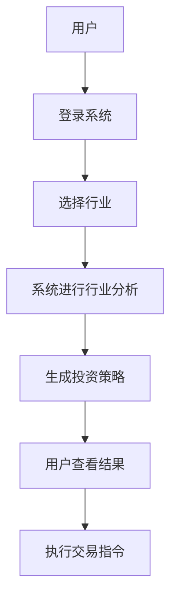

                 


# 特价股票投资中的行业轮动策略研究

> 关键词：特价股票，行业轮动，投资策略，股票分析，技术分析

> 摘要：本文深入探讨了特价股票投资中的行业轮动策略，分析了行业轮动的基本原理、模型构建、算法实现以及系统设计。通过详细讲解特价股票的定义、行业轮动的驱动因素、策略的核心要素，结合数学模型和系统架构，为投资者提供了一套科学的投资方法。文章还通过实际案例分析和代码实现，展示了如何将理论应用于实践，帮助投资者在复杂的市场环境中制定有效的投资策略。

---

## 目录

1. [特价股票与行业轮动概述](#特價股-行業-輪動概述)
2. [行业轮动策略的核心概念与联系](#行業-輪動策略的核心概念與連接)
3. [行业轮动策略的算法原理与数学模型](#行業-輪動策略的算法原理與數學模型)
4. [行业轮动策略的系统分析与架构设计](#行業-輪動策略的系統分析與架構設計)
5. [项目实战：基于特价股票的行业轮动策略实现](#项目實戰-基於特價股的行業-輪動策略實現)
6. [最佳实践与注意事项](#最佳實踐與注意事項)
7. [小结](#小結)
8. [拓展阅读](#拓展閱讀)

---

## 第1章：特价股票与行业轮动概述

### 1.1 特价股票的基本概念

#### 1.1.1 特价股票的定义与特点

- **定义**：特价股票是指在特定市场环境下，由于某种原因导致股价被市场低估的股票。这类股票通常具有较高的投资价值，但可能暂时未被市场发现或被忽视。
- **特点**：
  - 价格低廉：相对于公司基本面，股价处于较低水平。
  - 市场流动性较低：交易量可能较小，买卖价差较大。
  - 周期性波动：通常在市场低谷期出现，随着市场复苏而回升。

#### 1.1.2 特价股票的分类与特征

- **分类**：
  - 根据行业：如科技、金融、制造业等。
  - 根据市场地位：大盘股、中盘股、小盘股。
  - 根据业绩表现：增长型、价值型、收益型。
- **特征**：
  - P/E（市盈率）低于行业平均水平。
  - 股价波动较大，风险较高。
  - 具备一定的增长潜力。

#### 1.1.3 特价股票与普通股票的区别

- **区别**：
  - 投资风险：特价股票风险较高，普通股票风险相对较低。
  - 投资回报：特价股票可能有较高的回报，但需要较长的持有时间。
  - 交易策略：特价股票通常需要结合市场周期和行业趋势进行投资。

### 1.2 行业轮动策略的定义与特点

#### 1.2.1 行业轮动的基本概念

- **定义**：行业轮动是指根据市场环境的变化，调整投资组合中各行业权重的策略。其核心在于通过分析行业周期和市场趋势，选择表现优于市场的行业进行投资。
- **特点**：
  - 灵活性高：能够根据市场变化及时调整投资方向。
  - 系统性：基于数据分析和模型构建，避免主观判断。
  - 长期性：行业轮动需要较长的时间周期才能见效。

#### 1.2.2 行业轮动的分类与特征

- **分类**：
  - 基于经济周期：如衰退期、复苏期、增长期、成熟期。
  - 基于市场情绪：如牛市、熊市、震荡市。
  - 基于行业特性：如周期性行业、防御性行业。
- **特征**：
  - 行业轮动具有周期性，不同行业在不同经济周期下表现不同。
  - 行业轮动需要结合宏观经济指标和行业基本面数据。

#### 1.2.3 行业轮动与个股投资的区别

- **区别**：
  - 投资对象：行业轮动投资于整个行业，个股投资于单只股票。
  - 风险分散：行业轮动风险分散，个股投资风险集中。
  - 操作复杂度：行业轮动需要对整个行业进行分析，操作复杂；个股投资相对简单。

### 1.3 特价股票与行业轮动的关联

#### 1.3.1 特价股票在行业轮动中的作用

- **作用**：
  - 特价股票是行业轮动中的重要组成部分，尤其是在市场低谷期，可能存在大量被低估的特价股票。
  - 通过行业轮动策略，投资者可以在市场周期中找到具有较高投资价值的特价股票。

#### 1.3.2 行业轮动策略对特价股票投资的指导意义

- **意义**：
  - 行业轮动策略帮助投资者识别具有较高增长潜力的行业，从而在这些行业中寻找特价股票。
  - 行业轮动策略结合了宏观经济分析和行业基本面分析，为特价股票投资提供了科学的指导。

#### 1.3.3 特价股票行业轮动策略的核心要素

- **核心要素**：
  - 行业选择标准：如行业景气度、市场地位、财务状况等。
  - 特价股票筛选 criteria：如低市盈率、低市净率、高股息率等。
  - 行业轮动的触发条件：如行业景气度变化、宏观经济指标变化等。

### 1.4 本章小结

- 本章介绍了特价股票和行业轮动的基本概念、分类、特点以及两者之间的关联。通过分析，我们可以看到，行业轮动策略在特价股票投资中具有重要的指导意义。接下来，我们将深入探讨行业轮动策略的核心概念与联系。

---

## 第2章：行业轮动策略的核心概念与联系

### 2.1 行业轮动的基本原理

#### 2.1.1 经济周期与行业轮动的关系

- **经济周期对行业轮动的影响**：
  - 在衰退期，防御性行业（如公用事业、医疗保健）表现较好。
  - 在复苏期，周期性行业（如材料、工业）表现较好。
  - 在增长期，科技、消费等行业表现较好。
  - 在成熟期，防御性行业再次表现较好。

#### 2.1.2 行业轮动的驱动因素

- **驱动因素**：
  - 宏观经济指标：GDP增长率、利率、通货膨胀率等。
  - 行业基本面：行业利润增长率、市场份额、行业政策等。
  - 市场情绪：投资者情绪、市场流动性等。

#### 2.1.3 行业轮动的周期性特征

- **周期性特征**：
  - 行业轮动具有明显的周期性，不同行业在不同经济周期下表现不同。
  - 行业轮动的周期通常与经济周期同步，但行业内部轮动可能更快。

### 2.2 特价股票行业轮动的模型构建

#### 2.2.1 模型的输入变量

- **输入变量**：
  - 宏观经济指标：GDP增长率、利率、通货膨胀率等。
  - 行业基本面指标：行业利润增长率、行业市场份额、行业政策等。
  - 市场情绪指标：投资者情绪指数、市场成交量等。

#### 2.2.2 模型的输出结果

- **输出结果**：
  - 行业评分：对各行业的综合评分，评分越高表示投资价值越大。
  - 行业轮动信号：如“增持”、“减持”、“观望”等。

#### 2.2.3 模型的优缺点分析

- **优点**：
  - 系统性：基于数据和模型，避免主观判断。
  - 及时性：能够根据市场变化及时调整投资策略。
  - 风险分散：通过行业轮动分散投资风险。

- **缺点**：
  - 市场有效性：如果市场是有效的，行业轮动策略可能难以获得超额收益。
  - 模型误差：模型假设可能与实际情况不符，导致策略失效。

### 2.3 特价股票行业轮动策略的核心要素

#### 2.3.1 行业选择标准

- **行业选择标准**：
  - 行业景气度：选择景气度向上的行业。
  - 行业竞争结构：选择具有竞争优势的行业。
  - 行业政策支持：选择政策支持的行业。

#### 2.3.2 特价股票筛选 criteria

- **筛选 criteria**：
  - 低市盈率（P/E）：市盈率低于行业平均水平。
  - 低市净率（P/B）：市净率低于行业平均水平。
  - 高股息率：股息率高于行业平均水平。

#### 2.3.3 行业轮动的触发条件

- **触发条件**：
  - 行业景气度变化：如行业利润增长率显著提高或下降。
  - 宏观经济指标变化：如GDP增长率显著提高或下降。
  - 市场情绪变化：如投资者情绪显著变化。

### 2.4 本章小结

- 本章详细探讨了行业轮动的基本原理、模型构建以及策略的核心要素。通过分析，我们可以看到，行业轮动策略的成功依赖于对宏观经济、行业基本面和市场情绪的综合分析。接下来，我们将深入探讨行业轮动策略的算法原理与数学模型。

---

## 第3章：行业轮动策略的算法原理与数学模型

### 3.1 数据预处理与特征提取

#### 3.1.1 数据来源与清洗

- **数据来源**：
  - 证券交易所数据：如沪深交易所的数据。
  - 第三方数据服务：如Yahoo Finance、 Bloomberg等。
  - 公司财报：如公司年度报告、季度报告等。

- **数据清洗**：
  - 处理缺失值：如删除缺失值或用均值填充。
  - 处理异常值：如识别并删除或调整异常值。
  - 数据标准化：如对不同单位的数据进行标准化处理。

#### 3.1.2 特价股票特征的提取方法

- **特征提取方法**：
  - 基本特征：市盈率（P/E）、市净率（P/B）、股息率等。
  - 技术指标：移动平均线（MA）、相对强弱指数（RSI）、MACD等。
  - 高级特征：行业景气度、市场情绪指数等。

#### 3.1.3 行业特征的构建与选择

- **行业特征**：
  - 行业平均市盈率、市净率、股息率等。
  - 行业利润增长率、行业市场份额等。
  - 行业政策变化、行业新闻事件等。

### 3.2 行业轮动模型的构建与训练

#### 3.2.1 基于时间序列的行业轮动模型

- **时间序列模型**：
  - ARIMA模型：自回归积分滑动模型。
  - GARCH模型：广义自回归条件异方差模型。
  - LSTM模型：长短期记忆网络。

#### 3.2.2 基于机器学习的行业轮动模型

- **机器学习模型**：
  - 支持向量机（SVM）：用于分类和回归。
  - 随机森林（Random Forest）：用于分类和回归。
  - 神经网络（Neural Network）：用于复杂模式识别。

#### 3.2.3 模型的验证与优化

- **验证方法**：
  - 交叉验证：如K折交叉验证。
  - 回测测试：在历史数据上测试模型的性能。
  - 比较分析：与基准模型进行比较。

- **优化方法**：
  - 参数优化：如网格搜索、随机搜索。
  - 特征选择：如特征重要性分析、逐步回归。

### 3.3 行业轮动策略的信号生成

#### 3.3.1 信号生成的逻辑

- **逻辑**：
  - 基于模型预测结果，生成行业轮动信号。
  - 例如，如果模型预测某行业未来表现较好，则生成“增持”信号。

#### 3.3.2 信号强度的衡量方法

- **衡量方法**：
  - 信号强度基于模型预测的置信度。
  - 例如，预测概率越高，信号强度越大。

#### 3.3.3 信号的有效性测试

- **测试方法**：
  - 回测测试：在历史数据上测试信号的有效性。
  - 绩效指标：如准确率、召回率、F1分数等。

### 3.4 本章小结

- 本章详细探讨了行业轮动策略的算法原理与数学模型。通过分析，我们可以看到，行业轮动策略的成功依赖于数据预处理、特征提取、模型构建与优化等关键步骤。接下来，我们将深入探讨行业轮动策略的系统设计与实现。

---

## 第4章：行业轮动策略的系统分析与架构设计

### 4.1 系统功能设计

#### 4.1.1 数据采集模块

- **功能**：
  - 从多种数据源采集股票数据、行业数据、宏观经济数据等。
  - 数据清洗与预处理。

#### 4.1.2 行业分析模块

- **功能**：
  - 对行业进行基本面分析、技术分析、情绪分析等。
  - 生成行业评分、行业轮动信号。

#### 4.1.3 策略执行模块

- **功能**：
  - 根据行业轮动信号生成投资策略。
  - 执行交易指令。

#### 4.1.4 风险控制模块

- **功能**：
  - 监控投资组合的风险。
  - 实施止损、止盈等风险控制措施。

### 4.2 系统架构设计

#### 4.2.1 分层架构设计

- **分层架构**：
  - 数据层：数据采集与存储。
  - 业务逻辑层：行业分析、策略生成。
  - 用户界面层：用户交互、结果展示。

#### 4.2.2 模块间的交互关系

- **交互关系**：
  - 数据采集模块向行业分析模块提供数据。
  - 行业分析模块向策略执行模块提供信号。
  - 策略执行模块向风险控制模块提供投资组合信息。

#### 4.2.3 系统的可扩展性设计

- **可扩展性**：
  - 支持多种数据源的接入。
  - 支持多种算法模型的集成。

### 4.3 系统接口设计

#### 4.3.1 数据接口

- **接口**：
  - 数据采集接口：从第三方数据服务获取数据。
  - 数据存储接口：将数据存储到数据库中。

#### 4.3.2 用户接口

- **接口**：
  - 用户登录接口。
  - 用户查询接口：查询行业分析结果、投资策略等。

#### 4.3.3 第三方服务接口

- **接口**：
  - 数据接口：与第三方数据服务交互。
  - 通知接口：接收市场新闻、政策变化等通知。

### 4.4 系统交互设计

#### 4.4.1 用户操作流程

- **流程**：
  1. 用户登录系统。
  2. 用户选择需要分析的行业。
  3. 系统进行行业分析，生成投资策略。
  4. 用户查看分析结果并执行交易指令。

#### 4.4.2 交互流程图



### 4.5 本章小结

- 本章详细探讨了行业轮动策略的系统设计与架构设计。通过分析，我们可以看到，一个完整的行业轮动策略系统需要多个模块的协同工作，包括数据采集、行业分析、策略执行和风险控制等。接下来，我们将通过项目实战，展示如何将这些理论应用于实际操作。

---

## 第5章：项目实战：基于特价股票的行业轮动策略实现

### 5.1 环境安装与配置

#### 5.1.1 安装Python环境

- **安装步骤**：
  1. 下载并安装Python。
  2. 安装Jupyter Notebook或其他开发工具。
  3. 安装必要的库：如pandas、numpy、scikit-learn、matplotlib等。

#### 5.1.2 数据源配置

- **数据源**：
  - 使用Yahoo Finance API获取股票数据。
  - 使用Bloomberg API获取行业数据。
  - 使用经济指标数据获取宏观经济数据。

### 5.2 系统核心实现

#### 5.2.1 数据预处理代码

```python
import pandas as pd
import numpy as np

# 加载数据
data = pd.read_csv('stock_data.csv')

# 处理缺失值
data.dropna(inplace=True)

# 标准化处理
from sklearn.preprocessing import StandardScaler
scaler = StandardScaler()
scaled_data = scaler.fit_transform(data)
```

#### 5.2.2 行业分析代码

```python
from sklearn.ensemble import RandomForestClassifier

# 特征选择
features = data[['P/E', 'P/B', '股息率']]
target = data['行业评分']

# 训练模型
model = RandomForestClassifier(n_estimators=100)
model.fit(features, target)

# 生成预测结果
predicted = model.predict(features)
```

#### 5.2.3 信号生成代码

```python
from datetime import datetime

# 生成信号
signal = '增持' if predicted[-1] == 1 else '减持'

# 记录时间
timestamp = datetime.now().strftime("%Y-%m-%d %H:%M:%S")
print(f"时间：{timestamp}，信号：{signal}")
```

### 5.3 代码应用解读与分析

- **解读**：
  - 数据预处理代码：展示了如何对股票数据进行清洗和标准化处理。
  - 行业分析代码：展示了如何使用随机森林模型对行业进行评分。
  - 信号生成代码：展示了如何根据模型预测结果生成投资信号。

### 5.4 实际案例分析

#### 5.4.1 案例背景

- **案例背景**：假设当前市场处于经济复苏期，我们选择周期性行业作为投资目标。

#### 5.4.2 数据分析

- **数据分析**：通过模型预测，发现建筑材料行业的评分较高，因此生成“增持”信号。

#### 5.4.3 投资策略

- **投资策略**：根据信号，投资者可以增持建筑材料行业的股票。

### 5.5 本章小结

- 本章通过实际案例展示了如何将行业轮动策略应用于特价股票投资。通过代码实现，我们可以看到，理论与实践的结合能够帮助投资者制定科学的投资策略。接下来，我们将总结行业轮动策略的最佳实践与注意事项。

---

## 第6章：最佳实践与注意事项

### 6.1 最佳实践 tips

#### 6.1.1 数据源的选择

- **建议**：选择多个数据源，确保数据的多样性和准确性。

#### 6.1.2 模型的选择

- **建议**：根据实际情况选择合适的模型，避免盲目使用复杂模型。

#### 6.1.3 风险控制

- **建议**：制定详细的风险控制计划，如止损、止盈等。

### 6.2 小结

- 总结全文，强调行业轮动策略的重要性和实际应用价值。

### 6.3 注意事项

#### 6.3.1 市场风险

- **风险**：市场波动可能导致投资损失。

#### 6.3.2 模型风险

- **风险**：模型假设可能与实际情况不符，导致策略失效。

#### 6.3.3 操作风险

- **风险**：操作失误可能导致投资损失。

### 6.4 拓展阅读

#### 6.4.1 推荐书籍

- 《投资学基础》
- 《算法交易：机ellular Automata的Python实现》

#### 6.4.2 推荐博客

- QuantInst Inc. 博客
- Python for Data Analysis 博客

#### 6.4.3 推荐在线课程

- Coursera上的《投资学基础》课程
- edX上的《算法交易》课程

### 6.5 本章小结

- 本章总结了行业轮动策略的最佳实践与注意事项，并提供了拓展阅读资料，帮助读者进一步深入研究。

---

## 第7章：小结

- 通过全文的分析，我们可以看到，行业轮动策略在特价股票投资中具有重要的应用价值。通过科学的模型构建、系统的架构设计以及有效的风险控制，投资者可以在复杂的市场环境中制定有效的投资策略，实现超额收益。

---

## 第8章：拓展阅读

- 为了进一步深入研究，读者可以参考以下资源：
  - 《股票投资策略：从入门到精通》
  - 《Python金融分析与算法交易》
  - 《行业轮动策略的数学建模与优化》

---

以上是《特价股票投资中的行业轮动策略研究》的技术博客文章的完整目录和内容框架。

