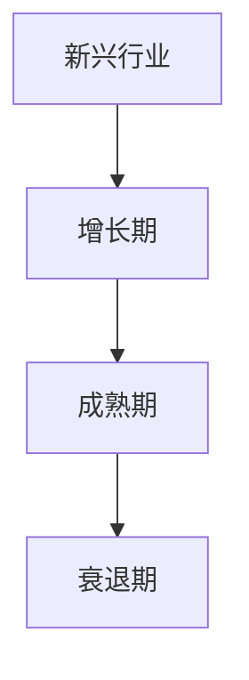
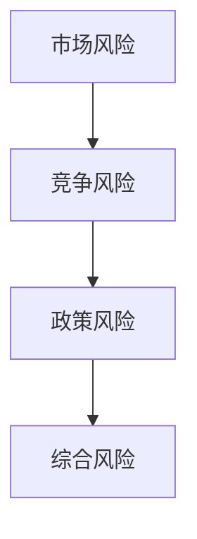

                 


# 特价股票投资中的行业选择考虑

> 关键词：特价股票，行业选择，投资策略，风险评估，市场分析

> 摘要：本文从特价股票投资的角度，详细探讨了在选择行业时需要考虑的关键因素，包括行业生命周期、竞争结构、财务指标等。通过分析不同行业的特点，结合实际案例，提出了有效的行业选择策略，帮助投资者做出明智的决策。文章还介绍了如何利用数学模型和算法进行行业风险评估和机会捕捉，提供了从理论到实践的全面指导。

---

## 第一章：特价股票投资的定义与特点

### 1.1 特价股票的定义与特征

#### 1.1.1 特价股票的定义

特价股票是指价格显著低于市场平均水平的股票。通常，这类股票被认为具有较高的投资潜力，因为它们可能处于低估状态，未来有较大的上涨空间。

#### 1.1.2 特价股票的特点

| 特性 | 描述 |
|------|------|
| 低价 | 价格远低于行业平均水平 |
| 高潜力 | 具备较高的上涨空间 |
| 高波动 | 市场波动较大，风险较高 |

#### 1.1.3 特价股票与普通股票的区别

- **价格差异**：特价股票价格较低，普通股票价格较高。
- **风险差异**：特价股票风险较高，普通股票风险相对较低。
- **投资策略**：特价股票需要更谨慎的选择，普通股票则更注重长期稳定。

### 1.2 特价股票投资的核心理念

#### 1.2.1 投资的基本概念

投资是指将资金投入到某个领域，以期获得超过初始投入的收益。在股票投资中，投资者通过购买股票成为公司的股东，分享公司未来增长的成果。

#### 1.2.2 特价股票投资的核心理念

- **价值投资**：寻找被市场低估的股票，长期持有，等待价值回归。
- **风险控制**：通过分散投资和严格筛选，降低投资风险。

#### 1.2.3 特价股票投资的市场环境

- **市场周期**：股市的周期性波动为特价股票投资提供了机会。
- **经济环境**：宏观经济状况影响行业和个股的表现。

---

## 第二章：行业选择的核心要素

### 2.1 行业分析的定义与作用

#### 2.1.1 行业分析的定义

行业分析是通过对特定行业的市场结构、竞争格局、财务状况等进行研究，评估该行业的发展潜力和风险。

#### 2.1.2 行业分析的作用

- **识别机会**：发现具有高增长潜力的行业。
- **评估风险**：了解行业的潜在风险，避免盲目投资。

### 2.2 行业选择的核心要素

#### 2.2.1 行业的生命周期

**行业生命周期模型**：



- **新兴行业**：市场增长迅速，竞争较小。
- **增长期**：行业快速增长，企业盈利提升。
- **成熟期**：行业增长放缓，竞争激烈。
- **衰退期**：行业需求下降，企业盈利能力减弱。

#### 2.2.2 行业的竞争结构

**行业竞争结构模型**：

| 竞争结构 | 描述 |
|----------|------|
| 完全竞争 | 市场上有许多竞争者，产品同质化。 |
| 垄断竞争 | 几家公司控制大部分市场，产品差异性较大。 |
| 寡头垄断 | 市场由少数几家企业控制，形成垄断竞争。 |
| 完全垄断 | 市场由一家企业完全控制，无竞争者。 |

#### 2.2.3 行业的财务指标

**关键财务指标**：

- **市盈率（P/E）**：股价与每股收益的比率。
- **市净率（P/B）**：股价与每股净资产的比率。
- **ROE（净资产收益率）**：衡量企业盈利能力的指标。

---

## 第三章：特价股票投资中的行业选择策略

### 3.1 行业选择的基本原则

#### 3.1.1 价值投资原则

- **低估值**：寻找市盈率、市净率等指标低于行业平均水平的股票。
- **高分红**：选择具有稳定分红能力的公司。

#### 3.1.2 风险控制原则

- **分散投资**：避免将所有资金投入到单一行业。
- **止损机制**：设定止损点，避免重大损失。

#### 3.1.3 长期投资原则

- **长期持有**：避免频繁交易，降低交易成本。
- **价值回归**：相信市场会回归理性，低估股票终将上涨。

### 3.2 行业选择的实战技巧

#### 3.2.1 如何识别行业拐点

- **行业周期**：关注行业生命周期，选择处于上升期的行业。
- **政策变化**：关注政府政策对行业的影响。

#### 3.2.2 如何评估行业风险

- **行业风险**：评估行业整体风险，如市场需求、竞争压力等。
- **公司风险**：分析公司的财务状况、管理团队等。

#### 3.2.3 如何捕捉行业机会

- **行业趋势**：关注行业发展趋势，如技术创新、消费升级等。
- **市场热点**：抓住市场热点，选择具有增长潜力的行业。

### 3.3 行业选择的案例分析

#### 3.3.1 某行业的成功投资案例

- **行业选择**：选择处于增长期的行业，如科技行业。
- **公司分析**：选择行业内具有竞争优势的公司，如苹果、微软等。

#### 3.3.2 某行业的失败投资案例

- **行业选择错误**：选择处于衰退期的行业，如传统制造业。
- **公司分析不足**：忽视公司财务状况和管理团队。

#### 3.3.3 案例总结与经验分享

- **成功经验**：选择具有高增长潜力的行业，关注公司基本面。
- **失败教训**：避免选择衰退期行业，加强公司分析。

---

## 第四章：行业风险评估与机会捕捉

### 4.1 行业风险的定义与分类

#### 4.1.1 行业风险的定义

行业风险是指由于行业整体环境的变化对投资收益造成的影响。

#### 4.1.2 行业风险的分类

| 风险类型 | 描述 |
|----------|------|
| 市场风险 | 行业市场需求变化导致的风险。 |
| 竞争风险 | 行业内竞争加剧导致的风险。 |
| 政策风险 | 政府政策变化对行业的影响。 |

### 4.2 行业风险的量化方法

#### 4.2.1 风险评估模型

**风险评估模型**：



#### 4.2.2 风险指标的计算

- **贝塔系数（Beta）**：衡量股票相对于市场的波动性。
- **波动率**：衡量股票价格的波动程度。

#### 4.2.3 风险评估的工具与方法

- **财务报表分析**：通过公司财务报表评估公司风险。
- **行业研究报告**：参考专业机构的行业研究报告。

### 4.3 风险控制策略

#### 4.3.1 风险分散策略

- **多元化投资**：将资金分散投资于不同行业，降低风险。

#### 4.3.2 风险对冲策略

- **对冲基金**：利用衍生工具对冲行业风险。

#### 4.3.3 风险预警机制

- **市场监控**：实时监控市场变化，及时调整投资策略。

---

## 第五章：行业机会捕捉与投资策略优化

### 5.1 行业机会的识别方法

#### 5.1.1 行业趋势分析

- **技术创新**：关注科技行业的技术创新。
- **消费升级**：关注消费行业的消费升级趋势。

#### 5.1.2 行业政策解读

- **政策支持**：政府政策对行业的影响。
- **政策变化**：关注政策变化对行业的影响。

### 5.2 投资策略的优化

#### 5.2.1 价值投资优化

- **精选个股**：选择具有竞争优势的公司。
- **长期持有**：避免短期波动，长期持有优质股票。

#### 5.2.2 风险管理优化

- **动态调整**：根据市场变化，动态调整投资组合。
- **止损机制**：设定止损点，避免重大损失。

---

## 第六章：总结与展望

### 6.1 投资策略的总结

- **核心原则**：价值投资、风险控制、长期投资。
- **实战技巧**：行业分析、风险评估、机会捕捉。

### 6.2 未来展望

- **技术创新**：科技行业的持续创新为投资带来新机会。
- **政策变化**：政府政策对行业的影响将更加显著。

### 6.3 最佳实践 tips

- **分散投资**：避免将所有资金投入到单一行业。
- **长期持有**：相信市场会回归理性，耐心等待价值回归。
- **持续学习**：关注行业动态和市场变化，不断提升自己的投资能力。

---

## 附录：代码实现与案例分析

### 附录 A：行业分析的代码实现

```python
import pandas as pd
import numpy as np

# 示例代码：计算行业市盈率
def calculate_pe_ratio(stock_data, industry):
    industry_stocks = stock_data[stock_data['industry'] == industry]
    pe_ratio = industry_stocks['price'] / industry_stocks['eps']
    return pe_ratio.mean()

# 示例数据
data = {
    'stock': ['A', 'B', 'C'],
    'industry': ['科技', '科技', '科技'],
    'price': [10, 15, 20],
    'eps': [5, 10, 15]
}

df = pd.DataFrame(data)
print(calculate_pe_ratio(df, '科技'))
```

### 附录 B：案例分析

#### 案例分析 1：科技行业投资

- **背景**：科技行业是当前增长最快的行业之一，技术创新推动行业发展。
- **投资策略**：选择具有竞争优势的科技公司，如苹果、微软等。
- **风险分析**：科技行业竞争激烈，技术更新换代快，需关注公司技术研发能力。

---

通过以上分析，投资者可以更好地理解特价股票投资中的行业选择策略，结合实际案例和数学模型，制定科学的投资计划，实现稳健的投资收益。

