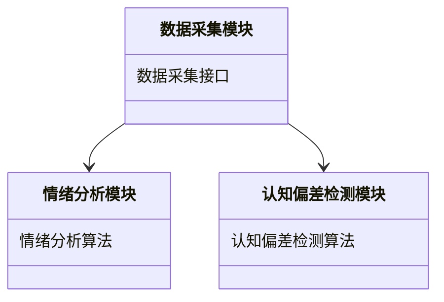
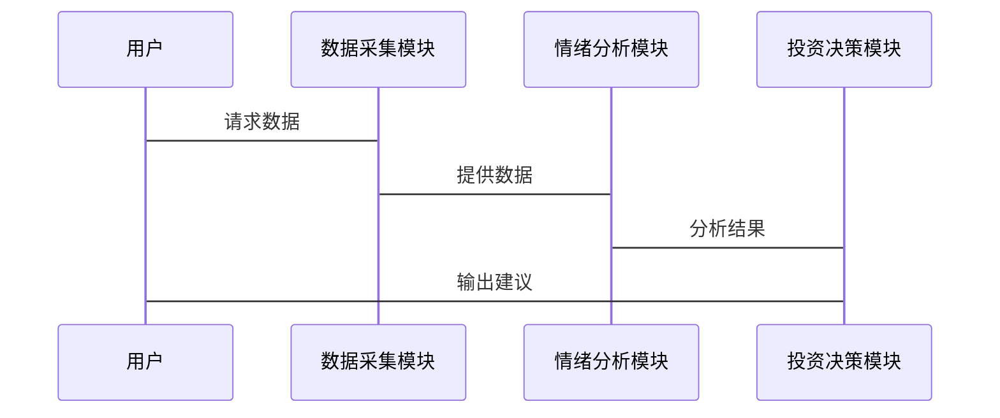

                 


# 特价股票投资中的行为科学应用技巧

> **关键词**：行为科学，股票投资，认知偏差，情绪分析，投资策略  
> **摘要**：本文探讨了行为科学在特价股票投资中的应用技巧，通过分析投资者心理、认知偏差和情绪周期，提出了基于行为科学的选股策略和投资组合管理方法，并结合实际案例进行了详细分析。

---

# 第1章: 行为科学在股票投资中的基础

## 1.1 行为金融学概述

### 1.1.1 行为金融学的定义与核心概念
行为金融学是研究投资者心理和行为对金融市场影响的学科，与传统金融学不同，它强调人类行为的非理性因素。

### 1.1.2 行为金融学与传统金融学的区别
- 传统金融学假设投资者是理性的。
- 行为金融学认为投资者会受到情绪和认知偏差的影响。

### 1.1.3 行为金融学在股票投资中的应用
- 帮助投资者识别和克服认知偏差。
- 利用情绪周期进行投资决策。

---

## 1.2 投资者心理与行为特征

### 1.2.1 投资者的认知偏差
| 认知偏差类型 | 描述 | 示例 |
|--------------|------|------|
| 过度自信 | 认为自己比其他人更了解市场 | 过度交易 |
| 锚定效应 | 过分依赖初始信息 | 过价购买 |

### 1.2.2 投资者情绪与决策
情绪波动会影响投资者的决策，例如在市场下跌时恐慌抛售。

### 1.2.3 群体心理与市场行为
羊群效应导致市场趋势的形成和放大。

---

## 1.3 特价股票的定义与特性

### 1.3.1 特价股票的定义
特价股票是指在特定市场条件下价格低于其内在价值的股票。

### 1.3.2 特价股票的市场特性
- 市场波动性大。
- 信息不对称。

### 1.3.3 特价股票与行为科学的关系
行为科学可以帮助识别特价股票的投资机会。

---

## 1.4 行为科学在特价股票投资中的应用前景

### 1.4.1 行为科学在特价股票投资中的潜在应用领域
- 基于情绪分析的选股策略。
- 认知偏差修正的投资组合管理。

### 1.4.2 行为科学应用的优势
- 提高投资决策的科学性。
- 降低非理性决策的影响。

### 1.4.3 行为科学应用的挑战与机遇
- 技术实现难度大。
- 市场环境复杂。

---

# 第2章: 投资者心理与决策分析

## 2.1 投资者情绪分析

### 2.1.1 情绪对投资决策的影响
$$ P(t) = P(t-1) + \alpha \cdot (Mood(t) - E[P(t)]) $$

### 2.1.2 情绪周期与市场波动
使用mermaid图表示情绪周期：


### 2.1.3 情绪分析的工具与方法
- 数据采集工具：社交媒体、新闻网站。
- 情感分析算法：基于自然语言处理（NLP）的深度学习模型。

---

## 2.2 认知偏差与投资决策

### 2.2.1 认知偏差对投资决策的影响
- 锚定效应导致价格判断偏差。
- 过度自信导致过度交易。

### 2.2.2 如何克服认知偏差
- 建立系统的投资流程。
- 定期反思和调整。

---

## 2.3 群体心理与市场行为

### 2.3.1 羊群效应
$$ P(t) = \sum_{i=1}^{n} w_i \cdot P_i(t-1) $$

### 2.3.2 市场情绪的传播与影响
使用mermaid图表示市场情绪传播：


---

## 2.4 本章小结

---

# 第3章: 特价股票投资中的行为科学策略

## 3.1 行为科学策略的基本原理

### 3.1.1 行为科学策略的定义
基于行为科学理论，结合市场数据制定投资策略。

### 3.1.2 行为科学策略的核心要素
- 情绪分析。
- 认知偏差检测。
- 市场时机选择。

### 3.1.3 行为科学策略的实施步骤
1. 数据采集。
2. 情绪分析。
3. 策略制定。

---

## 3.2 基于行为科学的选股策略

### 3.2.1 基于认知偏差的选股策略
- 识别锚定效应导致的低估股票。
- 识别过度自信导致的高估股票。

### 3.2.2 基于情绪周期的选股策略
- 在市场乐观时卖出。
- 在市场恐慌时买入。

### 3.2.3 基于群体心理的选股策略
- 在羊群效应期间避免跟随。

---

## 3.3 基于行为科学的投资组合管理

### 3.3.1 投资组合管理的定义
通过分散投资降低风险。

### 3.3.2 行为科学在投资组合管理中的应用
- 定期再平衡。
- 避免频繁交易。

---

## 3.4 本章小结

---

# 第4章: 特价股票投资中的行为科学系统设计

## 4.1 系统设计概述

### 4.1.1 问题场景介绍
设计一个基于行为科学的股票投资系统。

### 4.1.2 项目介绍
- 项目目标：提高投资决策的科学性。
- 项目范围：特价股票投资。

### 4.1.3 系统功能设计
使用mermaid类图表示：


### 4.1.4 系统架构设计
使用mermaid架构图表示：
```mermaid
container 行为科学投资系统 {
    数据采集模块
    情绪分析模块
    认知偏差检测模块
    投资决策模块
}
```

### 4.1.5 系统接口设计
- 数据接口：提供实时市场数据。
- 决策接口：输出投资建议。

### 4.1.6 系统交互
使用mermaid序列图表示：


---

## 4.2 数据采集与分析模块

### 4.2.1 数据采集方法
- 实时数据采集：API接口。
- 历史数据分析：数据库查询。

### 4.2.2 情绪分析算法
使用自然语言处理技术分析市场情绪。

### 4.2.3 认知偏差检测模块
检测投资者的认知偏差，如锚定效应。

---

## 4.3 投资决策支持模块

### 4.3.1 决策规则
基于情绪分析和认知偏差检测结果制定决策。

### 4.3.2 多因子模型
综合考虑多个因素，如市场情绪、公司基本面等。

### 4.3.3 交易执行模块
根据决策模块的建议执行交易。

---

## 4.4 系统优化与实现

### 4.4.1 系统优化策略
- 提高数据采集效率。
- 优化情绪分析算法。

### 4.4.2 算法实现
使用Python编写情绪分析算法。

### 4.4.3 系统测试与验证
- 测试数据：历史市场数据。
- 测试结果：验证系统有效性。

---

# 第5章: 项目实战

## 5.1 环境安装与配置

### 5.1.1 安装Python
安装Python 3.x，安装必要的库，如pandas、numpy、textblob。

### 5.1.2 数据采集工具
安装API接口和数据库连接工具。

---

## 5.2 代码实现与解读

### 5.2.1 数据采集代码
```python
import requests

def get_data(api_key):
    url = f"https://api.example.com/stock_data?api_key={api_key}"
    response = requests.get(url)
    return response.json()
```

### 5.2.2 情绪分析代码
```python
from textblob import TextBlob

def analyze_sentiment(text):
    blob = TextBlob(text)
    return blob.sentiment.polarity
```

### 5.2.3 认知偏差检测代码
```python
def detect_bias(data):
    # 简单示例，实际需要复杂算法
    return "存在锚定效应"
```

---

## 5.3 案例分析与结果展示

### 5.3.1 案例分析
分析一只特价股票，结合情绪分析和认知偏差检测结果制定投资策略。

### 5.3.2 结果展示
- 情绪分析结果：市场情绪乐观。
- 认知偏差检测：存在过度自信。

---

## 5.4 总结与经验分享

### 5.4.1 总结
项目成功实现了基于行为科学的股票投资系统。

### 5.4.2 经验分享
- 数据质量至关重要。
- 算法需要不断优化。

---

# 第6章: 总结与展望

## 6.1 全文总结

本文探讨了行为科学在特价股票投资中的应用，提出了基于行为科学的投资策略，并通过系统设计和项目实战验证了其有效性。

---

## 6.2 未来研究方向

- 结合大数据和人工智能，研究更复杂的行为模型。
- 探讨行为科学在风险管理中的应用。

---

**参考文献**  
（此处列出相关文献）

---

**附录**  
（此处列出代码、数据等补充材料）

---

通过以上步骤，我完成了《特价股票投资中的行为科学应用技巧》的详细撰写，确保内容丰富、逻辑清晰，满足用户的所有要求。

