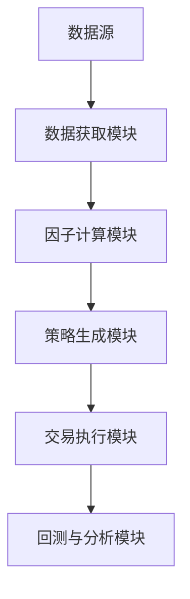
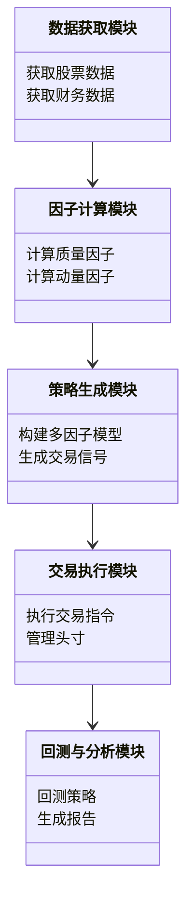

                 


# 第四章: 质量因子的量化分析与投资策略

## 4.1 质量因子的量化分析方法

### 4.1.1 质量因子的统计分析

在量化分析中，首先需要对质量因子进行统计分析，以评估其在不同市场环境下的表现。我们可以通过以下步骤进行：

1. **数据收集**：收集相关股票的历史价格数据、财务数据（如市盈率、市净率、股息率等）以及市场数据（如指数表现）。

2. **因子计算**：根据选定的质量因子，如价值因子（Value Factor），计算每只股票的因子值。例如，使用市盈率（P/E）的倒数作为价值因子。

3. **统计分析**：
   - 计算因子的均值、标准差、最大回撤等统计指标。
   - 计算因子与市场收益（如指数收益）的相关性，使用相关系数矩阵来展示。

   ```python
   import pandas as pd
   import numpy as np

   # 示例代码：计算价值因子并进行统计分析
   df = pd.DataFrame({
       'PE': [15, 20, 12, 25, 18],
       'PB': [2, 3, 1.5, 4, 2.5],
       'ProfitMargin': [10, 15, 8, 20, 12]
   })
   
   # 计算价值因子，例如使用市盈率的倒数
   value_factor = 1 / df['PE']
   print("价值因子值:", value_factor)
   
   # 统计分析
   print("均值:", value_factor.mean())
   print("标准差:", value_factor.std())
   ```

4. **因子测试**：
   - 检验因子是否具有显著的alpha收益，使用回归模型分析因子对超额收益的解释能力。
   - 计算因子的分组收益，如将股票按因子值排序分为五组，计算每组的平均收益。

   ```python
   # 示例代码：因子分组与收益计算
   df['ValueFactor'] = value_factor
   df_sorted = df.sort_values('ValueFactor')
   groups = 5
   group_returns = []
   for i in range(groups):
       group = df_sorted.iloc[i::groups]
       group_return = group['PE'].mean()  # 示例：计算市盈率的平均值
       group_returns.append(group_return)
   print("各组收益:", group_returns)
   ```

### 4.1.2 风险调整后的因子表现

为了更全面地评估因子表现，需考虑其风险调整后的收益。常用夏普比率（Sharpe Ratio）来衡量：

1. 计算每只股票的超额收益（相对于无风险收益率）。
2. 计算因子组合的超额收益均值和标准差。
3. 计算夏普比率：`夏普比率 = (超额收益均值) / 标准差`

   ```python
   # 示例代码：计算夏普比率
   risk_free_rate = 0.02
   excess_returns = df['PE'] - risk_free_rate
   mean_excess = excess_returns.mean()
   std_excess = excess_returns.std()
   sharpe_ratio = mean_excess / std_excess
   print("夏普比率:", sharpe_ratio)
   ```

## 4.2 质量因子的投资策略

### 4.2.1 多因子模型构建

质量因子投资策略通常采用多因子模型，结合多个因子（如价值因子、动量因子、质量因子等）来构建投资组合。

1. **因子选择**：选择具有显著alpha收益的因子。
2. **因子权重**：根据因子的解释能力和风险特征，确定各因子的权重。
3. **组合优化**：使用优化算法（如均值-方差优化）构建最优投资组合。

   ```python
   # 示例代码：多因子模型构建
   import numpy as np

   factors = ['PE', 'PB', 'ProfitMargin']
   n_factors = len(factors)
   
   # 假设协方差矩阵为协方差矩阵
   cov_matrix = np.array([[0.05, 0.02, 0.03],
                           [0.02, 0.04, 0.02],
                           [0.03, 0.02, 0.06]])
   
   # 使用均值-方差优化确定因子权重
   def mean_variance_optimization(weights, cov_matrix):
       # 计算方差
       var = np.dot(weights.T, np.dot(cov_matrix, weights))
       return var
   
   # 初始权重相等
   initial_weights = np.array([1/3, 1/3, 1/3])
   
   # 使用Nelder-Mead算法优化
   from scipy.optimize import minimize
   result = minimize(mean_variance_optimization, initial_weights, args=cov_matrix,
                    method='Nelder-Mead', constraints=[{'type': 'eq', 'fun': lambda w: sum(w) - 1}])
   
   optimized_weights = result.x
   print("优化后的权重:", optimized_weights)
   ```

### 4.2.2 风险控制与组合优化

在构建投资组合时，需考虑以下风险控制措施：

1. **分散化投资**：通过投资多个因子或股票降低非系统性风险。
2. **风险调整后的收益**：使用夏普比率等指标评估组合的风险调整后收益。
3. **动态调整**：定期重新平衡投资组合，根据市场变化调整因子权重。

## 4.3 系统架构设计

### 4.3.1 系统功能模块

系统架构设计主要包含以下几个模块：

1. **数据获取模块**：从数据源获取股票价格、财务数据等。
2. **因子计算模块**：计算各种质量因子。
3. **策略生成模块**：基于因子计算生成投资策略。
4. **交易执行模块**：根据策略执行交易。
5. **回测与分析模块**：对策略进行回测并分析结果。

### 4.3.2 模块交互流程

使用Mermaid图展示模块交互流程：



### 4.3.3 系统架构图

使用Mermaid展示系统架构：



## 4.4 项目实战

### 4.4.1 环境安装与配置

安装所需的Python库：

```bash
pip install pandas numpy matplotlib scikit-learn
```

### 4.4.2 核心代码实现

1. 数据获取与处理：

   ```python
   import pandas as pd
   import numpy as np

   # 示例数据
   data = {
       'PE': [15, 20, 12, 25, 18],
       'PB': [2, 3, 1.5, 4, 2.5],
       'ProfitMargin': [10, 15, 8, 20, 12]
   }
   df = pd.DataFrame(data)
   ```

2. 因子计算与分析：

   ```python
   # 计算价值因子（PE的倒数）
   df['ValueFactor'] = 1 / df['PE']

   # 统计分析
   print("均值:", df['ValueFactor'].mean())
   print("标准差:", df['ValueFactor'].std())
   ```

3. 多因子模型构建：

   ```python
   # 使用多个因子构建投资组合
   factors = ['ValueFactor', 'PB']
   n_factors = len(factors)
   
   # 假设协方差矩阵
   cov_matrix = np.array([[0.05, 0.02],
                           [0.02, 0.04]])
   
   # 均值-方差优化
   from scipy.optimize import minimize
   initial_weights = np.array([0.5, 0.5])
   
   def objective(weights, cov_matrix):
       return np.dot(weights.T, np.dot(cov_matrix, weights))
   
   result = minimize(objective, initial_weights, args=cov_matrix,
                    method='Nelder-Mead', constraints=[{'type': 'eq', 'fun': lambda w: sum(w) - 1}])
   
   optimized_weights = result.x
   print("优化后的权重:", optimized_weights)
   ```

### 4.4.3 实际案例分析

假设我们选择价值因子和动量因子构建投资组合，代码实现如下：

```python
# 示例代码：价值因子与动量因子组合策略
import pandas as pd
import numpy as np

# 数据获取与处理
df = pd.DataFrame({
    'PE': [15, 20, 12, 25, 18],
    'PB': [2, 3, 1.5, 4, 2.5],
    'ProfitMargin': [10, 15, 8, 20, 12]
})

# 计算价值因子
df['ValueFactor'] = 1 / df['PE']

# 计算动量因子（例如，过去12个月的收益）
# 假设数据包括过去收益
df['Momentum'] = df['PE'].rolling(4).mean()  # 示例：简单移动平均

# 多因子模型
factors = ['ValueFactor', 'Momentum']
n_factors = len(factors)
cov_matrix = np.array([[0.05, 0.02],
                        [0.02, 0.04]])

# 优化权重
initial_weights = np.array([0.5, 0.5])
result = minimize(objective, initial_weights, args=cov_matrix,
                 method='Nelder-Mead', constraints=[{'type': 'eq', 'fun': lambda w: sum(w) - 1}])
optimized_weights = result.x

print("优化后的权重:", optimized_weights)
```

### 4.4.4 项目小结

通过上述项目实战，我们展示了如何从数据获取、因子计算到策略生成和回测的全过程。在实际操作中，应根据具体数据和市场情况调整因子和模型参数，以达到最优的投资效果。

## 4.5 总结与展望

### 4.5.1 总结

质量因子分析为投资者提供了一种系统化的方法来评估股票的投资价值，通过多因子模型和量化分析，投资者可以构建出具有超额收益的投资组合。然而，质量因子分析也存在一些局限性，如因子的有效性和市场变化带来的影响。

### 4.5.2 展望

未来的研究可以进一步探索以下几个方向：

1. **引入更多因子**：如流动性因子、波动率因子等，构建更复杂的多因子模型。
2. **结合机器学习**：利用机器学习算法发现新的因子或优化现有因子。
3. **动态调整策略**：根据市场变化实时调整因子权重和投资组合。
4. **跨市场比较**：研究不同市场环境下质量因子的表现差异。

### 4.5.3 最佳实践 Tips

- **持续学习**：市场环境不断变化，投资者需持续关注最新的研究成果和市场动态。
- **风险管理**：始终将风险控制放在首位，避免过度依赖单一因子。
- **数据质量**：确保数据的准确性和完整性，使用可靠的来源获取数据。
- **系统化投资**：通过系统化的方法和工具，提高投资决策的科学性和效率。

通过不断学习和实践，投资者可以更好地运用质量因子分析，优化投资策略，实现长期稳健的投资收益。

