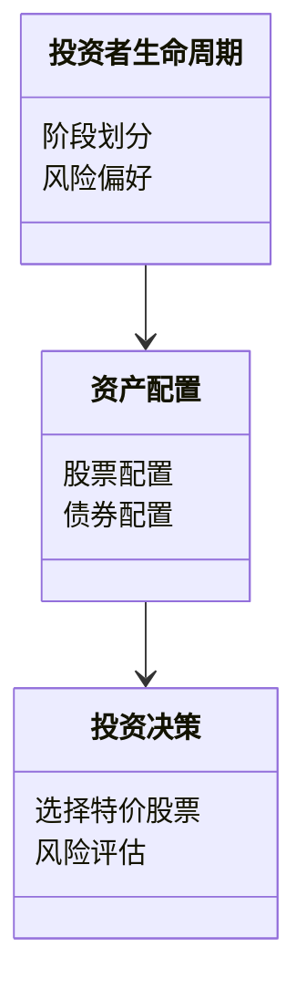

                 


# 特价股票投资中的跨代际投资策略与风险管理

## 关键词：
- 特价股票
- 跨代际投资
- 风险管理
- 股票投资策略
- 投资风险管理

## 摘要：
本文深入探讨了特价股票投资中的跨代际投资策略及其风险管理方法。首先，文章介绍了特价股票和跨代际投资的基本概念和特点，分析了两者之间的关系。接着，从风险管理的角度，详细阐述了跨代际投资中的风险评估与控制策略。然后，文章提出了跨代际投资策略的数学模型和算法原理，并通过实例分析验证了其有效性。最后，结合实际案例，总结了跨代际投资策略在实践中的应用价值和风险管理的重要性，为投资者提供了有益的参考和指导。

---

# 第一部分: 特价股票投资与跨代际投资策略概述

## 第1章: 特价股票投资的背景与概念

### 1.1 特价股票投资的定义与特点
#### 1.1.1 特价股票的定义
特价股票是指价格相对较低的股票，通常具有较高的市净率或市盈率，或者处于市场低估状态。这类股票往往被市场忽视或低估，但具有长期增值的潜力。

#### 1.1.2 特价股票投资的核心特点
- 低估值：市场价格低于内在价值。
- 高波动性：价格波动较大，但潜在回报高。
- 长期性：适合长期持有，等待市场回归理性。

#### 1.1.3 特价股票与普通股票的区别
| 属性 | 特价股票 | 普通股票 |
|------|----------|----------|
| 价格 | 低于市场价值 | 接近或高于市场价值 |
| 风险 | 高 | 中等 |
| 回报 | 高潜力 | 稳定 |

### 1.2 跨代际投资策略的背景与意义
#### 1.2.1 跨代际投资的定义
跨代际投资是指不同年龄段的投资者根据自身生命周期阶段，选择适合的投资策略，以实现长期财富目标。

#### 1.2.2 跨代际投资的背景与发展趋势
随着人口结构的变化和人们对长期财富管理的需求增加，跨代际投资逐渐成为一种重要的投资方式。

#### 1.2.3 跨代际投资在股票市场中的应用
跨代际投资通过优化资产配置和风险控制，帮助投资者在不同生命周期阶段实现财富增值。

## 第2章: 特价股票投资与跨代际投资的关系

### 2.1 特价股票投资与跨代际投资的结合
#### 2.1.1 跨代际投资在特价股票中的应用
跨代际投资策略可以帮助投资者在特价股票市场中发现低估机会，同时降低投资风险。

#### 2.1.2 特价股票投资中的跨代际策略
通过跨代际视角，投资者可以在特价股票市场中发现长期价值，实现资产保值和增值。

### 2.2 跨代际投资对股票市场的影响
#### 2.2.1 跨代际投资对市场流动性的影响
跨代际投资增加了市场流动性，特别是在特价股票市场中。

#### 2.2.2 跨代际投资对市场长期价值的影响
跨代际投资注重长期价值，有助于推动市场向理性化方向发展。

#### 2.2.3 跨代际投资对市场风险的影响
跨代际投资通过分散投资和风险控制，降低了市场整体风险。

## 第3章: 特价股票投资中的风险管理

### 3.1 风险管理的核心概念
#### 3.1.1 风险的定义与分类
风险是指投资收益的不确定性，可分为市场风险、流动性风险、信用风险等。

#### 3.1.2 风险管理的目标与原则
风险管理的目标是降低投资风险，实现长期收益最大化。其原则包括分散化、风险与收益匹配等。

#### 3.1.3 风险管理在股票投资中的重要性
有效的风险管理可以避免重大损失，提高投资收益的稳定性。

### 3.2 跨代际投资中的风险管理策略
#### 3.2.1 风险评估与分析方法
- 市场风险评估：分析市场波动对投资的影响。
- 信用风险评估：评估公司财务状况。
- 流动性风险评估：确保资产易于变现。

#### 3.2.2 风险控制的具体措施
- 分散投资：通过多样化投资降低风险。
- 设置止损点：控制单笔投资的最大损失。
- 定期调整投资组合：根据市场变化优化资产配置。

#### 3.2.3 风险管理工具与技术
- 基于波动率的VaR模型。
- 风险调整后收益（RAROC）。
- 多因子风险模型。

---

# 第二部分: 跨代际投资策略的核心概念与联系

## 第4章: 跨代际投资策略的原理与模型

### 4.1 跨代际投资策略的原理
#### 4.1.1 投资者生命周期理论
投资者在不同生命周期阶段（单身、结婚、养育子女、退休）的投资需求和风险承受能力不同。

#### 4.1.2 跨代际投资的动机与目标
跨代际投资的动机包括财富传承、资产保值、长期增值等。

#### 4.1.3 跨代际投资的长期视角
跨代际投资强调长期视角，注重资产的可持续增长和风险控制。

### 4.2 跨代际投资模型的构建
#### 4.2.1 跨代际投资模型的基本框架
- 投资者生命周期阶段划分。
- 资产配置策略。
- 风险管理框架。

#### 4.2.2 模型的核心假设与变量
| 假设 | 变量 |
|------|------|
| 不同生命周期阶段的风险承受能力不同 | 生命周期阶段、风险偏好、资产规模 |
| 投资目标与生命周期阶段相关 | 投资目标、投资期限、投资收益目标 |

#### 4.2.3 模型的验证与优化
通过历史数据验证模型的有效性，并根据市场变化进行参数调整。

## 第5章: 跨代际投资策略与风险管理的联系

### 5.1 跨代际投资策略对风险管理的影响
#### 5.1.1 跨代际策略如何降低风险
通过分散投资和长期视角，跨代际策略降低了市场波动对投资的影响。

#### 5.1.2 跨代际策略如何分散风险
跨代际投资通过资产配置和多样化投资，实现了风险的分散。

#### 5.1.3 跨代际策略如何应对市场波动
跨代际策略通过长期视角和风险管理工具，有效应对市场波动。

### 5.2 风险管理对跨代际投资策略的支持
#### 5.2.1 风险管理如何保障跨代际策略的实施
通过风险评估和控制，确保跨代际策略的稳健实施。

#### 5.2.2 风险管理如何优化跨代际策略
通过动态调整和优化，提升跨代际策略的收益与风险比。

#### 5.2.3 风险管理如何提升跨代际策略的长期收益
有效的风险管理可以避免重大损失，从而提升长期收益。

---

# 第三部分: 跨代际投资策略的算法原理与数学模型

## 第6章: 跨代际投资策略的算法原理

### 6.1 跨代际投资策略的算法框架
#### 6.1.1 算法的基本流程
1. 确定投资者生命周期阶段。
2. 制定资产配置策略。
3. 选择投资标的（如特价股票）。
4. 实施风险管理。

#### 6.1.2 算法的核心步骤
- 风险评估：分析市场风险、流动性风险等。
- 资产配置：根据生命周期阶段分配资产比例。
- 投资决策：选择适合的投资标的。
- 风险控制：设置止损点和风险对冲工具。

#### 6.1.3 算法的实现方法
通过Python编写投资策略代码，结合数据接口获取市场数据，实现自动化投资决策。

### 6.2 跨代际投资策略的数学模型
#### 6.2.1 风险价值模型（VaR）
$$ \text{VaR} = \mu + z \cdot \sigma $$
其中，$\mu$ 是平均收益，$z$ 是标准正态分布的分位数，$\sigma$ 是标准差。

#### 6.2.2 风险调整后收益模型（RAROC）
$$ \text{RAROC} = \frac{\text{净收益} - \text{风险调整成本}}{\text{资产规模}} $$

#### 6.2.3 资本资产定价模型（CAPM）
$$ E(r) = r_f + \beta (r_m - r_f) $$
其中，$E(r)$ 是预期收益，$r_f$ 是无风险利率，$\beta$ 是系统性风险系数，$r_m$ 是市场预期收益。

---

## 第7章: 系统架构与风险管理

### 7.1 系统功能设计
#### 7.1.1 领域模型（Mermaid 类图）


#### 7.1.2 系统架构（Mermaid 架构图）
```mermaid
container 跨代际投资系统 {
    投资者生命周期模块
    资产配置模块
    投资决策模块
    风险管理模块
}
```

#### 7.1.3 系统接口设计
- 输入：投资者生命周期阶段、资产规模、风险偏好。
- 输出：资产配置建议、投资标的建议、风险管理策略。

---

## 第8章: 项目实战与最佳实践

### 8.1 环境安装与配置
- Python 环境：安装 Pandas、NumPy、Matplotlib 等库。

### 8.2 系统核心实现
#### 8.2.1 投资策略代码
```python
import pandas as pd
import numpy as np

# 示例代码：跨代际投资策略
def cross_generational_strategy(portfolio, market_data):
    # 确定投资者生命周期阶段
    stage = portfolio['stage']
    # 资产配置
    allocation = portfolio['allocation']
    # 选择特价股票
    selected_stocks = market_data[market_data['valuation'] < market_data['price']]
    return selected_stocks
```

#### 8.2.2 风险管理代码
```python
def risk_management(portfolio, market_data):
    # 计算VaR
    returns = market_data['returns']
    mu = returns.mean()
    sigma = returns.std()
    z = 1.96  # 95% 置信水平
    var = mu + z * sigma
    return var
```

### 8.3 实际案例分析
#### 8.3.1 案例背景
假设一个投资者处于中年阶段，希望通过跨代际策略投资特价股票，实现财富增值。

#### 8.3.2 投资组合构建
- 60% 股票（特价股票为主）
- 30% 债券
- 10% 现金

#### 8.3.3 风险管理实施
- 设置止损点：最大损失不超过投资本金的 10%。
- 定期再平衡：每季度调整一次投资组合。

### 8.4 项目小结
跨代际投资策略结合风险管理，能够在特价股票市场中实现长期稳健的收益。通过合理的资产配置和风险管理工具，投资者能够有效控制风险，提升投资回报。

---

## 第9章: 最佳实践与总结

### 9.1 小结
跨代际投资策略通过结合投资者生命周期和风险管理，帮助投资者在特价股票市场中实现长期稳健的收益。

### 9.2 注意事项
- 风险管理是跨代际投资的核心。
- 投资者需根据自身生命周期阶段调整投资策略。
- 定期评估和优化投资组合。

### 9.3 拓展阅读
- 《投资学》
- 《风险管理与投资组合优化》
- 《跨代际财富管理》

---

通过以上结构，文章全面涵盖了跨代际投资策略的核心概念、算法原理、系统架构和实际应用，为投资者提供了理论与实践相结合的指导。

