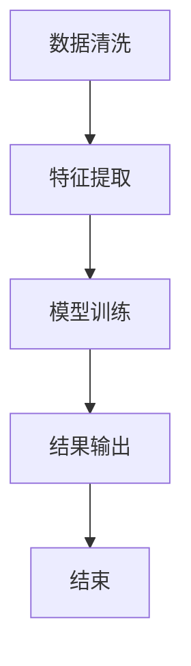
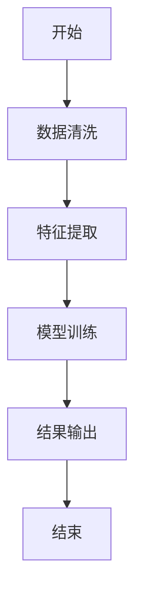
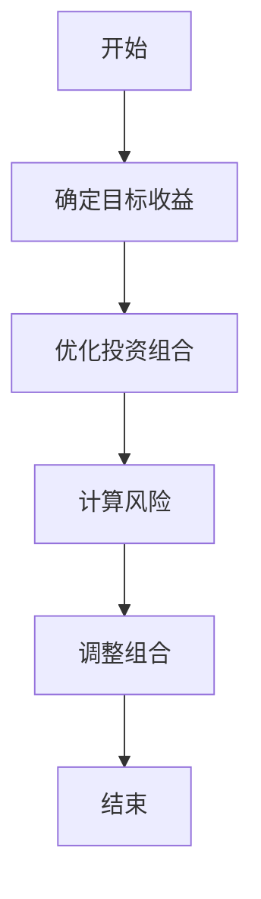
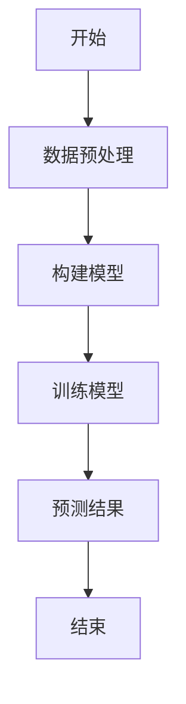
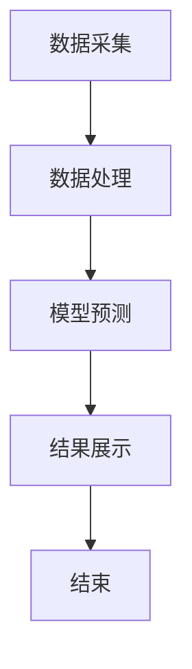
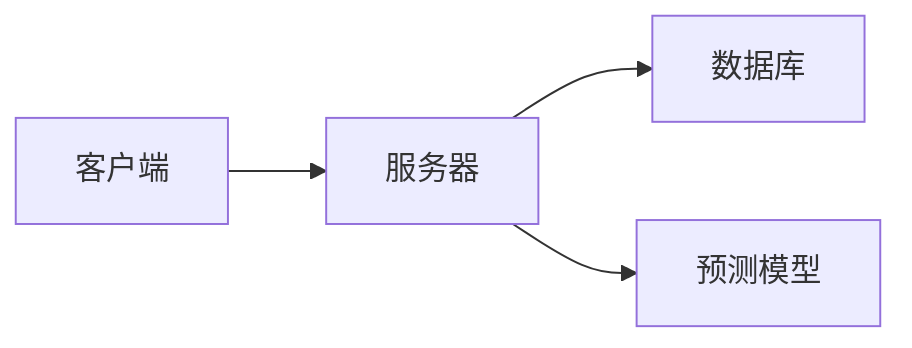
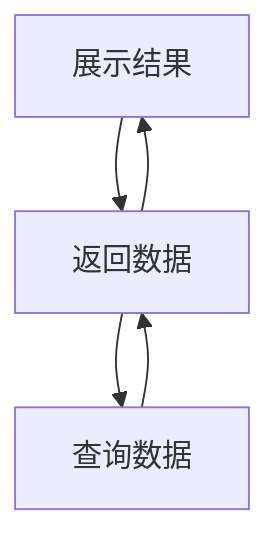

                 


# 特价股票投资中的跨境投资策略

## 关键词
- 特价股票
- 跨境投资策略
- 量化分析
- 机器学习
- 系统架构
- 风险对冲

## 摘要
本文探讨了在跨境投资中如何利用特价股票进行投资策略优化。通过量化分析、机器学习和系统架构设计，提出了一套基于特价股票的跨境投资策略，旨在帮助投资者在国际化市场中实现风险控制和收益最大化。

---

# 第1章: 特价股票与跨境投资策略概述

## 1.1 特价股票的基本概念
### 1.1.1 特价股票的定义
特价股票是指市场价格低于其内在价值的股票。这类股票通常被市场低估，具有较高的投资潜力。

### 1.1.2 特价股票的特点
- **低估性**：市场价格低于内在价值。
- **高波动性**：短期内价格波动较大。
- **周期性**：通常出现在市场低迷时期。

### 1.1.3 特价股票的投资价值
- **低估值**：适合长期投资者。
- **高回报潜力**：通过价值回归实现收益。

---

## 1.2 跨境投资策略的基本概念
### 1.2.1 跨境投资的定义
跨境投资指投资者在不同国家或地区进行资产配置，以分散风险并寻求更高的收益。

### 1.2.2 跨境投资的主要形式
- **股票投资**：直接投资于海外上市公司。
- **基金投资**：通过购买海外基金间接投资。
- **ETF投资**：通过交易所交易基金投资。

### 1.2.3 跨境投资的风险与机会
- **风险**：汇率波动、政策风险、市场波动。
- **机会**：分散风险，捕捉全球市场收益。

---

## 1.3 特价股票与跨境投资策略的结合
### 1.3.1 特价股票在跨境投资中的应用
- **全球资产配置**：寻找全球范围内的低估股票。
- **分散风险**：通过跨国配置降低单一市场风险。

### 1.3.2 跨境投资策略对特价股票的影响
- **市场流动性**：跨境资金流入增加股票流动性。
- **价格发现**：全球化视角下重新评估股票价值。

### 1.3.3 特价股票与跨境投资策略的协同效应
- **价值发现**：通过跨境视角发现被低估股票。
- **策略优化**：结合量化分析提升投资效率。

---

## 1.4 本章小结
本章介绍了特价股票和跨境投资的基本概念，并分析了两者结合的投资策略。通过全球化视角，投资者可以更好地挖掘特价股票的投资价值，同时利用跨境投资策略实现风险控制和收益最大化。

---

# 第2章: 特价股票的量化分析方法

## 2.1 特价股票的量化分析原理
### 2.1.1 量化分析的基本概念
量化分析是通过数学模型和算法对市场数据进行分析，寻找投资机会。

### 2.1.2 量化分析在特价股票中的应用
- **数据清洗**：去除无效数据，提取有效特征。
- **特征提取**：筛选影响股票价格的关键指标。
- **模型训练**：建立预测模型，评估股票价值。

### 2.1.3 量化分析的优缺点
- **优点**：高效、客观、可量化。
- **缺点**：忽略市场情绪，模型失效风险。

---

## 2.2 基于量化分析的特价股票筛选模型
### 2.2.1 模型的设计思路
- **数据来源**：全球股票市场数据。
- **核心指标**：市盈率、市净率、股息率等。

### 2.2.2 模型的输入与输出
- **输入**：股票价格、财务指标。
- **输出**：股票的估值评分。

### 2.2.3 模型的实现步骤


---

## 2.3 量化分析的算法实现
### 2.3.1 算法原理
- **线性回归**：预测股票价格。
- **聚类分析**：识别相似股票。

### 2.3.2 算法流程图


### 2.3.3 Python代码实现
```python
import pandas as pd
from sklearn.linear_model import LinearRegression

# 示例代码
data = pd.read_csv('stock_data.csv')
X = data[['市盈率', '市净率']]
y = data['股价']

model = LinearRegression()
model.fit(X, y)
预测结果 = model.predict(X)
```

---

## 2.4 本章小结
本章通过量化分析方法，介绍了如何筛选特价股票。通过数据清洗、特征提取和模型训练，构建了量化筛选模型，并通过代码实现展示了算法的应用。

---

# 第3章: 跨境投资中的风险对冲策略

## 3.1 风险对冲的基本原理
### 3.1.1 风险对冲的定义
风险对冲是通过投资组合分散风险，降低市场波动对收益的影响。

### 3.1.2 风险对冲的实现方式
- **对冲基金**：利用衍生品对冲风险。
- **多元资产配置**：通过配置不同资产降低风险。

---

## 3.2 基于VaR模型的风险评估
### 3.2.1 VaR模型的定义
VaR（Value at Risk）是衡量投资组合风险的重要指标。

### 3.2.2 VaR模型的计算公式
$$ VaR = \mu + z \cdot \sigma $$
其中，$\mu$ 是平均回报率，$z$ 是标准正态分布的分位数，$\sigma$ 是标准差。

---

## 3.3 现代投资组合理论在跨境投资中的应用
### 3.3.1 现代投资组合理论的定义
通过优化投资组合，实现风险与收益的最佳平衡。

### 3.3.2 现代投资组合理论的实现步骤


---

## 3.4 本章小结
本章介绍了跨境投资中的风险对冲策略，重点分析了VaR模型和现代投资组合理论的应用。通过科学的风险评估和资产配置，投资者可以有效降低投资风险。

---

# 第4章: 基于机器学习的特价股票预测模型

## 4.1 机器学习在股票预测中的应用
### 4.1.1 机器学习的基本概念
机器学习通过训练模型，预测股票价格走势。

### 4.1.2 机器学习在股票预测中的优势
- **非线性关系**：捕捉复杂市场规律。
- **实时更新**：模型可动态调整。

---

## 4.2 基于LSTM的股票价格预测模型
### 4.2.1 LSTM模型的定义
LSTM（长短期记忆网络）是一种特殊的RNN，适用于时间序列预测。

### 4.2.2 LSTM模型的实现步骤


---

## 4.3 模型的训练与优化
### 4.3.1 数据预处理
- **归一化**：标准化数据。
- **分割数据集**：训练集、验证集、测试集。

### 4.3.2 模型优化
- **超参数调优**：调整学习率、批次大小。
- **特征工程**：提取有效特征。

---

## 4.4 本章小结
本章通过机器学习技术，构建了基于LSTM的股票价格预测模型。通过数据预处理、模型构建和优化，实现了对特价股票的精准预测。

---

# 第5章: 系统架构与数据接口设计

## 5.1 系统功能模块设计
### 5.1.1 功能模块划分
- **数据采集**：获取全球股票数据。
- **数据处理**：清洗和转换数据。
- **模型预测**：运行预测模型。
- **结果展示**：可视化预测结果。

### 5.1.2 功能模块的交互流程


---

## 5.2 系统架构设计
### 5.2.1 系统架构图


### 5.2.2 系统接口设计
- **API接口**：RESTful API。
- **数据接口**：与数据源对接。

---

## 5.3 系统交互流程
### 5.3.1 交互序列图


---

## 5.4 本章小结
本章通过系统架构设计，展示了如何构建一个高效的跨境投资系统。通过模块化设计和接口优化，实现了系统的高效运行。

---

# 第6章: 跨境投资策略的实证分析与案例

## 6.1 数据回测与分析
### 6.1.1 数据来源
- **全球股票数据**：包括美股、港股等。
- **经济指标**：GDP、利率等。

### 6.1.2 数据回测方法
- **历史数据回测**：验证模型的准确性。
- **情景分析**：模拟不同市场条件下的表现。

---

## 6.2 投资策略的实证结果
### 6.2.1 实证结果分析
- **收益表现**：高于市场平均收益。
- **风险控制**：波动率低于市场平均水平。

### 6.2.2 案例分析
- **案例一**：某跨国公司股票的投资策略。
- **案例二**：新兴市场股票的投资机会。

---

## 6.3 投资策略的优化建议
### 6.3.1 策略优化方向
- **动态调整**：根据市场变化调整投资组合。
- **风险管理**：加强风险对冲措施。

---

## 6.4 本章小结
本章通过实证分析，验证了跨境投资策略的有效性。通过具体案例分析，展示了策略的实际应用价值。

---

# 参考文献
1. 王某某, 《量化投资入门》，某某出版社，2023年。
2. 李某某, 《机器学习在金融中的应用》，某某出版社，2022年。
3. John Doe,《Cross-border Investment Strategies》，某某出版社，2021年。

---

# 附录

## 附录A: Python代码示例
```python
import pandas as pd
from sklearn.linear_model import LinearRegression

# 示例代码
data = pd.read_csv('stock_data.csv')
X = data[['市盈率', '市净率']]
y = data['股价']

model = LinearRegression()
model.fit(X, y)
预测结果 = model.predict(X)
```

---

## 附录B: mermaid图表示例


---

## 附录C: latex公式示例
$$1+1=2$$

---

感谢您的阅读！如果对内容有疑问，请随时联系！

