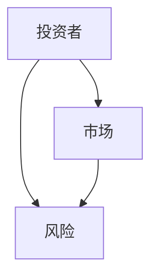
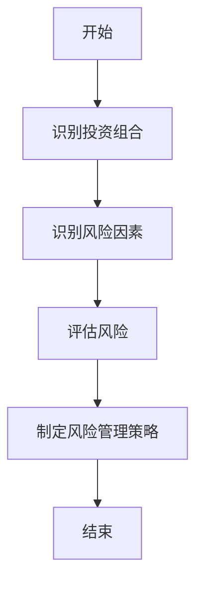
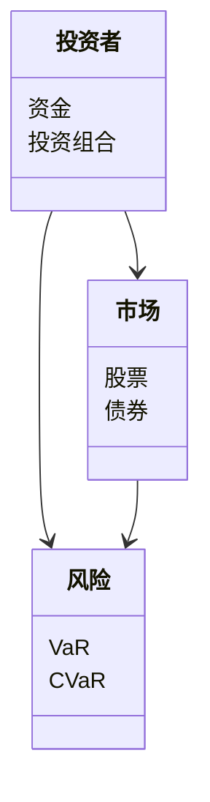
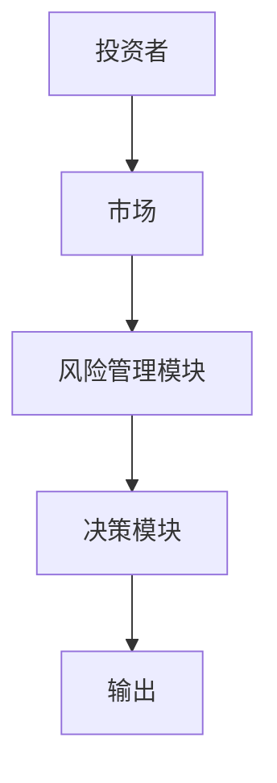

                 


# 特价股票投资中的跨境投资策略与风险管理

> 关键词：特价股票、跨境投资、风险管理、投资策略、股票市场、风险评估

> 摘要：本文系统地探讨了特价股票投资中的跨境投资策略与风险管理。通过分析跨境投资的背景、核心概念、策略算法、系统架构、实战案例和最佳实践，本文为投资者提供了全面的理论支持和实践指导。从风险评估到系统设计，再到实际应用，本文帮助读者理解如何在全球化市场中制定有效策略，规避风险，实现投资目标。

---

## 第一部分: 特价股票投资概述

### 第1章: 特价股票投资的基本概念

#### 1.1 什么是特价股票
特价股票是指价格相对较低、具有较大上涨潜力的股票。这类股票通常存在于新兴市场或周期性行业中，投资者通过长期持有或短期操作，利用价格波动获利。

#### 1.2 特价股票投资的意义
- **成本优势**：低价股票的投资门槛较低，适合中小投资者。
- **增值潜力**：通过长期持有，低价股票可能因公司成长或市场复苏而大幅增值。
- **分散风险**：投资于不同市场的特价股票，有助于分散单一市场的风险。

#### 1.3 跨境投资的背景
- **全球化趋势**：全球经济一体化使得投资者能够接触到更多市场。
- **市场差异**：不同国家的市场具有不同的增长潜力和风险特征。
- **资产配置**：通过跨境投资，投资者可以优化资产配置，平衡风险与收益。

### 第2章: 跨境投资的意义

#### 2.1 跨境投资的定义
跨境投资是指投资者在本国以外的市场进行资产配置和投资活动，包括股票、债券、基金等多种形式。

#### 2.2 跨境投资的背景
- **经济全球化**：跨国公司的发展和资本流动的自由化推动了跨境投资的增长。
- **市场多样性**：不同国家的经济周期和政策差异为投资者提供了多样化的投资机会。

#### 2.3 跨境投资的意义
- **分散风险**：通过投资不同市场的股票，降低单一市场的系统性风险。
- **捕捉机会**：新兴市场通常具有较高的增长潜力，能够为投资者带来超额收益。

### 第3章: 风险管理的重要性

#### 3.1 风险管理的基本概念
风险管理是指识别、评估和应对可能影响投资收益的不确定性因素，以降低潜在损失。

#### 3.2 风险管理在股票投资中的作用
- **保护资本**：通过风险控制，避免重大损失，保护投资本金。
- **提高收益**：通过合理配置风险和收益，实现投资目标。

#### 3.3 跨境投资中的风险管理挑战
- **汇率风险**：不同货币的波动可能影响投资收益。
- **市场风险**：不同市场的波动性和政策变化增加了风险管理的复杂性。

---

## 第二部分: 特价股票投资的核心概念与联系

### 第4章: 跨境投资策略的核心原理

#### 4.1 跨境投资策略的分类
- **地域分散策略**：将资金分配到不同国家或地区，降低区域风险。
- **行业分散策略**：投资于不同行业的股票，平衡行业风险。

#### 4.2 跨境投资策略的特点
- **全球化视角**：关注全球经济趋势和区域市场机会。
- **风险与收益平衡**：通过多元化配置，实现风险可控下的收益最大化。

#### 4.3 跨境投资策略与风险管理的关系
- **相互依存**：有效的风险管理是实现投资目标的前提，而合理的投资策略则是风险管理的基础。

### 第5章: 风险管理的核心要素

#### 5.1 风险的定义与分类
- **系统性风险**：影响整个市场的风险，如经济衰退、政策变化。
- **非系统性风险**：特定资产或行业的风险，如公司管理问题。

#### 5.2 风险管理的步骤
1. **识别风险**：分析可能影响投资的各类风险。
2. **评估风险**：量化风险的影响程度。
3. **制定应对策略**：根据风险特征采取相应的管理措施。

#### 5.3 风险管理工具与方法
- **分散投资**：通过投资不同资产和市场降低风险。
- **衍生工具**：利用期权、期货等工具对冲风险。

### 第6章: 跨境投资与风险管理的实体关系图

#### 6.1 实体关系图
使用Mermaid绘制的实体关系图展示了投资者、市场、风险因素之间的关系：



---

## 第三部分: 跨境投资策略的算法原理

### 第7章: 风险评估算法

#### 7.1 算法流程图
使用Mermaid绘制的风险评估算法流程图：



#### 7.2 风险评估算法的Python实现
以下代码示例使用VaR（Value at Risk）模型来评估投资组合的风险：

```python
import numpy as np

def calculate VaR(returns, confidence_level):
    sorted_returns = sorted(returns)
    VaR = sorted_returns[int(len(sorted_returns) * (1 - confidence_level))]
    return VaR

# 示例数据
returns = np.random.normal(0, 1, 1000)
confidence_level = 0.95

VaR = calculate VaR(returns, confidence_level)
print(f"VaR at {confidence_level * 100}% confidence: {VaR}")
```

#### 7.3 数学模型与公式
- **VaR公式**：衡量在给定置信水平下的潜在损失。
$$ \text{VaR} = \text{损失的值在特定置信水平下} $$

- **CVaR公式**：考虑VaR之外的潜在损失。
$$ \text{CVaR} = \text{VaR的平均损失} $$

---

## 第四部分: 系统分析与架构设计

### 第8章: 项目背景与目标

#### 8.1 项目背景
本文旨在探讨如何通过跨境投资策略和风险管理技术，帮助投资者在全球市场中实现稳健的投资回报。

#### 8.2 项目目标
- 提供跨境投资策略的理论框架。
- 提供风险管理的实用工具和方法。

### 第9章: 系统功能设计

#### 9.1 领域模型
使用Mermaid绘制的领域模型类图：



### 第10章: 系统架构设计

#### 10.1 系统架构图
使用Mermaid绘制的系统架构图：



### 第11章: 系统接口设计

#### 11.1 接口设计
- **输入接口**：投资者的资产配置需求。
- **输出接口**：风险管理模块的评估结果。

### 第12章: 系统交互序列图

使用Mermaid绘制的系统交互序列图：

```mermaid
sequenceDiagram
   参与者 投资者
    参与者 市场
    参与者 风险管理模块
    投资者 -> 市场: 提交资产配置需求
    市场 -> 风险管理模块: 传递市场数据
    风险管理模块 -> 投资者: 提供风险评估结果
```

---

## 第五部分: 项目实战

### 第13章: 环境安装

#### 13.1 环境要求
- Python 3.6+
- NumPy、Pandas等数据分析库

### 第14章: 核心代码实现

#### 14.1 风险管理模块的Python代码
```python
import numpy as np
import pandas as pd

def portfolio_risk(weights, covariance_matrix):
    portfolio_variance = (weights.T @ covariance_matrix @ weights)
    return np.sqrt(portfolio_variance)

# 示例数据
returns = pd.read_csv('market_returns.csv')
weights = pd.read_csv('portfolio_weights.csv')
covariance_matrix = returns.cov()

risk = portfolio_risk(weights, covariance_matrix)
print(f"Portfolio Risk: {risk}")
```

### 第15章: 实际案例分析

#### 15.1 案例分析
假设一个投资者将资产分配到美国、欧洲和亚洲市场，分别投资于科技、金融和消费行业。通过VaR模型评估不同市场和行业的风险，优化投资组合。

### 第16章: 项目小结

#### 16.1 项目总结
通过实际案例分析，验证了跨境投资策略和风险管理模型的有效性，为投资者提供了实用的操作指南。

---

## 第六部分: 最佳实践

### 第17章: 小结

#### 17.1 本文总结
本文系统地探讨了特价股票投资中的跨境投资策略与风险管理，从理论到实践，为投资者提供了全面的指导。

### 第18章: 注意事项

#### 18.1 投资者注意事项
- **谨慎选择市场**：了解目标市场的经济和政治风险。
- **动态调整策略**：根据市场变化及时调整投资组合。

### 第19章: 拓展阅读

#### 19.1 推荐书籍
- 《风险管理与金融创新》
- 《股票投资策略与技术分析》

---

通过以上详细的内容，本文为投资者提供了从理论到实践的全面指导，帮助他们在全球化市场中制定有效的投资策略，实现稳健的投资回报。

