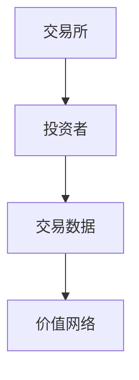
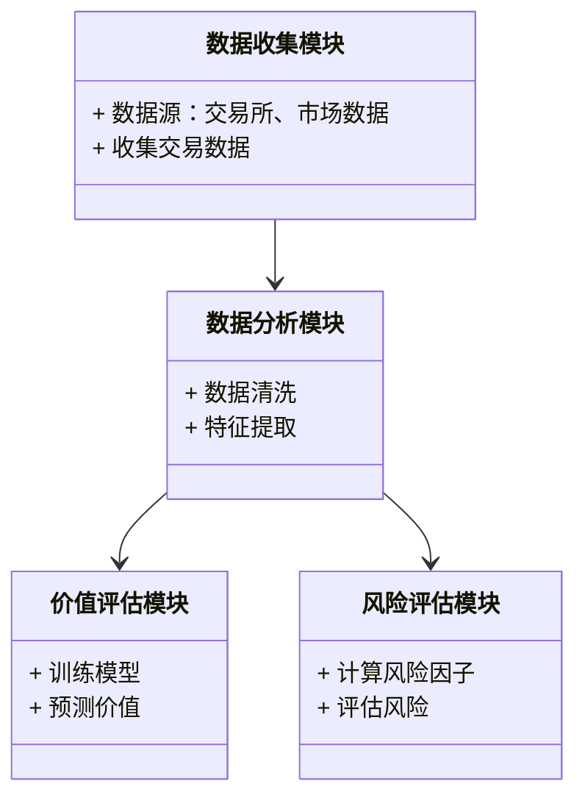
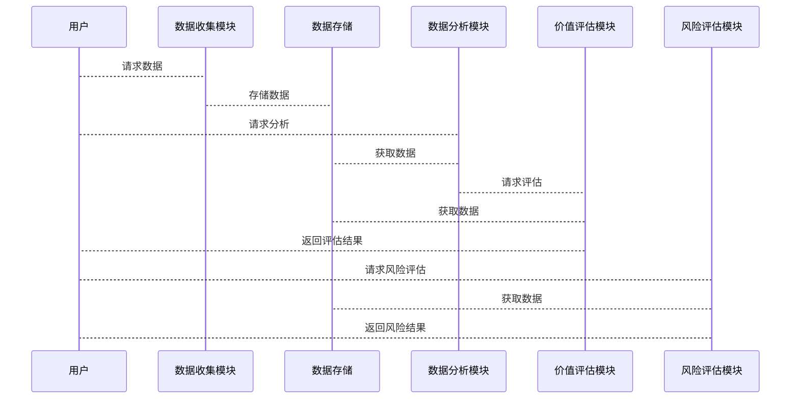

                 


```markdown
# 特价股票投资中的跨境数据流动与数字资产价值网络评估策略

> 关键词：特价股票投资，跨境数据流动，数字资产，价值网络，评估策略

> 摘要：本文探讨了在特价股票投资中，如何利用跨境数据流动和数字资产价值网络进行有效的评估和策略制定。通过分析数字资产价值网络的构建原理、算法模型和系统架构，结合实际案例，提出了切实可行的评估策略，为投资者提供了科学的决策依据。

---

# 第一部分：特价股票投资中的跨境数据流动与数字资产价值网络背景

## 第1章：特价股票投资与数字资产概述

### 1.1 特价股票投资的基本概念

#### 1.1.1 特价股票的定义与特点
- **定义**：特价股票是指在特定条件下，如价格波动、市场波动或公司公告等情况下，以低于市场价出售的股票。
- **特点**：高波动性、高风险、高收益潜力。

#### 1.1.2 特价股票投资的基本原理
- 投资者通过分析市场趋势、公司基本面和技术指标，寻找价格被低估的股票进行投资。
- 利用市场短期波动，通过短期买卖获利。

#### 1.1.3 特价股票与传统股票投资的区别
| 特性          | 特价股票                | 传统股票                |
|---------------|-------------------------|-------------------------|
| 投资目标      | 短期价格波动            | 长期价值增长            |
| 风险级别      | 高风险                 | 中低风险               |
| 持股时间      | 短期（几天到几周）       | 长期（数月到数年）       |

### 1.2 数字资产的基本概念

#### 1.2.1 数字资产的定义与分类
- **定义**：数字资产是指以数字形式存在的资产，包括加密货币（如比特币、以太坊）、代币、数字艺术品等。
- **分类**：
  1. 加密货币：如比特币、以太坊。
  2. 代币：如ERC20、SPL代币。
  3. 数字艺术品：如NFT。

#### 1.2.2 数字资产的核心特征
| 特性          | 描述                   |
|---------------|------------------------|
| 去中心化      | 不依赖传统金融机构     |
| 匿名性         | 交易隐私保护           |
| 可分割性      | 数字资产可分割为小单位  |
| 全球性         | 可以在全球范围内流通   |

#### 1.2.3 数字资产与传统金融资产的对比
| 特性          | 数字资产                | 传统金融资产            |
|---------------|-------------------------|-------------------------|
| 流动性         | 高                     | 中低                   |
| 交易成本      | 低                     | 高                     |
| 创新性        | 高                     | 中低                   |

### 1.3 跨境数据流动的定义与影响

#### 1.3.1 跨境数据流动的基本概念
- **定义**：数据在不同国家或地区之间的传输和交换。
- **类型**：
  1. 个人数据流动：如用户交易记录。
  2. 机构数据流动：如银行间的交易数据。

#### 1.3.2 跨境数据流动对金融市场的意义
- 提高交易效率：跨境数据流动使得全球金融市场能够实时交互。
- 促进资产全球化配置：投资者可以更便捷地进行跨国投资。
- 增加市场风险：数据泄露或被篡改可能导致市场波动。

#### 1.3.3 跨境数据流动的法律与技术挑战
- **法律挑战**：
  - 数据隐私保护：不同国家有不同的数据保护法规。
  - 跨境数据传输限制：某些国家限制敏感数据流出。
- **技术挑战**：
  - 数据安全：防止数据被截获或篡改。
  - 网络延迟：跨境数据传输可能带来延迟。

### 1.4 数字资产价值网络的基本结构

#### 1.4.1 数字资产价值网络的定义
- 数字资产价值网络是指通过数据流动和价值传递，形成的数字资产价值交互网络。

#### 1.4.2 数字资产价值网络的核心要素
| 要素          | 描述                   |
|---------------|------------------------|
| 数据节点      | 数据生成和存储的节点   |
| 价值节点      | 数字资产的价值评估节点 |
| 流动路径      | 数据流动的路径         |

#### 1.4.3 数字资产价值网络与金融市场的关联
- 数字资产价值网络通过跨境数据流动，与全球金融市场形成互动，影响资产价格和市场趋势。

### 1.5 本章小结
本章介绍了特价股票投资和数字资产的基本概念，分析了跨境数据流动的定义、影响及面临的挑战，并阐述了数字资产价值网络的基本结构，为后续的深入分析奠定了基础。

---

# 第二部分：数字资产价值网络与跨境数据流动的核心概念

## 第2章：数字资产价值网络的构建原理

### 2.1 数字资产价值网络的构建基础

#### 2.1.1 数据流动的网络结构
- 数据在不同节点之间的流动形成了网络结构，如交易数据在交易所、投资者和监管机构之间的流动。

#### 2.1.2 数字资产的流动路径
- 数字资产从发行方到投资者的流动路径，涉及多个中间节点，如交易所、支付平台等。

#### 2.1.3 价值网络的动态特征
- 网络的动态特征包括节点权重的变化、边权重的变化以及网络的拓扑结构变化。

### 2.2 数字资产价值网络的核心算法

#### 2.2.1 数据流动的网络模型


#### 2.2.2 数字资产的价值评估算法
- 算法流程：
  1. 收集交易数据。
  2. 提取特征（如价格、交易量、市场情绪）。
  3. 训练机器学习模型（如随机森林、神经网络）。
  4. 预测资产价值。

#### 2.2.3 网络节点的价值权重计算
- 公式：
  $$w_i = \frac{\sum_{j} w_{ij}}{\sum_{i} \sum_{j} w_{ij}}$$
  其中，\( w_i \) 表示节点 \( i \) 的价值权重。

### 2.3 数字资产价值网络的实体关系图
```mermaid
er
    actor 投资者
    actor 交易所
    actor 监管机构
    entity 数字资产
    entity 交易数据
    entity 价值网络
    relation 投资者 -[> ]-> 交易所
    relation 交易所 -[> ]-> 交易数据
    relation 交易数据 -[> ]-> 价值网络
```

### 2.4 本章小结
本章详细分析了数字资产价值网络的构建基础和核心算法，通过图表和公式，解释了数据流动和价值网络的构建过程，为后续的算法设计和系统实现提供了理论支持。

---

# 第三部分：跨境数据流动与数字资产价值网络的算法原理

## 第3章：数字资产价值网络的评估策略

### 3.1 数据流动的网络模型

#### 3.1.1 数据流动的网络结构
- 使用Mermaid流程图展示数据流动的网络结构。

#### 3.1.2 数据流动的特征分析
- 包括数据量、数据类型、数据流向等。

### 3.2 数字资产的价值评估算法

#### 3.2.1 价值评估的数学模型
- 公式：
  $$V = a \cdot P + b \cdot Q + c \cdot M$$
  其中，\( V \) 是价值，\( P \) 是价格，\( Q \) 是交易量，\( M \) 是市场情绪，\( a \)、\( b \)、\( c \) 是权重系数。

#### 3.2.2 价值评估的算法实现
- 使用Python代码实现价值评估算法：
```python
import pandas as pd
from sklearn.ensemble import RandomForestRegressor

# 数据加载
data = pd.read_csv('交易数据.csv')

# 特征提取
features = ['价格', '交易量', '市场情绪']
target = '价值'

# 模型训练
model = RandomForestRegressor()
model.fit(data[features], data[target])

# 预测价值
预测价值 = model.predict(new_data[features])
```

### 3.3 数字资产价值网络的风险分析

#### 3.3.1 风险评估的数学模型
- 公式：
  $$R = \sum_{i} w_i \cdot r_i$$
  其中，\( R \) 是风险，\( w_i \) 是节点权重，\( r_i \) 是风险因子。

#### 3.3.2 风险分析的算法实现
- 使用Python代码实现风险评估算法：
```python
import numpy as np

# 风险因子计算
风险因子 = np.array([0.3, 0.5, 0.2])
权重 = np.array([0.4, 0.5, 0.1])

# 风险评估
风险 = np.dot(权重, 风险因子)
```

### 3.4 本章小结
本章详细讲解了数字资产价值网络的评估策略，包括数据流动的网络模型、价值评估的数学模型和算法实现，以及风险分析的数学模型和算法实现，为实际应用提供了理论依据和实践指导。

---

# 第四部分：系统分析与架构设计

## 第4章：数字资产价值网络评估系统的架构设计

### 4.1 问题场景介绍
- 投资者在进行特价股票投资时，需要实时监控市场数据和风险因素，以制定科学的投资策略。

### 4.2 系统功能设计

#### 4.2.1 功能模块
- 数据收集模块：收集市场数据、交易数据等。
- 数据分析模块：分析数据，提取特征。
- 价值评估模块：评估资产价值，预测价格。
- 风险评估模块：评估投资风险。

#### 4.2.2 功能模块的类图


### 4.3 系统架构设计

#### 4.3.1 系统架构图


### 4.4 系统接口设计

#### 4.4.1 API接口设计
- 数据接口：提供数据收集和查询的API。
- 评估接口：提供资产价值和风险评估的API。

#### 4.4.2 用户界面设计
- 提供可视化界面，展示资产价值和风险评估结果。

### 4.5 系统交互流程

#### 4.5.1 交互流程图


### 4.6 本章小结
本章通过问题场景分析，系统功能设计和架构设计，展示了如何构建一个数字资产价值网络评估系统，并通过接口设计和交互流程图，详细说明了系统的实现方法。

---

# 第五部分：项目实战

## 第5章：数字资产价值网络评估系统的实现

### 5.1 环境安装

#### 5.1.1 安装Python环境
- 使用Anaconda安装Python 3.8及以上版本。

#### 5.1.2 安装依赖库
- 使用pip安装必要的库：
  ```bash
  pip install pandas scikit-learn matplotlib
  ```

### 5.2 核心代码实现

#### 5.2.1 数据收集模块
- 代码示例：
  ```python
  import pandas as pd
  import requests

  def 收集数据(api_url):
      response = requests.get(api_url)
      data = response.json()
      df = pd.DataFrame(data)
      return df
  ```

#### 5.2.2 数据分析模块
- 代码示例：
  ```python
  import pandas as pd
  from sklearn.preprocessing import StandardScaler

  def 数据分析(data):
      # 数据清洗
      data = data.dropna()
      # 特征提取
      features = data[['价格', '交易量', '市场情绪']]
      scaler = StandardScaler()
      features_scaled = scaler.fit_transform(features)
      return features_scaled
  ```

#### 5.2.3 价值评估模块
- 代码示例：
  ```python
  from sklearn.ensemble import RandomForestRegressor

  def 价值评估(features, labels):
      model = RandomForestRegressor()
      model.fit(features, labels)
      return model
  ```

#### 5.2.4 风险评估模块
- 代码示例：
  ```python
  import numpy as np

  def 风险评估(features, model):
      预测价值 = model.predict(features)
      风险 = np.std(预测价值)
      return 风险
  ```

### 5.3 案例分析

#### 5.3.1 数据收集与处理
- 使用API收集某数字资产的交易数据，清洗数据，提取特征。

#### 5.3.2 模型训练与评估
- 使用训练好的模型预测资产价值，并计算预测误差。

#### 5.3.3 风险分析
- 基于预测价值，计算投资风险，并制定相应的风险管理策略。

### 5.4 项目小结
本章通过实际案例，详细展示了数字资产价值网络评估系统的实现过程，包括环境安装、核心代码实现和案例分析，为读者提供了实践指导。

---

# 第六部分：最佳实践

## 第6章：数字资产价值网络评估系统的优化与拓展

### 6.1 小结
- 总结全文的主要内容，强调跨境数据流动和数字资产价值网络评估的重要性。

### 6.2 注意事项
- 数据隐私保护：确保数据在跨境流动过程中不被泄露。
- 模型准确性：选择合适的模型，提高预测精度。
- 系统稳定性：确保系统在高并发情况下的稳定运行。

### 6.3 拓展阅读
- 推荐相关书籍和论文，如《大数据金融》、《区块链技术与应用》等。

---

# 附录：代码示例与数据表

## 附录A：核心代码实现
- 提供本文中涉及的核心代码，方便读者参考和使用。

## 附录B：数据表与图表
- 提供本文中涉及的数据表和图表，帮助读者更好地理解内容。

---

# 结语

通过本文的系统分析和实际案例，读者可以深入了解特价股票投资中的跨境数据流动与数字资产价值网络评估策略。希望本文能为投资者提供科学的决策依据，帮助他们在复杂的金融市场中获得更好的投资回报。
```

