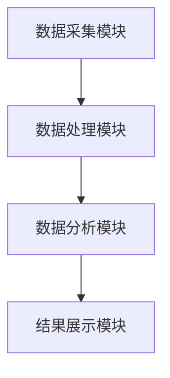
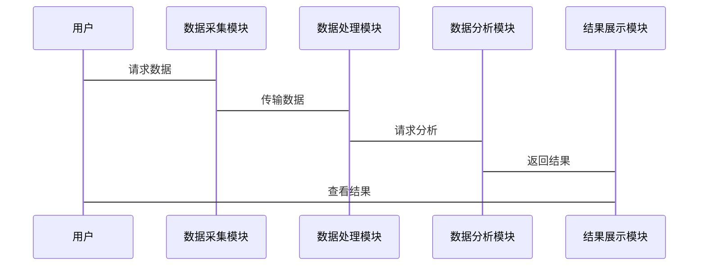

                 


# 特价股票投资中的跨境数据流动与数字资产价值评估策略

> 关键词：特价股票投资、跨境数据流动、数字资产价值评估、算法模型、系统架构

> 摘要：本文探讨了在跨境数据流动背景下，数字资产如何影响特价股票投资的价值评估。通过分析数字资产的特性、价值评估方法以及跨境数据流动对市场的潜在影响，结合数学模型和系统架构设计，提出了有效的价值评估策略。文章结合实际案例和系统实现，为投资者提供了理论和实践上的指导。

---

# 第一部分: 特价股票投资中的跨境数据流动与数字资产价值评估背景

## 第1章: 特价股票投资概述

### 1.1 特价股票投资的基本概念

#### 1.1.1 特价股票的定义与特点
- 特价股票是指市场价格低于其内在价值的股票。
- 特点：价格波动大、潜在收益高、风险较高。
- 适用场景：长期投资、价值发现。

#### 1.1.2 特价股票投资的目的与策略
- 目的：通过低价买入，高价卖出实现收益。
- 策略：价值投资、成长投资、事件驱动投资。

#### 1.1.3 特价股票投资的市场环境
- 市场环境：宏观经济、行业趋势、公司基本面。
- 风险因素：市场波动、政策风险、公司风险。

### 1.2 跨境数据流动的现状与挑战

#### 1.2.1 跨境数据流动的定义与特点
- 跨境数据流动：数据跨越国界进行传输和存储。
- 特点：实时性、全球化、复杂性。

#### 1.2.2 跨境数据流动的驱动因素
- 技术驱动：互联网技术发展。
- 经济驱动：全球化商业需求。
- 政治驱动：国际合作与竞争。

#### 1.2.3 跨境数据流动的法律与技术挑战
- 法律挑战：数据主权、隐私保护、跨境监管。
- 技术挑战：数据安全、传输延迟、带宽限制。

### 1.3 数字资产价值评估的基本原理

#### 1.3.1 数字资产的定义与分类
- 数字资产：以数字形式存在的资产，包括数字货币、NFT、数字股权。
- 分类：货币类（比特币）、价值存储类（黄金代币）、权益类（数字股票）。

#### 1.3.2 数字资产的特性与优势
- 特性：去中心化、可分割性、可编程性。
- 优势：透明性、高效性、安全性。

#### 1.3.3 数字资产的价值影响因素
- 技术因素：区块链技术、共识机制。
- 市场因素：供需关系、市场情绪。
- 政策因素：监管政策、法律法规。

---

## 第2章: 跨境数据流动对数字资产的影响

### 2.1 跨境数据流动与数字资产的相互作用

#### 2.1.1 数据流动对数字资产市场的推动作用
- 数据流动促进了全球数字资产交易的普及。
- 数据流动提高了市场的透明度和效率。

#### 2.1.2 数据流动对数字资产价格波动的影响
- 数据流动的实时性加剧了市场的波动性。
- 数据流动的地理分布影响了不同市场的联动性。

#### 2.1.3 跨境数据流动对数字资产监管的挑战
- 数据流动的跨境性增加了监管的复杂性。
- 数据流动的技术性对传统监管框架提出了挑战。

### 2.2 跨境数据流动与数字资产价值评估的联系

#### 2.2.1 数据流动对数字资产价值的影响
- 数据流动提供了全球化的市场信息，影响数字资产的价格。
- 数据流动的波动性增加了数字资产价值评估的复杂性。

#### 2.2.2 跨境数据流动对数字资产市场的风险传导
- 数据流动可能导致市场联动性增强，风险传导加速。
- 数据流动的不稳定性可能导致数字资产市场的剧烈波动。

#### 2.2.3 数据流动对数字资产价值评估的支撑作用
- 数据流动提供了丰富的数据支持，提高了评估的准确性。
- 数据流动的实时性为动态评估提供了基础。

---

## 第3章: 特价股票投资中的数字资产应用

### 3.1 数字资产在股票投资中的潜在价值

#### 3.1.1 数字资产如何影响股票价格
- 数字资产的市场波动直接影响投资者情绪，进而影响股票价格。
- 数字资产的技术创新可能推动相关股票的价值上升。

#### 3.1.2 数字资产与股票市场的互动关系
- 数字资产市场为股票市场提供了新的投资标的。
- 股票市场为数字资产提供了资金流动的渠道。

### 3.2 跨境数据流动对数字资产与股票市场的影响

#### 3.2.1 数据流动对数字资产与股票市场的联动性
- 数据流动加剧了数字资产与股票市场的联动。
- 数据流动的实时性导致市场反应更快。

#### 3.2.2 数据流动对数字资产与股票市场风险的传导
- 数据流动可能导致系统性风险的传导。
- 数据流动的不稳定性增加了市场的波动性。

#### 3.2.3 数据流动对数字资产与股票市场监管的挑战
- 数据流动的跨境性增加了监管的复杂性。
- 数据流动的技术性对传统监管框架提出了挑战。

---

# 第二部分: 数字资产价值评估的核心算法与模型

## 第4章: 数字资产价值评估的数学模型

### 4.1 时间序列分析模型

#### 4.1.1 ARIMA模型
- ARIMA（自回归积分滑动平均模型）用于预测时间序列数据。
- 模型公式：
  $$
  ARIMA(p, d, q) = y_t = \phi_1 y_{t-1} + \dots + \phi_p y_{t-p} + \theta_1 \epsilon_{t-1} + \dots + \theta_q \epsilon_{t-q} + \epsilon_t
  $$
- 应用：预测数字资产价格的短期波动。

#### 4.1.2 LSTM模型
- LSTM（长短期记忆网络）用于捕捉时间序列中的长期依赖关系。
- 模型结构：
  - 输入门（Input Gate）
  - 遗忘门（Forget Gate）
  - 输出门（Output Gate）
- 应用：预测数字资产价格的长期趋势。

#### 4.1.3 GARCH模型
- GARCH（广义自回归条件异方差模型）用于预测金融资产的波动性。
- 模型公式：
  $$
  y_t = \mu + \alpha \epsilon_{t-1}^2 + \beta \epsilon_{t-2}^2
  $$
- 应用：预测数字资产价格的波动性。

### 4.2 机器学习算法在数字资产价值评估中的应用

#### 4.2.1 支持向量回归
- SVR（支持向量回归）用于非线性回归问题。
- 模型公式：
  $$
  y = f(x) = \text{sign}(w \cdot x + b)
  $$
- 应用：评估数字资产的长期价值。

#### 4.2.2 随机森林回归
- 随机森林回归用于处理高维数据的回归问题。
- 核心思想：基于决策树的集成学习。
- 应用：评估数字资产的综合价值。

#### 4.2.3 神经网络模型
- DNN（深度神经网络）用于复杂非线性关系的建模。
- 模型结构：输入层、隐藏层、输出层。
- 应用：预测数字资产价格的复杂波动。

---

## 第5章: 跨境数据流动对数字资产价值的影响模型

### 5.1 数据流动对数字资产市场的影响

#### 5.1.1 数据流动的地理分布对数字资产价格的影响
- 数据流动的地理分布影响市场的联动性。
- 案例分析：比特币价格在不同市场的波动差异。

#### 5.1.2 数据流动的量级对数字资产波动的影响
- 数据流动的量级反映了市场热度。
- 案例分析：交易量与价格波动的相关性。

#### 5.1.3 数据流动的实时性对数字资产交易的影响
- 实时数据流动支持高频交易。
- 案例分析：高频交易对数字资产价格的影响。

### 5.2 数据流动驱动的数字资产价值评估模型

#### 5.2.1 数据流动驱动的回归模型
- 模型公式：
  $$
  y = \beta_0 + \beta_1 x_1 + \beta_2 x_2 + \dots + \beta_n x_n + \epsilon
  $$
- 应用：基于数据流动预测数字资产价格。

#### 5.2.2 数据流动驱动的分类模型
- 分类模型：决策树、随机森林、神经网络。
- 应用：基于数据流动判断数字资产的上涨或下跌趋势。

#### 5.2.3 数据流动驱动的时间序列预测模型
- LSTM模型用于时间序列预测。
- 应用：基于数据流动预测数字资产的未来价格。

---

# 第三部分: 系统架构与项目实战

## 第6章: 数字资产价值评估系统架构设计

### 6.1 系统功能设计

#### 6.1.1 数据采集模块
- 功能：采集数字资产的市场数据。
- 数据来源：加密货币交易所、金融数据平台。

#### 6.1.2 数据处理模块
- 功能：清洗、转换和存储数据。
- 技术：数据清洗算法、数据转换工具。

#### 6.1.3 数据分析模块
- 功能：分析数据，生成价值评估结果。
- 技术：机器学习算法、统计分析工具。

#### 6.1.4 结果展示模块
- 功能：可视化分析结果。
- 工具：图表生成工具、数据可视化平台。

### 6.2 系统架构设计

#### 6.2.1 系统架构图


#### 6.2.2 系统接口设计
- 接口1：数据采集模块接口。
- 接口2：数据分析模块接口。
- 接口3：结果展示模块接口。

#### 6.2.3 系统交互流程图


### 6.3 项目实战

#### 6.3.1 环境安装
- 安装Python：`python --version`
- 安装依赖库：`pip install numpy pandas scikit-learn`

#### 6.3.2 核心实现代码

##### 数据采集模块
```python
import requests
import pandas as pd

def fetch_data(api_url):
    response = requests.get(api_url)
    data = response.json()
    df = pd.DataFrame(data)
    return df
```

##### 数据处理模块
```python
def preprocess_data(df):
    df.dropna(inplace=True)
    df['date'] = pd.to_datetime(df['date'])
    return df
```

##### 数据分析模块
```python
from sklearn.ensemble import RandomForestRegressor

def train_model(X, y):
    model = RandomForestRegressor()
    model.fit(X, y)
    return model
```

##### 结果展示模块
```python
import matplotlib.pyplot as plt

def plot_results(predictions, actual):
    plt.plot(predictions, label='预测值')
    plt.plot(actual, label='实际值')
    plt.legend()
    plt.show()
```

#### 6.3.3 案例分析
- 数据来源：比特币价格数据。
- 分析过程：数据清洗、特征提取、模型训练、结果可视化。

#### 6.3.4 项目小结
- 项目总结：系统实现的优缺点。
- 经验总结：数据处理的注意事项、模型选择的影响。

---

## 第7章: 最佳实践与小结

### 7.1 小结

#### 7.1.1 核心概念回顾
- 特价股票投资的基本概念。
- 跨境数据流动对数字资产的影响。
- 数字资产价值评估的方法。

#### 7.1.2 算法与模型总结
- 时间序列分析模型的应用。
- 机器学习算法的优缺点。

### 7.2 注意事项

#### 7.2.1 投资风险提示
- 数字资产市场的高波动性。
- 政策风险的不确定性。

#### 7.2.2 系统设计的注意事项
- 数据安全的重要性。
- 系统架构的可扩展性。

### 7.3 拓展阅读

#### 7.3.1 推荐书籍
- 《数字资产投资指南》。
- 《数据科学与机器学习实战》。

#### 7.3.2 在线资源
- 数字资产交易平台。
- 数据科学社区。

---

# 结语

通过本文的分析与实践，我们可以看到，跨境数据流动与数字资产价值评估在特价股票投资中的重要性。结合数学模型与系统架构设计，我们可以更准确地评估数字资产的价值，并为投资决策提供科学依据。未来，随着技术的不断发展，数字资产与股票市场的结合将更加紧密，跨境数据流动的影响也将更加深远。

---

以上是文章的完整目录大纲和内容框架，您可以根据需要进一步扩展每一部分的具体内容。

