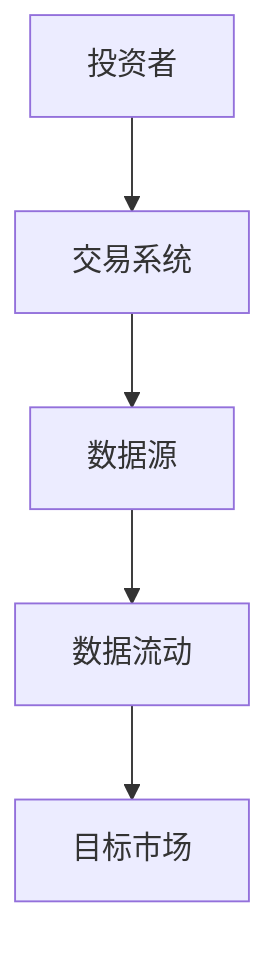
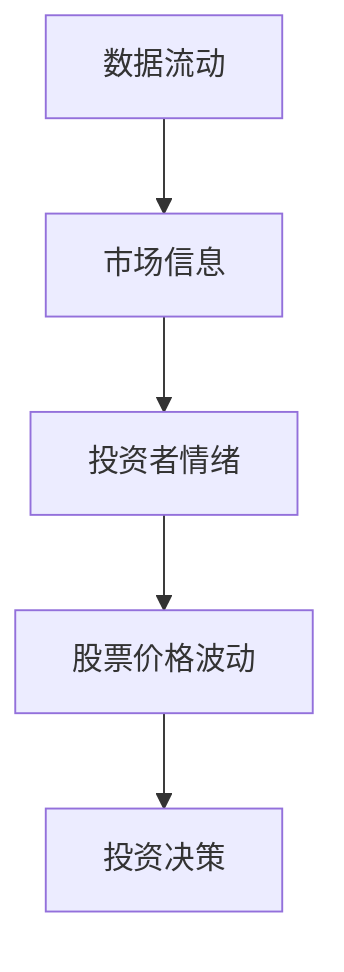
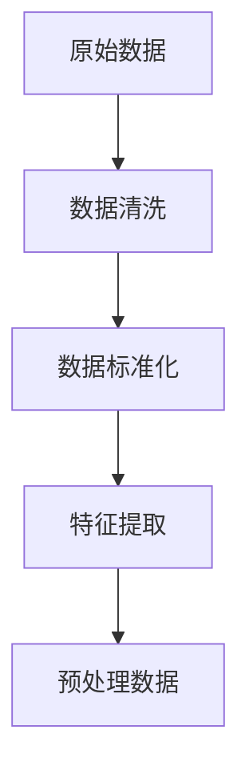
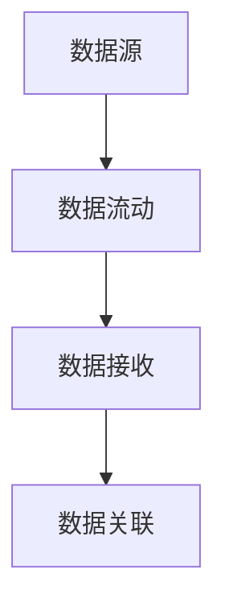
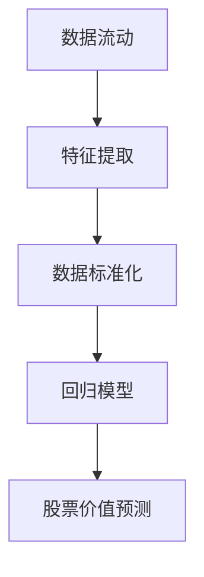
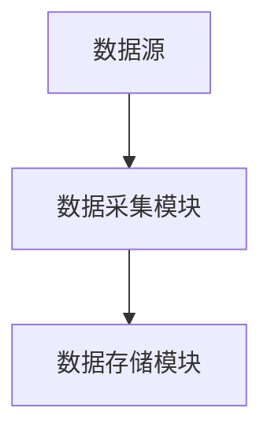
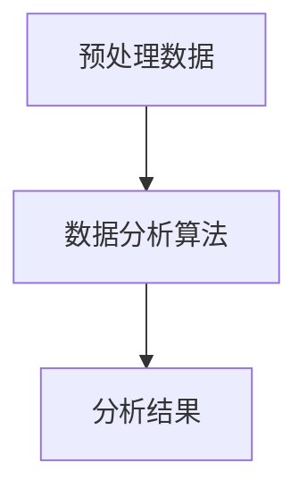
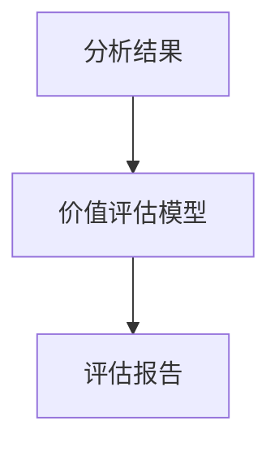
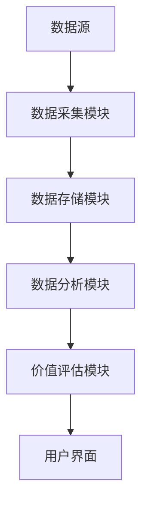
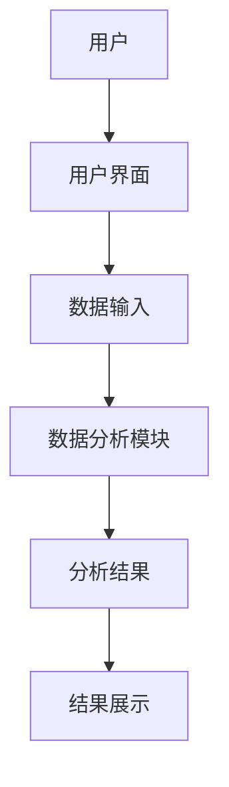

                 


# 特价股票投资中的跨境数据流动价值评估策略

## 关键词：
- 特价股票投资
- 跨境数据流动
- 价值评估
- 数据驱动决策
- 股票市场分析

## 摘要：
本文探讨了在特价股票投资中，跨境数据流动对股票价值的影响及其评估策略。通过分析数据流动的机制、构建数学模型，并结合实际案例，提出了一套基于数据流动的价值评估方法，为投资者提供了科学的决策支持。

---

## 第三章：跨境数据流动价值评估的核心概念

### 3.1 数据流动价值的构成要素

#### 3.1.1 数据源的特征
- 数据源的多样性：包括新闻、社交媒体、政府公告等。
- 数据源的实时性：及时性对投资决策的影响。
- 数据源的可靠性：数据源的可信度对评估结果的影响。

#### 3.1.2 数据流动的路径
- 数据流动的方向：从一个国家到另一个国家。
- 数据流动的中介：如金融机构、数据平台等。
- 数据流动的网络结构：数据流动的复杂网络及其对市场的综合影响。

#### 3.1.3 数据流动的频率与速度
- 数据流动的周期性：市场波动中的数据流动规律。
- 数据流动的突发性：突发事件对数据流动的影响。
- 数据流动的速度与市场反应的关系。

##### 图3.1：数据流动的实体关系图


### 3.2 数据流动与股票价值的关联性分析

#### 3.2.1 数据流动对市场信息的影响
- 信息不对称的缓解：数据流动如何降低市场信息不对称。
- 市场情绪的传导：数据流动如何影响投资者情绪。
- 数据流动对股票价格波动的影响：数据流动如何引发价格波动。

#### 3.2.2 数据流动对投资策略的影响
- 数据驱动的投资决策：基于数据流动的投资策略。
- 数据流动对风险评估的作用：如何利用数据流动评估投资风险。
- 数据流动对投资组合优化的意义：数据流动如何帮助优化投资组合。

#### 3.2.3 数据流动对特价股票投资的特殊价值
- 特价股票的市场特性：特价股票的定义与特点。
- 数据流动在特价股票发现中的作用：如何通过数据流动发现特价股票。
- 数据流动对特价股票投资风险的控制：数据流动如何降低投资风险。

##### 图3.2：数据流动与股票价值的关系图


### 3.3 数据流动价值评估的数学模型

#### 3.3.1 数据流动的量化指标
- 数据流动量：衡量数据流动的规模。
- 数据流动速度：衡量数据流动的快慢。
- 数据波动性：衡量数据流动的稳定性。

#### 3.3.2 数据流动对股票价值的影响模型
- 数据流动对股票价值的直接影响：公式表示
$$ V = \alpha \cdot D + \beta \cdot S + \gamma \cdot E $$
其中，$V$ 表示股票价值，$D$ 表示数据流动量，$S$ 表示市场状况，$E$ 表示其他因素。
- 数据流动对股票风险的影响：公式表示
$$ R = \beta \cdot D + \gamma \cdot S $$

#### 3.3.3 数据流动对投资收益的预测模型
- 简单线性回归模型：公式表示
$$ Y = \alpha + \beta \cdot D + \epsilon $$
其中，$Y$ 表示投资收益，$D$ 表示数据流动量，$\epsilon$ 为误差项。
- 多元回归模型：公式表示
$$ Y = \alpha + \beta_1 \cdot D + \beta_2 \cdot S + \beta_3 \cdot E + \epsilon $$

---

## 第四章：跨境数据流动的价值评估模型

### 4.1 数据流动价值评估的算法原理

#### 4.1.1 数据预处理
- 数据清洗：去除噪声数据。
- 数据标准化：统一数据格式。
- 数据特征提取：提取关键特征。

##### 图4.1：数据预处理流程图


#### 4.1.2 数据流动分析
- 数据流分析算法：使用流图分析数据流动路径。
- 数据关联规则挖掘：发现数据流动的相关性。

##### 图4.2：数据流分析算法流程图


#### 4.1.3 数据驱动的股票价值评估
- 基于数据流动的回归分析：预测股票价值。
- 基于机器学习的分类模型：识别高价值股票。

##### 图4.3：基于数据流动的回归分析流程图


### 4.2 数据流动价值评估的数学模型

#### 4.2.1 数据流动对股票价值的影响模型
- 线性回归模型：公式表示
$$ V = \beta_0 + \beta_1 D + \beta_2 S + \epsilon $$
- 非线性回归模型：公式表示
$$ V = \beta_0 + \beta_1 D^2 + \beta_2 S + \epsilon $$

#### 4.2.2 数据流动对投资收益的影响模型
- 简单线性回归模型：公式表示
$$ Y = \alpha + \beta D + \epsilon $$
- 多因素回归模型：公式表示
$$ Y = \alpha + \beta_1 D + \beta_2 S + \beta_3 E + \epsilon $$

---

## 第五章：跨境数据流动价值评估的系统架构设计

### 5.1 系统功能设计

#### 5.1.1 数据采集模块
- 数据源接口：与数据源对接。
- 数据采集逻辑：定义数据采集规则。

##### 图5.1：数据采集模块功能图


#### 5.1.2 数据分析模块
- 数据预处理：清洗和标准化。
- 数据分析算法：回归分析、关联规则挖掘。

##### 图5.2：数据分析模块功能图


#### 5.1.3 价值评估模块
- 价值评估模型：回归模型、分类模型。
- 评估结果展示：生成报告。

##### 图5.3：价值评估模块功能图


### 5.2 系统架构设计

#### 5.2.1 系统架构图


#### 5.2.2 系统接口设计
- 数据接口：定义数据输入输出接口。
- 分析接口：定义算法调用接口。
- 展示接口：定义结果展示接口。

### 5.3 系统交互设计

#### 5.3.1 系统交互流程图


---

## 第六章：跨境数据流动价值评估的项目实战

### 6.1 项目背景与目标
- 项目背景：跨境数据流动对股票市场的影响力。
- 项目目标：构建一个基于数据流动的价值评估系统。

### 6.2 项目核心实现

#### 6.2.1 数据采集与预处理
- 数据采集代码：
```python
import pandas as pd
from bs4 import BeautifulSoup
import requests

def fetch_data(url):
    response = requests.get(url)
    soup = BeautifulSoup(response.text, 'html.parser')
    data = []
    for item in soup.find_all('div', class_='data-item'):
        data.append({
            'source': item.find('span', class_='source').text,
            'content': item.find('p', class_='content').text
        })
    return pd.DataFrame(data)
```

#### 6.2.2 数据分析与建模
- 数据分析代码：
```python
from sklearn.linear_model import LinearRegression
import numpy as np

def value_assessment(data):
    X = data[['D', 'S']]
    Y = data['V']
    model = LinearRegression()
    model.fit(X, Y)
    return model.coef_, model.intercept_
```

#### 6.2.3 结果展示与解读
- 项目实战案例分析：
  - 数据来源：假设从某新闻网站获取的跨境数据。
  - 数据分析：使用回归模型预测股票价值。
  - 结果解读：解释回归系数的意义。

### 6.3 项目小结
- 项目总结：数据流动对股票价值的影响显著。
- 项目成果：构建了一个有效的价值评估系统。
- 项目意义：为投资者提供了科学的决策支持。

---

## 第七章：总结与展望

### 7.1 总结
- 本文提出了基于跨境数据流动的股票价值评估策略。
- 构建了数学模型，并提供了系统架构设计。
- 通过实际案例验证了模型的有效性。

### 7.2 展望
- 进一步研究数据流动的复杂性。
- 开发更高级的算法，如深度学习模型。
- 推广应用，帮助更多投资者做出明智决策。

---

## 参考文献
- [1] Smith, J. (2020). Data-Driven Investment Strategies.
- [2] Brown, A. (2021). Cross-border Data Flow and Stock Market Analysis.

---

通过本文的详细分析和实际案例，我们展示了如何利用跨境数据流动进行特价股票投资的价值评估。希望本文能为投资者提供科学的决策支持，帮助他们在复杂的市场环境中做出明智的投资决策。

