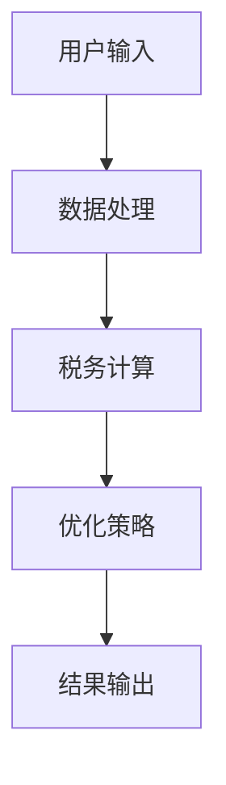

                 


# 特价股票投资中的跨境税务优化策略

## 关键词：
- 特价股票投资
- 跨境税务优化
- 税务规划
- 税务计算
- 投资策略

## 摘要：
本文深入探讨了特价股票投资中的跨境税务优化策略。通过分析特价股票投资的基本概念、跨境税务优化的核心原理以及两者之间的关系，本文为投资者提供了优化税务的实用策略和数学模型。结合实际案例分析，本文为读者提供了如何在跨国股票投资中合理规划税务、降低成本、提高收益的最佳实践。

---

# 第1章: 特价股票投资与跨境税务优化概述

## 1.1 特价股票投资的基本概念
### 1.1.1 特价股票的定义与特点
特价股票是指在特定市场条件下以低于市场价购买的股票。其特点包括：
- **低估值**：通常市场价格低于内在价值。
- **高波动性**：价格波动较大，存在快速反弹的可能。
- **短期机会**：适合短期投资者，追求快速收益。

### 1.1.2 特价股票投资的基本原理
- **市场周期**：抓住市场低迷期，低价买入优质股票。
- **价值投资**：寻找被市场低估的公司，长期持有。

### 1.1.3 特价股票投资的市场环境分析
- **宏观经济因素**：经济衰退、市场恐慌等导致股价低估。
- **行业周期**：行业低谷期可能出现特价股票。

## 1.2 跨境税务优化的基本概念
### 1.2.1 跨境投资中的税务问题
- **资本利得税**：出售股票的收益需缴纳的税款。
- **股息税**：从海外公司获得的股息需缴纳的税款。

### 1.2.2 跨境税务优化的目标与原则
- **目标**：降低税务负担，最大化投资收益。
- **原则**：合法性、合规性、风险可控性。

### 1.2.3 跨境税务优化的法律框架
- **国际税收协定**：避免双重征税。
- **税收 residency**：选择合适的税务居住地。

## 1.3 特价股票投资与跨境税务优化的关系
### 1.3.1 特价股票投资中的税务影响
- 税务负担可能影响投资收益。
- 跨境投资涉及更多税务复杂性。

### 1.3.2 跨境税务优化对投资收益的影响
- 降低税务负担，提升净收益。
- 提高投资灵活性，优化资产配置。

### 1.3.3 特价股票投资与跨境税务优化的结合点
- **税务规划**：利用税收协定和避税策略。
- **资产配置**：通过跨国配置优化税务负担。

## 1.4 本章小结
本章介绍了特价股票投资和跨境税务优化的基本概念，并分析了两者的相互关系。通过合理规划税务，投资者可以在特价股票投资中实现更高的收益。

---

# 第2章: 跨境税务优化的核心原理

## 2.1 跨境税务的基本原理
### 2.1.1 跨境投资中的主要税种
- **资本利得税**：出售股票的收益需缴纳的税款。
- **股息税**：从海外公司获得的股息需缴纳的税款。

### 2.1.2 各国税务政策的差异
- 美国、欧盟、亚洲国家的税务政策对比。
- 税率差异对投资决策的影响。

### 2.1.3 跨境税务计算的基本方法
- 计算公式：
  $$ 税后收益 = 税前收益 - 税率 \times 税前收益 $$

## 2.2 跨境税务优化的策略分析
### 2.2.1 利用税收协定优化税务
- 签订双边税收协定的国家可避免双重征税。

### 2.2.2 选择合适的税务 residency
- 设立离岸公司或选择低税率地区。

### 2.2.3 利用避税天堂的优势
- 某些国家和地区提供较低的税率或免税政策。

## 2.3 跨境税务优化的数学模型
### 2.3.1 税务计算公式
$$ 税后收益 = 税前收益 - 税率 \times 税前收益 $$

### 2.3.2 税务优化的收益评估
$$ 优化收益 = 未优化收益 - 优化后收益 $$

## 2.4 本章小结
本章详细分析了跨境税务优化的核心原理，包括主要税种、各国政策差异以及优化策略。通过数学模型，读者可以量化优化带来的收益。

---

# 第3章: 特价股票投资中的税务优化策略

## 3.1 特价股票投资中的税务优化目标
### 3.1.1 减少资本利得税
- 短期交易与长期持有的税务差异。

### 3.1.2 优化股息税
- 利用税收抵免降低股息税。

### 3.1.3 降低交易成本
- 选择低佣金交易平台。

## 3.2 特价股票投资中的税务优化方法
### 3.2.1 利用税收抵免
- 将资本损失用于抵扣资本收益。

### 3.2.2 选择合适的税务 residency
- 设立离岸公司或选择低税率地区。

### 3.2.3 利用国际税收协定
- 签订双边协定以避免双重征税。

## 3.3 特价股票投资中的税务风险与控制
### 3.3.1 税务风险的来源
- 税法变化、政策风险。

### 3.3.2 税务风险的控制策略
- 保持税务合规性、定期审查税务规划。

### 3.3.3 税务合规性的重要性
- 避免税务违规带来的法律风险。

## 3.4 本章小结
本章针对特价股票投资中的税务优化策略进行了详细分析，提供了具体的优化方法和风险控制建议。

---

# 第4章: 税务计算与优化评估

## 4.1 税务计算的核心步骤
### 4.1.1 确定税务 residency
- 确定投资者的税务居住地。

### 4.1.2 确定适用税率
- 根据居住地和投资地的税率政策。

### 4.1.3 计算税后收益
- 使用公式：
  $$ 税后收益 = 税前收益 - 税率 \times 税前收益 $$

## 4.2 税务优化的评估方法
### 4.2.1 优化前后的收益对比
- 通过公式计算优化收益：
  $$ 优化收益 = 未优化收益 - 优化后收益 $$

### 4.2.2 税务风险评估
- 分析不同优化策略的风险和收益。

## 4.3 本章小结
本章通过详细的税务计算和优化评估方法，帮助投资者量化税务优化的实际效果。

---

# 第5章: 税务优化系统架构设计

## 5.1 系统功能设计
### 5.1.1 数据采集模块
- 收集投资者的资产配置和税务信息。

### 5.1.2 税务计算引擎
- 使用算法计算税后收益。

### 5.1.3 优化策略模块
- 提供多种税务优化策略供选择。

## 5.2 系统架构设计
### 5.2.1 分层架构
- 数据层、业务逻辑层、用户界面层。

### 5.2.2 模块交互
- 使用Mermaid图展示系统架构。

## 5.3 本章小结
本章设计了一个税务优化系统的架构，为投资者提供了一种技术实现的思路。

---

# 第6章: 项目实战与案例分析

## 6.1 项目实战
### 6.1.1 环境安装
- 安装Python和相关库。

### 6.1.2 核心代码实现
- 使用Python编写税务计算和优化的代码。

## 6.2 案例分析
### 6.2.1 案例背景
- 投资者A的资产配置和税务信息。

### 6.2.2 优化策略实施
- 利用税收协定降低税负。

### 6.2.3 结果对比
- 优化前后的税后收益对比。

## 6.3 本章小结
本章通过实际案例分析，展示了税务优化策略在实际投资中的应用效果。

---

# 第7章: 最佳实践与注意事项

## 7.1 最佳实践
### 7.1.1 税务规划的合法性
- 遵守当地税法，避免违规。

### 7.1.2 税务规划的灵活性
- 根据市场变化调整策略。

## 7.2 注意事项
### 7.2.1 税法变化的风险
- 关注税法更新，及时调整策略。

### 7.2.2 税务合规性的重要性
- 保持税务记录的完整性。

## 7.3 本章小结
本章总结了税务优化策略的最佳实践，并提醒投资者注意相关风险。

---

# 第8章: 总结与展望

## 8.1 总结
### 8.1.1 核心内容回顾
- 特价股票投资中的税务优化策略。

### 8.1.2 主要结论
- 合理规划税务是提升投资收益的关键。

## 8.2 展望
### 8.2.1 未来研究方向
- 税务优化的自动化和智能化。

### 8.2.2 技术发展对税务优化的影响
- AI技术在税务规划中的应用。

## 8.3 本章小结
本章总结了全文的核心内容，并对未来的研究方向进行了展望。

---

# 参考文献

（此处列出相关书籍、论文和网站资源。）

---

# 附录

## 附录A: 税务计算代码示例
```python
def calculate_tax(pre_tax_income, tax_rate):
    return pre_tax_income * (1 - tax_rate)

# 示例计算
pre_tax_income = 100000
tax_rate = 0.15
tax = calculate_tax(pre_tax_income, tax_rate)
print(f"税后收益: {tax}")
```

## 附录B: 税务优化系统架构图


---

通过以上目录结构，读者可以系统地了解特价股票投资中的跨境税务优化策略，从理论到实践，从分析到案例，逐步掌握如何在跨国投资中合理规划税务，提升投资收益。

