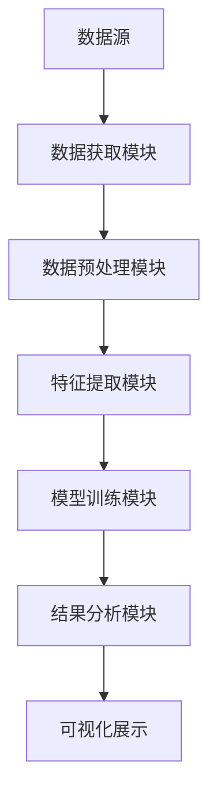
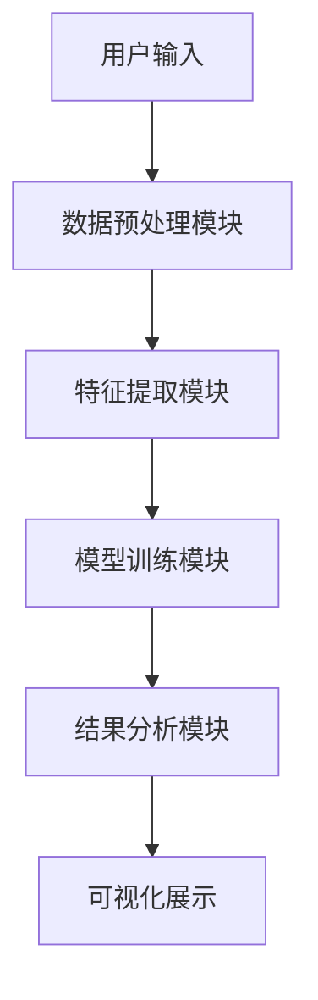

                 


# 特价股票投资中的跨资产类别数字相关性预测分析

## 关键词
- 特价股票投资
- 跨资产类别
- 数字相关性
- 预测分析
- 人工智能

## 摘要
本文旨在探讨如何通过跨资产类别的数字相关性预测分析来优化特价股票投资策略。通过分析不同资产类别之间的相关性，投资者可以更好地理解市场动态，识别潜在风险，并制定更科学的投资决策。文章将从相关性预测的基本原理入手，结合数学模型和算法，详细讲解如何利用这些方法来提升投资收益。

---

# 第一部分: 特价股票投资中的跨资产类别数字相关性预测概述

## 第1章: 特价股票投资与跨资产相关性预测概述

### 1.1 特价股票投资的背景与意义
#### 1.1.1 特价股票的定义与特点
特价股票是指价格相对市场指数或行业基准处于低位的股票，通常具有较高的潜在回报率。其特点是价格低廉、估值可能被市场低估，吸引寻求高回报的投资者。

#### 1.1.2 跨资产类别投资的必要性
现代投资组合理论强调资产多样化配置，通过将资金分配到不同的资产类别（如股票、债券、商品等）来降低风险并提高收益。跨资产类别投资能够帮助投资者在市场波动中保持稳定性。

#### 1.1.3 数字相关性预测在投资中的作用
数字相关性预测通过分析不同资产类别之间的价格波动、收益趋势等数据，帮助投资者识别资产之间的关联性，从而优化投资组合配置。

### 1.2 跨资产类别相关性的概念与重要性
#### 1.2.1 资产类别与相关性的基本概念
资产类别是指具有相似特性和风险的金融资产的集合。相关性是衡量两种资产价格变动方向和程度的指标，通常用相关系数（-1到1之间）表示。

#### 1.2.2 数字相关性预测的核心意义
通过数字相关性预测，投资者可以了解不同资产类别之间的互动关系，从而在市场变化中做出更精准的投资决策。

#### 1.2.3 跨资产相关性对投资决策的影响
资产之间的高度相关性可能导致投资组合的波动性增加，而低相关性或负相关性则有助于分散风险，提高收益稳定性。

### 1.3 数字相关性预测的背景与技术基础
#### 1.3.1 数字技术在金融领域的应用
大数据、人工智能等技术的进步为金融数据分析提供了新的工具和方法，使得跨资产相关性预测成为可能。

#### 1.3.2 大数据与人工智能在金融预测中的作用
通过收集和分析海量数据，人工智能算法能够识别复杂市场中的潜在模式，为投资决策提供支持。

#### 1.3.3 数字相关性预测的数学基础
相关性预测基于统计学和时间序列分析，通过协方差、相关系数等数学工具来量化资产之间的关联性。

### 1.4 本书的核心目标与结构安排
#### 1.4.1 本书的核心研究目标
探讨如何利用跨资产类别数字相关性预测来优化特价股票投资策略。

#### 1.4.2 目录结构与内容安排
本书将从相关性预测的基本原理开始，逐步深入探讨算法原理、系统架构、项目实战等内容。

#### 1.4.3 读者对象与学习方法
本书适合对量化投资和金融数据分析感兴趣的读者，建议读者具备一定的数学和编程基础。

### 1.5 本章小结
本章介绍了特价股票投资和跨资产相关性预测的基本概念，强调了数字相关性预测在投资决策中的重要性，并为后续章节奠定了基础。

---

# 第二部分: 跨资产类别数字相关性预测的核心概念与原理

## 第2章: 跨资产类别相关性的数学模型与公式

### 2.1 相关性计算的数学基础
#### 2.1.1 协方差与相关系数的定义
协方差是衡量两个变量之间变化方向的指标，相关系数是标准化后的协方差，范围在-1到1之间。

协方差公式：
$$ \text{Cov}(X, Y) = \frac{1}{n-1} \sum_{i=1}^{n} (X_i - \bar{X})(Y_i - \bar{Y}) $$

相关系数公式：
$$ r_{xy} = \frac{\text{Cov}(X, Y)}{\sqrt{\text{Var}(X)} \sqrt{\text{Var}(Y)}} $$

#### 2.1.2 相关系数的公式推导
相关系数的计算涉及协方差和方差的计算，公式推导清晰，结果直观。

#### 2.1.3 相关系数的性质与特点
相关系数具有对称性、传递性和尺度不变性等特点，能够有效反映资产之间的关联程度。

### 2.2 跨资产相关性的统计学分析
#### 2.2.1 资产回报率的分布特征
资产回报率通常服从正态分布或幂律分布，不同资产的分布特征影响相关性分析的结果。

#### 2.2.2 时间序列数据的相关性分析
时间序列数据的相关性分析需要考虑自相关性和交叉相关性，常用自相关函数（ACF）和部分自相关函数（PACF）进行分析。

#### 2.2.3 资产相关性的矩阵表示
通过构建相关性矩阵，可以清晰地展示不同资产类别之间的相关性关系。

### 2.3 数字相关性预测的数学模型
#### 2.3.1 线性回归模型在相关性预测中的应用
线性回归模型可以用于预测资产之间的相关性变化，但其假设条件限制了其在复杂市场中的应用。

#### 2.3.2 聚类分析与相关性分组
聚类分析可以根据资产之间的相关性将它们分成不同的组别，便于投资组合管理和风险控制。

#### 2.3.3 时间序列模型的相关性预测
ARIMA模型等时间序列模型可以用于预测未来资产之间的相关性变化。

### 2.4 本章公式总结
本章通过公式推导和实例分析，详细讲解了相关性计算的数学基础及其在资产相关性预测中的应用。

---

# 第三部分: 跨资产类别数字相关性预测的算法原理

## 第3章: 跨资产类别数字相关性预测的算法实现

### 3.1 相关性预测的主要算法
#### 3.1.1 协方差矩阵计算
通过计算多个资产之间的协方差矩阵，可以得到它们的相关性矩阵。

协方差矩阵公式：
$$ \Sigma = \begin{bmatrix} 
\sigma_{1}^2 & \sigma_{1,2} & \dots & \sigma_{1,n} \\
\sigma_{2,1} & \sigma_{2}^2 & \dots & \sigma_{2,n} \\
\vdots & \vdots & \ddots & \vdots \\
\sigma_{n,1} & \sigma_{n,2} & \dots & \sigma_{n}^2 
\end{bmatrix} $$

#### 3.1.2 Granger因果关系检验
Granger因果关系检验用于判断一个时间序列是否是另一个时间序列的“原因”。其基本思想是，如果变量X对变量Y有Granger因果关系，则X的过去信息有助于预测Y的当前值。

Granger因果关系检验流程图：

```mermaid
graph TD
    A[原假设：X不引起Y] --> B[备择假设：X引起Y]
    B --> C[回归模型：Y ~ lag(Y,1), lag(Y,2), ..., lag(Y,k), lag(X,1), ..., lag(X,k)]
    C --> D[计算F统计量]
    D --> E[比较F值与临界值]
    E --> F[拒绝原假设或不拒绝]
```

#### 3.1.3 时间序列分析模型
时间序列分析模型（如ARIMA）可以用于预测资产之间的相关性变化。

ARIMA模型公式：
$$
\phi(\mathcal{B}) (1 - \mathcal{B})^d X_t = \theta(\mathcal{B}) \epsilon_t
$$

### 3.2 算法实现步骤
#### 3.2.1 数据获取与预处理
从金融数据源获取历史价格数据，并进行清洗和标准化处理。

#### 3.2.2 特征提取与计算
计算资产之间的协方差矩阵和相关系数矩阵。

#### 3.2.3 模型训练与验证
使用Granger因果关系检验和时间序列模型进行相关性预测，并通过回测验证模型的准确性。

### 3.3 本章小结
本章详细讲解了跨资产相关性预测的主要算法及其实现步骤，为后续的系统设计和项目实战奠定了基础。

---

# 第四部分: 跨资产类别数字相关性预测的系统设计

## 第4章: 跨资产类别数字相关性预测的系统架构

### 4.1 系统功能设计
#### 4.1.1 数据获取模块
负责从金融数据源获取实时或历史数据。

#### 4.1.2 数据预处理模块
对获取的数据进行清洗、标准化和特征提取。

#### 4.1.3 相关性计算模块
计算资产之间的协方差矩阵和相关系数矩阵。

#### 4.1.4 模型训练模块
使用Granger检验和时间序列模型进行相关性预测。

#### 4.1.5 结果分析模块
对预测结果进行可视化展示和回测分析。

### 4.2 系统架构设计
跨资产相关性预测系统的架构包括数据层、计算层、模型层和展示层。

系统架构图：



### 4.3 系统接口设计
系统需要提供API接口，供其他模块调用相关性计算和预测结果。

### 4.4 系统交互设计
用户可以通过图形界面进行数据输入、模型选择和结果查看。

系统交互流程图：



### 4.5 本章小结
本章通过系统架构设计，展示了跨资产相关性预测的整体框架和实现步骤。

---

# 第五部分: 跨资产类别数字相关性预测的项目实战

## 第5章: 跨资产类别数字相关性预测的项目实现

### 5.1 项目环境与工具安装
#### 5.1.1 环境配置
安装Python、NumPy、Pandas、Matplotlib、Scikit-learn等工具。

```bash
pip install numpy pandas matplotlib scikit-learn
```

#### 5.1.2 数据源获取
从Yahoo Finance等数据源获取历史价格数据。

### 5.2 核心代码实现
#### 5.2.1 数据预处理
清洗数据并计算资产之间的协方差矩阵。

```python
import numpy as np
import pandas as pd

# 示例数据
data = pd.DataFrame({
    'Stock1': [10, 12, 11, 13, 14],
    'Stock2': [20, 22, 21, 23, 24]
})

# 计算协方差矩阵
cov_matrix = data.cov()
print("协方差矩阵：")
print(cov_matrix)

# 计算相关系数矩阵
cor_matrix = data.corr()
print("相关系数矩阵：")
print(cor_matrix)
```

#### 5.2.2 Granger因果关系检验
实现Granger因果关系检验的代码。

```python
from statsmodels.tsa.stattools import grangercausalitytests

# 示例数据
data = pd.DataFrame({
    'Stock1': [10, 12, 11, 13, 14],
    'Stock2': [20, 22, 21, 23, 24]
})

# Granger因果关系检验
result = grangercausalitytests(data, max_lag=2)
print("Granger因果关系检验结果：")
print(result)
```

#### 5.2.3 时间序列模型实现
使用ARIMA模型进行相关性预测。

```python
from statsmodels.tsa.arima_model import ARIMA

# 示例数据
data = pd.Series([10, 12, 11, 13, 14])

# ARIMA模型训练
model = ARIMA(data, order=(1, 1, 0))
model_fit = model.fit(disp=0)
print("ARIMA模型参数：")
print(model_fit.params)
```

### 5.3 项目实战总结
本章通过实际案例展示了跨资产相关性预测的实现过程，包括数据获取、预处理、模型训练和结果分析。

### 5.4 本章小结
通过项目实战，读者可以掌握跨资产相关性预测的核心技术和实现方法。

---

# 第六部分: 跨资产类别数字相关性预测的最佳实践

## 第6章: 跨资产类别数字相关性预测的最佳实践

### 6.1 关键点总结
#### 6.1.1 数据质量的重要性
数据清洗和预处理是确保预测结果准确性的基础。

#### 6.1.2 模型选择与优化
选择合适的模型并进行参数调优是提高预测准确性的关键。

#### 6.1.3 风险控制
在实际投资中，需要结合风险控制策略，避免过度依赖单一模型。

### 6.2 投资策略优化
通过相关性预测优化投资组合配置，分散风险，提高收益。

### 6.3 本章小结
本章总结了跨资产相关性预测的最佳实践，为读者提供了实际操作的指导。

---

# 总结

通过本文的详细讲解，读者可以全面了解跨资产类别数字相关性预测的核心概念、算法原理和系统设计，并通过实际案例掌握相关技术的实现方法。希望本文能够为特价股票投资者提供有价值的参考和指导。

---

**关键词：** 特价股票投资，跨资产类别，数字相关性，预测分析，人工智能

**摘要：** 本文探讨了如何通过跨资产类别数字相关性预测优化特价股票投资策略，结合数学模型和算法，详细讲解了相关性计算、预测方法和系统设计，并通过项目实战展示了技术实现。

