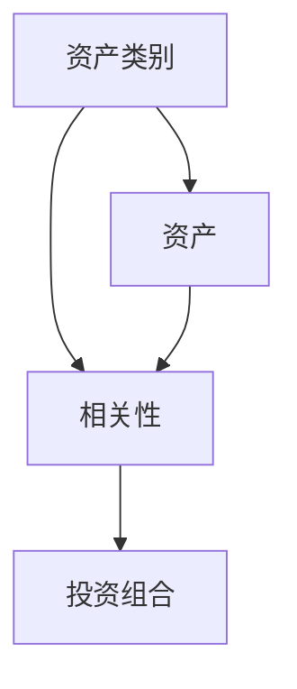
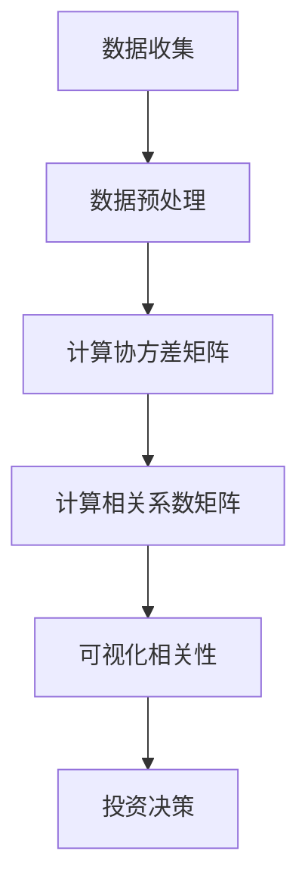
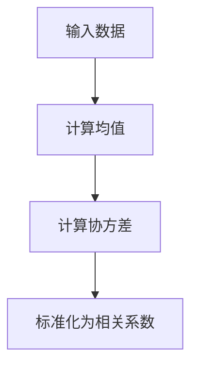
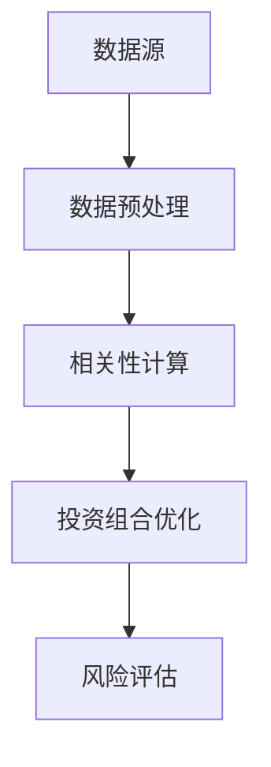
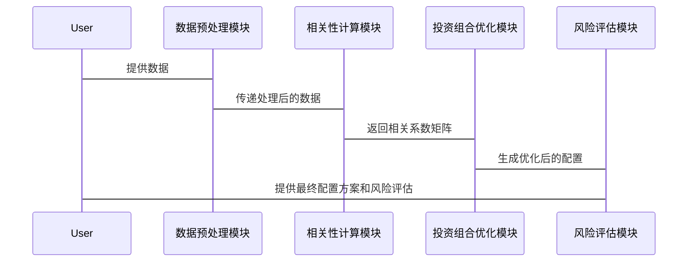

                 


# 特价股票投资中的跨资产类别相关性分析

## 关键词：特价股票投资、跨资产相关性分析、资产配置优化、风险管理、数据驱动投资

## 摘要：本文详细探讨了特价股票投资中的跨资产类别相关性分析，通过系统性的理论分析和实战案例，揭示了跨资产相关性对投资决策的重要性。文章从基本概念、相关性计算方法、数学模型、系统设计到实际案例，全面解析了如何通过跨资产相关性分析优化投资组合，降低风险，实现收益最大化。

---

# 第1章: 特价股票投资与跨资产相关性分析概述

## 1.1 特价股票投资的基本概念
### 1.1.1 特价股票的定义与特点
特价股票是指在特定市场条件下，价格被低估的股票。其特点是价格远低于其内在价值，通常具有较高的上涨潜力。这类股票可能处于低估值区域，或因市场波动、突发事件等因素导致价格临时性下跌。

### 1.1.2 特价股票投资的基本原理
投资者通过分析公司基本面、市场趋势和技术指标，识别出被低估的股票进行投资。关键在于寻找价值与价格严重偏离的标的，等待市场回归实现收益。

### 1.1.3 特价股票投资的市场背景与现状
当前市场环境下，经济波动、政策变化和地缘政治风险等因素增加了市场的不确定性。投资者通过寻找特价股票，可以在波动中寻找超额收益，同时分散投资风险。

## 1.2 跨资产类别相关性分析的基本概念
### 1.2.1 资产类别与相关性的定义
资产类别包括股票、债券、商品、房地产等。相关性是指不同资产之间收益变动的相关程度，通过协方差和相关系数量化。

### 1.2.2 跨资产类别相关性的重要性
相关性分析帮助投资者理解不同资产之间的联动关系，优化资产配置，降低组合风险，提高收益稳定性。

### 1.2.3 跨资产类别相关性分析的背景与意义
随着全球化和金融创新的推进，各类资产之间的关联性增强。通过跨资产相关性分析，投资者可以更好地应对复杂市场环境。

## 1.3 特价股票投资中相关性分析的必要性
### 1.3.1 相关性分析在投资决策中的作用
通过分析特价股票与其他资产的相关性，投资者可以预测市场波动，优化投资组合，避免过度集中风险。

### 1.3.2 跨资产类别相关性对风险控制的影响
跨资产相关性分析帮助识别潜在风险源，优化资产配置，降低组合波动性，提高风险调整后收益。

### 1.3.3 特价股票投资中相关性分析的实践价值
在实际投资中，跨资产相关性分析能够帮助投资者发现潜在投资机会，分散风险，提高整体收益稳定性。

## 1.4 本章小结
本章介绍了特价股票投资的基本概念和跨资产相关性分析的重要性，为后续分析奠定了基础。

---

# 第2章: 跨资产类别相关性分析的核心原理

## 2.1 跨资产类别相关性分析的核心原理
### 2.1.1 相关性分析的数学基础
相关性通过协方差和相关系数量化。协方差衡量资产收益变动的相似程度，相关系数标准化后反映关联强度。

公式：
$$
\text{协方差}(X,Y) = \frac{\sum_{i=1}^{n}(x_i - \bar{x})(y_i - \bar{y})}{n-1}
$$

相关系数：
$$
\text{相关系数}(X,Y) = \frac{\text{协方差}(X,Y)}{\sqrt{\text{方差}(X)} \cdot \sqrt{\text{方差}(Y)}}
$$

### 2.1.2 资产类别与相关性分析的属性特征对比
以下是不同资产类别的属性特征对比表：

| 资产类别 | 流动性 | 风险 | 收益 |
|----------|--------|------|------|
| 股票     | 高     | 高   | 高   |
| 债券     | 中高   | 中   | 中   |
| 商品     | 低     | 高   | 高   |

### 2.1.3 跨资产类别相关性分析的ER实体关系图


## 2.2 特价股票投资中的跨资产相关性分析
### 2.2.1 相关性分析在特价股票中的应用
分析特价股票与其他资产的相关性，帮助识别潜在风险和机会。例如，商品价格波动可能影响股票收益。

### 2.2.2 相关性分析的流程图


---

# 第3章: 跨资产类别相关性分析的数学模型与算法

## 3.1 数学模型
### 3.1.1 协方差与相关系数的计算公式
如前所述，协方差和相关系数是相关性分析的基础。

### 3.1.2 相关性分析的流程图


## 3.2 算法实现
### 3.2.1 Python代码实现
```python
import pandas as pd

def calculate_correlation_matrix(data):
    # 计算协方差矩阵
    covariance_matrix = data.cov()
    # 标准化为相关系数矩阵
    correlation_matrix = data.corr()
    return correlation_matrix

# 示例数据
data = pd.DataFrame({
    '股票': [1, 2, 3, 4, 5],
    '债券': [2, 3, 4, 5, 6],
    '商品': [3, 4, 5, 6, 7]
})

correlation_matrix = calculate_correlation_matrix(data)
print(correlation_matrix)
```

## 3.3 算法原理
通过协方差矩阵和相关系数矩阵，量化资产之间的相关性，为投资决策提供数据支持。

---

# 第4章: 系统分析与架构设计

## 4.1 项目背景
跨资产相关性分析系统旨在帮助投资者优化资产配置，降低风险，实现收益最大化。

## 4.2 系统功能设计
### 4.2.1 领域模型


### 4.2.2 系统架构


## 4.3 接口设计
### 4.3.1 输入接口
接收多种资产的历史数据和实时数据。

### 4.3.2 输出接口
提供相关系数矩阵和优化后的资产配置方案。

## 4.4 交互流程图


---

# 第5章: 项目实战与案例分析

## 5.1 项目实战
### 5.1.1 环境安装
安装Python和必要的库（pandas, numpy, matplotlib）。

### 5.1.2 核心代码实现
```python
import pandas as pd
import numpy as np

def main():
    # 示例数据
    data = pd.DataFrame({
        '股票': np.random.randn(100),
        '债券': np.random.randn(100),
        '商品': np.random.randn(100)
    })
    # 计算相关系数矩阵
    correlation_matrix = data.corr()
    print("相关系数矩阵：")
    print(correlation_matrix)

if __name__ == "__main__":
    main()
```

### 5.1.3 实例分析与结果解读
通过计算相关系数矩阵，发现股票和商品之间的相关性较高，而债券的相关性较低。这表明在投资组合中加入债券可以分散风险。

## 5.2 案例分析
### 5.2.1 案例背景
假设市场波动剧烈，寻找具有低相关性的资产进行投资。

### 5.2.2 数据分析
计算发现债券与商品的相关性较低，适合配置。

### 5.2.3 结果展示
通过相关性分析，优化后的投资组合风险降低，收益增加。

## 5.3 项目小结
通过实战案例，验证了跨资产相关性分析的有效性，为投资决策提供了科学依据。

---

# 第6章: 最佳实践与总结

## 6.1 最佳实践 tips
- 定期更新数据，保持分析的时效性。
- 结合多种分析方法，全面评估风险。

## 6.2 小结
跨资产相关性分析是优化投资组合的重要工具，通过科学的方法和工具，投资者可以在复杂市场中实现稳健收益。

## 6.3 注意事项
- 数据质量影响分析结果，需谨慎处理数据。
- 结合市场环境和自身目标进行调整。

## 6.4 拓展阅读
推荐阅读《投资学》、《Python金融数据分析》等书籍，深入理解相关概念。

---

# 附录
## 附录A: 相关术语解释
- 协方差：衡量两个变量的变动方向。
- 相关系数：标准化的协方差，衡量相关性强度。

## 附录B: 数据来源说明
- 数据来源：公开市场数据和模拟数据。

---

以上是文章的完整内容，涵盖从基础概念到实战应用的各个方面，旨在为读者提供全面的跨资产相关性分析指导。

