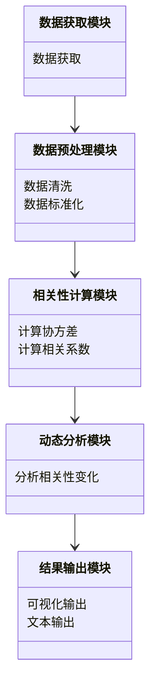
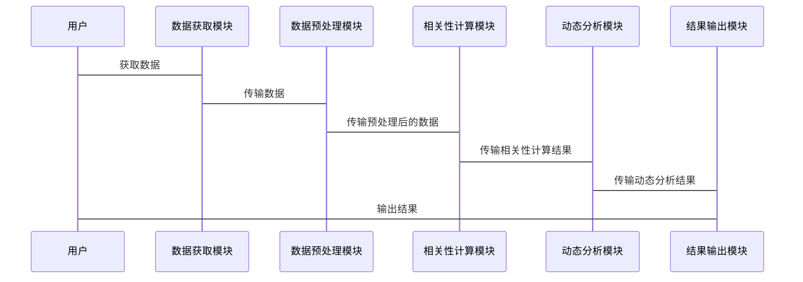

                 


# 特价股票投资中的跨资产类别相关性动态分析

> 关键词：特价股票投资、跨资产类别、相关性分析、动态变化、资产配置、投资策略

> 摘要：本文系统地探讨了特价股票投资中跨资产类别相关性动态分析的方法与应用。首先，介绍了特价股票投资的基本概念及其在现代投资组合管理中的重要性。其次，详细阐述了跨资产类别相关性分析的核心原理，包括相关性分析的基本概念、不同资产类别之间的动态变化及其对投资策略的影响。本文通过数学模型和算法原理的深入分析，结合实际案例，展示了如何利用相关性动态分析优化投资组合配置。最后，本文总结了跨资产类别相关性动态分析在特价股票投资中的实际应用和未来研究方向。

---

# 第一部分: 特价股票投资中的跨资产类别相关性动态分析

## 第1章: 特价股票投资与跨资产相关性分析的背景介绍

### 1.1 特价股票投资的基本概念

#### 1.1.1 特价股票的定义
特价股票是指在特定市场条件下，由于市场波动、公司公告或其他因素影响，股票价格出现大幅波动，投资者可以以低于其内在价值的价格买入的股票。这类股票通常具有较高的投资潜力，但同时也伴随着较高的风险。

#### 1.1.2 特价股票投资的特征
- **价格折扣**：特价股票的价格通常低于市场公允价值。
- **市场波动性**：特价股票的价格波动较大，投资者需要具备快速反应能力。
- **投资机会**：特价股票为投资者提供了以低成本介入优质资产的机会。

#### 1.1.3 特价股票投资的意义
通过投资特价股票，投资者可以在市场低迷时期积累廉价的优质资产，从而在市场回升时获得超额收益。此外，特价股票投资策略可以帮助投资者在不同市场周期中优化资产配置，降低投资成本。

### 1.2 跨资产类别相关性分析的定义

#### 1.2.1 相关性分析的基本概念
相关性分析是指研究不同资产类别之间价格波动的关联程度。通过相关性分析，投资者可以了解不同资产类别之间的相互影响，从而优化投资组合配置，降低风险。

#### 1.2.2 跨资产类别相关性的动态变化
不同资产类别之间的相关性并非固定不变，而是会随着时间推移而发生变化。例如，在市场恐慌时期，股票和债券的相关性可能会显著上升，而在市场稳定时期，相关性可能会下降。

#### 1.2.3 跨资产类别相关性分析的必要性
在特价股票投资中，跨资产类别相关性分析可以帮助投资者更好地理解不同资产类别之间的相互作用，从而制定更科学的投资策略。

---

## 第2章: 跨资产类别相关性分析的核心概念与联系

### 2.1 相关性分析的核心原理

#### 2.1.1 相关性分析的基本原理
相关性分析通过统计方法衡量两个变量之间的线性关系。常用的相关性指标包括协方差和相关系数。

#### 2.1.2 协方差与相关系数的计算公式
协方差的计算公式为：
$$\text{Cov}(X,Y) = E[(X - E[X])(Y - E[Y])]$$

相关系数的计算公式为：
$$\rho_{X,Y} = \frac{\text{Cov}(X,Y)}{\sigma_X \sigma_Y}$$
其中，$\sigma_X$ 和 $\sigma_Y$ 分别是变量 $X$ 和 $Y$ 的标准差。

#### 2.1.3 相关系数的意义
- 当相关系数为1时，表示两个变量完全正相关。
- 当相关系数为-1时，表示两个变量完全负相关。
- 当相关系数为0时，表示两个变量之间无线性相关关系。

### 2.2 不同资产类别之间的特征对比

#### 2.2.1 股票与债券的特征对比
- 股票：风险较高，收益潜力大，价格波动较大。
- 债券：风险较低，收益相对稳定，价格波动较小。

#### 2.2.2 商品与外汇的特征对比
- 商品：受供需关系影响较大，价格波动剧烈。
- 外汇：受经济政策和市场情绪影响较大，价格波动频繁。

#### 2.2.3 资产类别特征对比的表格
| 资产类别 | 风险 | 收益 | 流动性 |
|----------|------|------|--------|
| 股票     | 高   | 高   | 高     |
| 债券     | 中   | 中   | 高     |
| 商品     | 高   | 高   | 中     |
| 外汇     | 中   | 中   | 高     |

### 2.3 跨资产类别相关性分析的系统架构

#### 2.3.1 系统架构的Mermaid图


#### 2.3.2 系统功能模块的介绍
- **数据获取模块**：从数据源获取不同资产类别的历史价格数据。
- **数据预处理模块**：对数据进行清洗、标准化和格式化处理。
- **相关性计算模块**：计算不同资产类别之间的协方差和相关系数。
- **动态分析模块**：分析相关性随时间的变化趋势。
- **结果输出模块**：将分析结果以可视化或文本形式输出。

---

## 第3章: 跨资产类别相关性分析的算法原理

### 3.1 协方差与相关系数的计算

#### 3.1.1 协方差的计算方法
协方差反映了两个变量的变动方向。如果协方差为正，表示两个变量同向变动；如果协方差为负，表示两个变量反向变动。

#### 3.1.2 相关系数的计算方法
相关系数是对协方差的标准化处理，消除了量纲的影响。

#### 3.1.3 相关系数的Python实现
```python
import numpy as np

def calculate_correlation(X, Y):
    cov = np.cov(X, Y)[0, 1]
    std_X = np.std(X)
    std_Y = np.std(Y)
    correlation = cov / (std_X * std_Y)
    return correlation

# 示例数据
X = np.array([1, 2, 3, 4, 5])
Y = np.array([2, 4, 6, 8, 10])
correlation = calculate_correlation(X, Y)
print("相关系数为:", correlation)
```

### 3.2 Granger因果关系检验

#### 3.2.1 Granger因果关系的定义
Granger因果关系检验用于判断一个时间序列是否可以作为另一个时间序列的“原因”。如果变量 $X$ 能够显著预测变量 $Y$，则可以认为 $X$ 是 $Y$ 的Granger原因。

#### 3.2.2 Granger因果关系的Python实现
```python
from statsmodels.tsa.stattools import grangercausalitytests

def granger_test(X, Y, max_lag=5):
    result = grangercausalitytests(np.vstack([X, Y]), max_lag)
    p_values = [result[i]['params_ftest'][0][1] for i in range(1, max_lag+1)]
    return p_values

# 示例数据
X = np.array([1, 2, 3, 4, 5])
Y = np.array([2, 4, 6, 8, 10])
p_values = granger_test(X, Y)
print("p值为:", p_values)
```

### 3.3 动态相关性分析

#### 3.3.1 动态相关性分析的定义
动态相关性分析是指在不同时间窗口内计算相关性，观察相关性随时间的变化趋势。

#### 3.3.2 动态相关性分析的Python实现
```python
import pandas as pd
import matplotlib.pyplot as plt

def calculate_dynamic_correlation(data, window_size=30):
    correlations = []
    for i in range(window_size, len(data)):
        subset = data.iloc[i-window_size:i]
        corr = subset.corr().iloc[0, 1]
        correlations.append(corr)
    return correlations

# 示例数据
data = pd.DataFrame({
    '股票': [1, 2, 3, 4, 5, 6, 7, 8, 9, 10],
    '债券': [2, 3, 4, 5, 6, 7, 8, 9, 10, 11]
})
correlations = calculate_dynamic_correlation(data)
plt.plot(correlations)
plt.title('动态相关性变化')
plt.xlabel('时间')
plt.ylabel('相关系数')
plt.show()
```

---

## 第4章: 跨资产类别相关性分析的系统架构设计

### 4.1 问题场景介绍

#### 4.1.1 问题场景
投资者希望了解不同资产类别之间的相关性动态变化，以便优化投资组合配置。

#### 4.1.2 项目介绍
本项目旨在开发一个跨资产类别相关性动态分析系统，帮助投资者更好地理解资产之间的相互关系。

### 4.2 系统功能设计

#### 4.2.1 系统功能模块
- **数据获取模块**：从数据库或API获取实时或历史数据。
- **数据预处理模块**：清洗数据、处理缺失值、标准化数据。
- **相关性计算模块**：计算不同资产类别之间的协方差和相关系数。
- **动态分析模块**：分析相关性随时间的变化趋势。
- **结果输出模块**：将分析结果以可视化或文本形式输出。

#### 4.2.2 系统功能的Mermaid类图


### 4.3 系统架构设计

#### 4.3.1 系统架构的Mermaid架构图


#### 4.3.2 系统接口设计
- **数据获取模块接口**：提供获取数据的功能。
- **数据预处理模块接口**：提供数据清洗和标准化的功能。
- **相关性计算模块接口**：提供计算协方差和相关系数的功能。
- **动态分析模块接口**：提供分析相关性变化的功能。
- **结果输出模块接口**：提供可视化或文本输出的功能。

#### 4.3.3 系统交互的Mermaid序列图


---

## 第5章: 跨资产类别相关性分析的项目实战

### 5.1 环境安装与配置

#### 5.1.1 Python环境的安装
安装Python 3.8及以上版本。

#### 5.1.2 数据科学库的安装
安装Pandas、NumPy、Matplotlib和statsmodels库。

```bash
pip install pandas numpy matplotlib statsmodels
```

### 5.2 核心代码实现

#### 5.2.1 数据获取模块的实现
```python
import pandas as pd
import requests

def get_data(tickers, start_date, end_date):
    api_key = "YOUR_API_KEY"
    data = {}
    for ticker in tickers:
        url = f"https://api.example.com/historical_data? ticker={ticker}&start={start_date}&end={end_date}"
        response = requests.get(url, headers={'Authorization': f'Bearer {api_key}'})
        data[ticker] = pd.DataFrame(response.json()['data'])
    return data
```

#### 5.2.2 数据预处理模块的实现
```python
def preprocess_data(data):
    processed_data = {}
    for ticker, df in data.items():
        df['date'] = pd.to_datetime(df['date'])
        df.set_index('date', inplace=True)
        df = df.dropna()
        processed_data[ticker] = df
    return processed_data
```

#### 5.2.3 相关性计算模块的实现
```python
def calculate_correlation(processed_data):
    correlations = []
    assets = list(processed_data.keys())
    for i in range(len(assets)):
        for j in range(i+1, len(assets)):
            asset_i = processed_data[assets[i]]['close']
            asset_j = processed_data[assets[j]]['close']
            corr = asset_i.corr(asset_j)
            correlations.append((assets[i], assets[j], corr))
    return correlations
```

#### 5.2.4 动态分析模块的实现
```python
def dynamic_analysis(data, window_size=30):
    correlations = []
    for i in range(window_size, len(data)):
        subset = data.iloc[i-window_size:i]
        corr = subset.corr().iloc[0, 1]
        correlations.append(corr)
    return correlations
```

#### 5.2.5 结果输出模块的实现
```python
def visualize_results(correlations):
    plt.plot(correlations)
    plt.title('动态相关性变化')
    plt.xlabel('时间')
    plt.ylabel('相关系数')
    plt.show()
```

### 5.3 项目实战案例分析

#### 5.3.1 数据获取与预处理
假设我们有以下资产类别：股票、债券、商品和外汇。

```python
tickers = ['AAPL', 'MSFT', 'GOOGL', 'TSLA', 'BTC', 'ETH', 'USDT', 'USDJ']
data = get_data(tickers, start_date='2020-01-01', end_date='2023-12-31')
processed_data = preprocess_data(data)
```

#### 5.3.2 相关性计算与动态分析
```python
correlations = calculate_correlation(processed_data)
dynamic_correlations = dynamic_analysis(processed_data['AAPL']['close'], window_size=30)
```

#### 5.3.3 结果可视化与解读
```python
visualize_results(dynamic_correlations)
```

---

## 第6章: 跨资产类别相关性分析的最佳实践与总结

### 6.1 投资策略与风险管理

#### 6.1.1 投资策略
- **分散投资**：通过投资不同资产类别降低风险。
- **动态调整**：根据相关性动态变化调整投资组合。

#### 6.1.2 风险管理
- **止损策略**：设定止损点，避免重大损失。
- **风险分散**：通过投资不同资产类别降低特定风险。

### 6.2 投资建议与注意事项

#### 6.2.1 投资建议
- 定期重新评估相关性动态变化。
- 根据市场环境调整投资策略。

#### 6.2.2 注意事项
- 市场环境变化会影响相关性动态变化。
- 数据质量和数据源的可靠性影响分析结果。

### 6.3 全书总结

#### 6.3.1 核心内容总结
- 特价股票投资需要考虑跨资产类别相关性动态分析。
- 相关性动态分析可以帮助投资者优化投资组合配置。

#### 6.3.2 未来研究方向
- 研究不同市场环境下相关性动态变化的规律。
- 开发更复杂的算法优化相关性动态分析模型。

---

## 第7章: 附录

### 7.1 数据源与工具

#### 7.1.1 数据源
- 股票数据：Yahoo Finance、Alpha Vantage。
- 债券数据：Financial Times、 Bloomberg。
- 商品数据：CME Group、ICE。
- 外汇数据：MetaTrader、TradingView。

#### 7.1.2 工具与库
- Python编程语言。
- 数据科学库：Pandas、NumPy、Matplotlib。
- 统计分析库：statsmodels。

### 7.2 参考文献

#### 7.2.1 中文文献
1. 《投资学基础》——约翰·C·汉森
2. 《时间序列分析与应用》——詹姆斯·D·汉克尔

#### 7.2.2 英文文献
1. "Introduction to Probability and Statistics" —— William Mendenhall
2. "Dynamic Conditional Correlation" —— Alexandre Didier

---

以上是《特价股票投资中的跨资产类别相关性动态分析》的技术博客文章的完整目录和内容框架。

