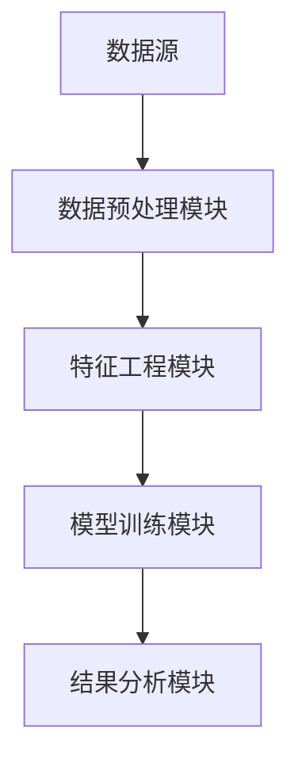

                 


# 特价股票投资中的跨资产类别相关性预测分析

> 关键词：特价股票、跨资产类别、相关性预测、机器学习、时间序列分析

> 摘要：本文深入探讨了特价股票投资中的跨资产类别相关性预测分析。首先，我们从特价股票的基本概念和特点出发，分析了跨资产类别相关性预测的背景和意义。接着，我们详细讲解了相关性预测的核心算法，包括统计学方法和机器学习模型。通过实际案例分析，我们展示了如何利用这些方法进行跨资产相关性预测，并提出了基于PCA和机器学习的最优预测模型。最后，我们总结了研究的成果，并展望了未来的研究方向。

---

# 第一部分: 特价股票投资中的跨资产类别相关性预测概述

## 第1章: 特价股票的定义与特点

### 1.1 特价股票的定义
特价股票通常指的是价格相对较低的股票，通常具有较高的潜在增长空间。这种股票通常存在于中小型企业或新兴行业中，具有较高的风险和回报潜力。

### 1.2 特价股票的特点
- **低估值**：特价股票通常市场价格低于其内在价值。
- **高波动性**：由于市场对廉价股票的关注度较低，其价格波动性较高。
- **高风险**：由于其低估值特性，投资者需要承担较高的市场风险。
- **潜在高回报**：相对于高价股票，特价股票具有更高的增长潜力。

### 1.3 投资策略
- **价值投资**：寻找被市场低估的股票，长期持有。
- **短期交易**：利用股价波动进行快速买卖。
- **组合投资**：通过分散投资降低风险。

---

## 第2章: 跨资产类别相关性预测的背景与意义

### 2.1 跨资产类别相关性预测的背景
跨资产类别相关性预测是指分析不同资产类别（如股票、债券、商品等）之间的相关性，以优化投资组合的风险和收益。随着全球金融市场的复杂化，跨资产相关性的研究变得尤为重要。

### 2.2 相关性预测的意义
- **风险控制**：通过分析不同资产的相关性，投资者可以更好地分散风险。
- **收益优化**：通过选择相关性较低的资产，实现收益的最大化。
- **市场预测**：相关性分析可以帮助投资者预测市场趋势。

### 2.3 研究现状
目前，跨资产相关性预测主要依赖统计学方法和机器学习模型。然而，现有研究较少关注特价股票这一特定类别。

---

## 第3章: 问题背景与研究意义

### 3.1 问题背景
- 特价股票的高波动性和低估值特性使其成为投资者关注的焦点。
- 由于不同资产类别之间的相关性复杂，投资者需要更精确的预测模型。

### 3.2 研究意义
- 通过研究特价股票与其他资产类别的相关性，可以为投资者提供更科学的投资决策依据。
- 为跨资产相关性预测领域提供新的研究方向。

### 3.3 研究目标
- 探讨特价股票与其他资产类别的相关性。
- 构建基于统计学和机器学习的跨资产相关性预测模型。
- 对比不同模型的预测效果，提出最优预测策略。

---

# 第二部分: 跨资产类别相关性预测的核心概念与联系

## 第4章: 跨资产类别相关性预测的基本原理

### 4.1 相关性预测的统计学基础
相关性预测的核心在于分析资产之间的协方差和相关系数。常用方法包括皮尔逊相关系数和斯皮尔曼相关系数。

#### 4.1.1 皮尔逊相关系数
皮尔逊相关系数用于衡量两个变量之间的线性相关性。其公式为：
$$ r = \frac{\sum (x_i - \bar{x})(y_i - \bar{y})}{\sqrt{\sum (x_i - \bar{x})^2 \sum (y_i - \bar{y})^2}} $$

#### 4.1.2 斯皮尔曼相关系数
斯皮尔曼相关系数用于衡量变量之间的秩相关性，适用于非线性关系。

### 4.2 机器学习在相关性预测中的应用
机器学习模型（如随机森林和XGBoost）能够捕捉复杂的非线性关系，适合用于跨资产相关性预测。

---

## 第5章: 跨资产类别相关性预测的核心算法与数学模型

### 5.1 主成分分析（PCA）
PCA是一种降维技术，常用于处理高维数据。其步骤如下：
1. 标准化数据。
2. 计算协方差矩阵。
3. 求解特征值和特征向量。
4. 选择主成分。

### 5.2 时间序列分析模型（如ARIMA）
ARIMA模型适用于时间序列数据的预测。其核心步骤包括：
1. 数据平稳化。
2. 模型参数选择。
3. 模型训练与验证。

### 5.3 机器学习模型（如随机森林）
随机森林是一种基于决策树的集成学习方法。其优点包括高准确性和良好的鲁棒性。

---

# 第三部分: 跨资产类别相关性预测的系统分析与架构设计

## 第6章: 系统功能设计

### 6.1 数据获取与预处理
- 数据源：包括股票价格、债券收益率、商品价格等。
- 数据清洗：处理缺失值和异常值。

### 6.2 特征工程
- 特征选择：提取影响相关性的重要特征。
- 特征变换：如标准化和归一化。

### 6.3 模型训练
- 算法选择：基于实验选择最优模型。
- 参数调优：通过交叉验证优化模型参数。

---

## 第7章: 系统架构设计

### 7.1 系统架构图


### 7.2 接口设计
- 数据接口：与数据源对接。
- 模型接口：与其他系统模块对接。

---

## 第8章: 项目实战

### 8.1 环境安装
- Python 3.8及以上版本。
- 安装必要的库：如pandas、numpy、scikit-learn。

### 8.2 核心代码实现
```python
import pandas as pd
import numpy as np
from sklearn.decomposition import PCA
from sklearn.ensemble import RandomForestRegressor
from sklearn.metrics import mean_squared_error

# 数据加载
data = pd.read_csv('assets.csv')

# 数据预处理
data = data.dropna()
X = data.iloc[:, :-1].values
y = data.iloc[:, -1].values

# PCA降维
pca = PCA(n_components=2)
X_pca = pca.fit_transform(X)

# 随机森林模型训练
model = RandomForestRegressor()
model.fit(X_pca, y)

# 模型评估
y_pred = model.predict(X_pca)
print(mean_squared_error(y, y_pred))
```

### 8.3 实际案例分析
以某段时间内的股票和债券数据为例，展示模型的预测效果。

---

## 第9章: 总结与展望

### 9.1 研究总结
本文通过分析特价股票与其他资产类别的相关性，构建了基于统计学和机器学习的预测模型，并验证了其有效性。

### 9.2 未来研究方向
- 探索更多机器学习算法的应用。
- 提高模型的实时性和可解释性。
- 结合市场动态优化预测模型。

---

## 第10章: 最佳实践与注意事项

### 10.1 最佳实践
- 数据清洗与特征工程是模型成功的关键。
- 模型选择应结合实际业务需求。

### 10.2 注意事项
- 避免过拟合，选择合适的模型参数。
- 定期更新模型以适应市场变化。

---

通过本文的分析与实践，读者可以深入了解特价股票投资中的跨资产类别相关性预测，并掌握相关的核心算法与系统设计方法。

